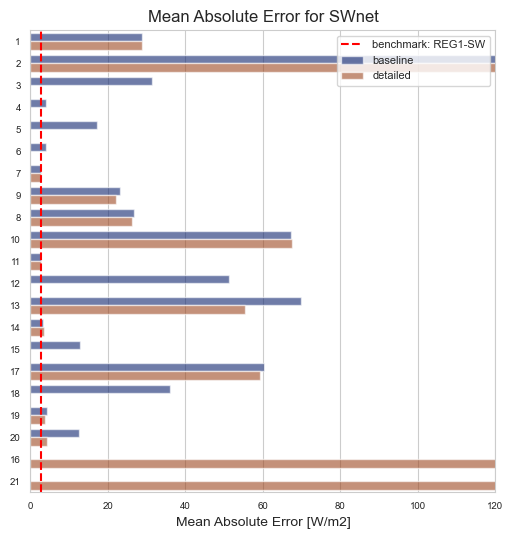
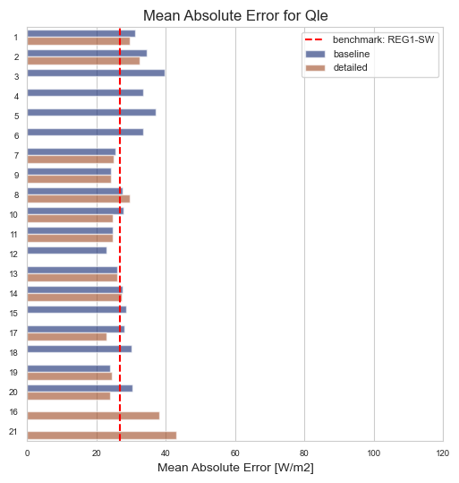
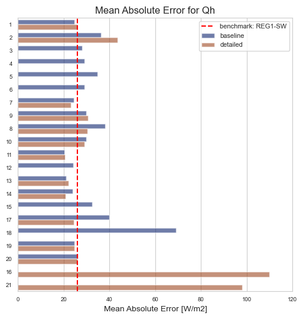

## AU-Preston results: summary

### SWnet: Net shortwave radiation (downward)

### LWnet: Net longwave radiation (downward)

### Qle: Latent heat flux (upward)

### Qh: Sensible heat flux (upward)

## more info

 - [Participant metadata and submitted variables](modelattrs/index.md)
 - [Baseline results](baseline/index.md)
 - [Detailed results](detailed/index.md)

