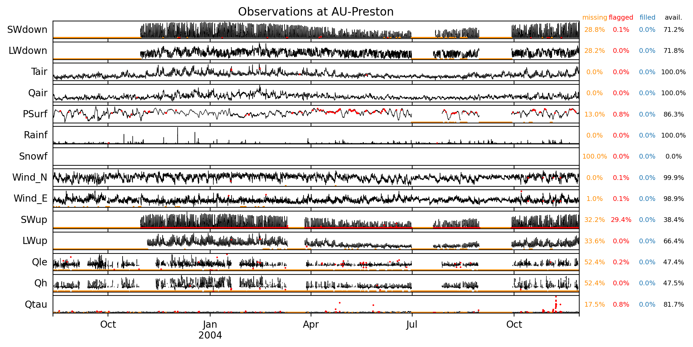
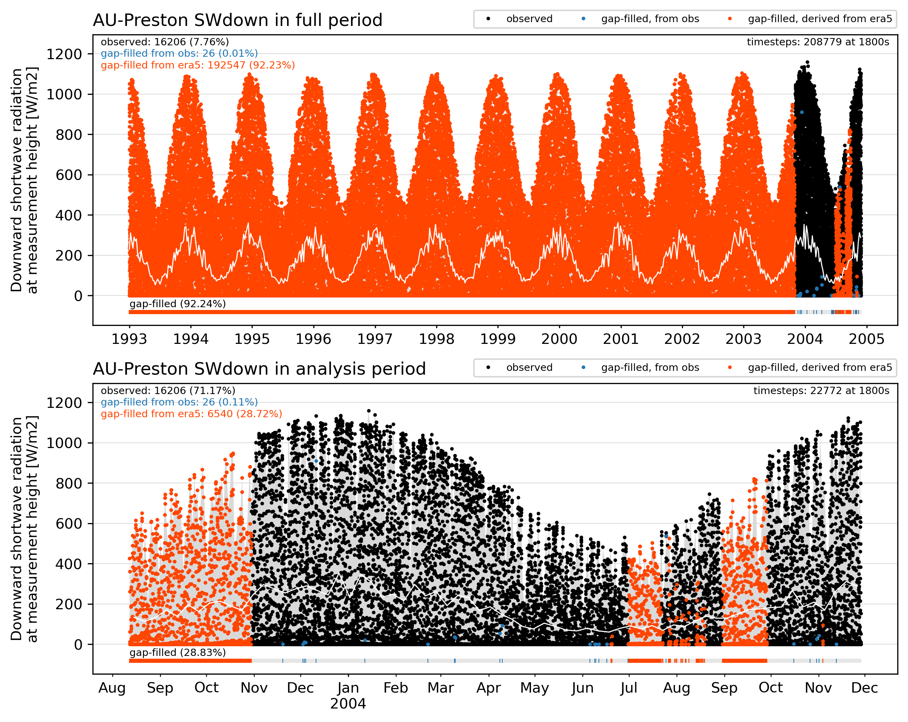
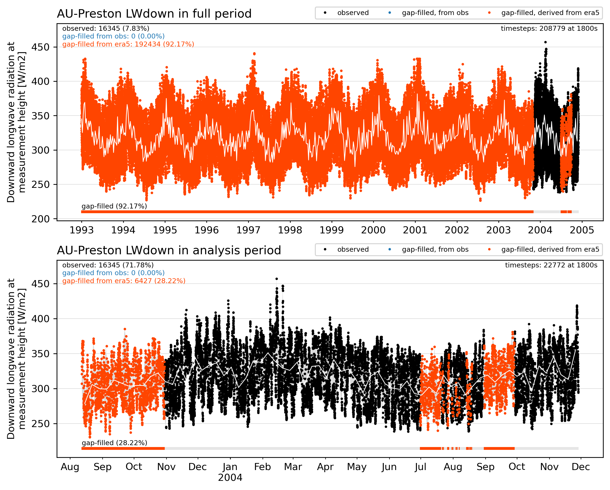
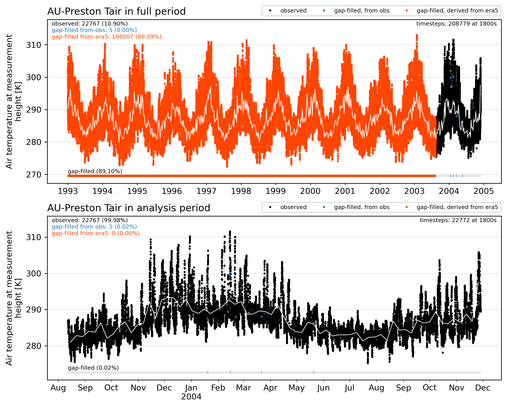
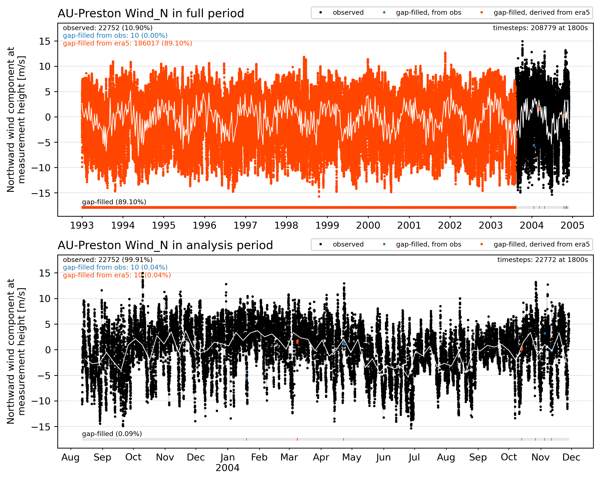
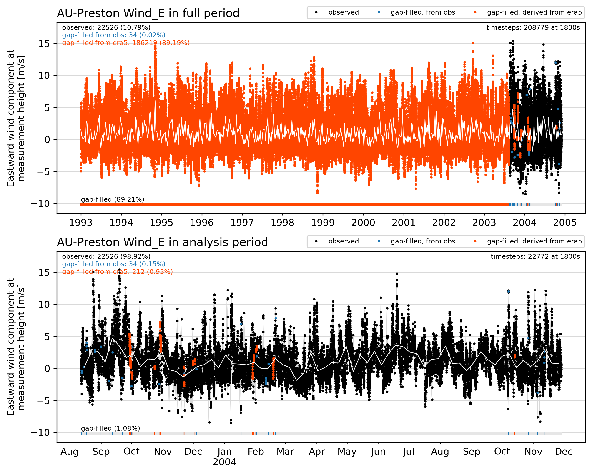

# AU-Preston

## Site observations

|                           | observation_attributes                                                         |
|:--------------------------|:-------------------------------------------------------------------------------|
| title                     | Cleaned flux tower observations for AU-Preston                                 |
| summary                   | Quality controlled observations for the Urban-PLUMBER model evaluation project |
| sitename                  | AU-Preston                                                                     |
| version                   | v3                                                                             |
| conventions               | ALMA+CF.rev13                                                                  |
| featureType               | timeSeries                                                                     |
| time_coverage_start       | 2003-08-12 03:30:00                                                            |
| time_coverage_end         | 2004-11-28 13:00:00                                                            |
| time_shown_in             | UTC                                                                            |
| local_utc_offset_hours    | 10.0                                                                           |
| timestep_interval_seconds | 1800.0                                                                         |
| timestep_number_analysis  | 22772                                                                          |
| date_created              | 2021-01-15 19:14:09                                                            |
| project_contact           | Mathew Lipson: m.lipson@unsw.edu.au, Martin Best: martin.best@metoffice.gov.uk |
| observations_contact      | Andrew Coutts: andrew.coutts@monash.edu; Nigel Tapper: nigel.tapper@monash.edu |
| observations_reference    | Coutts, A. M., Beringer, J. and Tapper, N. J.: doi:10.1175/JAM2462.1           |

## Site characteristics

source: Coutts et al. 2007: doi:[10.1016/j.atmosenv.2006.08.030](http://doi.org/10.1016/j.atmosenv.2006.08.030)

|   id | parameter                       |     value | units         | source                 |
|-----:|:--------------------------------|----------:|:--------------|:-----------------------|
|    1 | latitude                        |  -37.7306 | degrees_north | Coutts et al. 2007a    |
|    2 | longitude                       |  145.014  | degrees_east  | Coutts et al. 2007a    |
|    3 | ground_height                   |   93      | m             | Coutts et al. 2007a    |
|    4 | measurement_height_above_ground |   40      | m             | Coutts et al. 2007b    |
|    5 | impervious_area_fraction        |    0.62   | 1             | Grimmond et al. 2011   |
|    6 | tree_area_fraction              |    0.225  | 1             | Grimmond et al. 2011   |
|    7 | grass_area_fraction             |    0.15   | 1             | Grimmond et al. 2011   |
|    8 | bare_soil_area_fraction         |    0.005  | 1             | Grimmond et al. 2011   |
|    9 | water_area_fraction             |    0      | 1             | Grimmond et al. 2011   |
|   10 | roof_area_fraction              |    0.445  | 1             | Grimmond et al. 2011   |
|   11 | road_area_fraction              |    0.13   | 1             | Grimmond et al. 2011   |
|   12 | footpath_area_fraction          |    0.045  | 1             | Grimmond et al. 2011   |
|   13 | building_mean_height            |    6.4    | m             | Grimmond et al. 2011   |
|   14 | tree_mean_height                |    5.7    | m             | Nice et al. 2018       |
|   15 | roughness_length_momentum       |    0.4    | m             | Grimmond et al. 2011   |
|   16 | displacement_height             |    4.57   | m             | Macdonald et al. 1998  |
|   17 | canyon_height_width_ratio       |    0.42   | 1             | Grimmond et al. 2011   |
|   18 | wall_to_plan_area_ratio         |    0.4    | 1             | Grimmond et al. 2011   |
|   19 | average_albedo_at_midday        |    0.15   | 1             | Grimmond et al. 2011   |
|   20 | resident_population_density     |  415.78   | person/km2    | Grimmond et al. 2011   |
|   21 | anthropogenic_heat_flux_mean    |   11      | W/m2          | Best and Grimmond 2016 |
|   22 | topsoil_clay_fraction           |    0.18   | 1             | openlandmap.org        |
|   23 | topsoil_sand_fraction           |    0.72   | 1             | openlandmap.org        |
|   24 | topsoil_bulk_density            | 1230      | kg/m3         | openlandmap.org        |

## Site observations

## Site forcing

### SWdown

### LWdown

### Tair

### Qair

### PSurf

### Rainf

### Snowf

### Wind_N

### Wind_E

## Quality control and gap filling procedure

**QC process on observations**
 
 - remove values outside the ALMAv3 protocol expected range values
 - remove night periods for shortwave between civil twilight times for site latitude and longitude
 - remove constant values of 4 or more timesteps (excluding rainfall, snowfall)
 - remove outliers by applying a filter for values outside 5 standard deviations for each hour in a rolling 30 day window. Applying that filter until no outliers exist.
 
**Gap-filling process**
  
 - for gaps of 2 hours or less, fill with linear interpolation of adjacent observation
 - for remaining gaps, fill with the time-averaged profile for adjacent days, where available
 - again fill gaps of 2 hours or less with linear interpolation of observation
 - fill remaining gaps with bias-corrected, ERA5 derived data
 - prepend flux tower data period with 10-years of ERA5 derived data (used for model spinup)
 
**ERA5 bias correction**
 
 - for energy fluxes, temperature, humidity and pressure: calculate the mean bias between ERA5 and flux tower data in a 30-day rolling window for every hour of the year, and apply that bias correction to ERA5 data
 - for rainfall: calculate total precipitation in a 10-year period and calculate the ratio between ERA5 data and the nearest GHCN-D station and apply that correction factor to ERA5 data.
 - for wind: apply wind log profile correction based on ERA5 reference height (10m) and flux tower measurement heights, plus ERA5 and local roughness and displacement.

