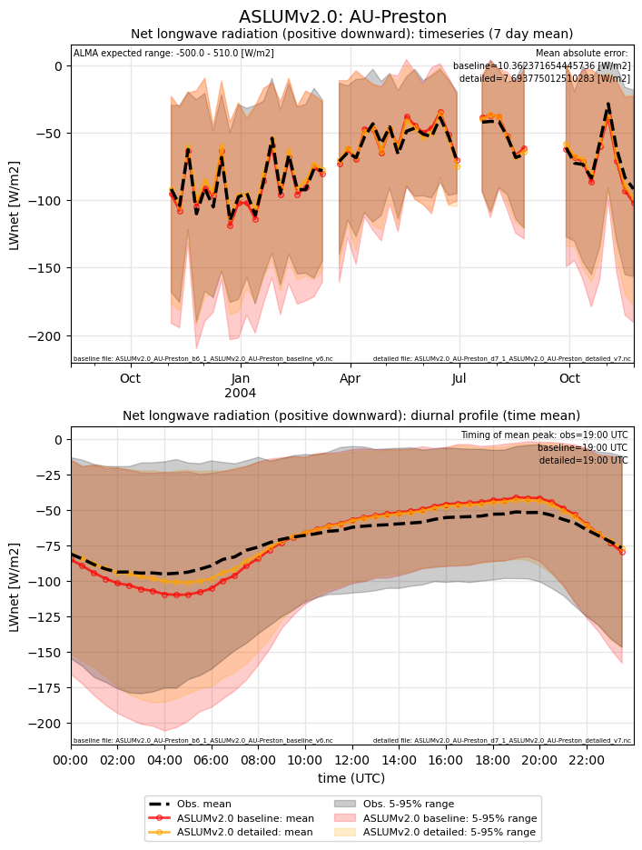
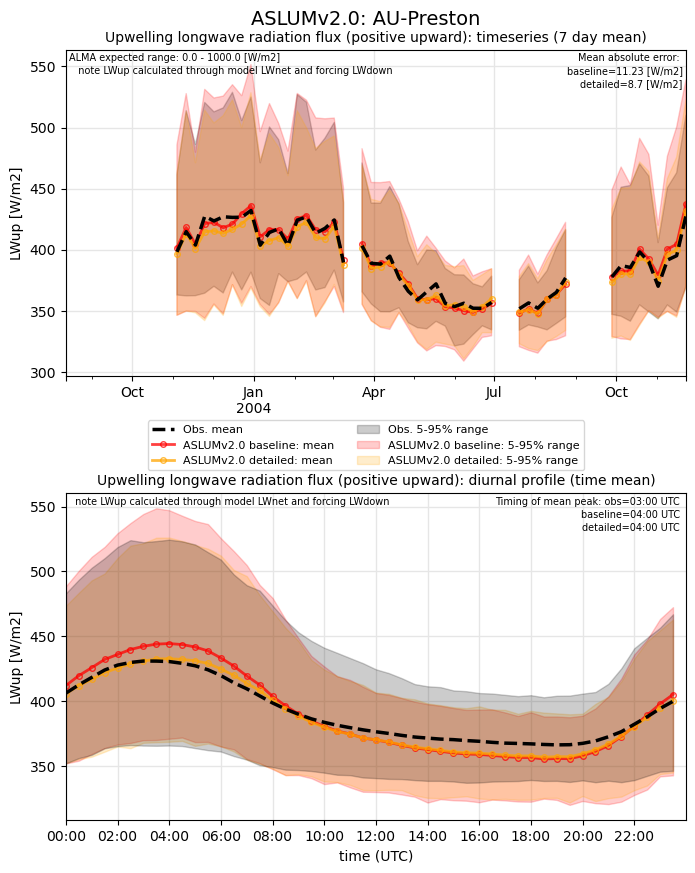
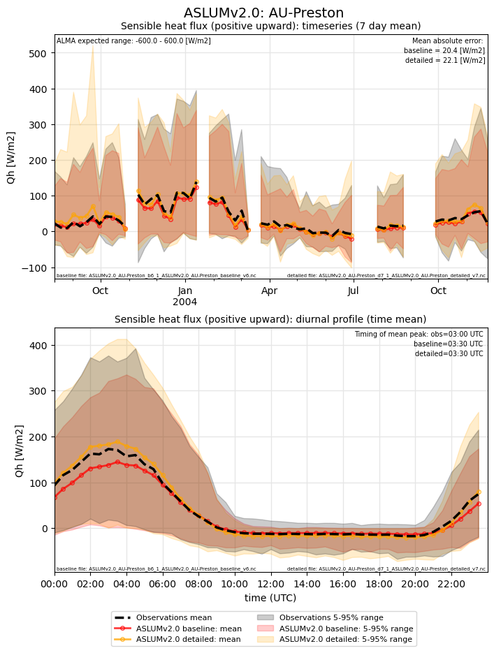
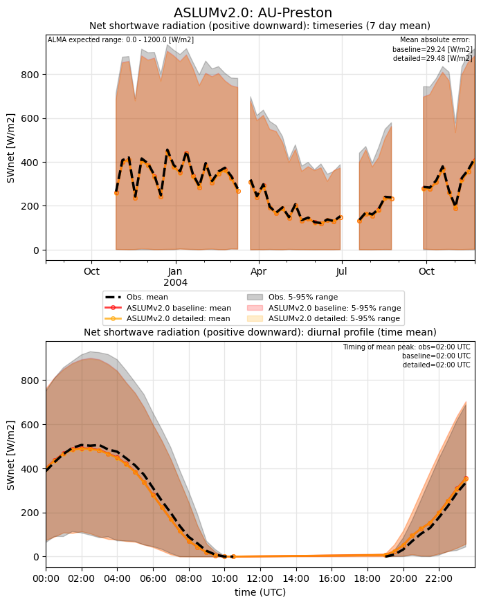
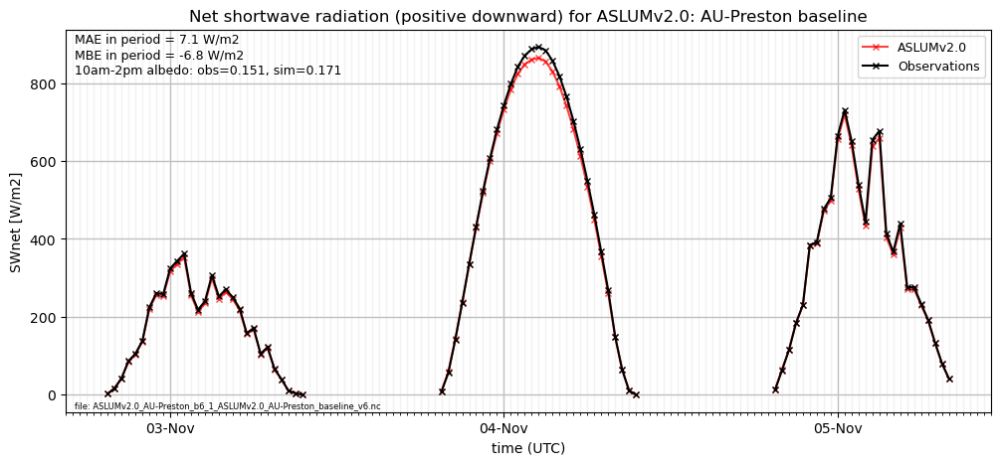
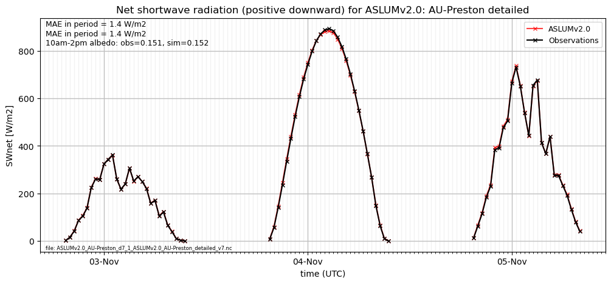
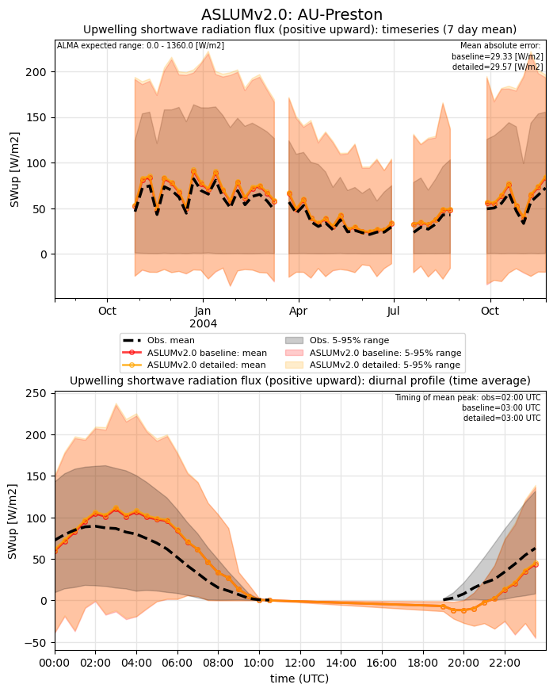
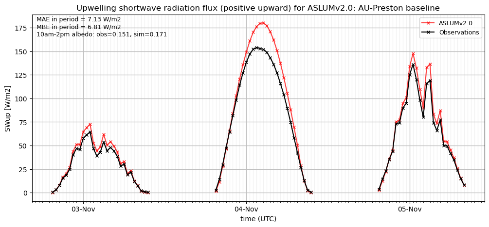
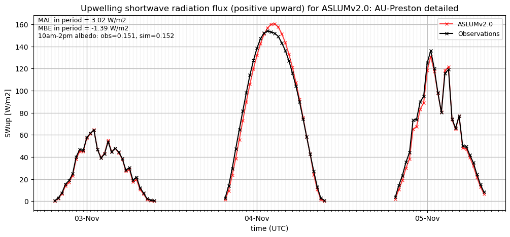

# AU-Preston: ASLUMv2.0

**NOTE:** *Results presented here are highly dependent on how models are configured in this experiment and may be subject to variable output formatting errors. Results are not intended to indicate the quality of any individual model, but to help participants better understand and improve modelling approaches in different urban environments.*

### Error metrics

| flux   | experiment   |   MAE |    MBE |    NSD |      R |
|:-------|:-------------|------:|-------:|-------:|-------:|
| SWnet  | baseline     | 29.24 | -6.321 | 0.8439 | 0.989  |
| SWnet  | detailed     | 29.48 | -7.296 | 0.8406 | 0.989  |
| LWnet  | baseline     | 11.23 |  0.113 | 1.0484 | 0.9577 |
| LWnet  | detailed     |  8.7  |  3.228 | 0.9433 | 0.9689 |
| Qle    | baseline     | 24.48 |  0.76  | 0.8669 | 0.6573 |
| Qle    | detailed     | 27.17 | 10.694 | 1.0331 | 0.6699 |
| Qh     | baseline     | 20.24 | -6.929 | 0.8525 | 0.9412 |
| Qh     | detailed     | 22.11 | -1.566 | 1.0739 | 0.9197 |

### jump to figure:
 - [LWnet](#lwnet)
 - [LWup](#lwup)
 - [Qh](#qh)
 - [Qle](#qle)
 - [SWnet](#swnet)
 - [SWnet_subset_baseline](#swnet_subset_baseline)
 - [SWnet_subset_detailed](#swnet_subset_detailed)
 - [SWup](#swup)
 - [SWup_subset_baseline](#swup_subset_baseline)
 - [SWup_subset_detailed](#swup_subset_detailed)
 - [closure_baseline](#closure_baseline)
 - [closure_detailed](#closure_detailed)

[Link to variable definitions](variable_definitions.md)

### LWnet

### LWup

### Qh

### Qle

### SWnet

### SWnet_subset_baseline

### SWnet_subset_detailed

### SWup

### SWup_subset_baseline

### SWup_subset_detailed

### closure_baseline

### closure_detailed

### out of range: baseline

 - ASLUMv2.0 SWup min value of -376.2155 is less than expected 0.0 [W/m2]
 - ASLUMv2.0 alb min value of -0.9990 is less than expected 0.0 [1]

### out of range: detailed

 - ASLUMv2.0 Qh max value of 720.0273 is greater than expected 600.0 [W/m2]
 - ASLUMv2.0 SWup min value of -374.0503 is less than expected 0.0 [W/m2]
 - ASLUMv2.0 ESoil max value of 0.0003 is greater than expected 0.0003 [kg/m2/s]
 - ASLUMv2.0 alb min value of -0.9991 is less than expected 0.0 [1]

[Link to variable definitions](variable_definitions.md)

