# AU-Preston: ASLUMv3.1

**NOTE:** *Results presented here are highly dependent on how models are configured in this experiment and may be subject to variable output formatting errors. Results are not intended to indicate the quality of any individual model, but to help participants better understand and improve modelling approaches in different urban environments.*

### Error metrics

| flux   | experiment   |   MAE |     MBE |    NSD |      R |
|:-------|:-------------|------:|--------:|-------:|-------:|
| SWnet  | baseline     | 28.63 |   1.427 | 0.87   | 0.9888 |
| SWnet  | detailed     | 28.99 |   4.902 | 0.8805 | 0.9888 |
| LWnet  | baseline     |  9.96 |   4.164 | 1.001  | 0.9653 |
| LWnet  | detailed     |  8.57 |   5.06  | 0.9235 | 0.9735 |
| Qle    | baseline     | 25.87 |  -5.42  | 0.7923 | 0.6209 |
| Qle    | detailed     | 27.88 |   9.506 | 1.057  | 0.6611 |
| Qh     | baseline     | 24.45 | -14.891 | 0.7217 | 0.939  |
| Qh     | detailed     | 22.18 | -12.702 | 0.9177 | 0.9355 |

 - MAE: mean absolute error
 - MBE: mean bias error
 - NSD: ratio of model to obs standard deviation
 - R: Pearson's correlation

### jump to figure:
 - [LWnet](#lwnet)
 - [LWup](#lwup)
 - [Qh](#qh)
 - [Qle](#qle)
 - [SWnet](#swnet)
 - [SWnet_subset_baseline](#swnet_subset_baseline)
 - [SWnet_subset_detailed](#swnet_subset_detailed)
 - [SWup](#swup)
 - [SWup_subset_baseline](#swup_subset_baseline)
 - [SWup_subset_detailed](#swup_subset_detailed)
 - [closure_baseline](#closure_baseline)
 - [closure_detailed](#closure_detailed)

[Link to variable definitions](variable_definitions.md)

### LWnet
[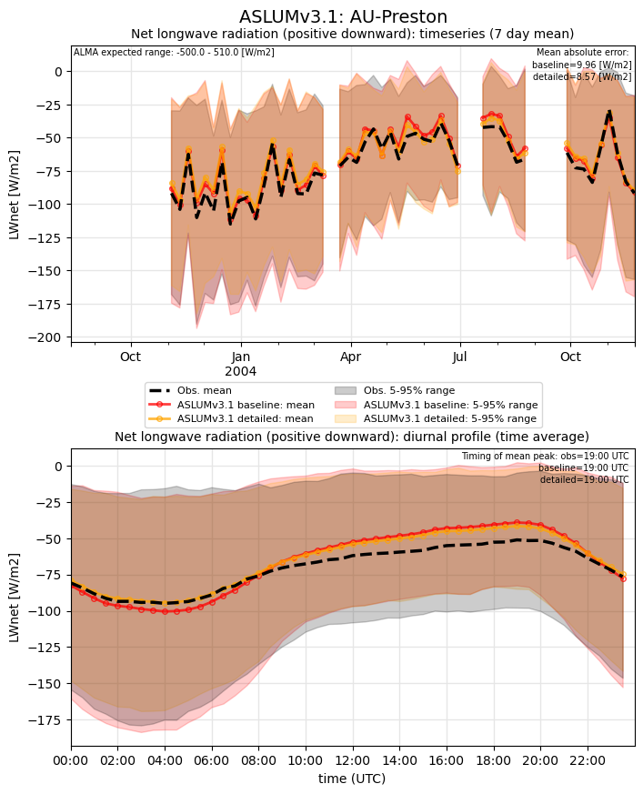](ASLUMv3.1_AU-Preston_LWnet.png)

### LWup
[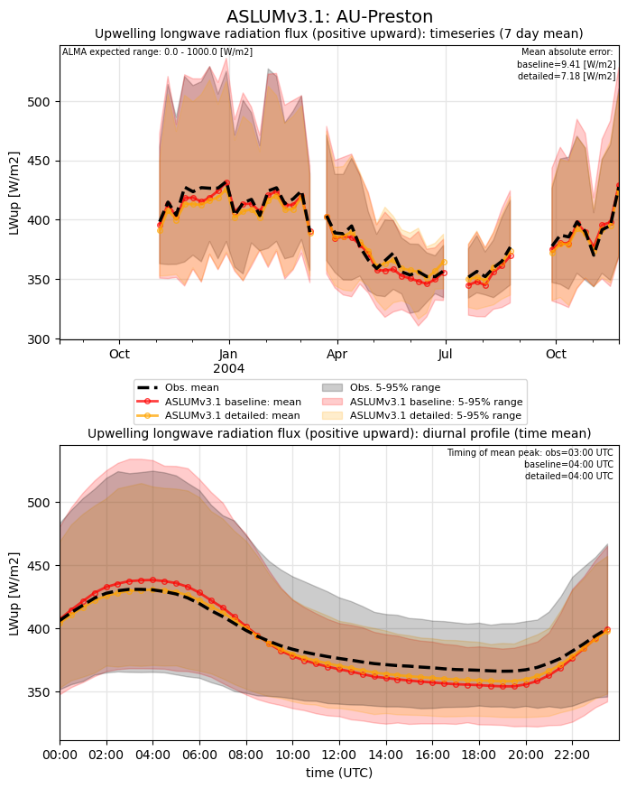](ASLUMv3.1_AU-Preston_LWup.png)

### Qh
[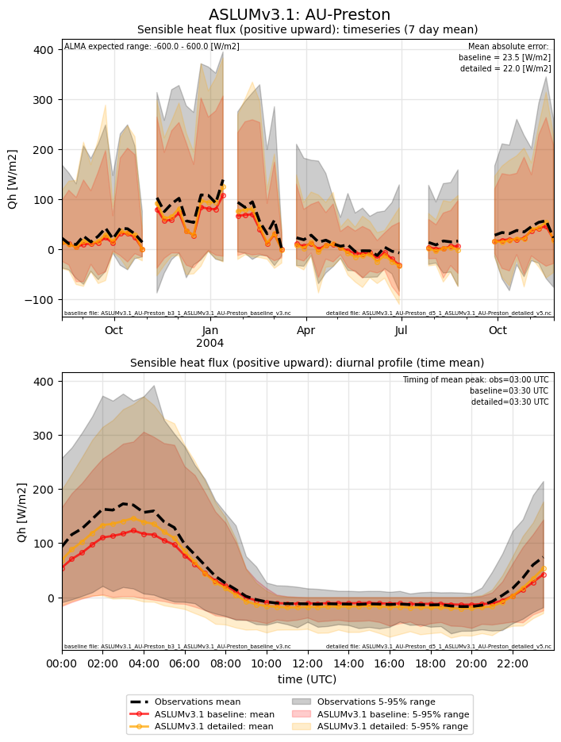](ASLUMv3.1_AU-Preston_Qh.png)

### Qle
[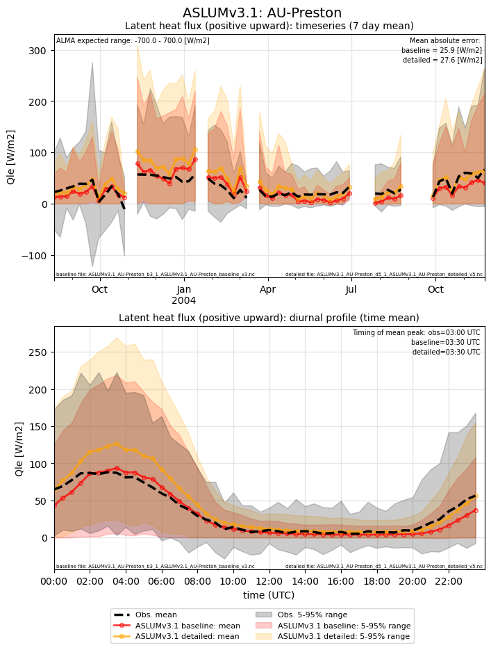](ASLUMv3.1_AU-Preston_Qle.png)

### SWnet
[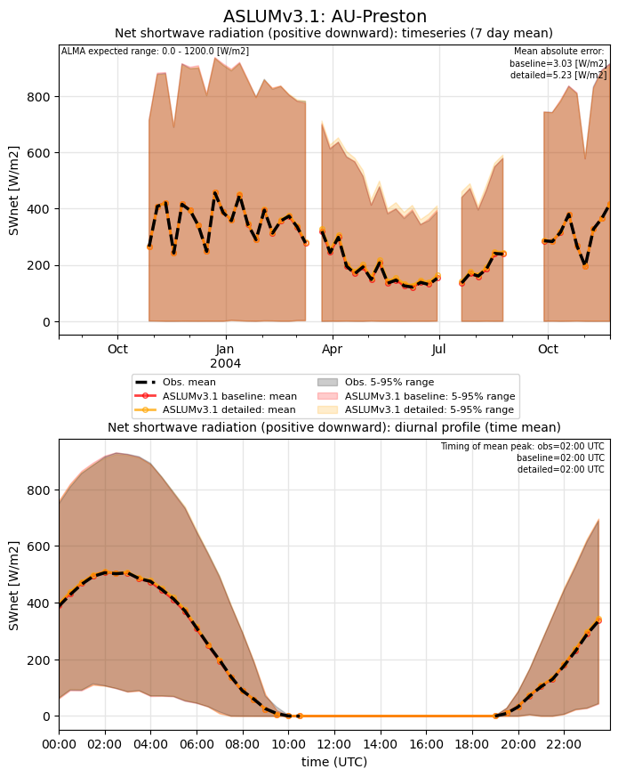](ASLUMv3.1_AU-Preston_SWnet.png)

### SWnet_subset_baseline
[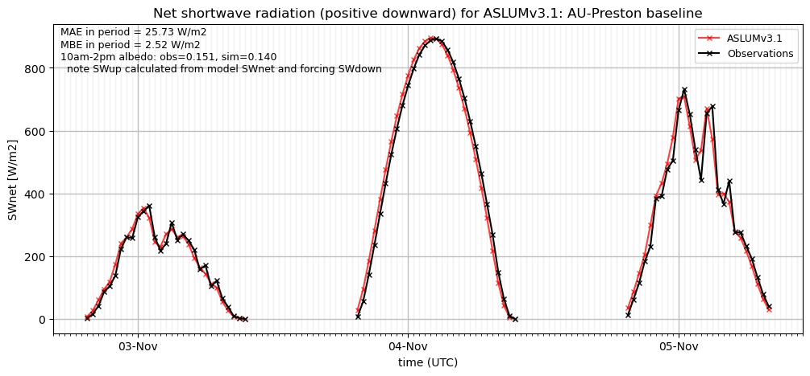](ASLUMv3.1_AU-Preston_SWnet_subset_baseline.png)

### SWnet_subset_detailed
[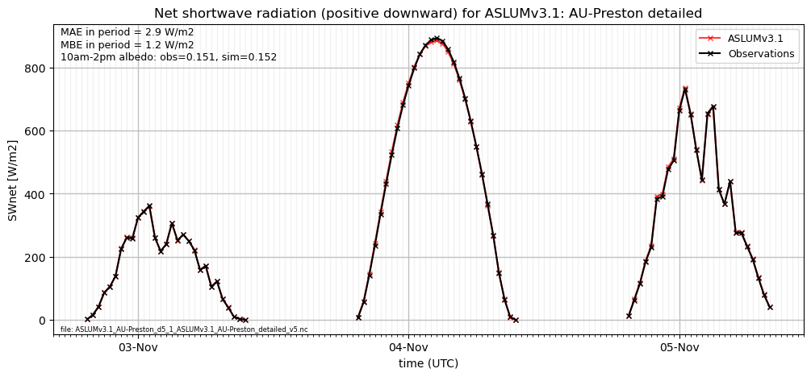](ASLUMv3.1_AU-Preston_SWnet_subset_detailed.png)

### SWup

### SWup_subset_baseline
[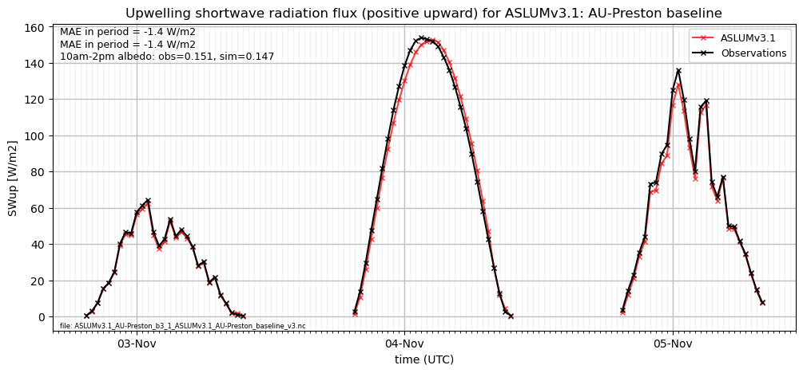](ASLUMv3.1_AU-Preston_SWup_subset_baseline.png)

### SWup_subset_detailed
[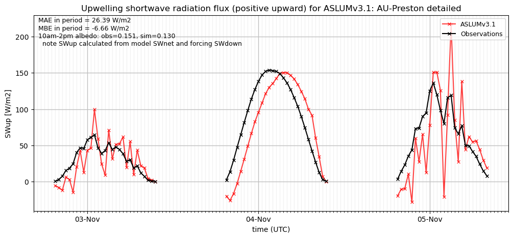](ASLUMv3.1_AU-Preston_SWup_subset_detailed.png)

### closure_baseline
[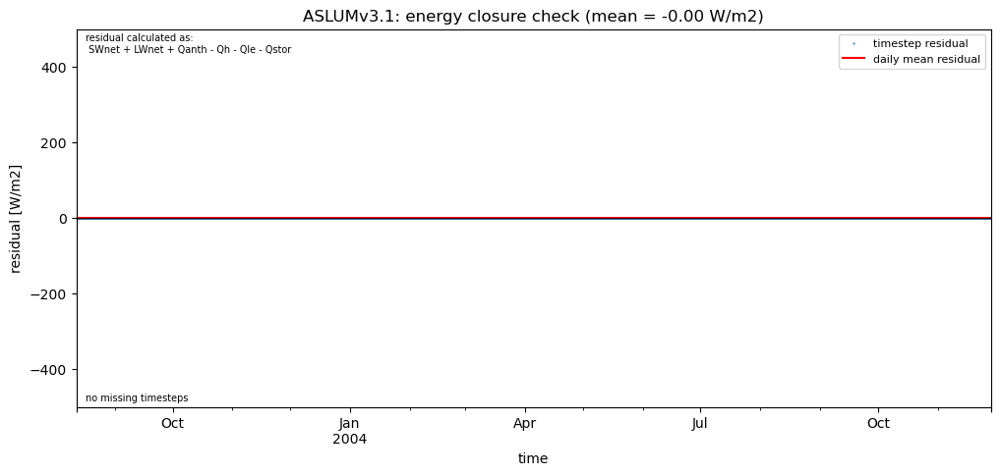](ASLUMv3.1_AU-Preston_closure_baseline.png)

### closure_detailed
[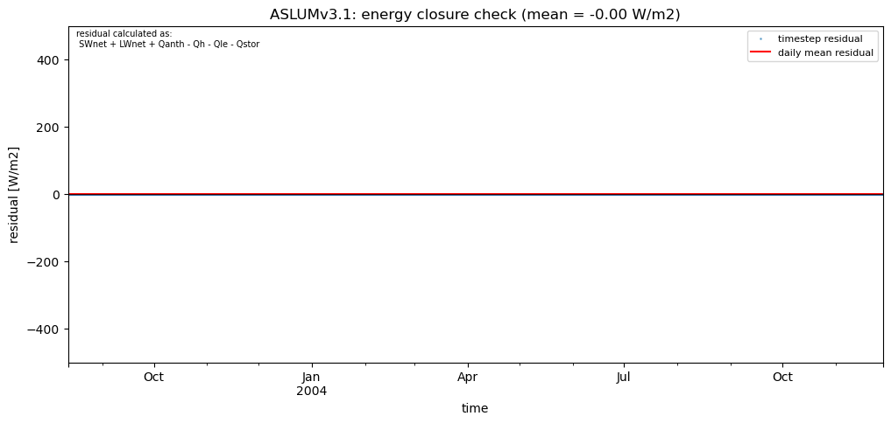](ASLUMv3.1_AU-Preston_closure_detailed.png)

### out of range: baseline

 - ASLUMv3.1 SWup min value of -393.3918 is less than expected 0.0 [W/m2]
 - ASLUMv3.1 ESoil max value of 0.0009 is greater than expected 0.0003 [kg/m2/s]
 - ASLUMv3.1 alb min value of -0.9984 is less than expected 0.0 [1]

### out of range: detailed

 - ASLUMv3.1 SWup min value of -400.1762 is less than expected 0.0 [W/m2]
 - ASLUMv3.1 ESoil max value of 0.0003 is greater than expected 0.0003 [kg/m2/s]
 - ASLUMv3.1 alb min value of -0.9997 is less than expected 0.0 [1]

[Link to variable definitions](variable_definitions.md)

