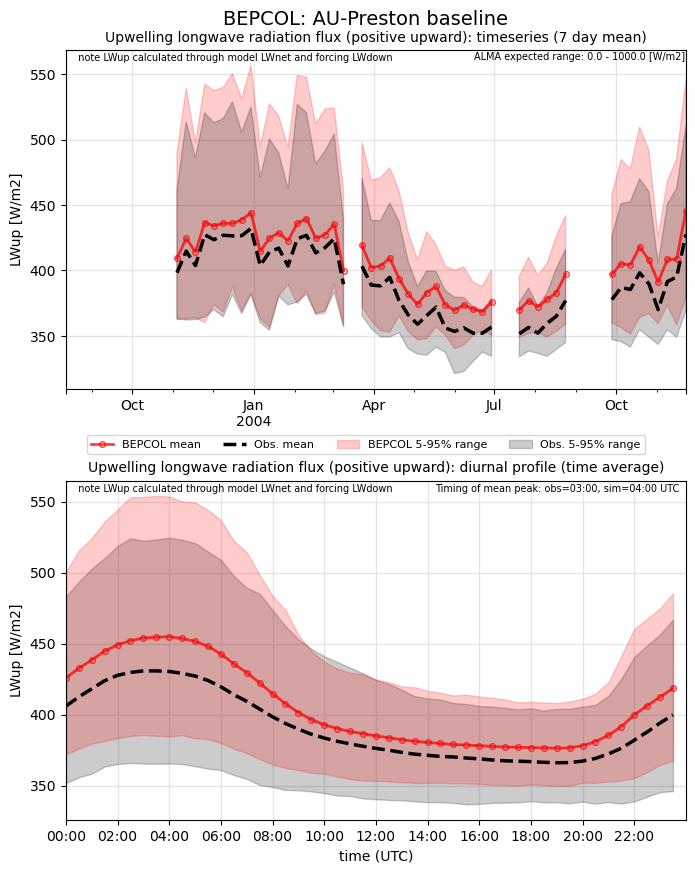
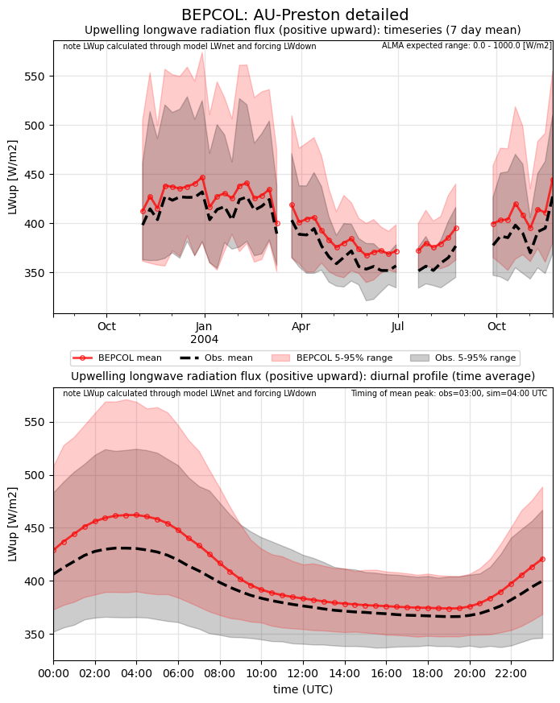
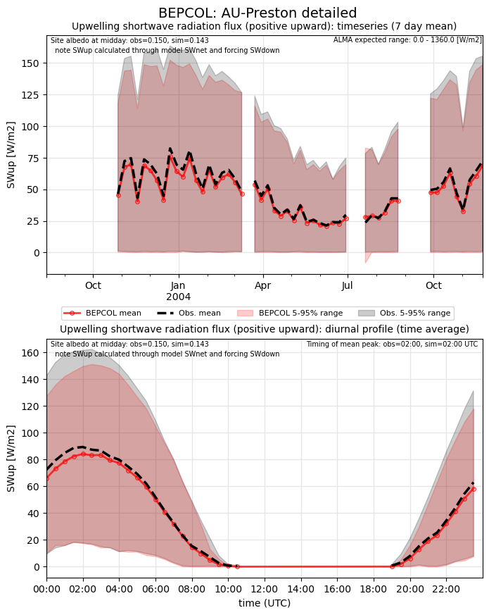

# AU-Preston: BEPCOL

**NOTE:** *Results presented here are highly dependent on how models are configured in this experiment and may be subject to variable output formatting errors. Results are not intended to indicate the quality of any individual model, but to help participants better understand and improve modelling approaches in different urban environments.*

### Error metrics

| flux   | experiment   |   MAE |     MBE |    NSD |      R |
|:-------|:-------------|------:|--------:|-------:|-------:|
| SWnet  | baseline     |  5.79 |   5.653 | 0.891  | 1      |
| SWnet  | detailed     |  3.35 |   3.019 | 0.8825 | 0.9999 |
| LWnet  | baseline     | 15.48 | -14.935 | 0.988  | 0.9791 |
| LWnet  | detailed     | 17.61 | -15.927 | 1.0375 | 0.9619 |
| Qle    | baseline     | 30.2  | -13.088 | 0.6607 | 0.3952 |
| Qle    | detailed     | 29.05 | -14.809 | 0.6684 | 0.4792 |
| Qh     | baseline     | 38.54 |  28.518 | 1.3403 | 0.9272 |
| Qh     | detailed     | 38.39 |  32.11  | 1.1847 | 0.9214 |

### jump to figure:
 - [baseline_Albedo](#baseline_albedo)
 - [baseline_LWnet](#baseline_lwnet)
 - [baseline_LWup](#baseline_lwup)
 - [baseline_Qh](#baseline_qh)
 - [baseline_Qle](#baseline_qle)
 - [baseline_SWnet](#baseline_swnet)
 - [baseline_SWnet_ts](#baseline_swnet_ts)
 - [baseline_SWup](#baseline_swup)
 - [baseline_SWup_ts](#baseline_swup_ts)
 - [baseline_closure](#baseline_closure)
 - [detailed_Albedo](#detailed_albedo)
 - [detailed_LWnet](#detailed_lwnet)
 - [detailed_LWup](#detailed_lwup)
 - [detailed_Qh](#detailed_qh)
 - [detailed_Qle](#detailed_qle)
 - [detailed_SWnet](#detailed_swnet)
 - [detailed_SWnet_ts](#detailed_swnet_ts)
 - [detailed_SWup](#detailed_swup)
 - [detailed_SWup_ts](#detailed_swup_ts)
 - [detailed_closure](#detailed_closure)

### baseline_Albedo

### baseline_LWnet

### baseline_LWup

### baseline_Qh

### baseline_Qle

### baseline_SWnet

### baseline_SWnet_ts

### baseline_SWup

### baseline_SWup_ts

### baseline_closure

### detailed_Albedo

### detailed_LWnet

### detailed_LWup

### detailed_Qh

### detailed_Qle

### detailed_SWnet

### detailed_SWnet_ts

### detailed_SWup

### detailed_SWup_ts

### detailed_closure

### out of range: baseline

 - BEPCOL Qh max value of 777.1300 is greater than expected 600.0 [W/m2]
 - BEPCOL SWup min value of -419.9369 is less than expected 0.0 [W/m2]
 - BEPCOL alb min value of -0.9996 is less than expected 0.0 [1]

### out of range: detailed

 - BEPCOL Qh max value of 726.0000 is greater than expected 600.0 [W/m2]
 - BEPCOL SWup min value of -410.7551 is less than expected 0.0 [W/m2]
 - BEPCOL alb min value of -0.9964 is less than expected 0.0 [1]

