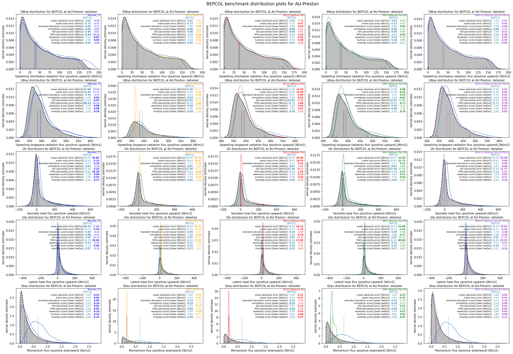

# AU-Preston: BEPCOL

**NOTE:** *Results presented here are highly dependent on how models are configured in this experiment and may be subject to variable output formatting errors. Results are not intended to indicate the quality of any individual model, but to help participants better understand and improve modelling approaches in different urban environments.*

### Submitted metadata

- [Baseline](BEPCOL_AU-Preston_baseline_attrs.md)
- [Detailed](BEPCOL_AU-Preston_detailed_attrs.md)

### Error metrics

| flux   | experiment   |       MAE |        MBE |      nSD |        R |      5th |      95th |      RMSE |    cRMSE |      AMBE |     1-nSD |        1-R |   nSkewness |   nKurtosis |   Overlap |
|:-------|:-------------|----------:|-----------:|---------:|---------:|---------:|----------:|----------:|---------:|----------:|----------:|-----------:|------------:|------------:|----------:|
| SWup   | baseline     |  6.11345  |  -5.96507  | 0.880982 | 0.998127 |  0.59    |  17.64    |  8.57246  | 0.132155 |  5.96507  | 0.119018  | 0.00187268 |   0.0818974 |    0.169992 | 0.0793931 |
| SWup   | detailed     |  3.52279  |  -3.17214  | 0.939093 | 0.998098 |  0.55    |   8.94    |  5.08596  | 0.085335 |  3.17214  | 0.0609068 | 0.00190206 |   0.0500294 |    0.10644  | 0.0721152 |
| LWup   | baseline     | 15.4841   |  14.9373   | 1.07747  | 0.979954 | 13.71    |  24.77    | 17.6058   | 0.221809 | 14.9373   | 0.0774655 | 0.0200463  |   0.130513  |    0.225839 | 0.183981  |
| LWup   | detailed     | 17.6104   |  15.931    | 1.15443  | 0.966089 | 12.63    |  36.43    | 20.835    | 0.319603 | 15.931    | 0.154434  | 0.033911   |   0.207112  |    0.407135 | 0.176409  |
| Qle    | baseline     | 29.924    | -13.002    | 0.663011 | 0.396522 |  0.93    |  48.85    | 51.4502   | 0.955922 | 13.002    | 0.336989  | 0.603478   |   0.045791  |    0.724411 | 0.145233  |
| Qle    | detailed     | 28.7386   | -14.6858   | 0.669954 | 0.483171 |  0.35    |  43.18    | 48.878    | 0.895228 | 14.6858   | 0.330046  | 0.516829   |   0.164065  |    0.115436 | 0.173167  |
| Qh     | baseline     | 38.5281   |  28.5262   | 1.3466   | 0.927341 |  6.29    | 107.7     | 59.0459   | 0.561979 | 28.5262   | 0.346604  | 0.0726591  |   0.0432588 |    0.135893 | 0.280529  |
| Qh     | detailed     | 38.3609   |  32.0848   | 1.1729   | 0.921568 | 28.66    |  80.68    | 53.2863   | 0.462471 | 32.0848   | 0.1729    | 0.0784315  |   0.20901   |    0.535956 | 0.404107  |
| Qtau   | baseline     |  0.52512  |   0.521581 | 1.15853  | 0.807368 |  0.25491 |   0.52538 |  0.568161 | 0.686636 |  0.521581 | 0.158526  | 0.192632   |   0.680081  |    0.9221   | 0.620273  |
| Qtau   | detailed     |  0.431469 |   0.425595 | 1.1008   | 0.818995 |  0.20794 |   0.4062  |  0.474476 | 0.639264 |  0.425595 | 0.100797  | 0.181005   |   0.588174  |    0.83534  | 0.572127  |

 - MAE: mean absolute error (close to 0 is better)
 - MBE: mean bias error (close to 0 is better)
 - NSD: ratio of model to obs standard deviation (close to 1 is better)
 - R: Pearson's correlation (close to 1 is better)
 - all others: closer to 0 is better

[Link to variable definitions](../modelattrs/variable_definitions.md)

### Datasheet

### Distributions

### closure_baseline

### closure_detailed

### subset_LWup

### subset_Qh

### subset_Qle

### subset_SWup

### out of range: baseline

 - BEPCOL Qh max value of 777.1300 is greater than expected 600.0 [W/m2]
 - BEPCOL EvapF max value of 24.4938 is greater than expected 1.0 [1]
 - BEPCOL EvapF min value of -45.0000 is less than expected 0.0 [1]

### out of range: detailed

 - BEPCOL Qh max value of 726.0000 is greater than expected 600.0 [W/m2]
 - BEPCOL EvapF max value of 1217.0000 is greater than expected 1.0 [1]
 - BEPCOL EvapF min value of -8.1732 is less than expected 0.0 [1]

[Link to variable definitions](../modelattrs/variable_definitions.md)

