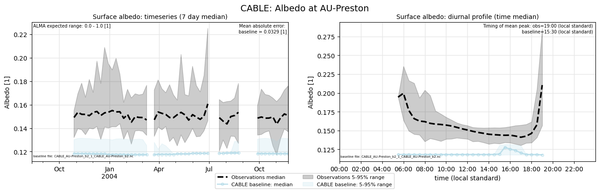

# AU-Preston: CABLE

**NOTE:** *Results presented here are highly dependent on how models are configured in this experiment and may be subject to variable output formatting errors. Results are not intended to indicate the quality of any individual model, but to help participants better understand and improve modelling approaches in different urban environments.*

### Error metrics

| flux   | experiment   |     MAE |      MBE |      NSD |        R |
|:-------|:-------------|--------:|---------:|---------:|---------:|
| SWnet  | baseline     | 10.7044 |  10.6978 | 0.904461 | 0.999857 |
| LWnet  | baseline     | 16.3636 | -13.8349 | 1.33098  | 0.93779  |
| Qle    | baseline     | 38.3701 |  16.7921 | 1.43436  | 0.536006 |
| Qh     | baseline     | 27.8381 | -12.2579 | 1.008    | 0.893699 |

 - MAE: mean absolute error (close to 0 is better)
 - MBE: mean bias error (close to 0 is better)
 - NSD: ratio of model to obs standard deviation (close to 1 is better)
 - R: Pearson's correlation (close to 1 is better)

### jump to figure:
 - [Albedo](#albedo)
 - [LWnet](#lwnet)
 - [LWup](#lwup)
 - [Qanth](#qanth)
 - [Qh](#qh)
 - [Qle](#qle)
 - [SWnet](#swnet)
 - [SWup](#swup)
 - [closure_baseline](#closure_baseline)
 - [subset_LWnet](#subset_lwnet)
 - [subset_LWup](#subset_lwup)
 - [subset_Qanth](#subset_qanth)
 - [subset_Qh](#subset_qh)
 - [subset_Qle](#subset_qle)
 - [subset_SWnet](#subset_swnet)
 - [subset_SWup](#subset_swup)

[Link to variable definitions](../modelattrs/variable_definitions.md)

### Albedo

### LWnet

### LWup

### Qanth

### Qh

### Qle

### SWnet

### SWup

### closure_baseline

### subset_LWnet

### subset_LWup

### subset_Qanth

### subset_Qh

### subset_Qle

### subset_SWnet

### subset_SWup

### out of range: baseline

 - CABLE Qle max value of 758.7974 is greater than expected 700.0 [W/m2]
 - CABLE Evap max value of 0.0003 is greater than expected 0.0003 [kg/m2/s]

### out of range: detailed

[Link to variable definitions](../modelattrs/variable_definitions.md)

