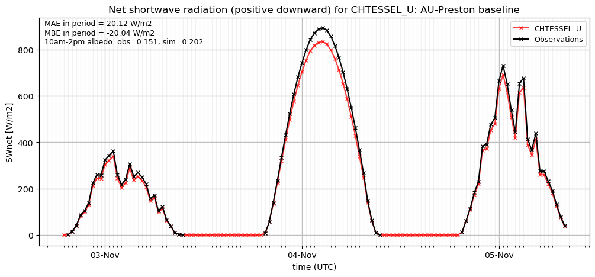
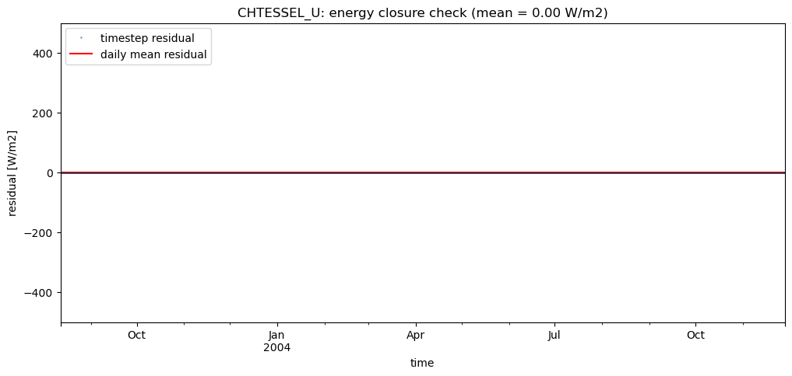
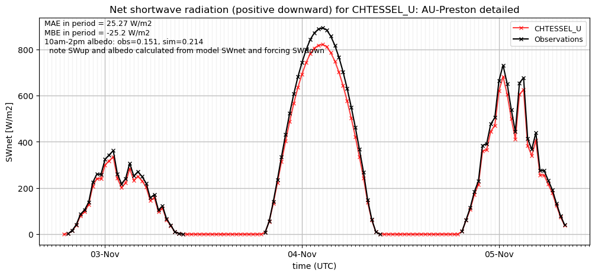
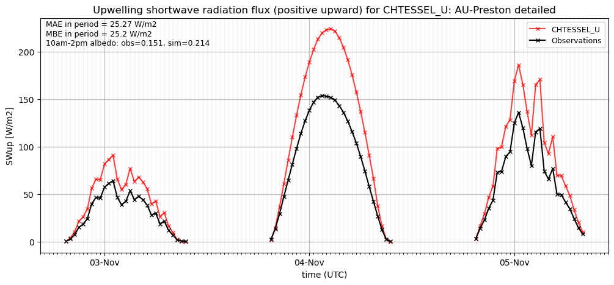

# AU-Preston: CHTESSEL_U

**NOTE:** *Results presented here are highly dependent on how models are configured in this experiment and may be subject to variable output formatting errors. Results are not intended to indicate the quality of any individual model, but to help participants better understand and improve modelling approaches in different urban environments.*

### Error metrics

| flux   | experiment   |   MAE |     MBE |    NSD |      R |
|:-------|:-------------|------:|--------:|-------:|-------:|
| SWnet  | baseline     | 17.21 | -16.989 | 0.8208 | 0.9999 |
| SWnet  | detailed     | 21.59 | -21.421 | 0.8076 | 0.9999 |
| LWnet  | baseline     |  9.61 |  -6.1   | 1.0056 | 0.9728 |
| LWnet  | detailed     |  9.78 |  -1.204 | 0.9838 | 0.9611 |
| Qle    | baseline     | 36.96 | -28.291 | 0.3737 | 0.1213 |
| Qle    | detailed     | 36.93 | -28.362 | 0.3898 | 0.1409 |
| Qh     | baseline     | 34.79 |  21.186 | 1.4361 | 0.9446 |
| Qh     | detailed     | 40.86 |  24.013 | 1.5785 | 0.9451 |

### jump to figure:
 - [Albedo](#albedo)
 - [LWnet](#lwnet)
 - [LWup](#lwup)
 - [Qh](#qh)
 - [Qle](#qle)
 - [SWnet](#swnet)
 - [SWup](#swup)
 - [baseline_SWnet_ts](#baseline_swnet_ts)
 - [baseline_SWup_ts](#baseline_swup_ts)
 - [baseline_closure](#baseline_closure)
 - [detailed_SWnet_ts](#detailed_swnet_ts)
 - [detailed_SWup_ts](#detailed_swup_ts)
 - [detailed_closure](#detailed_closure)

### Albedo

### LWnet

### LWup

### Qh

### Qle

### SWnet

### SWup

### baseline_SWnet_ts

### baseline_SWup_ts

### baseline_closure

### detailed_SWnet_ts

### detailed_SWup_ts

### detailed_closure

### out of range: baseline

 - CHTESSEL_U Qh max value of 609.2643 is greater than expected 600.0 [W/m2]
 - CHTESSEL_U SWup min value of -357.0919 is less than expected 0.0 [W/m2]
 - CHTESSEL_U alb min value of -0.9967 is less than expected 0.0 [1]

### out of range: detailed

 - CHTESSEL_U Qh max value of 651.2963 is greater than expected 600.0 [W/m2]
 - CHTESSEL_U SWup min value of -345.7458 is less than expected 0.0 [W/m2]
 - CHTESSEL_U alb min value of -0.9943 is less than expected 0.0 [1]

