# CM-BEM

**NOTE:** *Results presented here are highly dependent on how models are configured in this experiment and may be subject to variable output formatting errors. Results are not intended to indicate the quality of any individual model, but to help participants better understand and improve modelling approaches in different urban environments.*

### baseline_Albedo
[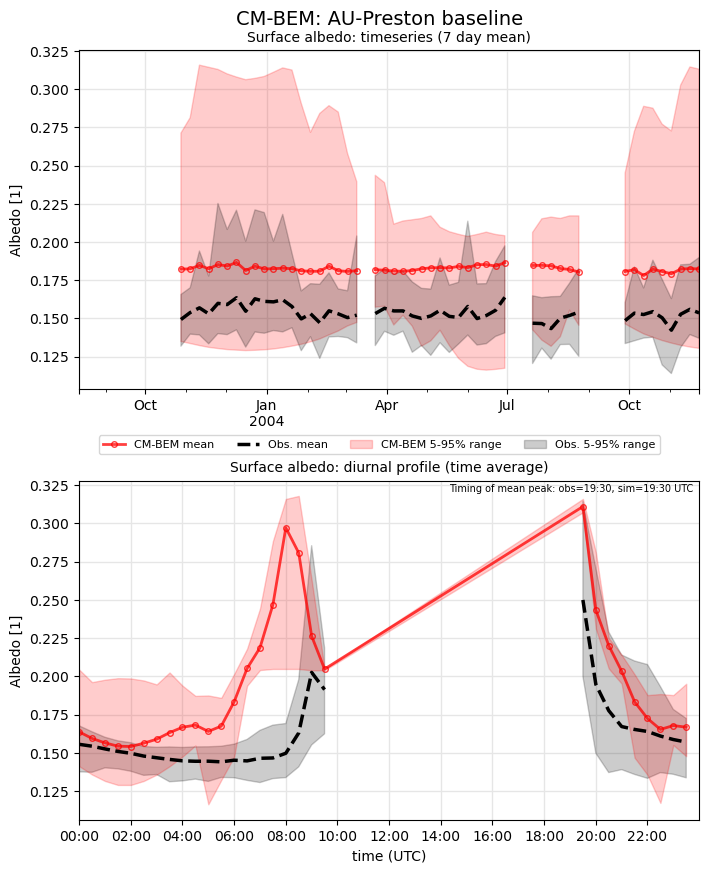](CM-BEM_AU-Preston_baseline_Albedo.png.png)

### baseline_LWnet
[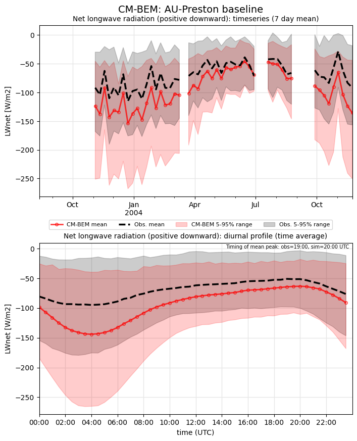](CM-BEM_AU-Preston_baseline_LWnet.png.png)

### baseline_LWup
[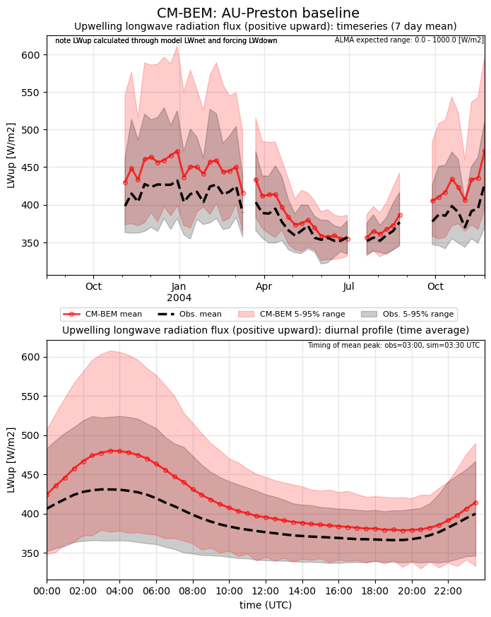](CM-BEM_AU-Preston_baseline_LWup.png.png)

### baseline_Qh
[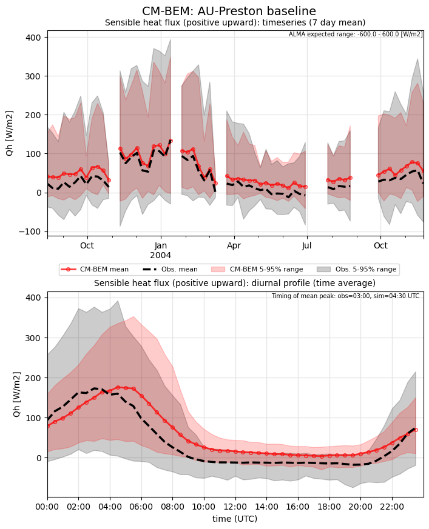](CM-BEM_AU-Preston_baseline_Qh.png.png)

### baseline_Qle
[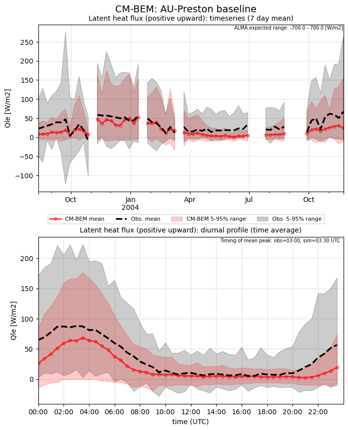](CM-BEM_AU-Preston_baseline_Qle.png.png)

### baseline_SWnet
[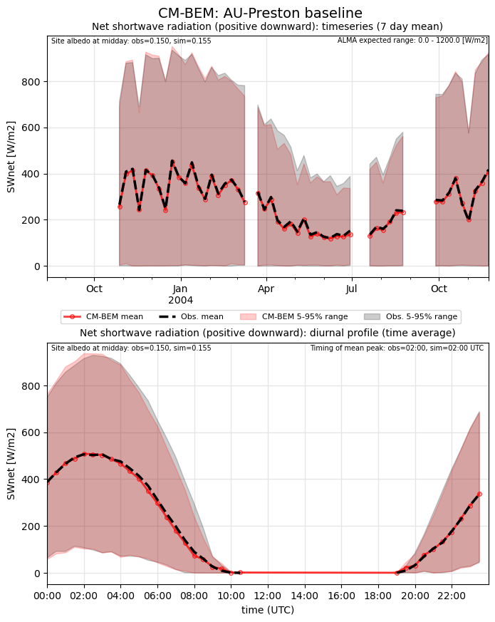](CM-BEM_AU-Preston_baseline_SWnet.png.png)

### baseline_SWnet_ts

### baseline_SWup

### baseline_SWup_ts

### baseline_closure

### detailed_Albedo
[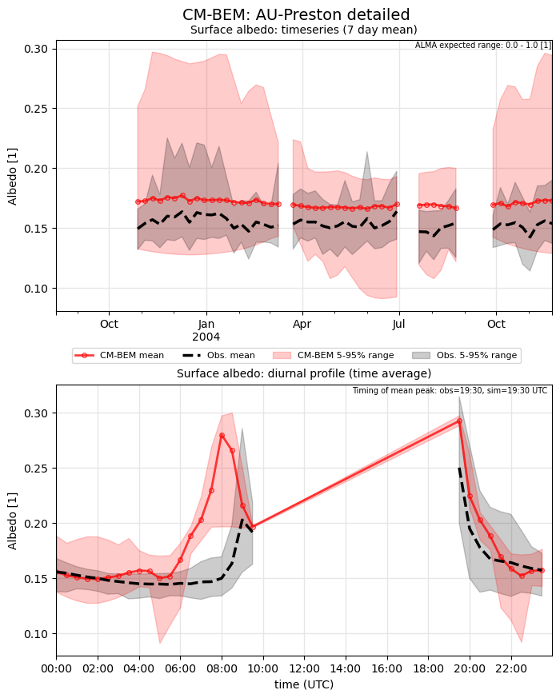](CM-BEM_AU-Preston_detailed_Albedo.png.png)

### detailed_LWnet
[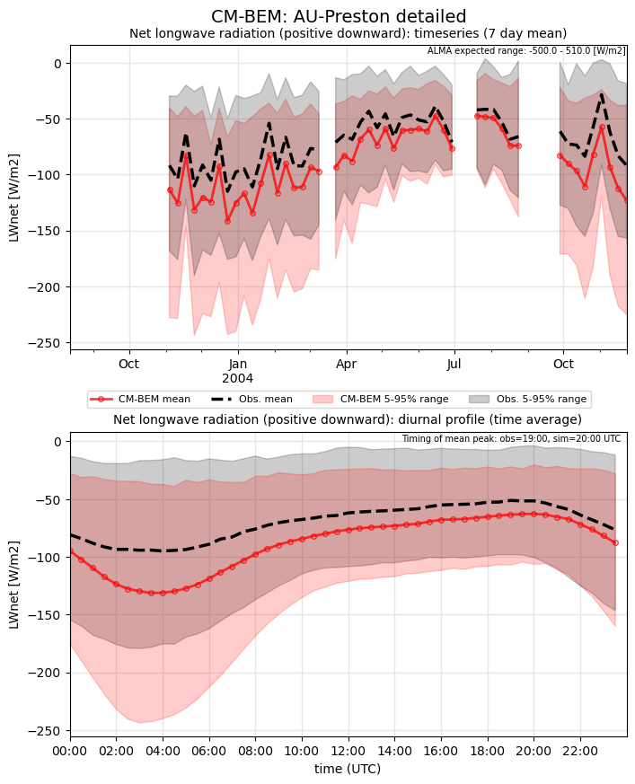](CM-BEM_AU-Preston_detailed_LWnet.png.png)

### detailed_LWup
[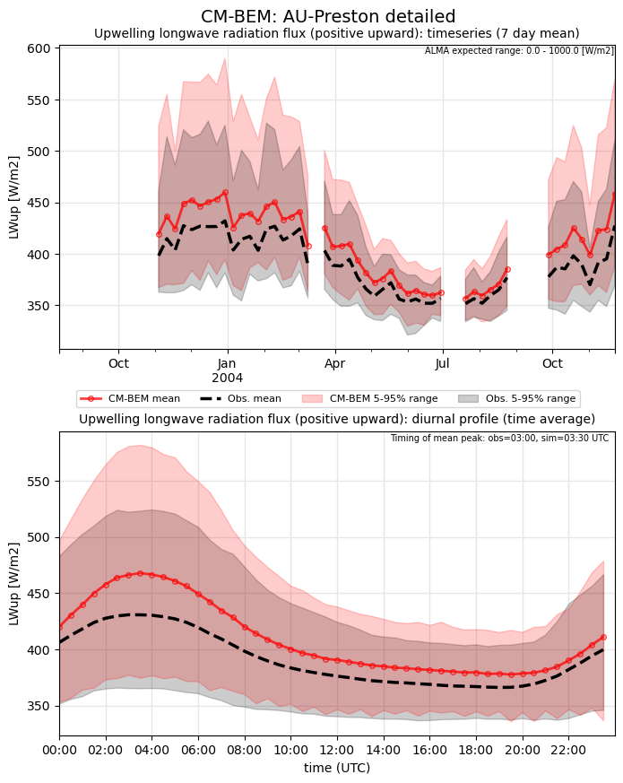](CM-BEM_AU-Preston_detailed_LWup.png.png)

### detailed_Qh
[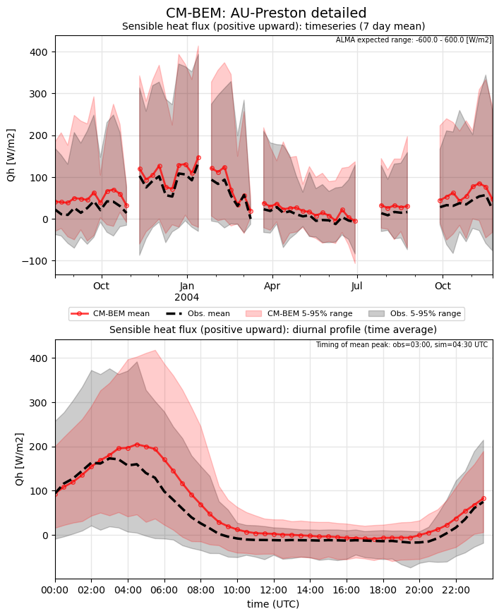](CM-BEM_AU-Preston_detailed_Qh.png.png)

### detailed_Qle
[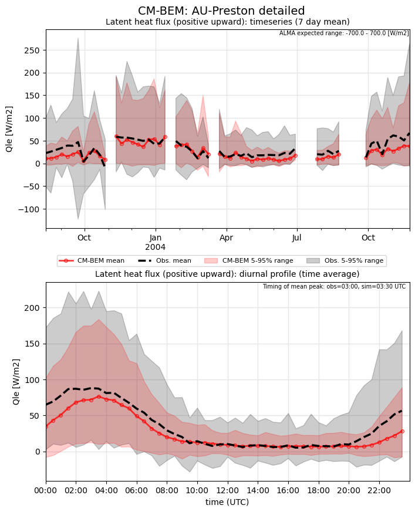](CM-BEM_AU-Preston_detailed_Qle.png.png)

### detailed_SWnet

### detailed_SWnet_ts

### detailed_SWup
[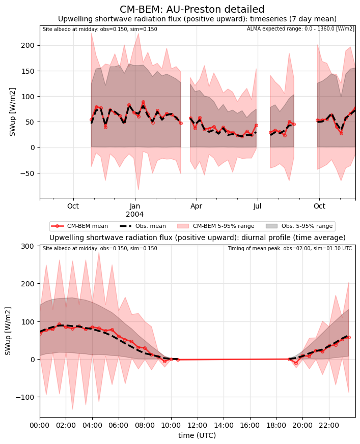](CM-BEM_AU-Preston_detailed_SWup.png.png)

### detailed_SWup_ts

### detailed_closure

