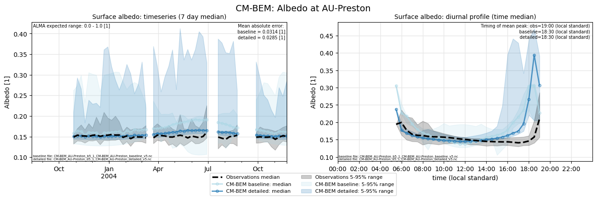

# AU-Preston: CM-BEM

**NOTE:** *Results presented here are highly dependent on how models are configured in this experiment and may be subject to variable output formatting errors. Results are not intended to indicate the quality of any individual model, but to help participants better understand and improve modelling approaches in different urban environments.*

### Error metrics

| flux   | experiment   |   MAE |     MBE |    NSD |      R |
|:-------|:-------------|------:|--------:|-------:|-------:|
| SWnet  | baseline     | 27    |  -4.418 | 0.8589 | 0.9799 |
| SWnet  | detailed     | 25.62 |  -1.415 | 0.8656 | 0.9804 |
| LWnet  | baseline     | 25.88 | -24.609 | 1.2076 | 0.9313 |
| LWnet  | detailed     | 19.4  | -18.607 | 1.0922 | 0.9536 |
| Qle    | baseline     | 27.83 | -14.644 | 0.6249 | 0.5949 |
| Qle    | detailed     | 24.16 |  -8.693 | 0.6402 | 0.6448 |
| Qh     | baseline     | 34.97 |  18.384 | 0.8314 | 0.8928 |
| Qh     | detailed     | 30.53 |  18.093 | 1.0274 | 0.9093 |

### jump to figure:
 - [Albedo](#albedo)
 - [LWnet](#lwnet)
 - [LWup](#lwup)
 - [Qh](#qh)
 - [Qle](#qle)
 - [SWnet](#swnet)
 - [SWnet_subset_baseline](#swnet_subset_baseline)
 - [SWnet_subset_detailed](#swnet_subset_detailed)
 - [SWup](#swup)
 - [SWup_subset_baseline](#swup_subset_baseline)
 - [SWup_subset_detailed](#swup_subset_detailed)
 - [closure_baseline](#closure_baseline)
 - [closure_detailed](#closure_detailed)

[Link to variable definitions](variable_definitions.md)

### Albedo

### LWnet

### LWup

### Qh

### Qle

### SWnet

### SWnet_subset_baseline

### SWnet_subset_detailed

### SWup

### SWup_subset_baseline

### SWup_subset_detailed

### closure_baseline

### closure_detailed

### out of range: baseline

 - CM-BEM SWnet min value of -0.1441 is less than expected 0.0 [W/m2]
 - CM-BEM SWup min value of -488.7715 is less than expected 0.0 [W/m2]
 - CM-BEM Qanth_Qle min value of -1.9800 is less than expected 0.0 [W/m2]
 - CM-BEM alb min value of -0.9995 is less than expected 0.0 [1]

### out of range: detailed

 - CM-BEM SWnet min value of -0.1370 is less than expected 0.0 [W/m2]
 - CM-BEM SWup min value of -489.3107 is less than expected 0.0 [W/m2]
 - CM-BEM Qanth_Qle min value of -1.8900 is less than expected 0.0 [W/m2]
 - CM-BEM alb min value of -0.9978 is less than expected 0.0 [1]

[Link to variable definitions](variable_definitions.md)

