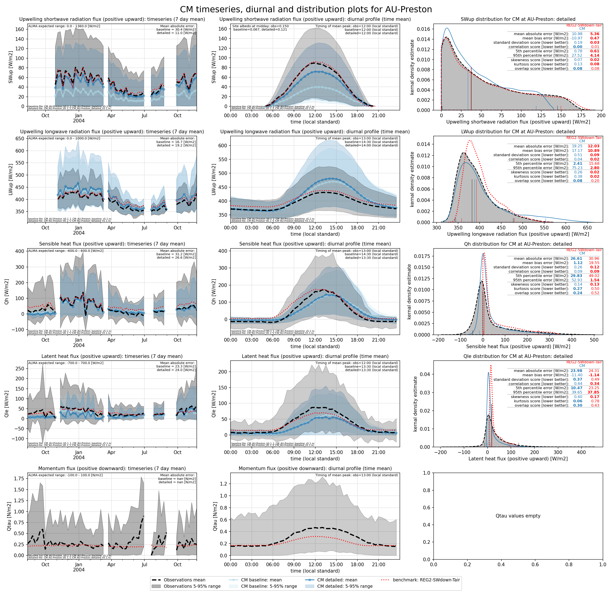
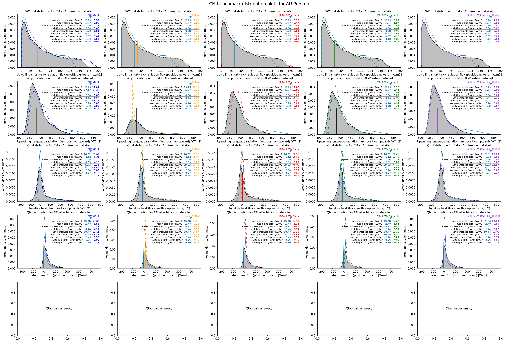
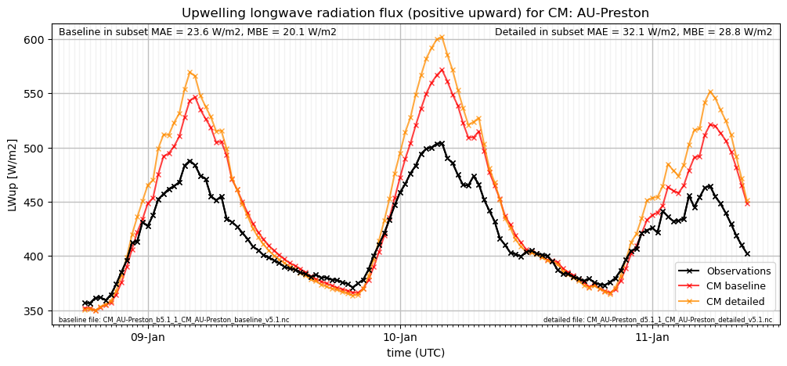

# AU-Preston: CM

**NOTE:** *Results presented here are highly dependent on how models are configured in this experiment and may be subject to variable output formatting errors. Results are not intended to indicate the quality of any individual model, but to help participants better understand and improve modelling approaches in different urban environments.*

### Submitted metadata

- [Baseline](CM_AU-Preston_baseline_attrs.md)
- [Detailed](CM_AU-Preston_detailed_attrs.md)

### Error metrics

| flux   | experiment   |      MAE |        MBE |        nSD |          R |    5th |   95th |     RMSE |      cRMSE |       AMBE |      1-nSD |          1-R |   nSkewness |   nKurtosis |     Overlap |
|:-------|:-------------|---------:|-----------:|-----------:|-----------:|-------:|-------:|---------:|-----------:|-----------:|-----------:|-------------:|------------:|------------:|------------:|
| SWup   | baseline     |  30.3294 | -30.3294   |   0.450599 |   0.996707 |   1.18 |  80.12 |  39.7669 |   0.552095 |  30.3294   |   0.549401 |   0.00329272 |   0.0118083 |   0.019932  |   0.118515  |
| SWup   | detailed     |  10.9526 | -10.9447   |   0.809878 |   0.996707 |   0.76 |  27.58 |  14.4849 |   0.203666 |  10.9447   |   0.190122 |   0.00329277 |   0.0118016 |   0.0199162 |   0.0766776 |
| LWup   | baseline     |  16.7231 |  14.4722   |   1.34857  |   0.953377 |   4.76 |  55.47 |  25.4134 |   0.497243 |  14.4722   |   0.348569 |   0.0466234  |   0.172409  |   0.0824588 |   0.0885482 |
| LWup   | detailed     |  19.2497 |  17.1675   |   1.51054  |   0.956917 |   2.42 |  75.2  |  31.3768 |   0.625148 |  17.1675   |   0.510541 |   0.0430832  |   0.262653  |   0.390757  |   0.0818837 |
| Qle    | baseline     |  25.4946 | -10.3061   |   0.588147 |   0.58959  |   8.08 |  40.94 |  43.3059 |   0.807704 |  10.3061   |   0.411853 |   0.41041    |   0.0159798 |   0.465612  |   0.194154  |
| Qle    | detailed     |  25.929  | -11.5732   |   0.603494 |   0.529955 |  12.11 |  42.23 |  45.8131 |   0.851208 |  11.5732   |   0.396506 |   0.470045   |   0.265955  |   0.130912  |   0.290491  |
| Qh     | baseline     |  32.185  |   4.21072  |   0.697652 |   0.882921 |  32.77 |  56.1  |  46.6241 |   0.504753 |   4.21072  |   0.302348 |   0.117079   |   0.0147222 |   0.106703  |   0.330265  |
| Qh     | detailed     |  27.7335 |   0.412447 |   0.734795 |   0.901571 |  29.74 |  52.93 |  42.6557 |   0.463664 |   0.412447 |   0.265205 |   0.0984292  |   0.0710226 |   0.119719  |   0.240415  |
| Qtau   | baseline     | nan      | nan        | nan        | nan        | nan    | nan    | nan      | nan        | nan        | nan        | nan          | nan         | nan         | nan         |
| Qtau   | detailed     | nan      | nan        | nan        | nan        | nan    | nan    | nan      | nan        | nan        | nan        | nan          | nan         | nan         | nan         |

 - MAE: mean absolute error (close to 0 is better)
 - MBE: mean bias error (close to 0 is better)
 - NSD: ratio of model to obs standard deviation (close to 1 is better)
 - R: Pearson's correlation (close to 1 is better)
 - all others: closer to 0 is better

[Link to variable definitions](../modelattrs/variable_definitions.md)

### Datasheet

### Distributions

### closure_baseline

### closure_detailed

### subset_LWup

### subset_Qh

### subset_Qle

### subset_SWup

### out of range: baseline

 - CM Qg max value of 513.7900 is greater than expected 500.0 [W/m2]
 - CM EvapF max value of 5.8462 is greater than expected 1.0 [1]
 - CM EvapF min value of -9.1905 is less than expected 0.0 [1]

### out of range: detailed

 - CM EvapF max value of 39.9310 is greater than expected 1.0 [1]
 - CM EvapF min value of -9.3846 is less than expected 0.0 [1]

[Link to variable definitions](../modelattrs/variable_definitions.md)

