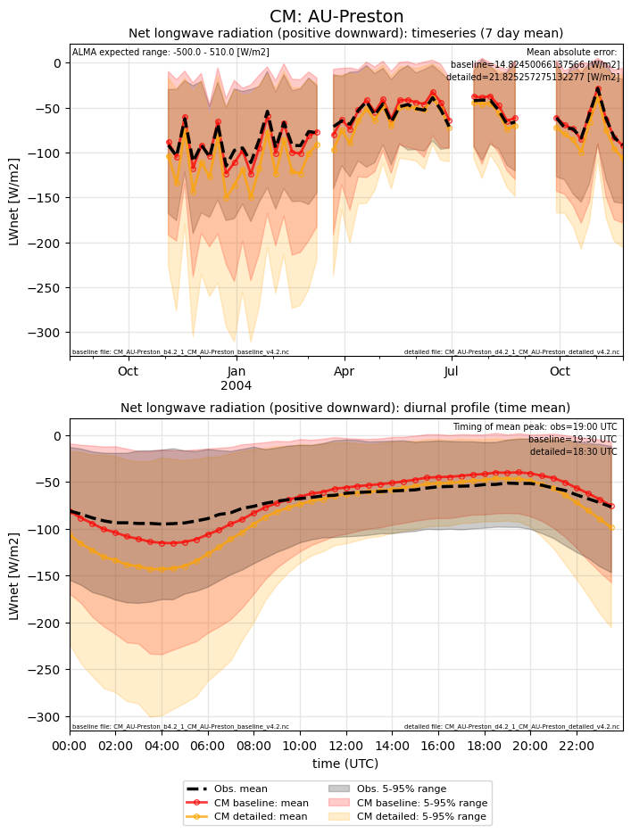
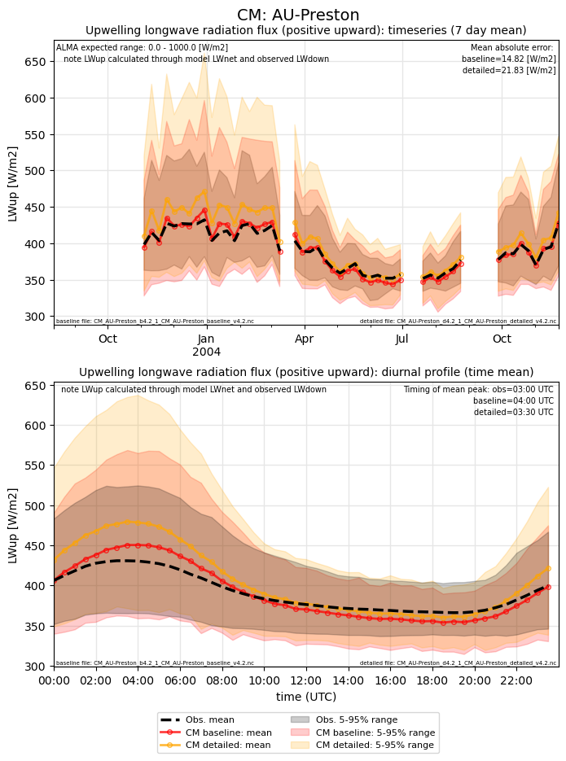
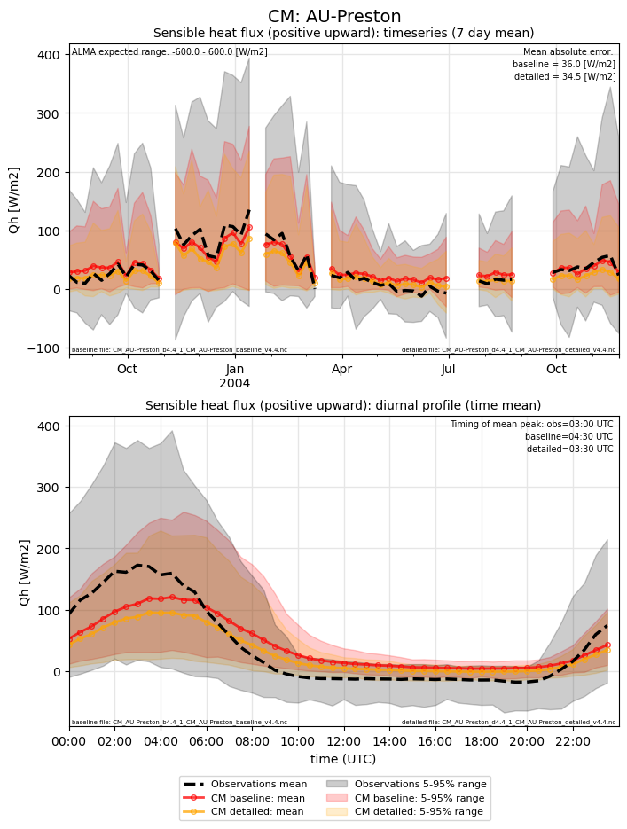
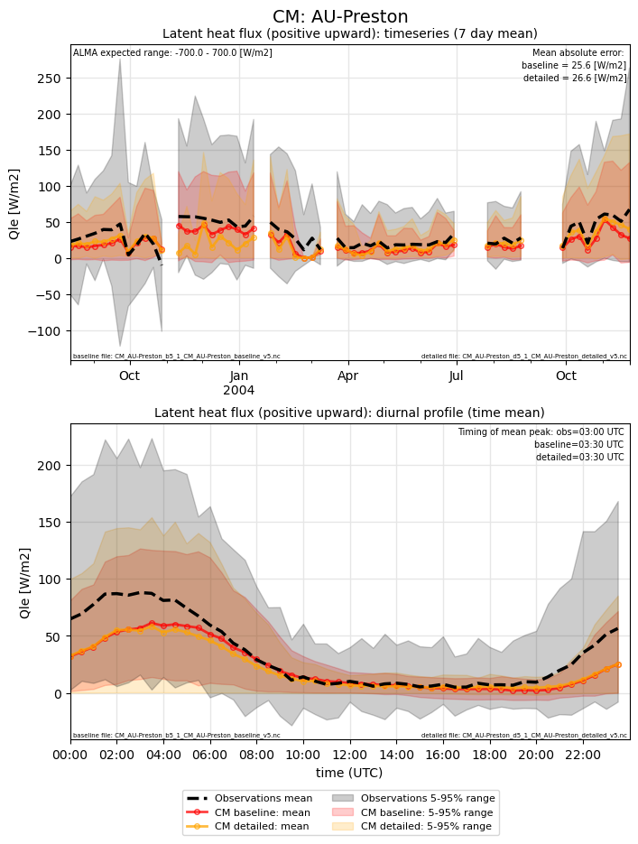
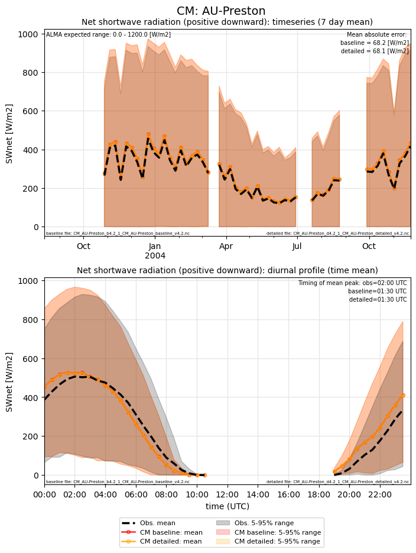
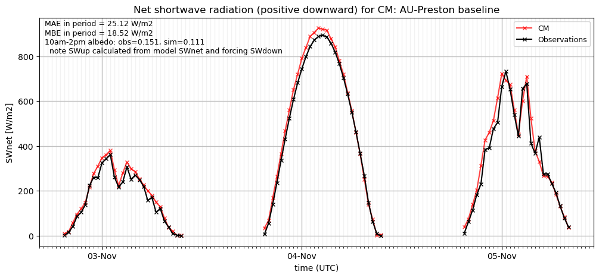
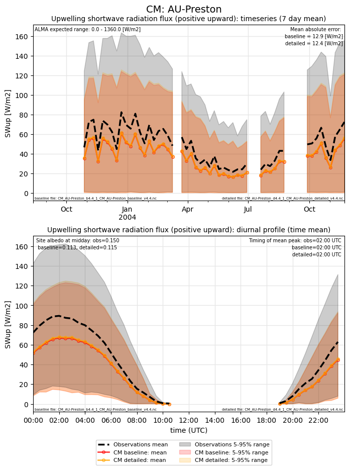
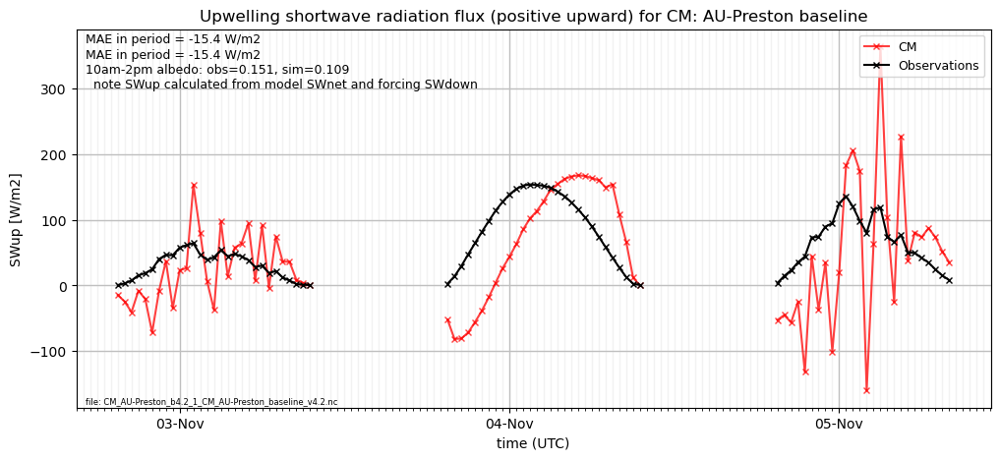
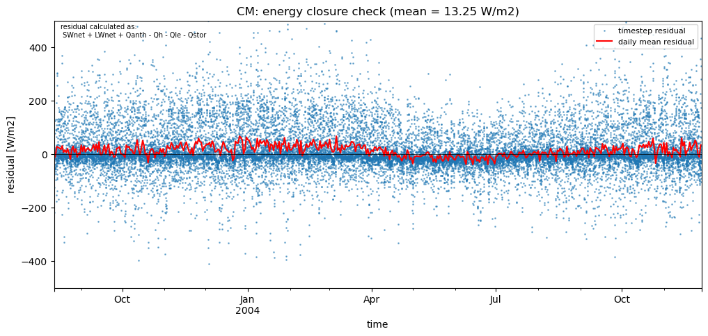
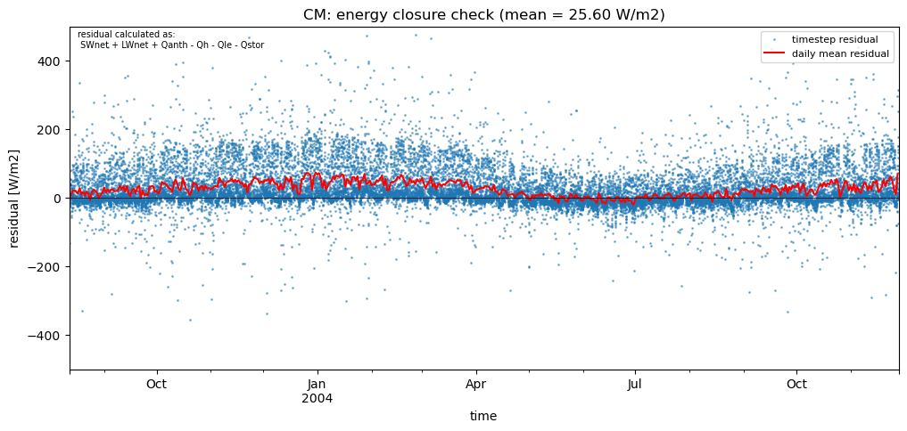

# AU-Preston: CM

**NOTE:** *Results presented here are highly dependent on how models are configured in this experiment and may be subject to variable output formatting errors. Results are not intended to indicate the quality of any individual model, but to help participants better understand and improve modelling approaches in different urban environments.*

### Error metrics

| flux   | experiment   |   MAE |     MBE |    NSD |      R |
|:-------|:-------------|------:|--------:|-------:|-------:|
| SWnet  | baseline     | 28.3  |  13.945 | 0.9054 | 0.9855 |
| SWnet  | detailed     | 28.04 |  13.414 | 0.9039 | 0.9855 |
| LWnet  | baseline     | 23.98 | -22.672 | 1.1892 | 0.9203 |
| LWnet  | detailed     | 37.61 | -37.306 | 1.4278 | 0.9042 |
| Qle    | baseline     | 27.67 |  -8.357 | 0.6742 | 0.5057 |
| Qle    | detailed     | 29.18 |  -7.759 | 0.8292 | 0.4789 |
| Qh     | baseline     | 39.62 |   2.727 | 0.5854 | 0.8235 |
| Qh     | detailed     | 37.22 |  -8.604 | 0.4999 | 0.8392 |

MAE = mean absolute error, MBE = mean bias error, NSD = ratio of model:obs standard deviation, R = Pearson's correlation

### jump to figure:
 - [LWnet](#lwnet)
 - [LWup](#lwup)
 - [Qh](#qh)
 - [Qle](#qle)
 - [SWnet](#swnet)
 - [SWnet_subset_baseline](#swnet_subset_baseline)
 - [SWnet_subset_detailed](#swnet_subset_detailed)
 - [SWup](#swup)
 - [SWup_subset_baseline](#swup_subset_baseline)
 - [SWup_subset_detailed](#swup_subset_detailed)
 - [closure_baseline](#closure_baseline)
 - [closure_detailed](#closure_detailed)

[Link to variable definitions](variable_definitions.md)

### LWnet

### LWup

### Qh

### Qle

### SWnet

### SWnet_subset_baseline

### SWnet_subset_detailed

### SWup

### SWup_subset_baseline

### SWup_subset_detailed

### closure_baseline

### closure_detailed

### out of range: baseline

 - CM SWnet min value of -7.7000 is less than expected 0.0 [W/m2]
 - CM SWup min value of -437.2001 is less than expected 0.0 [W/m2]
 - CM alb min value of -0.9987 is less than expected 0.0 [1]

### out of range: detailed

 - CM SWnet min value of -7.8000 is less than expected 0.0 [W/m2]
 - CM SWup min value of -436.0201 is less than expected 0.0 [W/m2]
 - CM alb min value of -0.9995 is less than expected 0.0 [1]

[Link to variable definitions](variable_definitions.md)

