# AU-Preston: CM

**NOTE:** *Results presented here are highly dependent on how models are configured in this experiment and may be subject to variable output formatting errors. Results are not intended to indicate the quality of any individual model, but to help participants better understand and improve modelling approaches in different urban environments.*

### Error metrics
| flux   | experiment   |   MAE |     MBE |    NSD |      R |
|:-------|:-------------|------:|--------:|-------:|-------:|
| SWnet  | baseline     | 28.3  |  13.945 | 0.9054 | 0.9855 |
| SWnet  | detailed     | 28.04 |  13.414 | 0.9039 | 0.9855 |
| LWnet  | baseline     | 23.98 | -22.672 | 1.1892 | 0.9203 |
| LWnet  | detailed     | 37.61 | -37.306 | 1.4278 | 0.9042 |
| Qle    | baseline     | 27.67 |  -8.357 | 0.6742 | 0.5057 |
| Qle    | detailed     | 29.18 |  -7.759 | 0.8292 | 0.4789 |
| Qh     | baseline     | 39.62 |   2.727 | 0.5854 | 0.8235 |
| Qh     | detailed     | 37.22 |  -8.604 | 0.4999 | 0.8392 |

### jump to figure:
 - [baseline_LWnet](#baseline_lwnet)
 - [baseline_LWup](#baseline_lwup)
 - [baseline_Qh](#baseline_qh)
 - [baseline_Qle](#baseline_qle)
 - [baseline_SWnet](#baseline_swnet)
 - [baseline_SWnet_ts](#baseline_swnet_ts)
 - [baseline_SWup](#baseline_swup)
 - [baseline_SWup_ts](#baseline_swup_ts)
 - [baseline_closure](#baseline_closure)
 - [detailed_LWnet](#detailed_lwnet)
 - [detailed_LWup](#detailed_lwup)
 - [detailed_Qh](#detailed_qh)
 - [detailed_Qle](#detailed_qle)
 - [detailed_SWnet](#detailed_swnet)
 - [detailed_SWnet_ts](#detailed_swnet_ts)
 - [detailed_SWup](#detailed_swup)
 - [detailed_SWup_ts](#detailed_swup_ts)
 - [detailed_closure](#detailed_closure)

### baseline_LWnet
[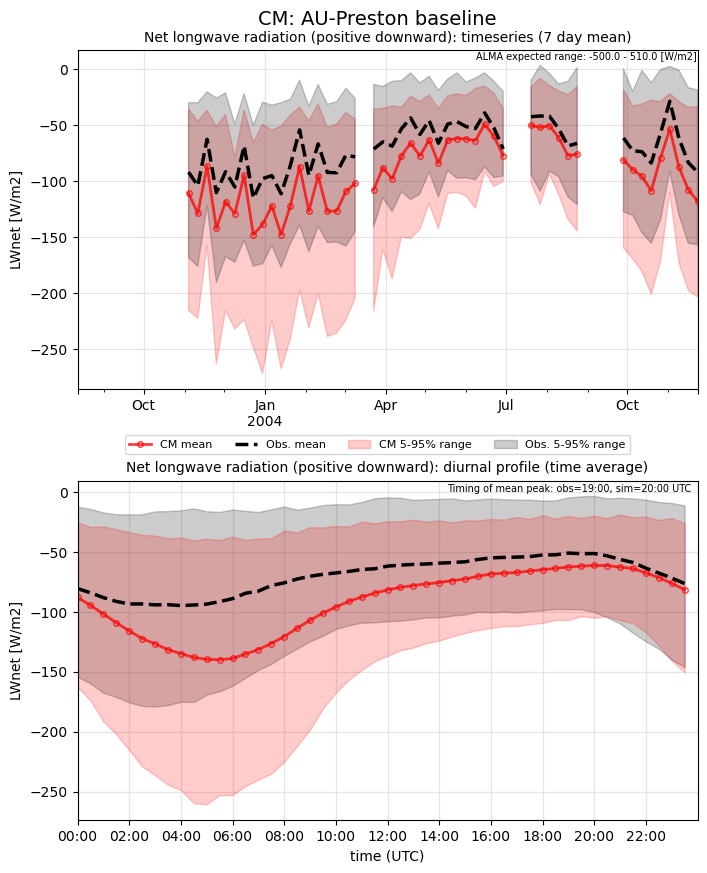](CM_AU-Preston_baseline_LWnet.png)

### baseline_LWup
[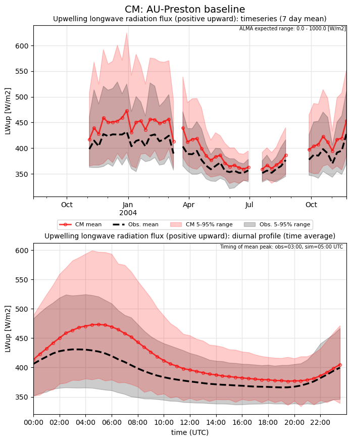](CM_AU-Preston_baseline_LWup.png)

### baseline_Qh
[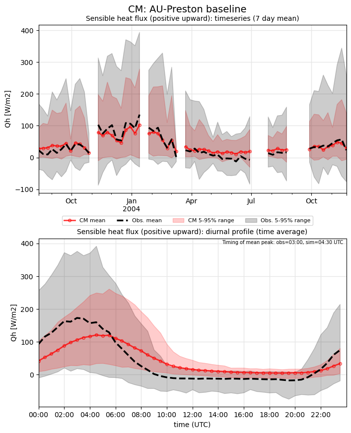](CM_AU-Preston_baseline_Qh.png)

### baseline_Qle
[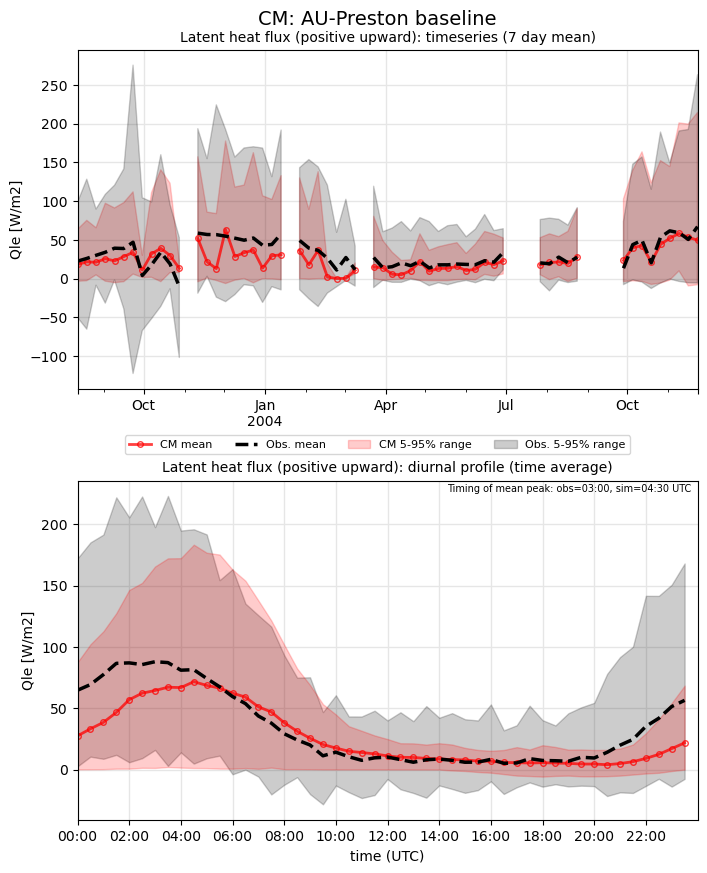](CM_AU-Preston_baseline_Qle.png)

### baseline_SWnet
[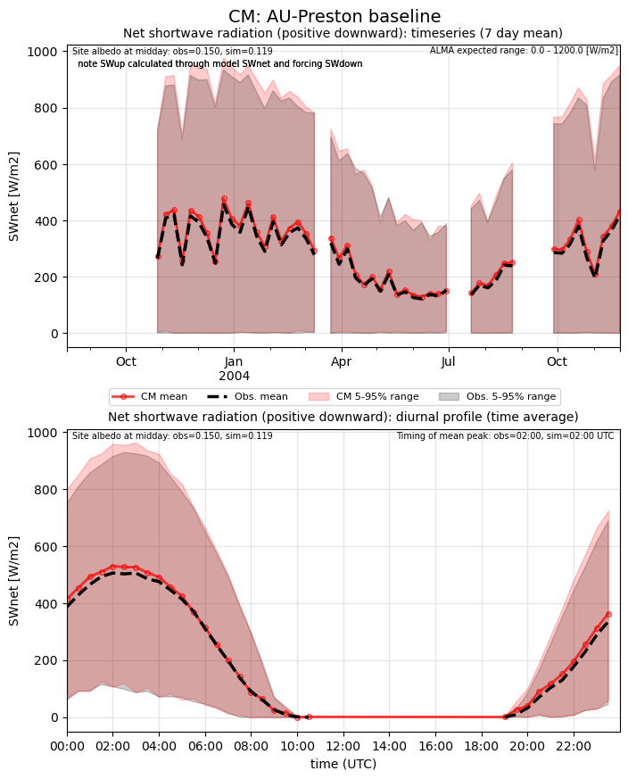](CM_AU-Preston_baseline_SWnet.png)

### baseline_SWnet_ts
[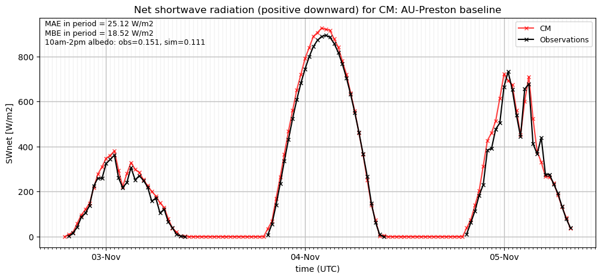](CM_AU-Preston_baseline_SWnet_ts.png)

### baseline_SWup
[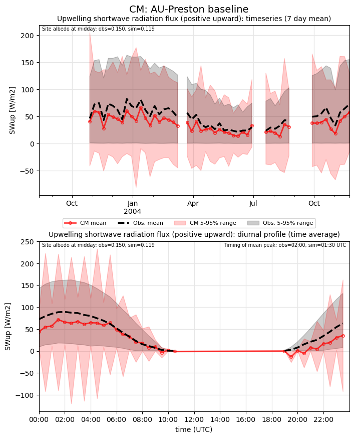](CM_AU-Preston_baseline_SWup.png)

### baseline_SWup_ts
[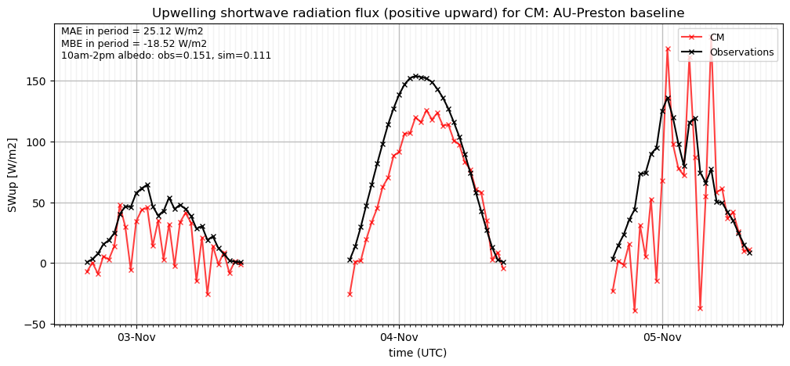](CM_AU-Preston_baseline_SWup_ts.png)

### baseline_closure
[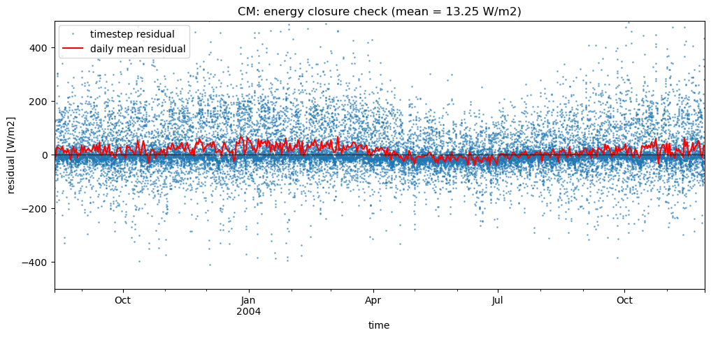](CM_AU-Preston_baseline_closure.png)

### detailed_LWnet

### detailed_LWup
[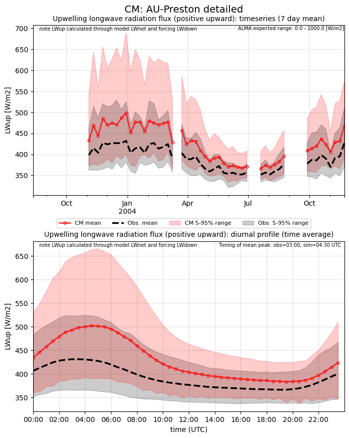](CM_AU-Preston_detailed_LWup.png)

### detailed_Qh
[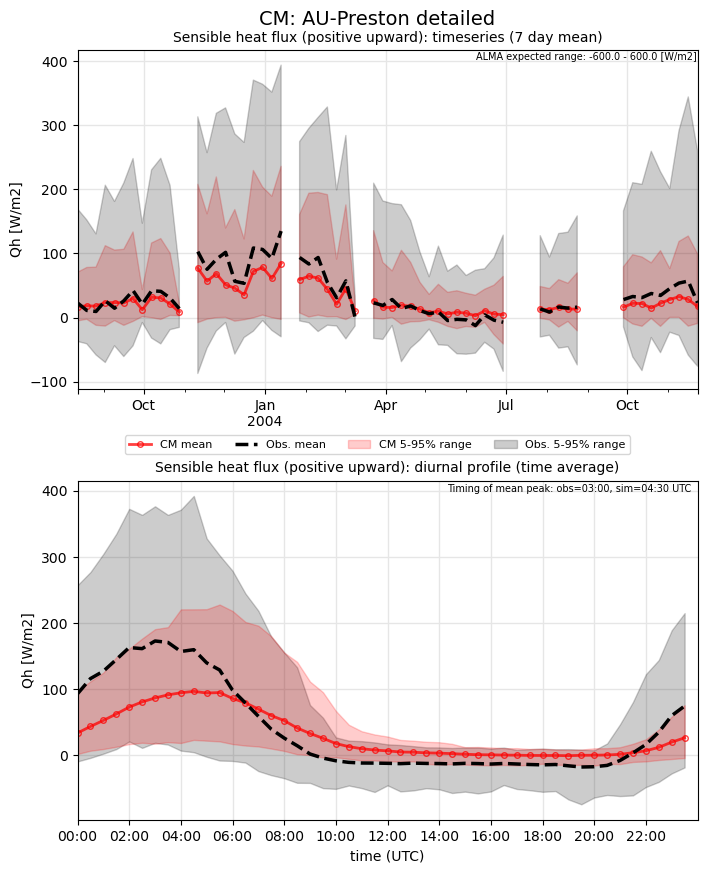](CM_AU-Preston_detailed_Qh.png)

### detailed_Qle
[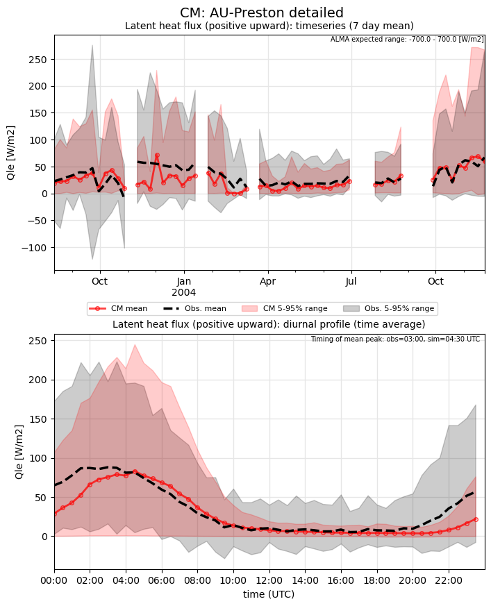](CM_AU-Preston_detailed_Qle.png)

### detailed_SWnet
[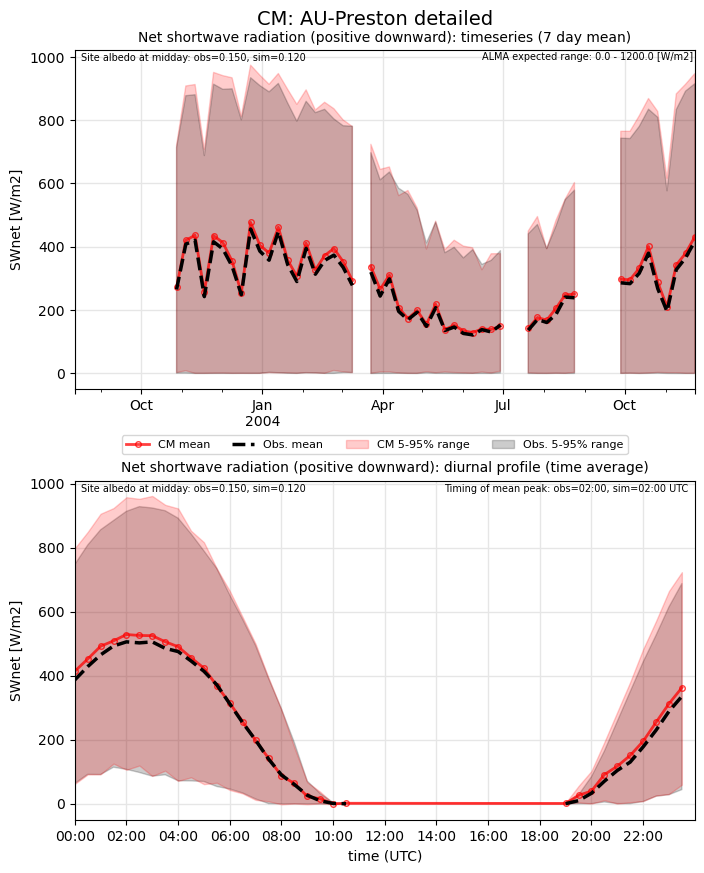](CM_AU-Preston_detailed_SWnet.png)

### detailed_SWnet_ts
[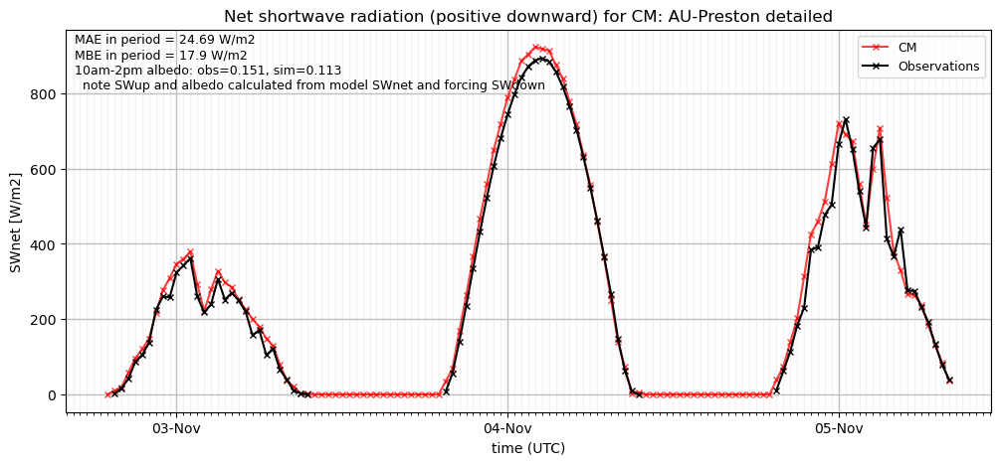](CM_AU-Preston_detailed_SWnet_ts.png)

### detailed_SWup

### detailed_SWup_ts
[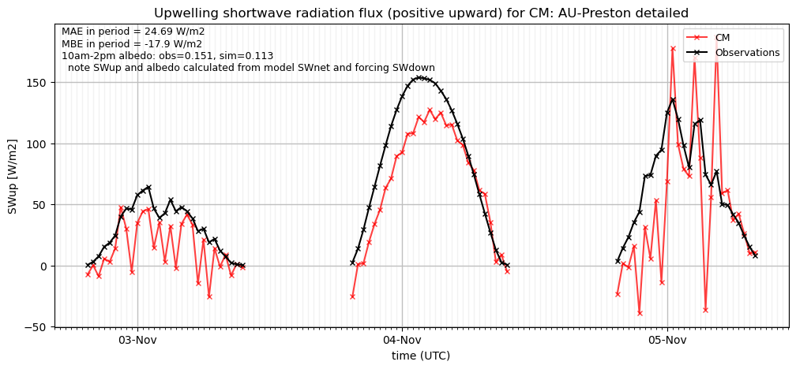](CM_AU-Preston_detailed_SWup_ts.png)

### detailed_closure
[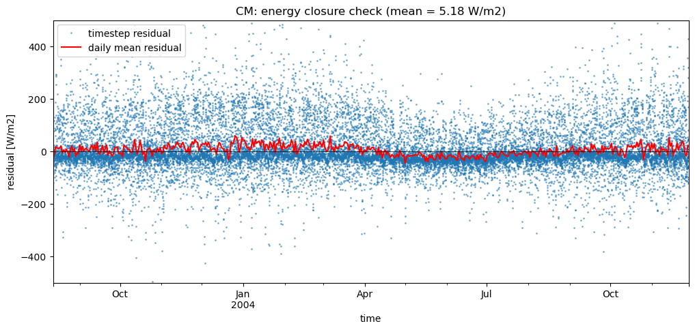](CM_AU-Preston_detailed_closure.png)

### out of range: baseline

 - CM SWnet value of -7.7000 is less than expected 0.0 [W/m2]
 - CM SWup value of -437.2001 is less than expected 0.0 [W/m2]
 - CM alb value of -0.9987 is less than expected 0.0 [1]

### out of range: detailed

 - CM SWnet value of -7.7000 is less than expected 0.0 [W/m2]
 - CM SWup value of -437.2001 is less than expected 0.0 [W/m2]
 - CM alb value of -0.9987 is less than expected 0.0 [1]

