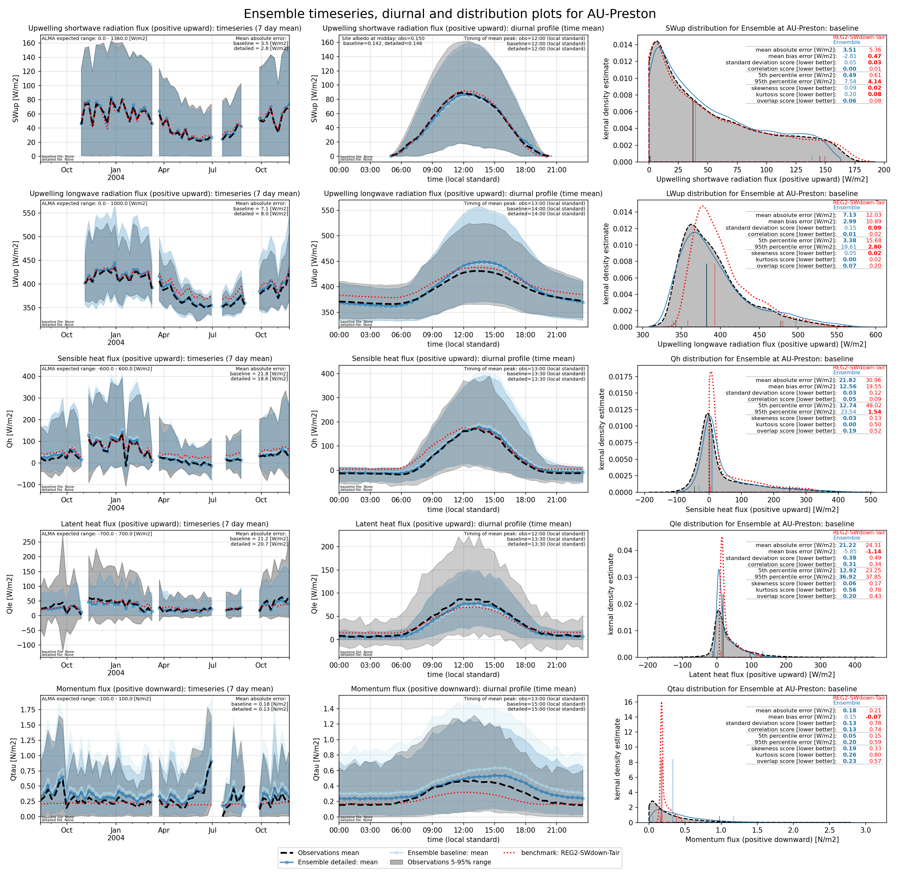
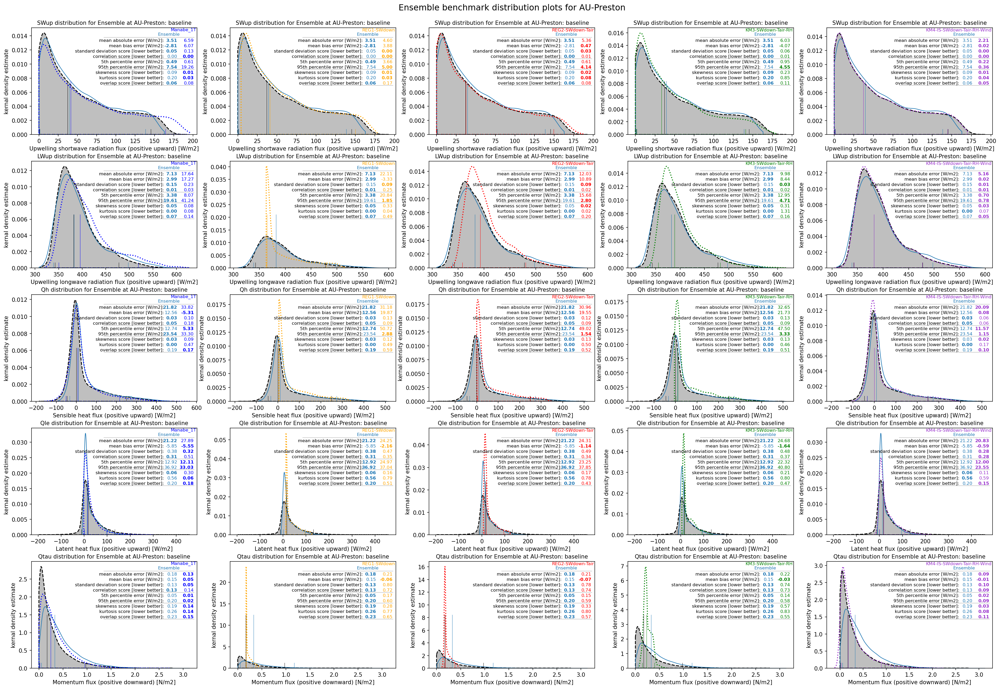
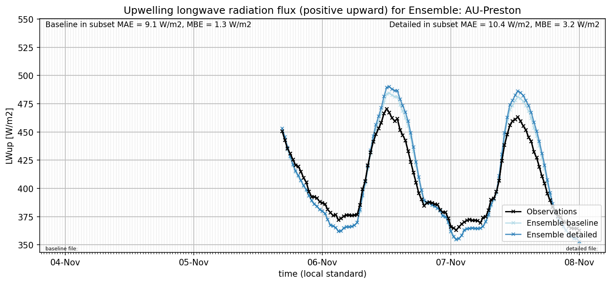
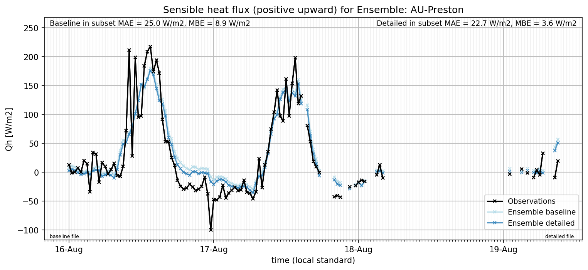
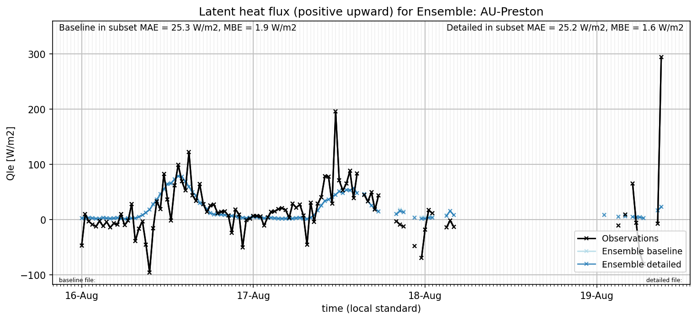
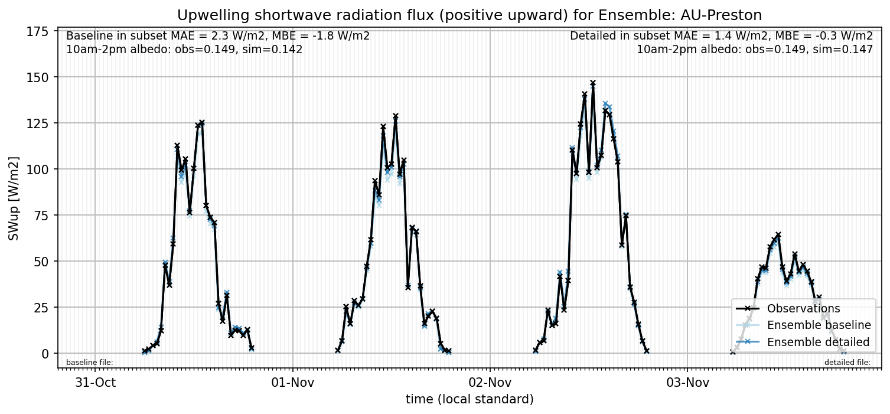

# AU-Preston: Ensemble

**NOTE:** *Results presented here are highly dependent on how models are configured in this experiment and may be subject to variable output formatting errors. Results are not intended to indicate the quality of any individual model, but to help participants better understand and improve modelling approaches in different urban environments.*

### Error metrics

| flux   | experiment   |       MAE |        MBE |      nSD |        R |        5th |        95th |      RMSE |     cRMSE |       AMBE |      1-nSD |        1-R |   nSkewness |   nKurtosis |   Overlap |
|:-------|:-------------|----------:|-----------:|---------:|---------:|-----------:|------------:|----------:|----------:|-----------:|-----------:|-----------:|------------:|------------:|----------:|
| SWup   | baseline     |  3.51665  | -2.8094    | 0.949652 | 0.996597 |  0.494108  |  7.53635    |  5.23645  | 0.0948554 |  2.8094    | 0.0503484  | 0.00340261 |   0.0215012 | 0.0483083   | 0.0643595 |
| SWup   | detailed     |  2.81137  | -1.44694   | 0.981507 | 0.996704 |  0.485916  |  2.21737    |  4.10849  | 0.0825396 |  1.44694   | 0.0184932  | 0.00329635 |   0.017247  | 0.0396156   | 0.064682  |
| LWup   | baseline     |  7.12654  |  2.99456   | 1.15089  | 0.987034 |  3.37522   | 19.6124     | 10.0907   | 0.229373  |  2.99456   | 0.150888   | 0.0129659  |   0.051545  | 0.00330926  | 0.0653977 |
| LWup   | detailed     |  8.03967  |  4.33255   | 1.17737  | 0.985166 |  2.58387   | 23.7866     | 11.6594   | 0.257661  |  4.33255   | 0.17737    | 0.0148335  |   0.0701023 | 0.0282309   | 0.0648015 |
| Qle    | baseline     | 21.2159   | -5.8455    | 0.624342 | 0.68847  | 12.9245    | 36.9156     | 38.3639   | 0.728095  |  5.8455    | 0.375658   | 0.31153    |   0.0618635 | 0.560171    | 0.201102  |
| Qle    | detailed     | 20.6888   | -4.42      | 0.655844 | 0.697184 | 12.783     | 32.5735     | 37.6549   | 0.718083  |  4.42      | 0.344156   | 0.302816   |   0.126875  | 0.65948     | 0.20931   |
| Qh     | baseline     | 21.8219   | 12.5628    | 1.03077  | 0.945867 | 12.7444    | 23.5409     | 33.3204   | 0.335476  | 12.5628    | 0.0307706  | 0.0541329  |   0.0267151 | 3.28067e-05 | 0.190628  |
| Qh     | detailed     | 18.5821   |  5.78176   | 0.998597 | 0.947988 |  8.74404   |  9.45593    | 30.208    | 0.322303  |  5.78176   | 0.00140313 | 0.0520117  |   0.0301613 | 0.00480943  | 0.104595  |
| Qtau   | baseline     |  0.177665 |  0.149682  | 1.13455  | 0.872419 |  0.0450157 |  0.198957   |  0.235627 | 0.554616  |  0.149682  | 0.134551   | 0.127581   |   0.18626   | 0.257152    | 0.234899  |
| Qtau   | detailed     |  0.127638 |  0.0730247 | 0.962491 | 0.875062 |  0.0317124 |  0.00918463 |  0.177133 | 0.491843  |  0.0730247 | 0.0375085  | 0.124938   |   0.183535  | 0.26278     | 0.17152   |

 - MAE: mean absolute error (close to 0 is better)
 - MBE: mean bias error (close to 0 is better)
 - NSD: ratio of model to obs standard deviation (close to 1 is better)
 - R: Pearson's correlation (close to 1 is better)
 - all others: closer to 0 is better

[Link to variable definitions](../modelattrs/variable_definitions.md)

### Datasheet

### Distributions

### subset_LWup

### subset_Qh

### subset_Qle

### subset_SWup

### out of range: baseline

 - Ensemble SWup min value of -0.0110 is less than expected 0.0 [W/m2]
 - Ensemble Qfz min value of -0.0000 is less than expected 0.0 [kg/m2/s]
 - Ensemble Qs min value of -0.0000 is less than expected 0.0 [kg/m2/s]
 - Ensemble Qsm max value of 9.0914 is greater than expected 0.005 [kg/m2/s]
 - Ensemble Qsm min value of -0.7546 is less than expected 0.0 [kg/m2/s]
 - Ensemble EvapF max value of 8.4784 is greater than expected 1.0 [1]
 - Ensemble EvapF min value of -9.4480 is less than expected 0.0 [1]

### out of range: detailed

 - Ensemble SWup min value of -0.0112 is less than expected 0.0 [W/m2]
 - Ensemble Qfz min value of -0.0000 is less than expected 0.0 [kg/m2/s]
 - Ensemble EvapF max value of 18.8409 is greater than expected 1.0 [1]
 - Ensemble EvapF min value of -11.3198 is less than expected 0.0 [1]

[Link to variable definitions](../modelattrs/variable_definitions.md)

