# AU-Preston: JULES_MOR

**NOTE:** *Results presented here are highly dependent on how models are configured in this experiment and may be subject to variable output formatting errors. Results are not intended to indicate the quality of any individual model, but to help participants better understand and improve modelling approaches in different urban environments.*

### Error metrics

| flux   | experiment   |      MAE |        MBE |      NSD |        R |
|:-------|:-------------|---------:|-----------:|---------:|---------:|
| SWnet  | baseline     |  3.19246 |   1.92096  | 0.881307 | 0.999913 |
| SWnet  | detailed     |  2.88978 |  -1.84089  | 0.867821 | 0.999922 |
| SWup   | baseline     |  3.18899 |  -1.91804  | 0.835872 | 0.99705  |
| SWup   | detailed     |  2.88631 |   1.82618  | 0.912365 | 0.99739  |
| LWnet  | baseline     |  6.92147 |  -4.58678  | 0.888505 | 0.990092 |
| LWnet  | detailed     |  7.02907 |   0.721139 | 0.883577 | 0.981994 |
| LWup   | baseline     |  6.92147 |   4.58678  | 0.890208 | 0.989297 |
| LWup   | detailed     |  7.02907 |  -0.721139 | 0.921423 | 0.978889 |
| Qle    | baseline     | 24.4955  | -12.1955   | 0.539447 | 0.626433 |
| Qle    | detailed     | 22.4388  |   1.7105   | 0.830036 | 0.67208  |
| Qh     | baseline     | 28.5936  |  13.2371   | 1.21687  | 0.916668 |
| Qh     | detailed     | 24.0587  |   3.86374  | 1.20473  | 0.935137 |

 - MAE: mean absolute error (close to 0 is better)
 - MBE: mean bias error (close to 0 is better)
 - NSD: ratio of model to obs standard deviation (close to 1 is better)
 - R: Pearson's correlation (close to 1 is better)

### jump to figure:
 - [Albedo](#albedo)
 - [LWnet](#lwnet)
 - [LWup](#lwup)
 - [Qanth](#qanth)
 - [Qh](#qh)
 - [Qle](#qle)
 - [Qtau](#qtau)
 - [SWnet](#swnet)
 - [SWup](#swup)
 - [closure_baseline](#closure_baseline)
 - [closure_detailed](#closure_detailed)
 - [subset_LWnet](#subset_lwnet)
 - [subset_LWup](#subset_lwup)
 - [subset_Qanth](#subset_qanth)
 - [subset_Qh](#subset_qh)
 - [subset_Qle](#subset_qle)
 - [subset_SWnet](#subset_swnet)
 - [subset_SWup](#subset_swup)

[Link to variable definitions](../modelattrs/variable_definitions.md)

### Albedo
[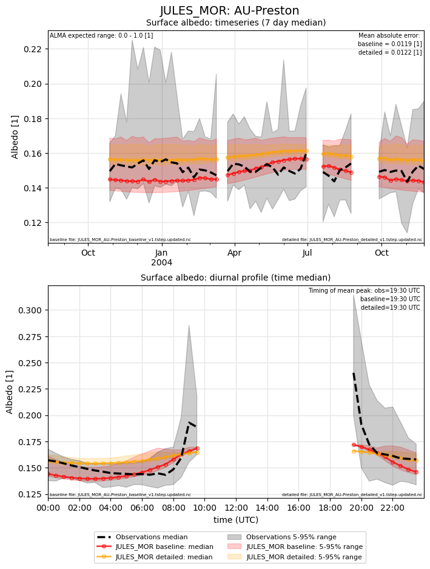](JULES_MOR_AU-Preston_Albedo.png)

### LWnet
[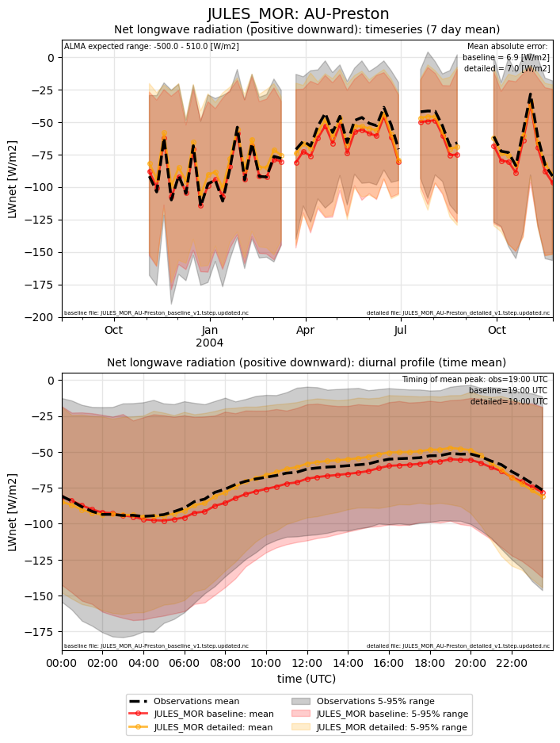](JULES_MOR_AU-Preston_LWnet.png)

### LWup
[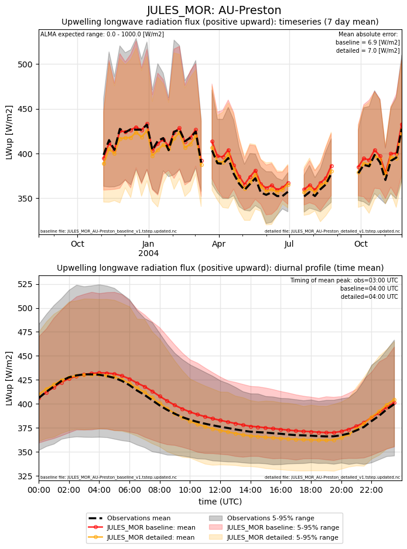](JULES_MOR_AU-Preston_LWup.png)

### Qanth
[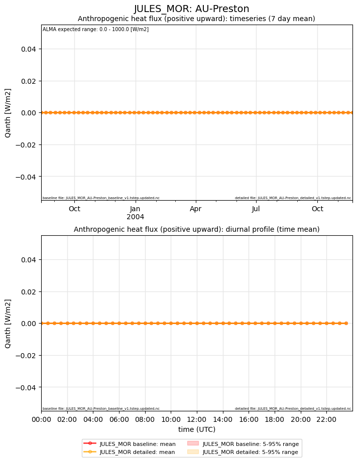](JULES_MOR_AU-Preston_Qanth.png)

### Qh
[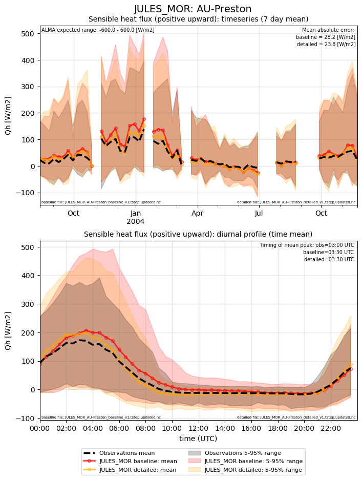](JULES_MOR_AU-Preston_Qh.png)

### Qle

### Qtau
[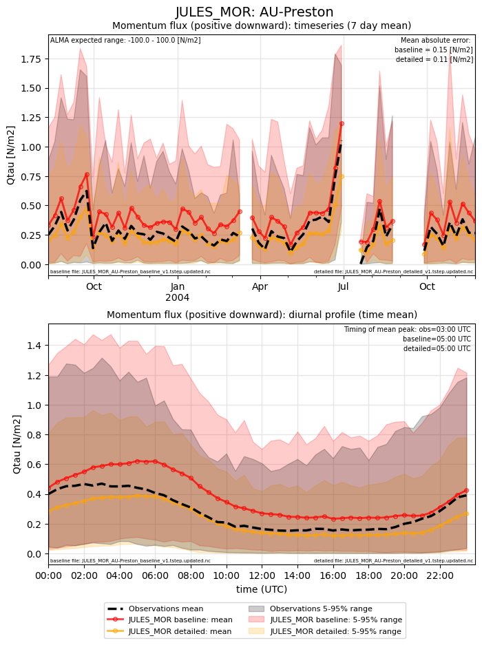](JULES_MOR_AU-Preston_Qtau.png)

### SWnet
[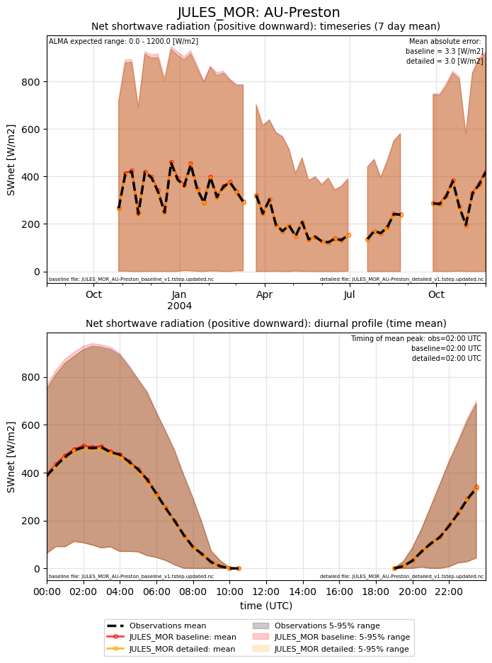](JULES_MOR_AU-Preston_SWnet.png)

### SWup

### closure_baseline
[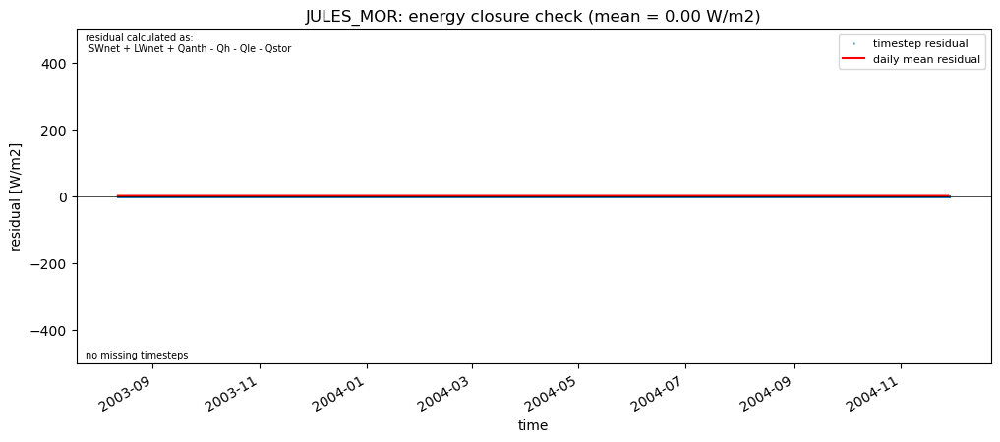](JULES_MOR_AU-Preston_closure_baseline.png)

### closure_detailed

### subset_LWnet
[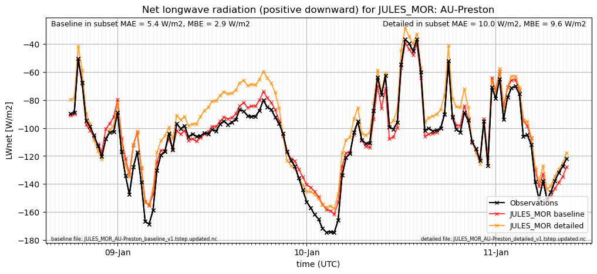](JULES_MOR_AU-Preston_subset_LWnet.png)

### subset_LWup
[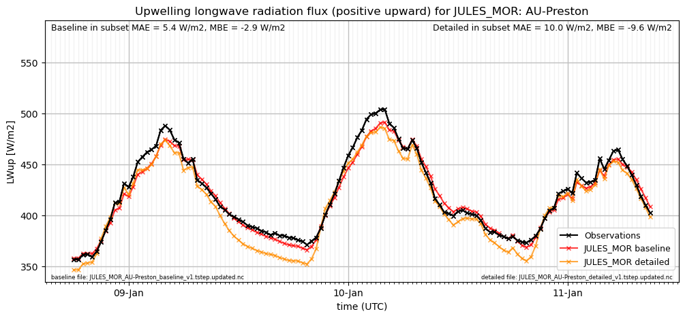](JULES_MOR_AU-Preston_subset_LWup.png)

### subset_Qanth
[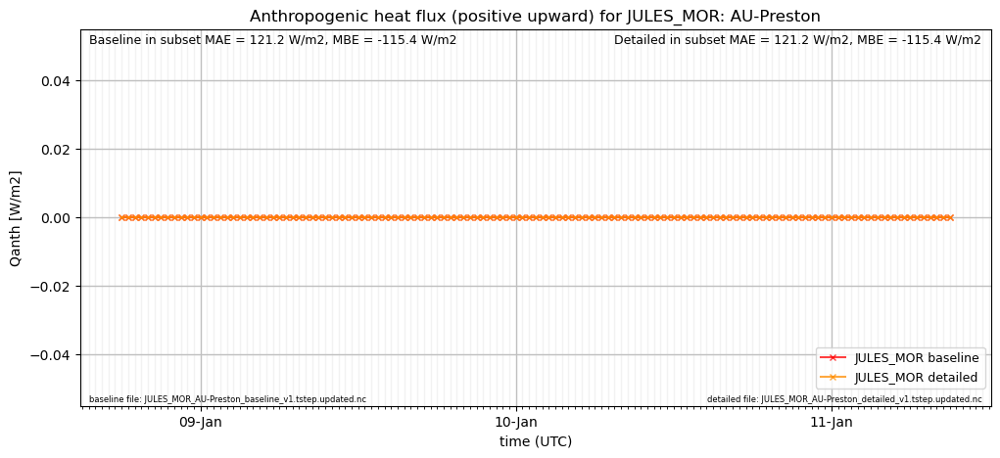](JULES_MOR_AU-Preston_subset_Qanth.png)

### subset_Qh
[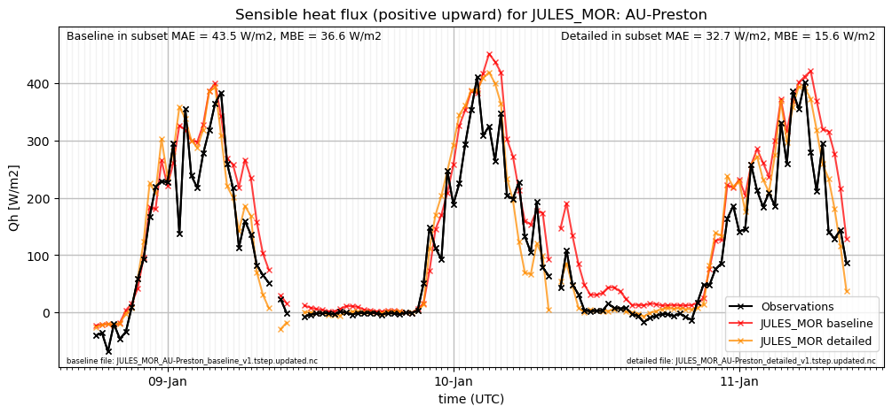](JULES_MOR_AU-Preston_subset_Qh.png)

### subset_Qle
[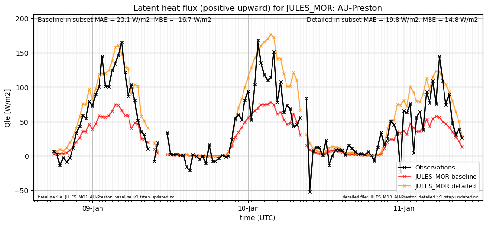](JULES_MOR_AU-Preston_subset_Qle.png)

### subset_SWnet
[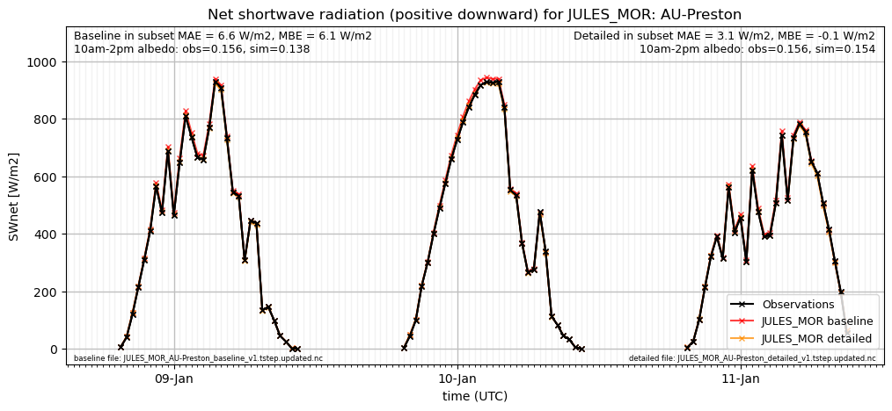](JULES_MOR_AU-Preston_subset_SWnet.png)

### subset_SWup
[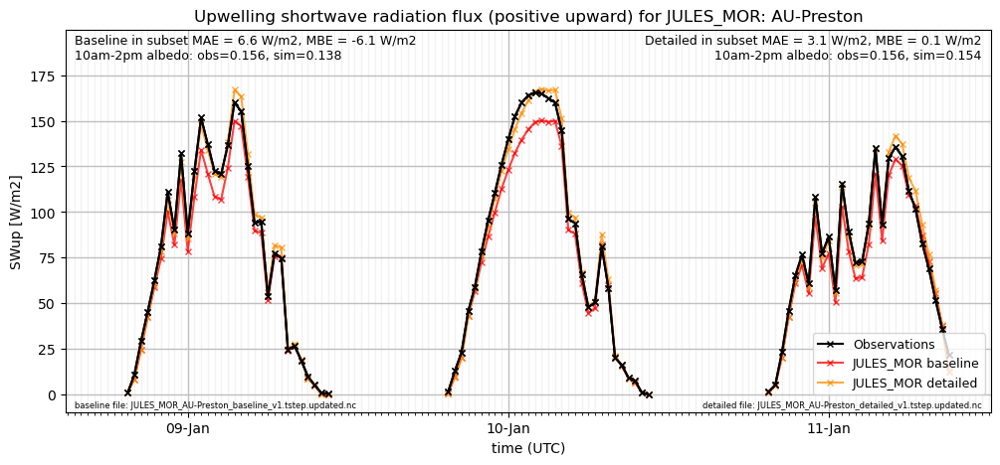](JULES_MOR_AU-Preston_subset_SWup.png)

### out of range: baseline

 - JULES_MOR Qh max value of 699.7561 is greater than expected 600.0 [W/m2]
 - JULES_MOR SWE min value of -0.0000 is less than expected 0.0 [kg/m2]
 - JULES_MOR Qsm min value of -0.0000 is less than expected 0.0 [kg/m2/s]

### out of range: detailed

 - JULES_MOR SWE min value of -0.0000 is less than expected 0.0 [kg/m2]

[Link to variable definitions](../modelattrs/variable_definitions.md)

