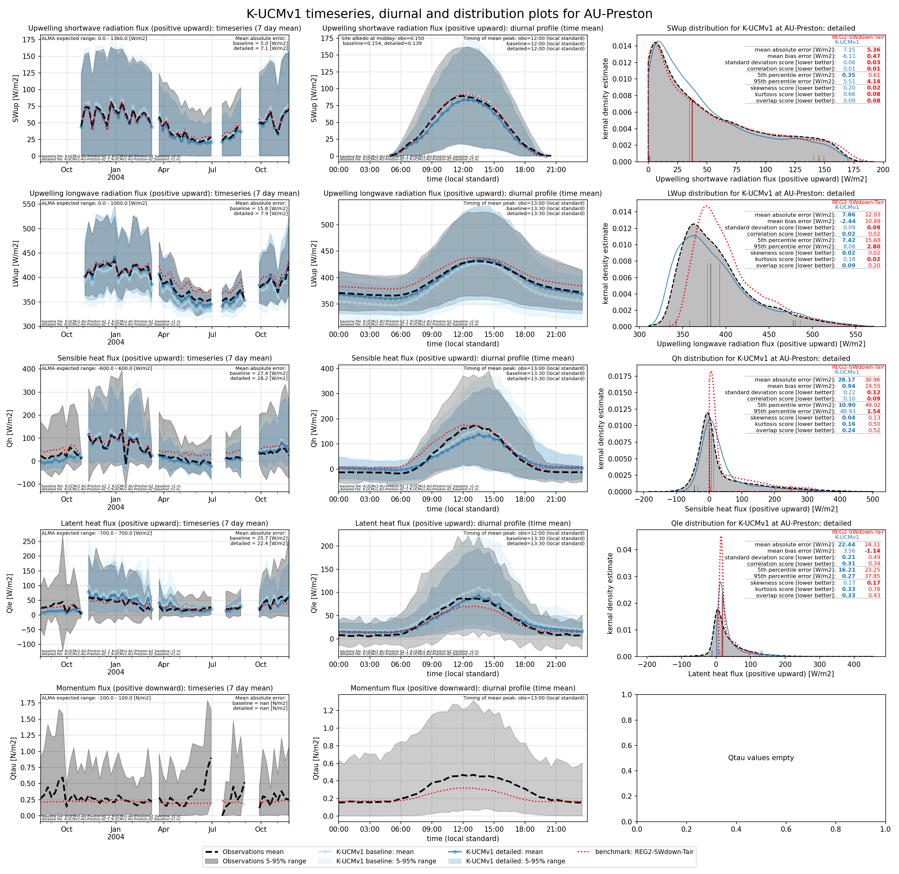
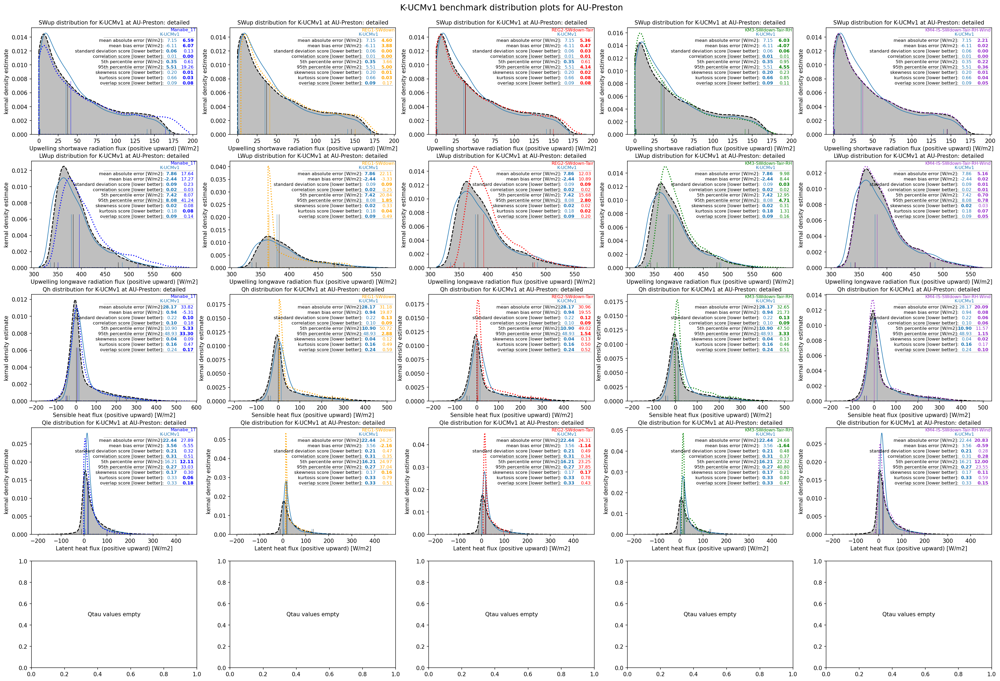
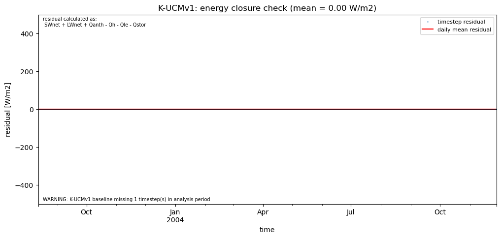
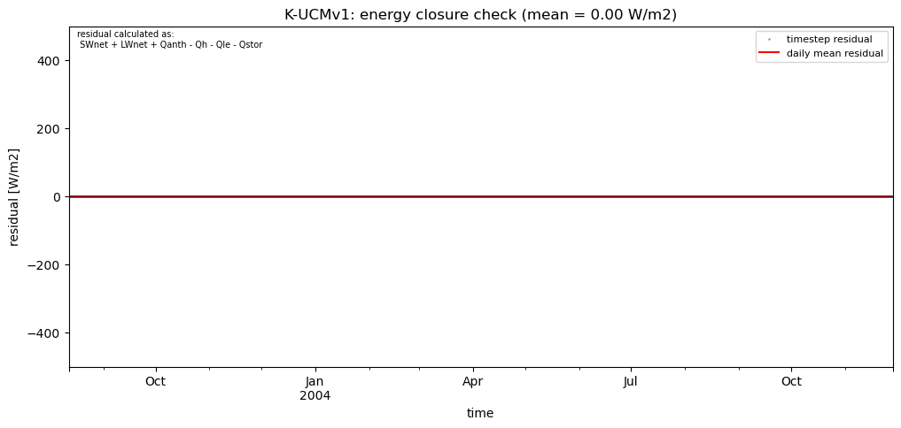
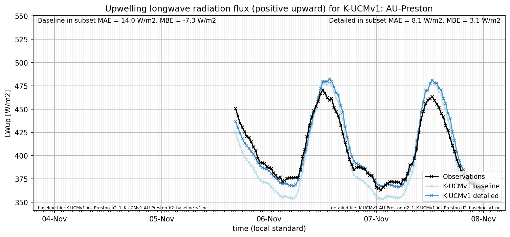
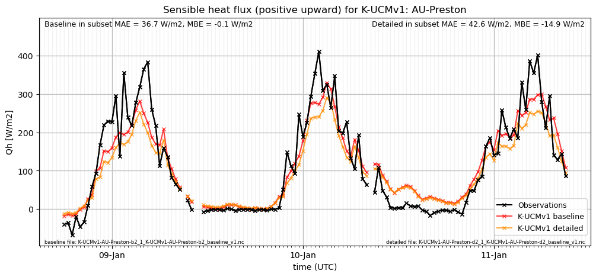
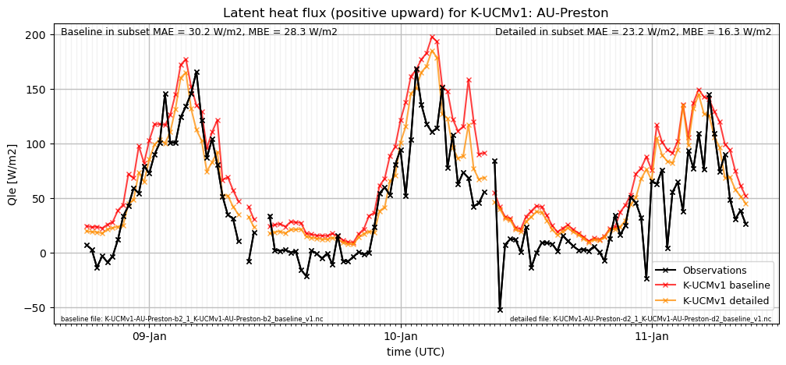

# AU-Preston: K-UCMv1

**NOTE:** *Results presented here are highly dependent on how models are configured in this experiment and may be subject to variable output formatting errors. Results are not intended to indicate the quality of any individual model, but to help participants better understand and improve modelling approaches in different urban environments.*

### Submitted metadata

- [Baseline](K-UCMv1_AU-Preston_baseline_attrs.md)
- [Detailed](K-UCMv1_AU-Preston_detailed_attrs.md)

### Error metrics

| flux   | experiment   |       MAE |        MBE |        nSD |          R |      5th |     95th |      RMSE |      cRMSE |       AMBE |       1-nSD |         1-R |   nSkewness |    nKurtosis |     Overlap |
|:-------|:-------------|----------:|-----------:|-----------:|-----------:|---------:|---------:|----------:|-----------:|-----------:|------------:|------------:|------------:|-------------:|------------:|
| SWup   | baseline     |   4.95314 |   0.544291 |   1.03219  |   0.98991  |   0.1781 |   5.5731 |   6.91025 |   0.147869 |   0.544291 |   0.0321854 |   0.01009   |   0.100094  |   0.235182   |   0.0653994 |
| SWup   | detailed     |   7.14029 |  -6.10177  |   0.942985 |   0.987396 |   0.3407 |   5.6388 |   9.79173 |   0.164383 |   6.10177  |   0.0570146 |   0.0126042 |   0.294446  |   0.716307   |   0.0861537 |
| LWup   | baseline     |  15.8296  | -13.2748   |   1.13981  |   0.977038 |  18.7849 |   3.8652 |  17.4101  |   0.268128 |  13.2748   |   0.139814  |   0.022962  |   0.0649963 |   0.00966032 |   0.214779  |
| LWup   | detailed     |   7.85811 |  -2.44106  |   1.09407  |   0.980614 |   7.3752 |   8.0823 |   9.82078 |   0.226425 |   2.44106  |   0.0940651 |   0.0193864 |   0.0159297 |   0.168476   |   0.0930956 |
| Qle    | baseline     |  27.0937  |  11.1633   |   0.872478 |   0.6528   |  18.781  |  15.5839 |  42.5641  |   0.78874  |  11.1633   |   0.127522  |   0.3472    |   0.0329497 |   0.469465   |   0.297117  |
| Qle    | detailed     |  24.2898  |   1.88988  |   0.72109  |   0.648461 |  17.9315 |   9.7649 |  39.8673  |   0.764704 |   1.88988  |   0.27891   |   0.351539  |   0.161143  |   0.327779   |   0.325245  |
| Qh     | baseline     |  28.294   |   6.57122  |   0.910055 |   0.898715 |   3.8036 |  15.5737 |  40.8869  |   0.43868  |   6.57122  |   0.0899446 |   0.101285  |   0.0428394 |   0.00835906 |   0.220768  |
| Qh     | detailed     |  28.9433  |   0.267453 |   0.775726 |   0.893409 |  11.1192 |  50.8761 |  42.7225  |   0.464403 |   0.267453 |   0.224274  |   0.106591  |   0.0168721 |   0.0560017  |   0.240335  |
| Qtau   | baseline     | nan       | nan        | nan        | nan        | nan      | nan      | nan       | nan        | nan        | nan         | nan         | nan         | nan          | nan         |
| Qtau   | detailed     | nan       | nan        | nan        | nan        | nan      | nan      | nan       | nan        | nan        | nan         | nan         | nan         | nan          | nan         |

 - MAE: mean absolute error (close to 0 is better)
 - MBE: mean bias error (close to 0 is better)
 - NSD: ratio of model to obs standard deviation (close to 1 is better)
 - R: Pearson's correlation (close to 1 is better)
 - all others: closer to 0 is better

[Link to variable definitions](../modelattrs/variable_definitions.md)

### Datasheet

### Distributions

### closure_baseline

### closure_detailed

### subset_LWup

### subset_Qh

### subset_Qle

### subset_SWup

### out of range: baseline

 - K-UCMv1 SWnet min value of -13.9929 is less than expected 0.0 [W/m2]
 - K-UCMv1 EvapF max value of 88.9040 is greater than expected 1.0 [1]
 - K-UCMv1 EvapF min value of -13.4847 is less than expected 0.0 [1]

### out of range: detailed

 - K-UCMv1 SWnet min value of -8.7294 is less than expected 0.0 [W/m2]
 - K-UCMv1 EvapF max value of 92.0813 is greater than expected 1.0 [1]
 - K-UCMv1 EvapF min value of -107.1101 is less than expected 0.0 [1]

[Link to variable definitions](../modelattrs/variable_definitions.md)

