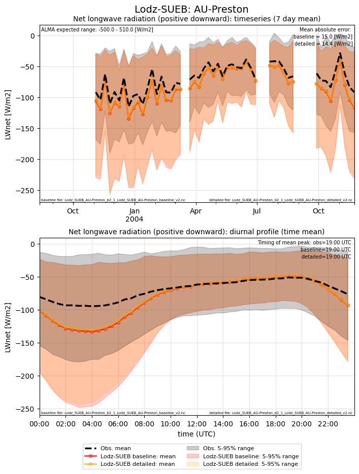
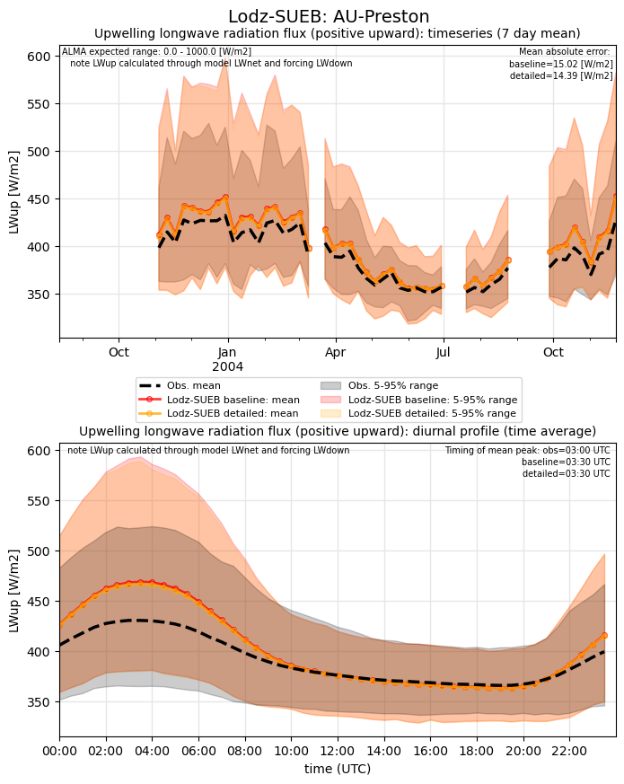
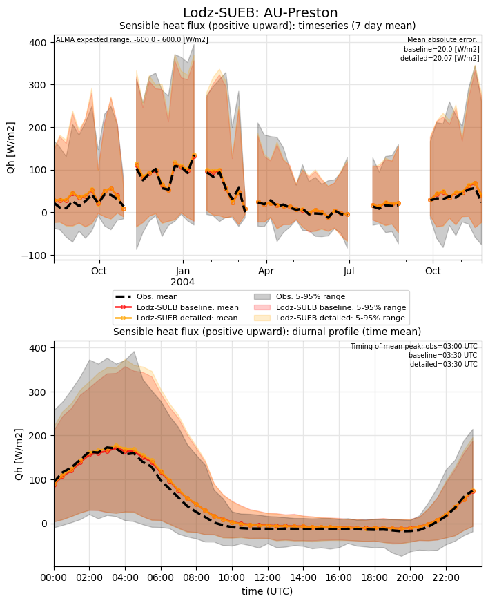
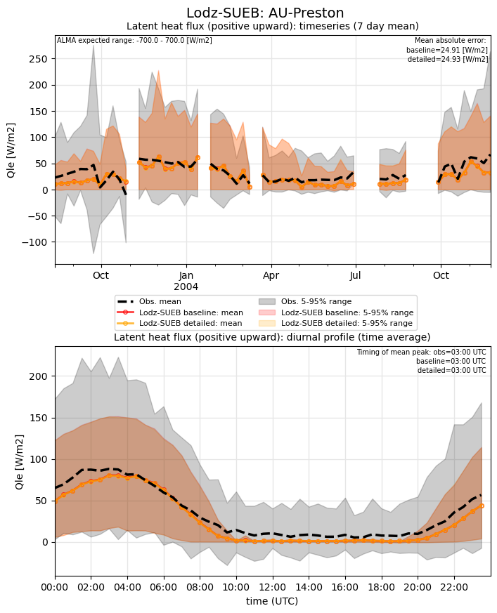
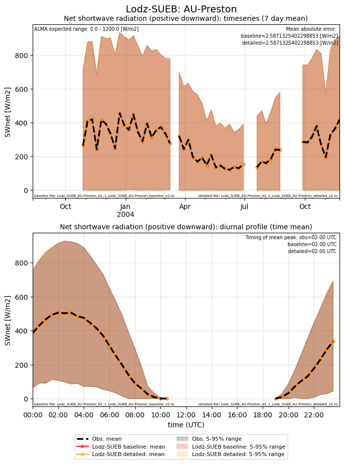
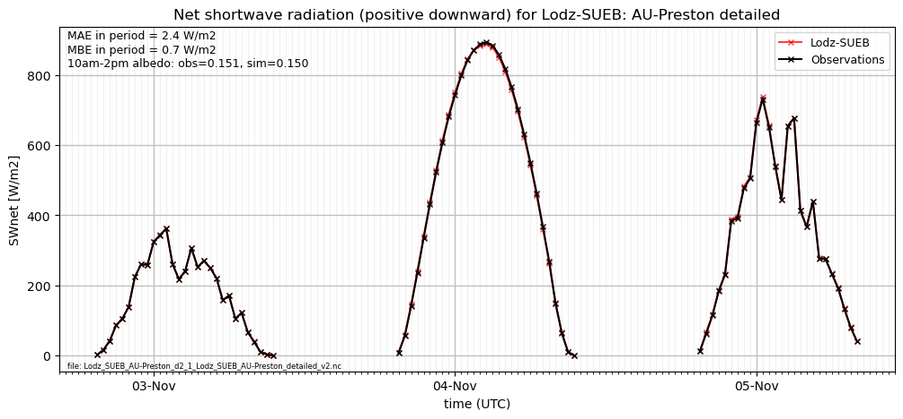
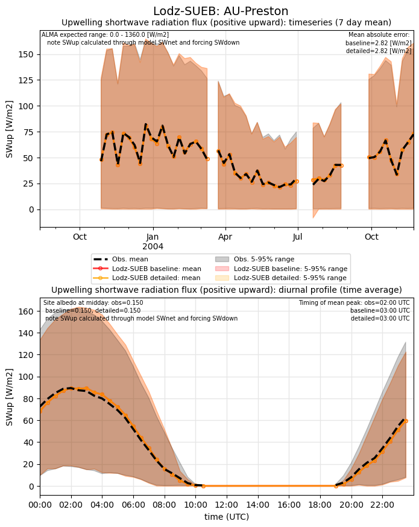
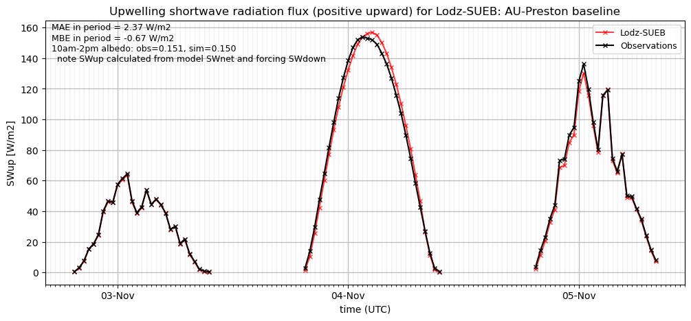
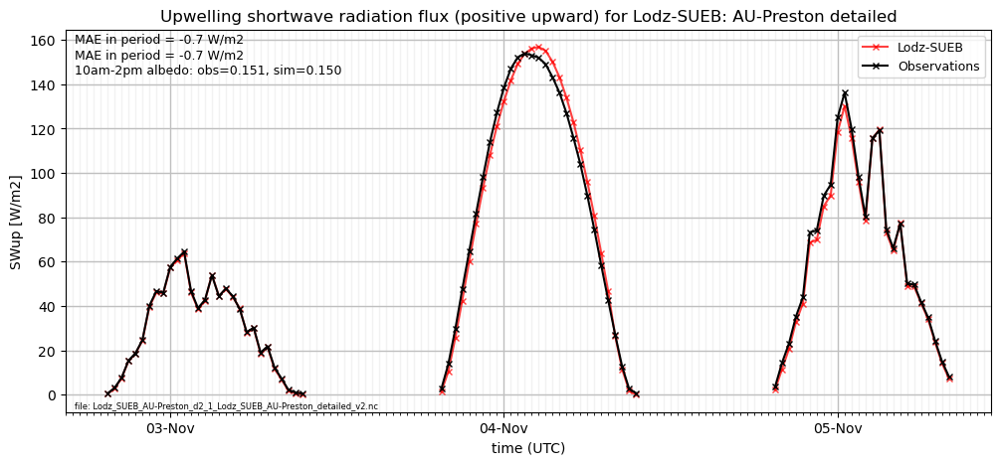
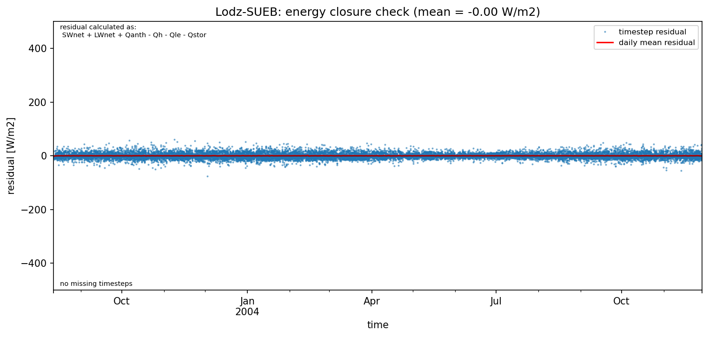

# AU-Preston: Lodz-SUEB

**NOTE:** *Results presented here are highly dependent on how models are configured in this experiment and may be subject to variable output formatting errors. Results are not intended to indicate the quality of any individual model, but to help participants better understand and improve modelling approaches in different urban environments.*

### Error metrics

| flux   | experiment   |   MAE |     MBE |    NSD |      R |
|:-------|:-------------|------:|--------:|-------:|-------:|
| SWnet  | baseline     |  2.59 |   0.265 | 0.873  | 0.9999 |
| SWnet  | detailed     |  2.59 |   0.265 | 0.873  | 0.9999 |
| LWnet  | baseline     | 15.02 | -11.635 | 1.2011 | 0.9522 |
| LWnet  | detailed     | 14.39 | -10.756 | 1.1841 | 0.9538 |
| Qle    | baseline     | 24.91 |  -7.963 | 0.7637 | 0.6343 |
| Qle    | detailed     | 24.93 |  -8.102 | 0.7615 | 0.6332 |
| Qh     | baseline     | 20    |   5.19  | 0.9192 | 0.9408 |
| Qh     | detailed     | 20.07 |   6.184 | 0.9496 | 0.9397 |

MAE = mean absolute error, MBE = mean bias error, NSD = ratio of model:obs standard deviation, R = Pearson's correlation

### jump to figure:
 - [LWnet](#lwnet)
 - [LWup](#lwup)
 - [Qh](#qh)
 - [Qle](#qle)
 - [SWnet](#swnet)
 - [SWnet_subset_baseline](#swnet_subset_baseline)
 - [SWnet_subset_detailed](#swnet_subset_detailed)
 - [SWup](#swup)
 - [SWup_subset_baseline](#swup_subset_baseline)
 - [SWup_subset_detailed](#swup_subset_detailed)
 - [closure_baseline](#closure_baseline)
 - [closure_detailed](#closure_detailed)

[Link to variable definitions](variable_definitions.md)

### LWnet

### LWup

### Qh

### Qle

### SWnet

### SWnet_subset_baseline

### SWnet_subset_detailed

### SWup

### SWup_subset_baseline

### SWup_subset_detailed

### closure_baseline

### closure_detailed

### out of range: baseline

 - Lodz-SUEB SWup min value of -400.4376 is less than expected 0.0 [W/m2]
 - Lodz-SUEB AvgSurfT max value of 1051.5700 is greater than expected 333.0 [K]
 - Lodz-SUEB AvgSurfT min value of 145.1560 is less than expected 213.0 [K]
 - Lodz-SUEB alb min value of -0.9981 is less than expected 0.0 [1]

### out of range: detailed

 - Lodz-SUEB SWup min value of -400.4376 is less than expected 0.0 [W/m2]
 - Lodz-SUEB AvgSurfT max value of 1054.3100 is greater than expected 333.0 [K]
 - Lodz-SUEB AvgSurfT min value of 145.3970 is less than expected 213.0 [K]
 - Lodz-SUEB alb min value of -0.9981 is less than expected 0.0 [1]

[Link to variable definitions](variable_definitions.md)

