# AU-Preston: MUSE

**NOTE:** *Results presented here are highly dependent on how models are configured in this experiment and may be subject to variable output formatting errors. Results are not intended to indicate the quality of any individual model, but to help participants better understand and improve modelling approaches in different urban environments.*

### Error metrics

| flux   | experiment   |   MAE |     MBE |    NSD |      R |
|:-------|:-------------|------:|--------:|-------:|-------:|
| SWnet  | baseline     | 18.9  | -17.574 | 0.8433 | 0.9964 |
| SWnet  | detailed     | 30.43 | -30.34  | 0.8034 | 0.9964 |
| LWnet  | baseline     |  9.44 |   2.658 | 0.9574 | 0.9612 |
| LWnet  | detailed     |  9.31 |   4.231 | 0.92   | 0.9665 |
| Qle    | baseline     | 34.71 | -28.116 | 0.503  | 0.5911 |
| Qle    | detailed     | 35.44 | -29.299 | 0.4671 | 0.5869 |
| Qh     | baseline     | 38.19 |  28.174 | 1.1418 | 0.8971 |
| Qh     | detailed     | 35.58 |  24.117 | 1.0866 | 0.897  |

### jump to figure:
 - [baseline_LWnet](#baseline_lwnet)
 - [baseline_LWup](#baseline_lwup)
 - [baseline_Qh](#baseline_qh)
 - [baseline_Qle](#baseline_qle)
 - [baseline_SWnet](#baseline_swnet)
 - [baseline_SWnet_ts](#baseline_swnet_ts)
 - [baseline_SWup](#baseline_swup)
 - [baseline_SWup_ts](#baseline_swup_ts)
 - [baseline_closure](#baseline_closure)
 - [detailed_LWnet](#detailed_lwnet)
 - [detailed_LWup](#detailed_lwup)
 - [detailed_Qh](#detailed_qh)
 - [detailed_Qle](#detailed_qle)
 - [detailed_SWnet](#detailed_swnet)
 - [detailed_SWnet_ts](#detailed_swnet_ts)
 - [detailed_SWup](#detailed_swup)
 - [detailed_SWup_ts](#detailed_swup_ts)
 - [detailed_closure](#detailed_closure)

### baseline_LWnet
[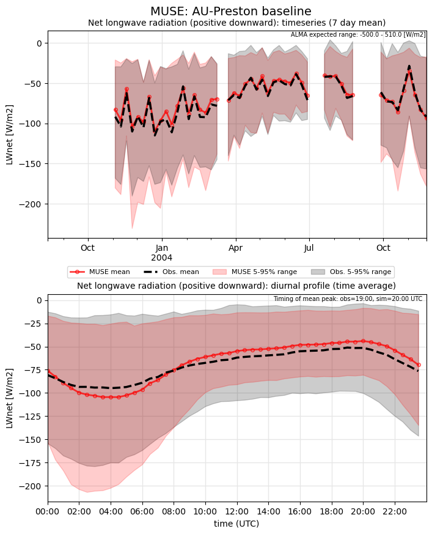](MUSE_AU-Preston_baseline_LWnet.png)

### baseline_LWup
[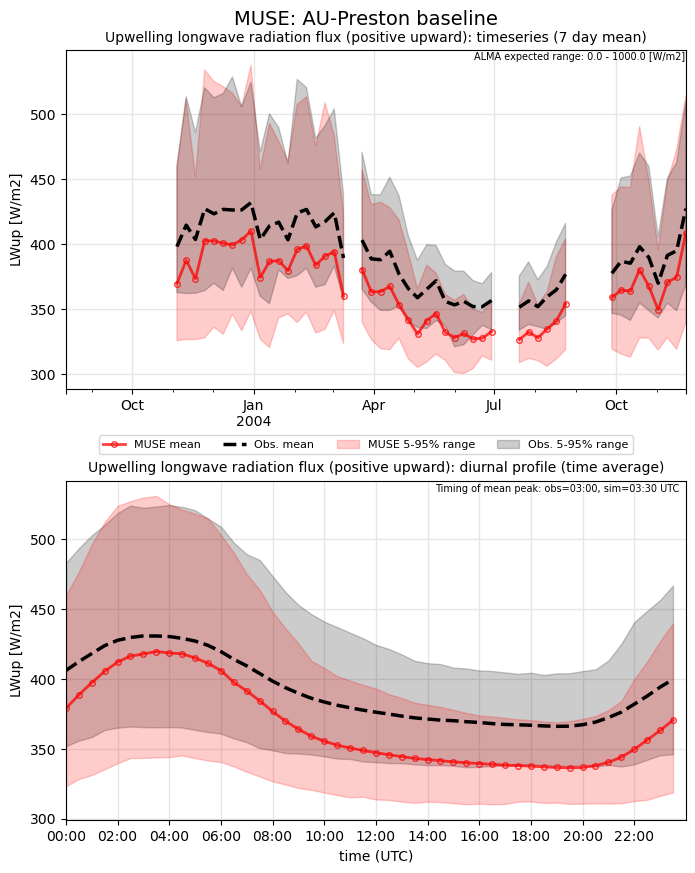](MUSE_AU-Preston_baseline_LWup.png)

### baseline_Qh
[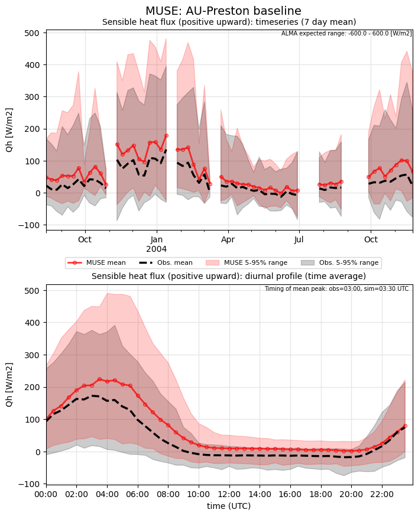](MUSE_AU-Preston_baseline_Qh.png)

### baseline_Qle
[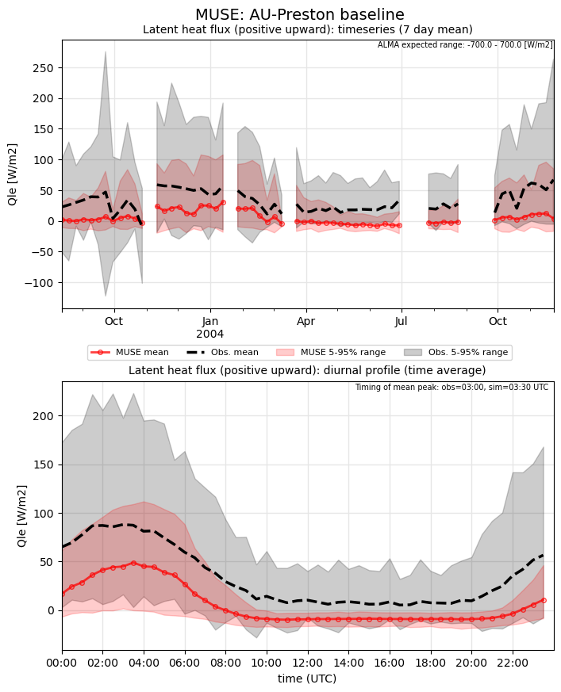](MUSE_AU-Preston_baseline_Qle.png)

### baseline_SWnet

### baseline_SWnet_ts
[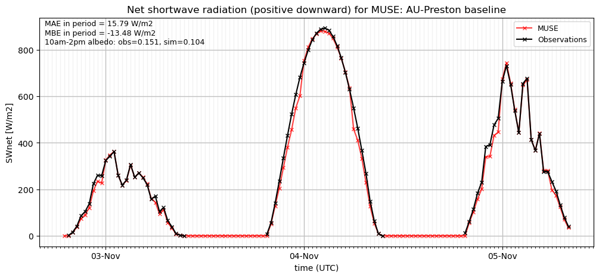](MUSE_AU-Preston_baseline_SWnet_ts.png)

### baseline_SWup
[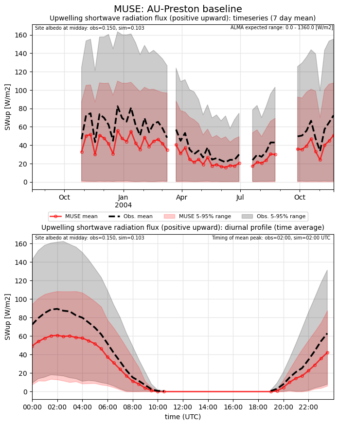](MUSE_AU-Preston_baseline_SWup.png)

### baseline_SWup_ts
[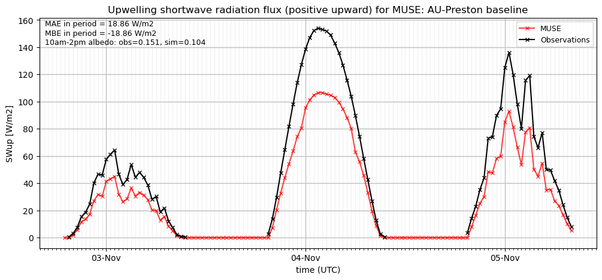](MUSE_AU-Preston_baseline_SWup_ts.png)

### baseline_closure
[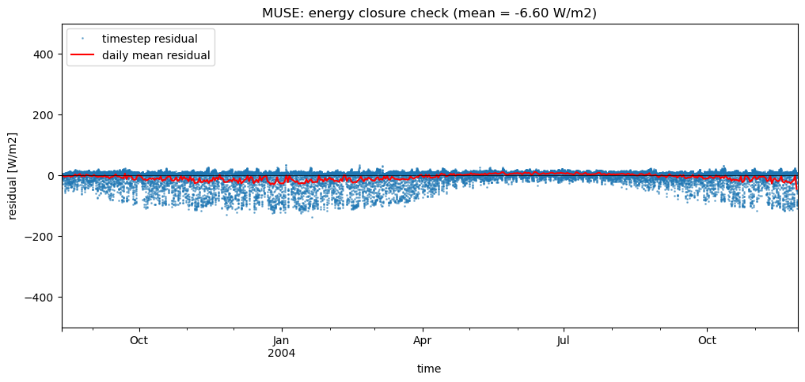](MUSE_AU-Preston_baseline_closure.png)

### detailed_LWnet
[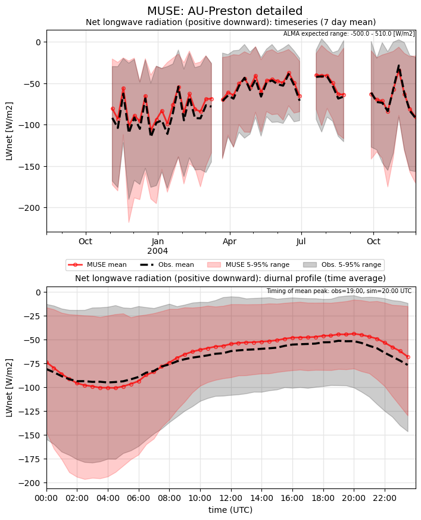](MUSE_AU-Preston_detailed_LWnet.png)

### detailed_LWup

### detailed_Qh
[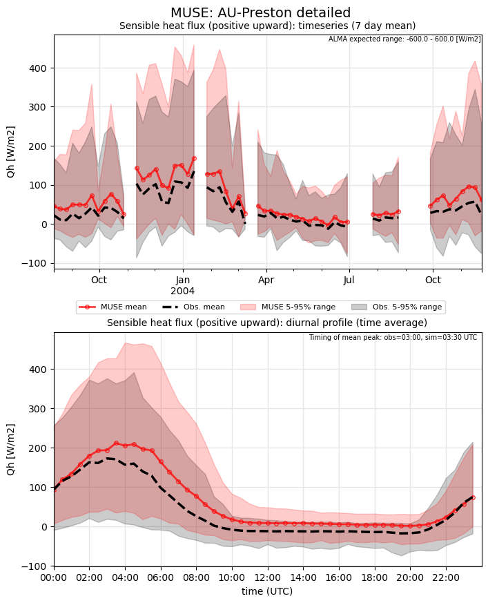](MUSE_AU-Preston_detailed_Qh.png)

### detailed_Qle
[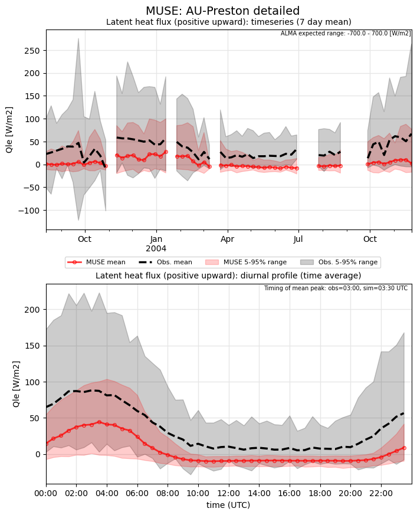](MUSE_AU-Preston_detailed_Qle.png)

### detailed_SWnet

### detailed_SWnet_ts
[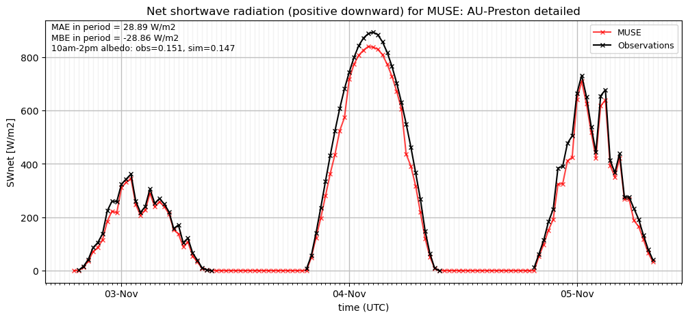](MUSE_AU-Preston_detailed_SWnet_ts.png)

### detailed_SWup
[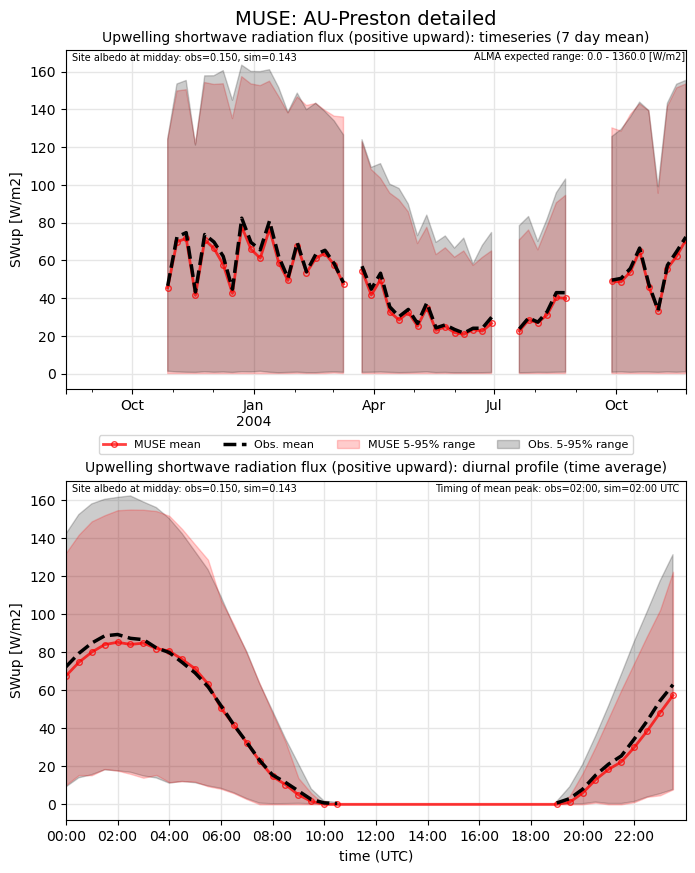](MUSE_AU-Preston_detailed_SWup.png)

### detailed_SWup_ts
[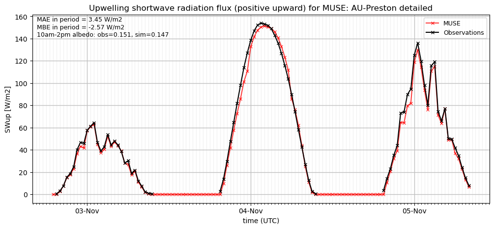](MUSE_AU-Preston_detailed_SWup_ts.png)

### detailed_closure
[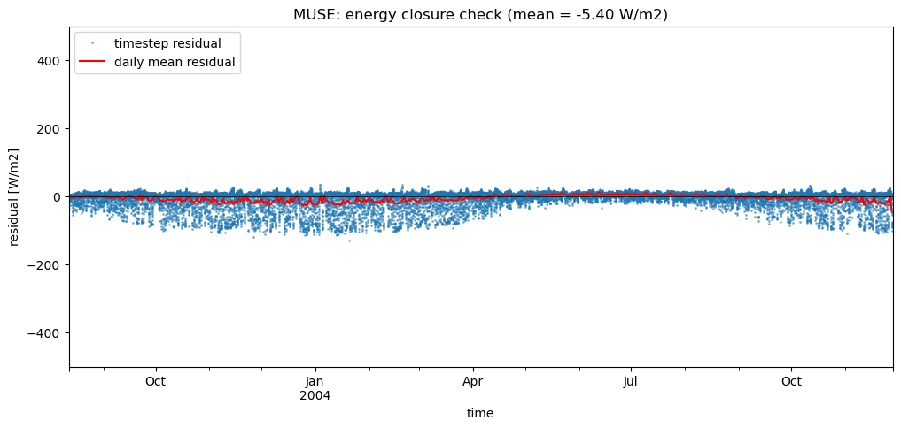](MUSE_AU-Preston_detailed_closure.png)

### out of range: baseline

 - MUSE Qh value of 655.5630 is greater than expected 600.0 [W/m2]

### out of range: detailed

 - MUSE Qh value of 655.5630 is greater than expected 600.0 [W/m2]

