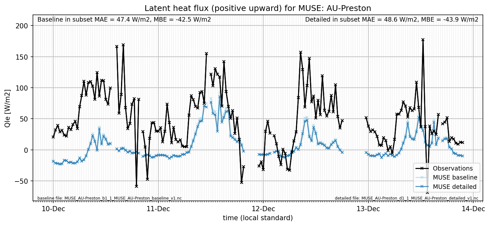

# AU-Preston: MUSE

**NOTE:** *Results presented here are highly dependent on how models are configured in this experiment and may be subject to variable output formatting errors. Results are not intended to indicate the quality of any individual model, but to help participants better understand and improve modelling approaches in different urban environments.*

### Error metrics

| flux   | experiment   |      MAE |       MBE |        nSD |          R |     5th |    95th |      RMSE |       cRMSE |      AMBE |       1-nSD |          1-R |   nSkewness |   nKurtosis |     Overlap |
|:-------|:-------------|---------:|----------:|-----------:|-----------:|--------:|--------:|----------:|------------:|----------:|------------:|-------------:|------------:|------------:|------------:|
| SWup   | baseline     |  16.5207 | -16.5205  |   0.69176  |   0.995961 |   1.043 |  44.571 |  22.1645  |   0.317175  |  16.5205  |   0.30824   |   0.00403908 |   0.0336322 |   0.0632633 |   0.106842  |
| SWup   | detailed     |   3.3933 |  -2.21892 |   0.978727 |   0.995731 |   0.818 |   2.401 |   4.90339 |   0.0938591 |   2.21892 |   0.021273  |   0.00426931 |   0.0566493 |   0.0973339 |   0.0800368 |
| LWup   | baseline     |  26.082  | -24.6419  |   1.14067  |   0.972202 |  26.553 |   6.667 |  27.4608  |   0.288455  |  24.6419  |   0.140671  |   0.0277984  |   0.281379  |   0.80882   |   0.351546  |
| LWup   | detailed     |  27.035  | -26.2672  |   1.09496  |   0.975287 |  26.85  |  13.109 |  28.3091  |   0.251269  |  26.2672  |   0.0949557 |   0.0247131  |   0.245786  |   0.696524  |   0.358598  |
| Qle    | baseline     |  34.3739 | -27.977   |   0.515677 |   0.598714 |   3.475 |  58.111 |  50.4102  |   0.805256  |  27.977   |   0.484323  |   0.401286   |   0.132003  |   0.441582  |   0.533199  |
| Qle    | detailed     |  35.0991 | -29.1622  |   0.478797 |   0.594422 |   3.595 |  64.319 |  51.3844  |   0.812423  |  29.1622  |   0.521203  |   0.405578   |   0.129263  |   0.439916  |   0.545984  |
| Qh     | baseline     |  38.1625 |  28.1462  |   1.17416  |   0.897298 |  15.733 |  73.593 |  55.5868  |   0.521064  |  28.1462  |   0.174157  |   0.102702   |   0.0739858 |   0.134302  |   0.308558  |
| Qh     | detailed     |  35.5435 |  24.0872  |   1.11683  |   0.897191 |  14.961 |  56.784 |  51.3719  |   0.493244  |  24.0872  |   0.11683   |   0.102809   |   0.069579  |   0.135171  |   0.298808  |
| Qtau   | baseline     | nan      | nan       | nan        | nan        | nan     | nan     | nan       | nan         | nan       | nan         | nan          | nan         | nan         | nan         |
| Qtau   | detailed     | nan      | nan       | nan        | nan        | nan     | nan     | nan       | nan         | nan       | nan         | nan          | nan         | nan         | nan         |

 - MAE: mean absolute error (close to 0 is better)
 - MBE: mean bias error (close to 0 is better)
 - NSD: ratio of model to obs standard deviation (close to 1 is better)
 - R: Pearson's correlation (close to 1 is better)
 - all others: closer to 0 is better

[Link to variable definitions](../modelattrs/variable_definitions.md)

### Datasheet

### Distributions

### closure_baseline

### closure_detailed

### subset_LWup

### subset_Qh

### subset_Qle

### subset_SWup

### out of range: baseline

 - MUSE Qh max value of 655.5630 is greater than expected 600.0 [W/m2]
 - MUSE EvapF max value of 191.5600 is greater than expected 1.0 [1]
 - MUSE EvapF min value of -12.0913 is less than expected 0.0 [1]

### out of range: detailed

 - MUSE Qh max value of 633.2700 is greater than expected 600.0 [W/m2]
 - MUSE EvapF max value of 25.8868 is greater than expected 1.0 [1]
 - MUSE EvapF min value of -48.1030 is less than expected 0.0 [1]

[Link to variable definitions](../modelattrs/variable_definitions.md)

