# AU-Preston: NOAH-SLUCM

**NOTE:** *Results presented here are highly dependent on how models are configured in this experiment and may be subject to variable output formatting errors. Results are not intended to indicate the quality of any individual model, but to help participants better understand and improve modelling approaches in different urban environments.*

### Error metrics

| flux   | experiment   |   MAE |     MBE |     NSD |      R |
|:-------|:-------------|------:|--------:|--------:|-------:|
| SWnet  | baseline     | 69.85 | -69.768 |  0.6594 | 0.9998 |
| SWnet  | detailed     | 55.29 | -55.201 |  0.7029 | 0.9998 |
| LWnet  | baseline     | 41.99 | -41.782 | 35.8017 | 0.0041 |
| LWnet  | detailed     | 21.46 | -21.114 |  3.572  | 0.1912 |
| Qle    | baseline     | 25.93 | -15.628 |  0.4326 | 0.5986 |
| Qle    | detailed     | 25.92 | -15.049 |  0.4571 | 0.5784 |
| Qh     | baseline     | 21.07 |   9.069 |  1.1248 | 0.9485 |
| Qh     | detailed     | 22.08 |   8.632 |  1.1714 | 0.9489 |

### jump to figure:
 - [baseline_Albedo](#baseline_albedo)
 - [baseline_LWnet](#baseline_lwnet)
 - [baseline_LWup](#baseline_lwup)
 - [baseline_Qh](#baseline_qh)
 - [baseline_Qle](#baseline_qle)
 - [baseline_SWnet](#baseline_swnet)
 - [baseline_SWnet_ts](#baseline_swnet_ts)
 - [baseline_SWup](#baseline_swup)
 - [baseline_SWup_ts](#baseline_swup_ts)
 - [baseline_closure](#baseline_closure)
 - [detailed_Albedo](#detailed_albedo)
 - [detailed_LWnet](#detailed_lwnet)
 - [detailed_LWup](#detailed_lwup)
 - [detailed_Qh](#detailed_qh)
 - [detailed_Qle](#detailed_qle)
 - [detailed_SWnet](#detailed_swnet)
 - [detailed_SWnet_ts](#detailed_swnet_ts)
 - [detailed_SWup](#detailed_swup)
 - [detailed_SWup_ts](#detailed_swup_ts)
 - [detailed_closure](#detailed_closure)

### baseline_Albedo
[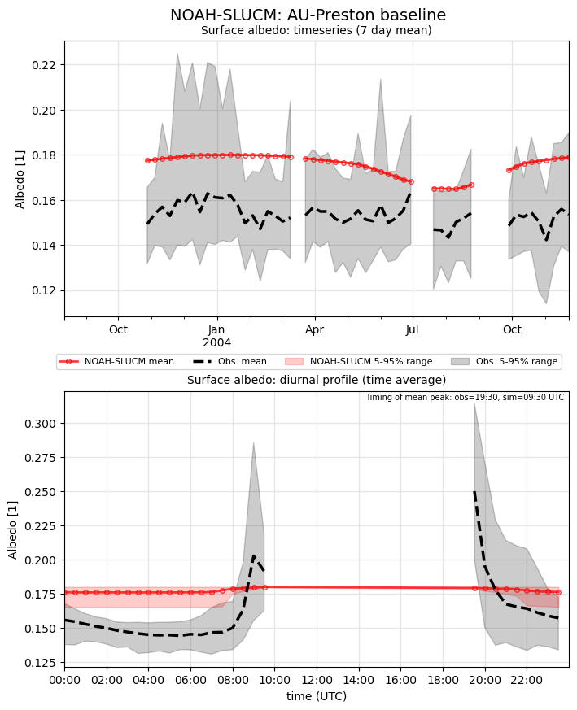](NOAH-SLUCM_AU-Preston_baseline_Albedo.png)

### baseline_LWnet
[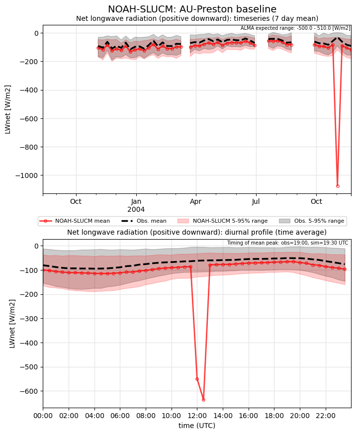](NOAH-SLUCM_AU-Preston_baseline_LWnet.png)

### baseline_LWup
[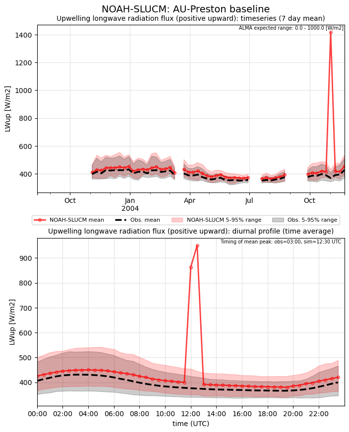](NOAH-SLUCM_AU-Preston_baseline_LWup.png)

### baseline_Qh
[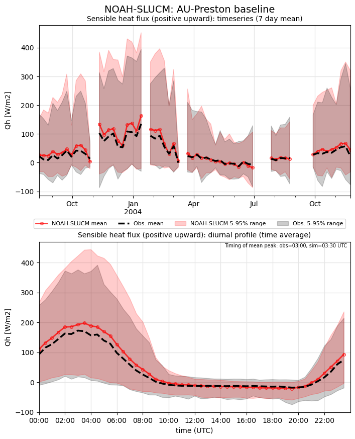](NOAH-SLUCM_AU-Preston_baseline_Qh.png)

### baseline_Qle
[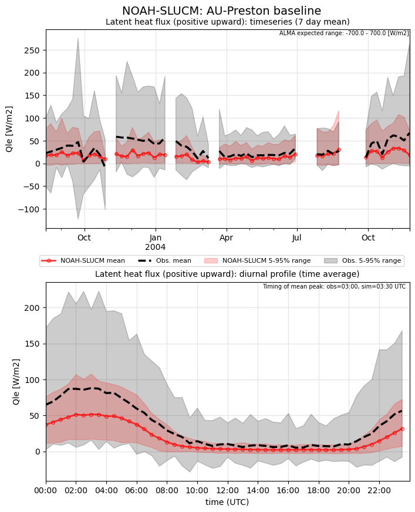](NOAH-SLUCM_AU-Preston_baseline_Qle.png)

### baseline_SWnet

### baseline_SWnet_ts
[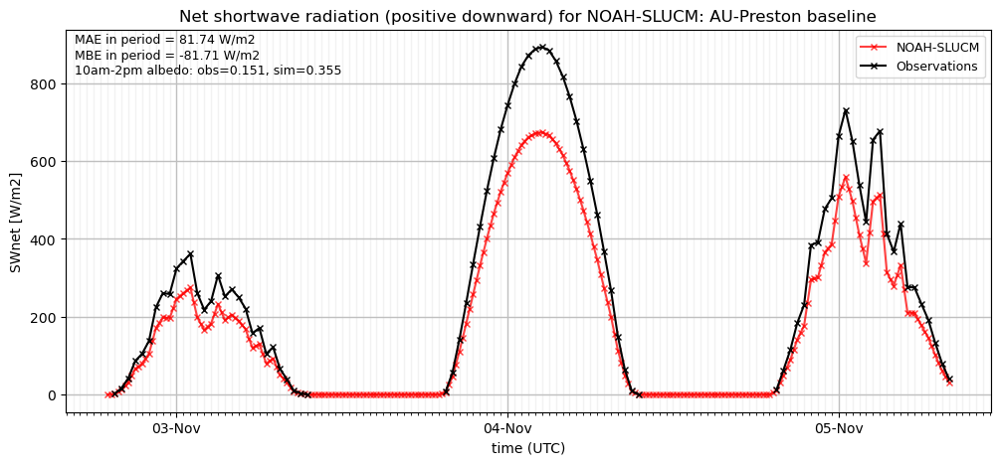](NOAH-SLUCM_AU-Preston_baseline_SWnet_ts.png)

### baseline_SWup
[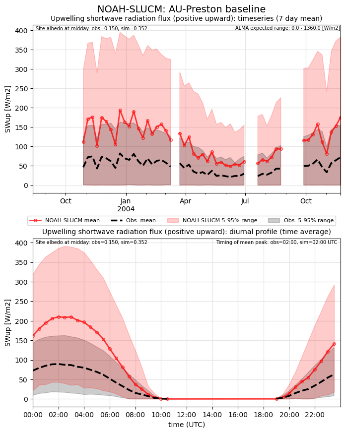](NOAH-SLUCM_AU-Preston_baseline_SWup.png)

### baseline_SWup_ts

### baseline_closure
[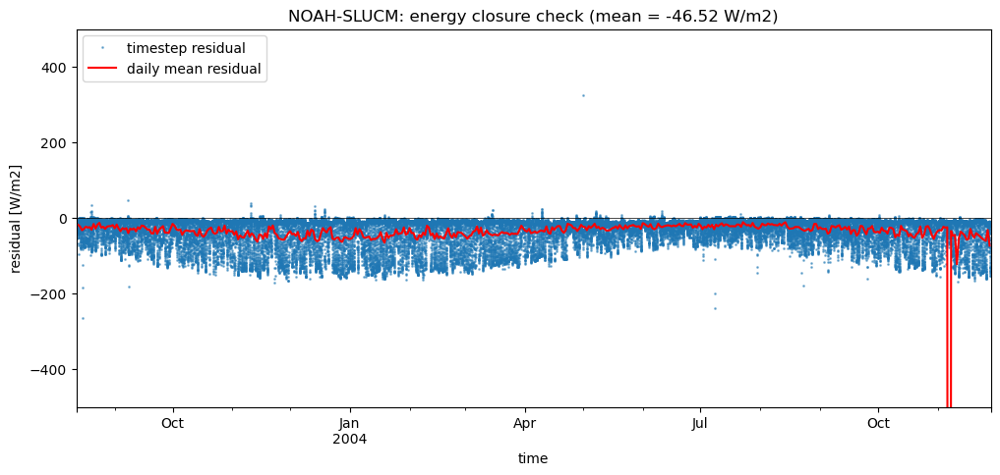](NOAH-SLUCM_AU-Preston_baseline_closure.png)

### detailed_Albedo
[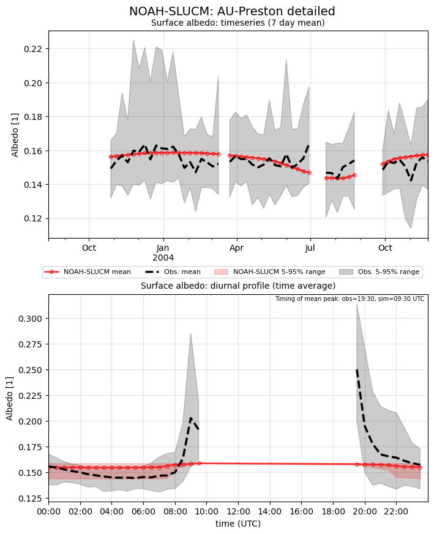](NOAH-SLUCM_AU-Preston_detailed_Albedo.png)

### detailed_LWnet
[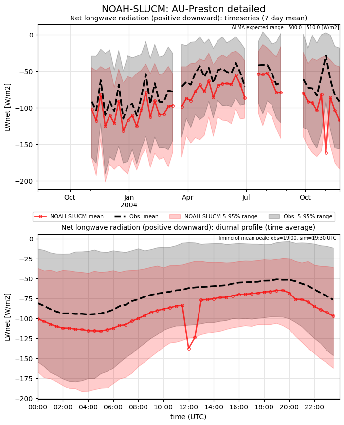](NOAH-SLUCM_AU-Preston_detailed_LWnet.png)

### detailed_LWup
[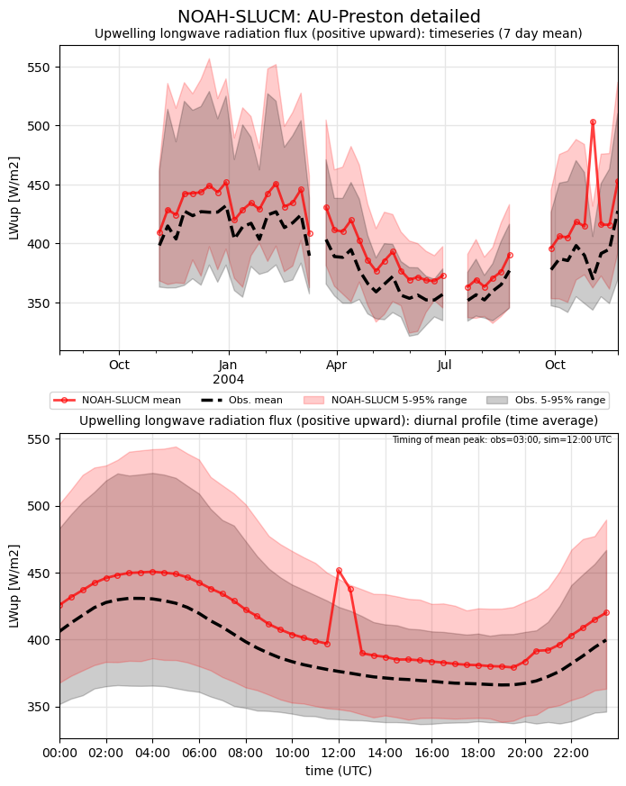](NOAH-SLUCM_AU-Preston_detailed_LWup.png)

### detailed_Qh
[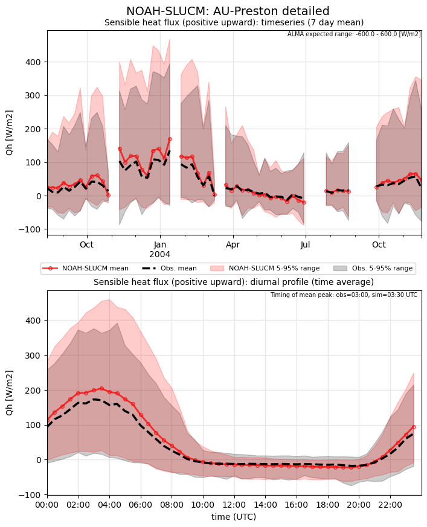](NOAH-SLUCM_AU-Preston_detailed_Qh.png)

### detailed_Qle
[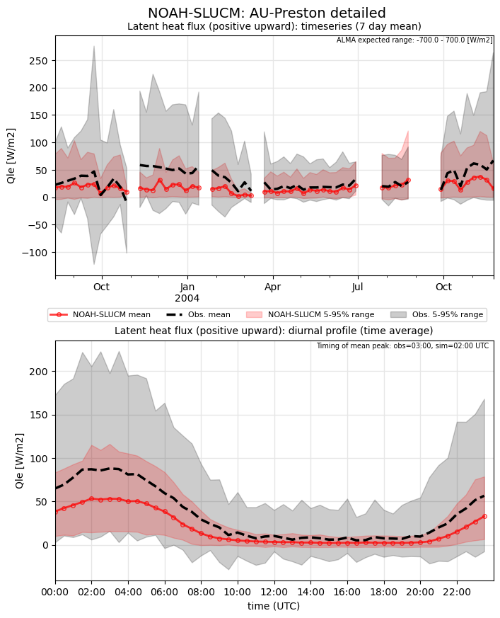](NOAH-SLUCM_AU-Preston_detailed_Qle.png)

### detailed_SWnet
[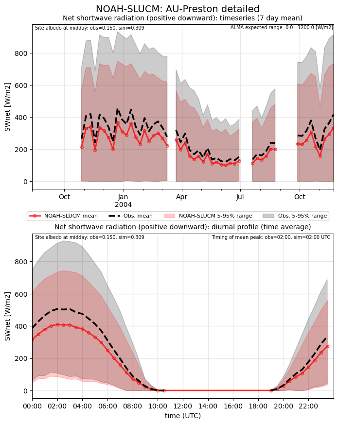](NOAH-SLUCM_AU-Preston_detailed_SWnet.png)

### detailed_SWnet_ts
[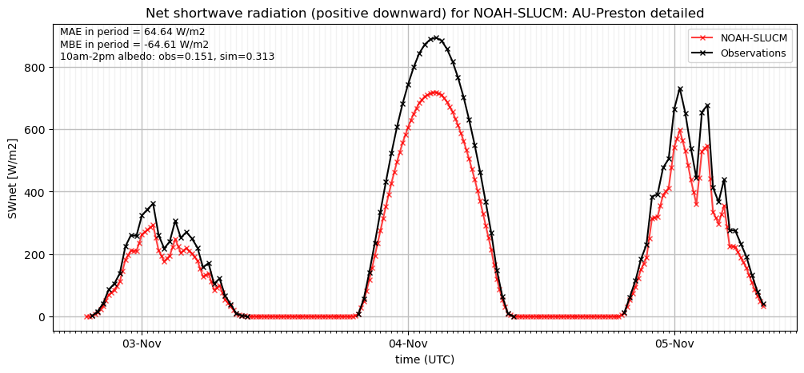](NOAH-SLUCM_AU-Preston_detailed_SWnet_ts.png)

### detailed_SWup
[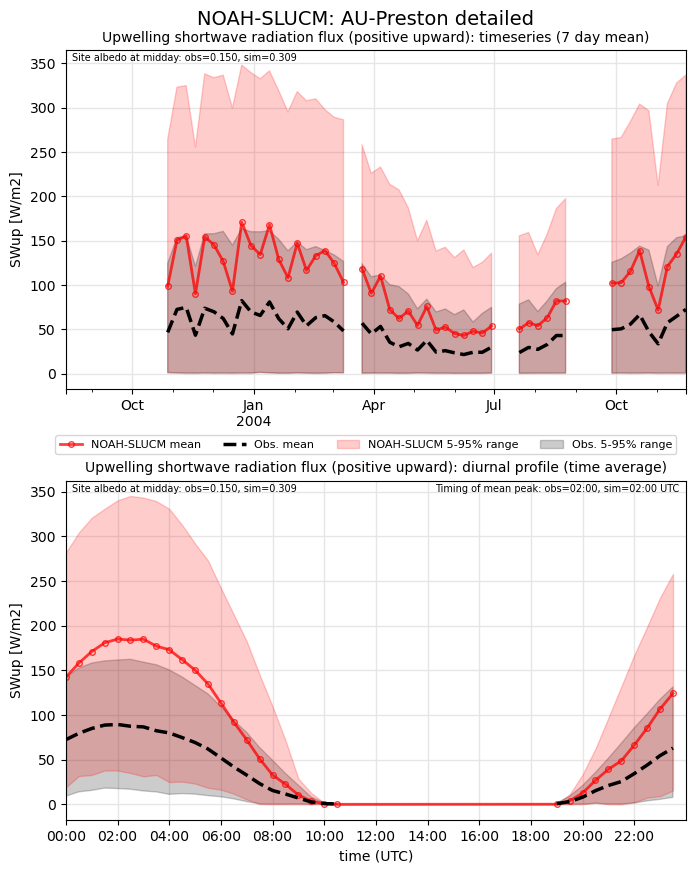](NOAH-SLUCM_AU-Preston_detailed_SWup.png)

### detailed_SWup_ts
[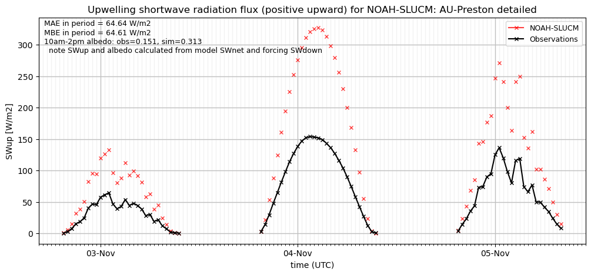](NOAH-SLUCM_AU-Preston_detailed_SWup_ts.png)

### detailed_closure
[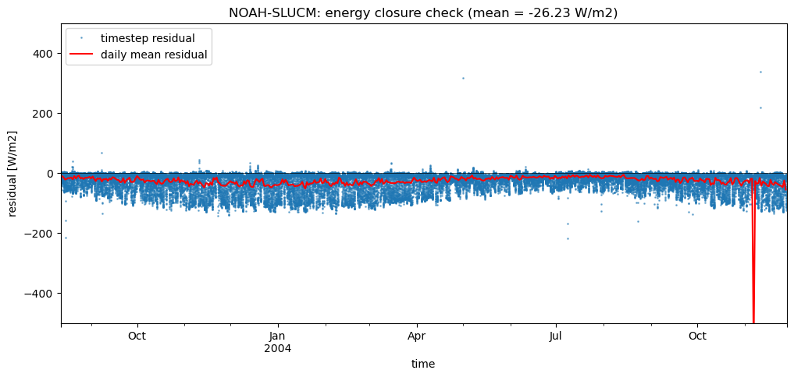](NOAH-SLUCM_AU-Preston_detailed_closure.png)

### out of range: baseline

 - NOAH-SLUCM LWnet min value of -179448.4531 is less than expected -500.0 [W/m2]
 - NOAH-SLUCM SWup min value of -254.5751 is less than expected 0.0 [W/m2]
 - NOAH-SLUCM LWup max value of 179806.8531 is greater than expected 1000.0 [W/m2]
 - NOAH-SLUCM Evap max value of 397.3634 is greater than expected 0.0003 [kg/m2/s]
 - NOAH-SLUCM Evap min value of -21.5631 is less than expected -0.0003 [kg/m2/s]
 - NOAH-SLUCM Qsm max value of 109.4080 is greater than expected 0.005 [kg/m2/s]
 - NOAH-SLUCM Qsm min value of -16.3000 is less than expected 0.0 [kg/m2/s]
 - NOAH-SLUCM Qfz min value of -0.0000 is less than expected 0.0 [kg/m2/s]
 - NOAH-SLUCM AvgSurfT max value of 1355.9984 is greater than expected 333.0 [K]
 - NOAH-SLUCM AvgSurfT min value of -62.7736 is less than expected 213.0 [K]
 - NOAH-SLUCM RadT max value of 1355.9984 is greater than expected 353.0 [K]
 - NOAH-SLUCM RadT min value of 62.7736 is less than expected 213.0 [K]
 - NOAH-SLUCM TVeg max value of 363.9469 is greater than expected 0.0003 [kg/m2/s]
 - NOAH-SLUCM alb min value of -0.9739 is less than expected 0.0 [1]

### out of range: detailed

 - NOAH-SLUCM LWnet min value of -18590.7520 is less than expected -500.0 [W/m2]
 - NOAH-SLUCM SWup min value of -281.8973 is less than expected 0.0 [W/m2]
 - NOAH-SLUCM LWup max value of 18935.9720 is greater than expected 1000.0 [W/m2]
 - NOAH-SLUCM Evap max value of 412.8776 is greater than expected 0.0003 [kg/m2/s]
 - NOAH-SLUCM Evap min value of -21.6109 is less than expected -0.0003 [kg/m2/s]
 - NOAH-SLUCM Qsm max value of 109.9217 is greater than expected 0.005 [kg/m2/s]
 - NOAH-SLUCM Qsm min value of -16.5773 is less than expected 0.0 [kg/m2/s]
 - NOAH-SLUCM Qfz min value of -0.0000 is less than expected 0.0 [kg/m2/s]
 - NOAH-SLUCM AvgSurfT max value of 772.0754 is greater than expected 333.0 [K]
 - NOAH-SLUCM AvgSurfT min value of -119.9518 is less than expected 213.0 [K]
 - NOAH-SLUCM RadT max value of 772.0754 is greater than expected 353.0 [K]
 - NOAH-SLUCM RadT min value of 75.5868 is less than expected 213.0 [K]
 - NOAH-SLUCM TVeg max value of 372.4022 is greater than expected 0.0003 [kg/m2/s]
 - NOAH-SLUCM alb min value of -0.9838 is less than expected 0.0 [1]

