**NOTE:** *Results presented here are highly dependent on how models are configured in this experiment and may be subject to variable output formatting errors. Results are not intended to indicate the quality of any individual model, but to help participants better understand and improve modelling approaches in different urban environments.*

# AU-Preston results (supplementary)

The following supplements results reported in the article:

> **The Urban-PLUMBER model intercomparison for urban areas: description and Phase 1 results**

Refer to the published article for interpretation of figures and for referencing.

# Taylor plots

See Figure 7 caption in the original article

## Fig. S1: Improvement Taylor plot

Line indicates improvement between baseline and detailed experiment. Marker indicates detailed result

[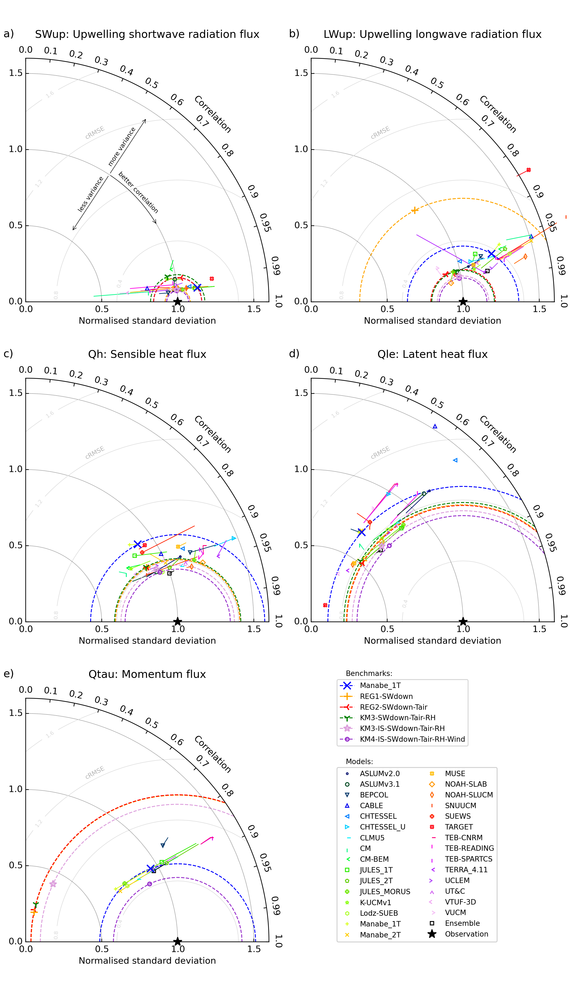](AU-Preston_taylor_five_improvement.png)

# Benchmarking relative evaluation plots

See Figure 8 caption in the original article

## Fig. S2: Extreme metric group

Metrics: 5th, 95th as defined in Table A.1

[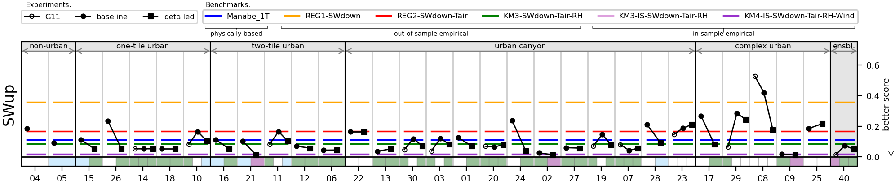](AU-Preston_combined_extreme_global_SWup.png)
[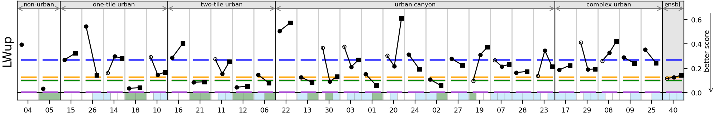](AU-Preston_combined_extreme_global_LWup.png)
[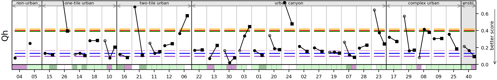](AU-Preston_combined_extreme_global_Qh.png)
[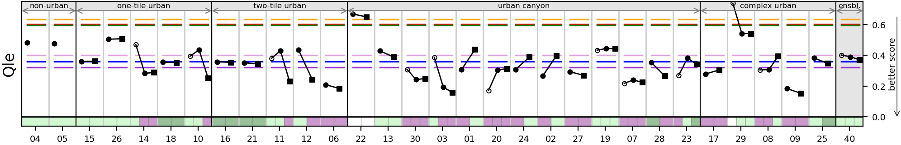](AU-Preston_combined_extreme_global_Qle.png)
[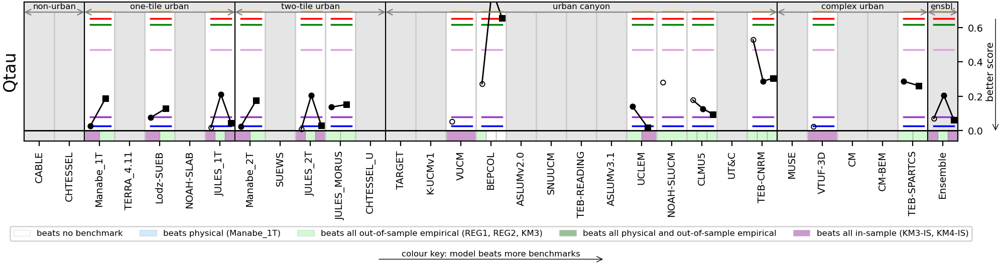](AU-Preston_combined_extreme_global_Qtau.png)

## Fig. S3: Distribution metric group

Metrics: nSkewness, nKurtosis, Overlap as defined in Table A.1

[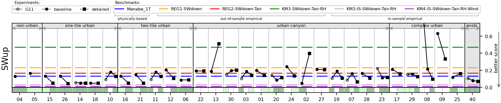](AU-Preston_combined_distribution_global_SWup.png)

[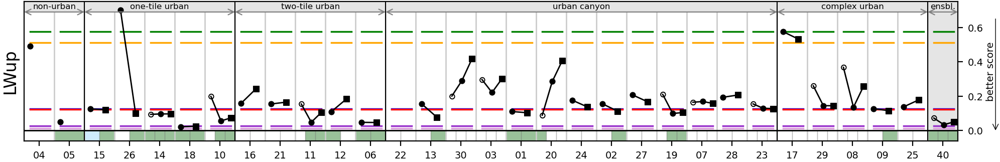](AU-Preston_combined_distribution_global_LWup.png)

[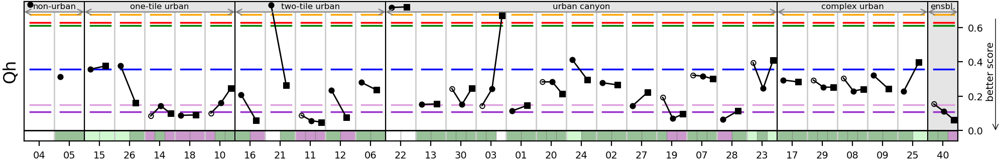](AU-Preston_combined_distribution_global_Qh.png)

[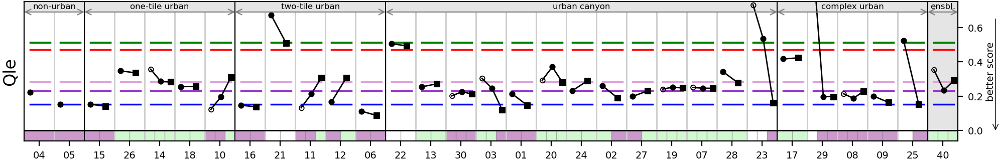](AU-Preston_combined_distribution_global_Qle.png)

[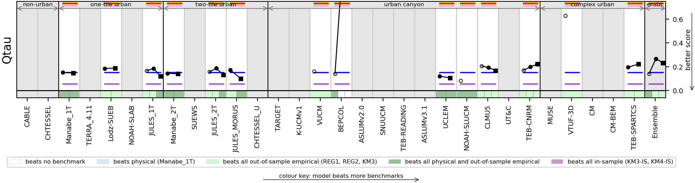](AU-Preston_combined_distribution_global_Qtau.png)

## Fig. S4: All metrics combined

[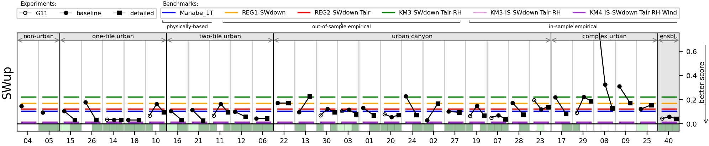](AU-Preston_combined_all_global_SWup.png)
[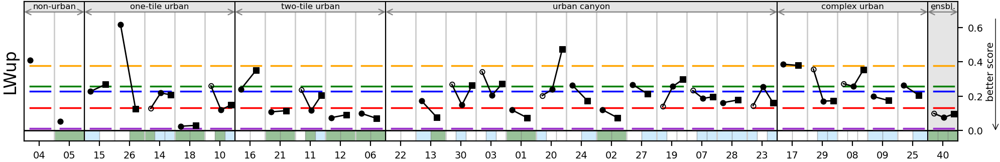](AU-Preston_combined_all_global_LWup.png)
[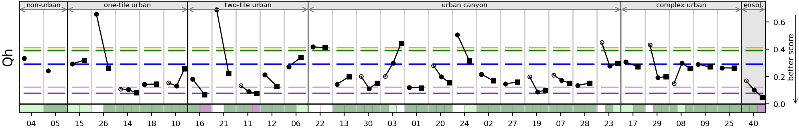](AU-Preston_combined_all_global_Qh.png)
[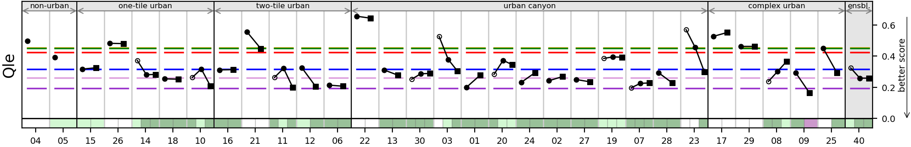](AU-Preston_combined_all_global_Qle.png)
[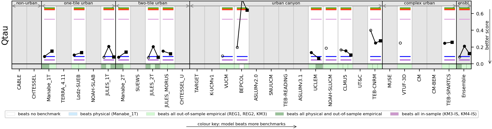](AU-Preston_combined_all_global_Qtau.png)

# Categorical MAE plots

See Figure 6 caption in the original article

## Fig. S5: By previous experience with the site

[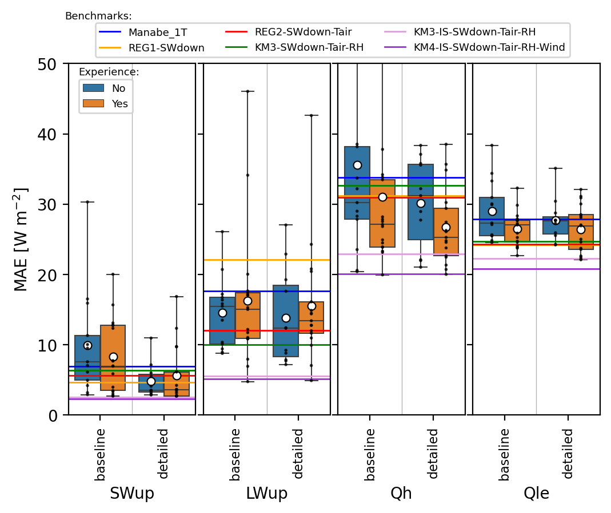](AU-Preston_experience_MAE_boxplot.png)

