**NOTE:** *Results presented here are highly dependent on how models are configured in this experiment and may be subject to variable output formatting errors. Results are not intended to indicate the quality of any individual model, but to help participants better understand and improve modelling approaches in different urban environments.*

# AU-Preston results (supplementary)

The following supplements results reported in the article:

> **The Urban-PLUMBER model intercomparison for urban areas: description and Phase 1 results**

Refer to the published article for interpretation of figures and for referencing.

Also see:

- [Baseline plots (all variables)](../baseline/index.md)
- [Detailed plots (all variables)](../detailed/index.md)
- [Individual model data and results](../index.md#model-data)

## Fig. S1: Extreme metric group

Metrics: 5th, 95th as defined in Table A.1. See Figure 8 caption in the original article for further details.

[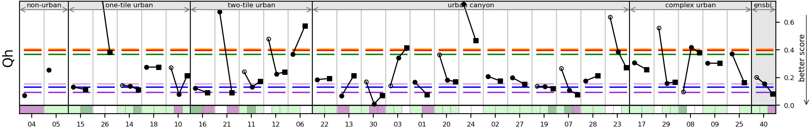](AU-Preston_phase1_extreme_global_Qh_v1.png)

[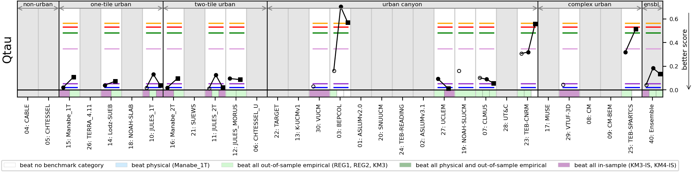](AU-Preston_phase1_extreme_global_Qtau_v1.png)

## Fig. S2: Distribution metric group

Metrics: nSkewness, nKurtosis, Overlap as defined in Table A.1. See Figure 8 caption in the original article for further details. 

[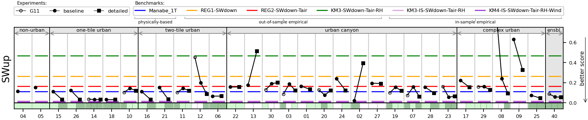](AU-Preston_phase1_distribution_global_SWup_v1.png)

[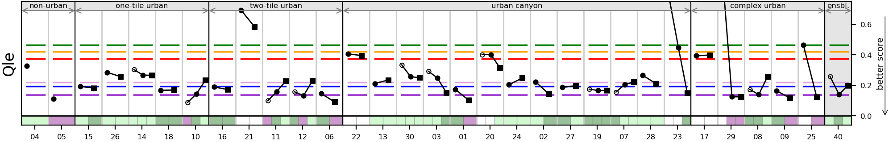](AU-Preston_phase1_distribution_global_Qle_v1.png)

## Fig. S3: All metrics aggregated

All metrics as defined in Table A.1. See Figure 8 caption in the original article for further details.

[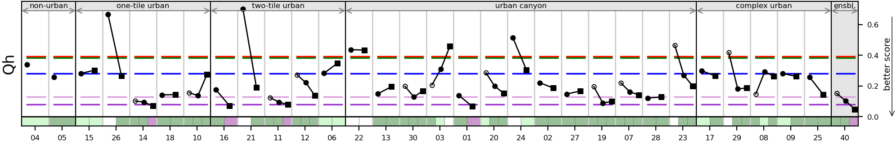](AU-Preston_phase1_all_global_Qh_v1.png)
[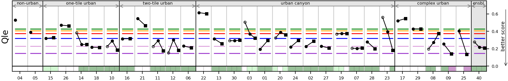](AU-Preston_phase1_all_global_Qle_v1.png)
[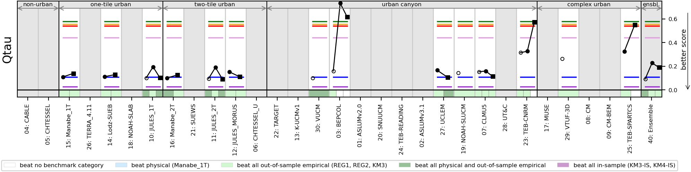](AU-Preston_phase1_all_global_Qtau_v1.png)

## Fig. S4: By cohort (only models with SWup correlation>0.99)

All models with lower SWup correlation excluded. See Figure 6 caption in the original article for further details.

[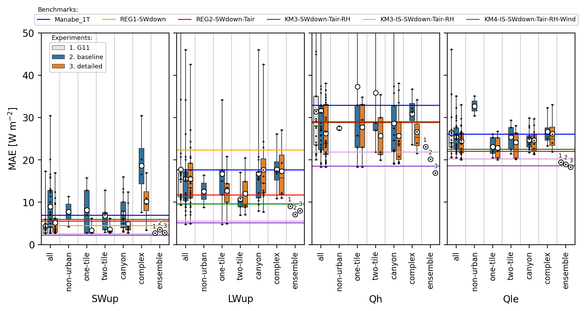](AU-Preston_good_sw_timing_MAE_boxplot_v1.png)

## Fig. S5: Comparison of initial and baseline submissions

Mean absolute error (MAE) improvement from the first (initial) to the final baseline submission, with the number of submissions and direction of improvement indicated

[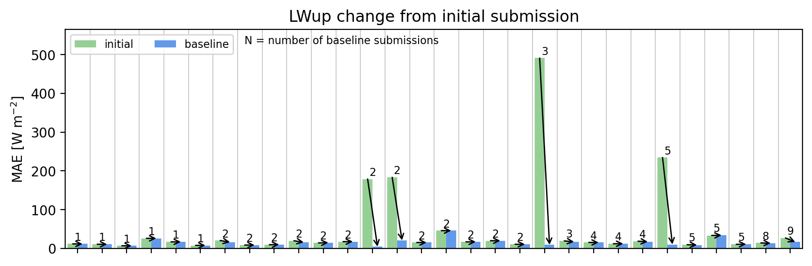](AU-Preston_phase1_improvement_MAE_LWup_v1.png)
[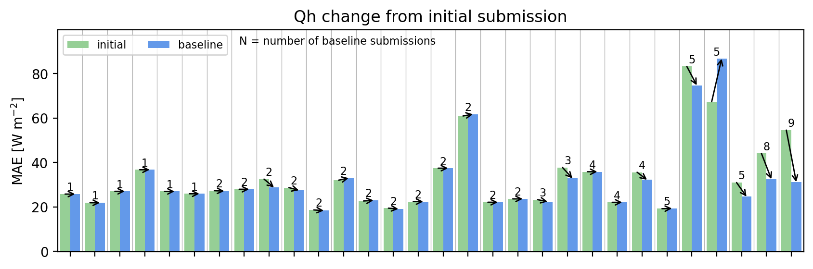](AU-Preston_phase1_improvement_MAE_Qh_v1.png)
[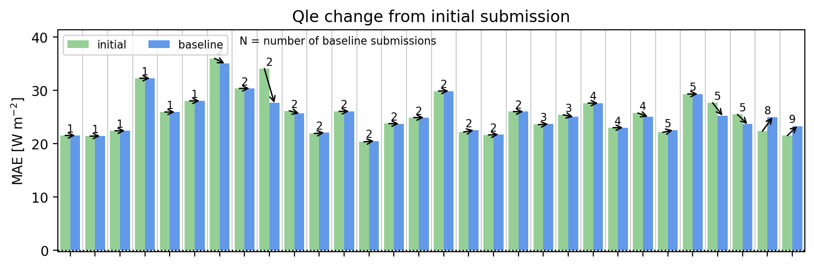](AU-Preston_phase1_improvement_MAE_Qle_v1.png)
[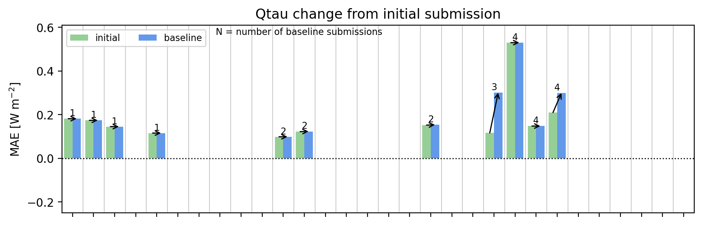](AU-Preston_phase1_improvement_MAE_Qtau_v1.png)

## Fig. S6: By previous experience with the site

[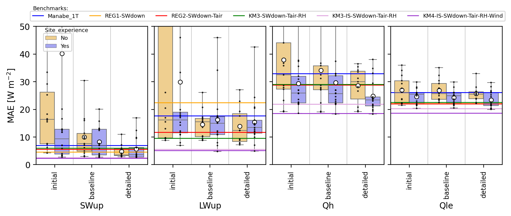](AU-Preston_site_experience_MAE_boxplot_v1.png)

## Fig. S7: By complete spinup

See [plot of simulation durations](../PLUMBER/index.md#simulation-duration)

## Fig. S8: By energy closure

