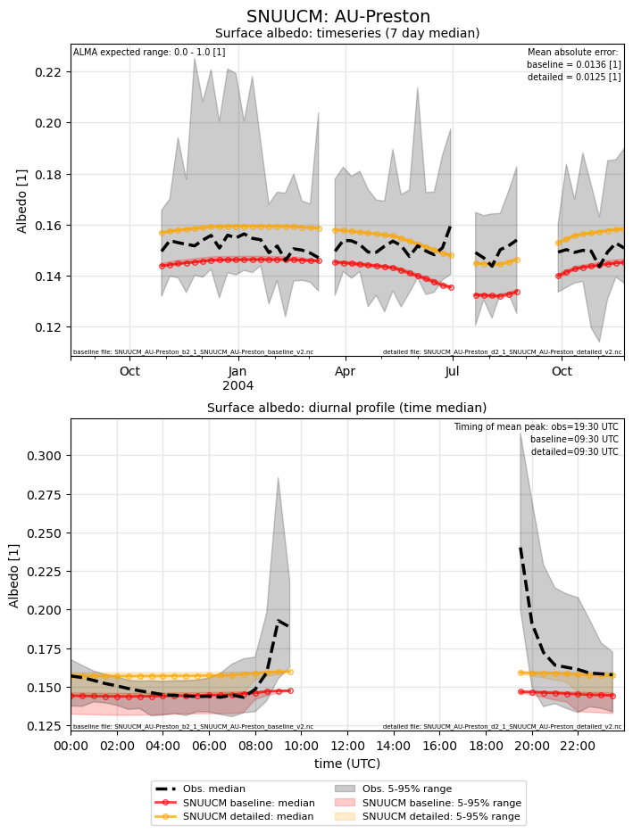
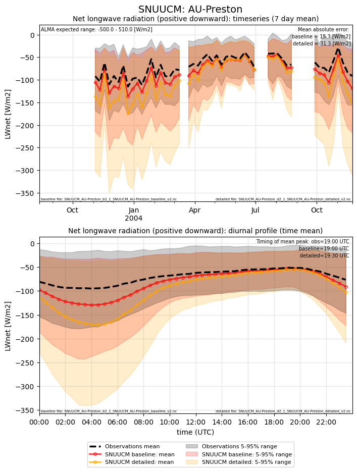
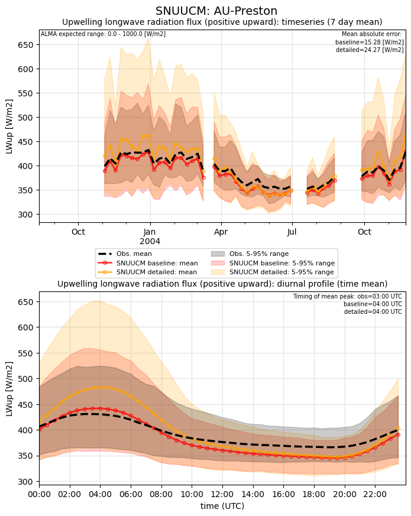
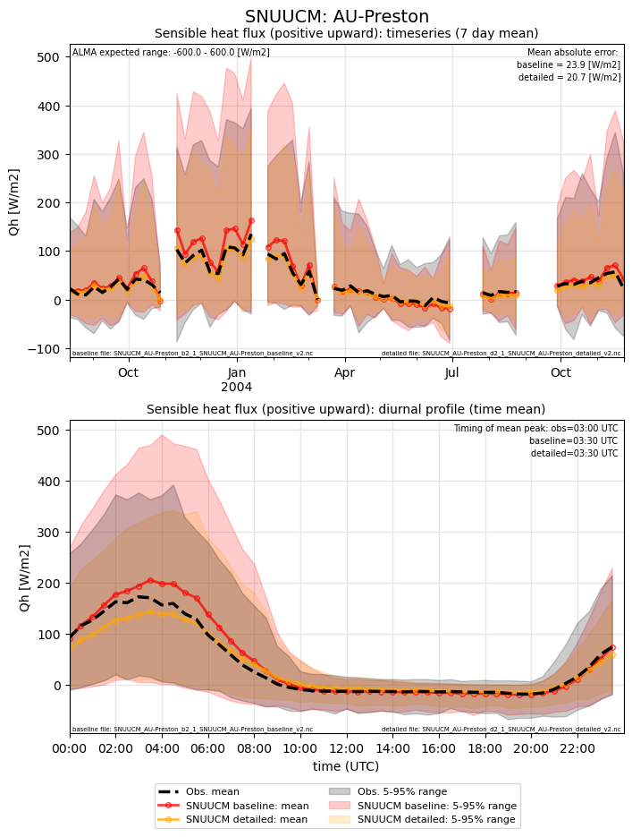
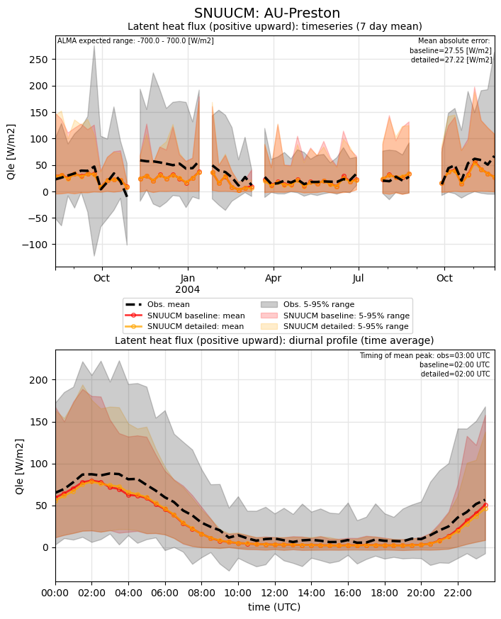
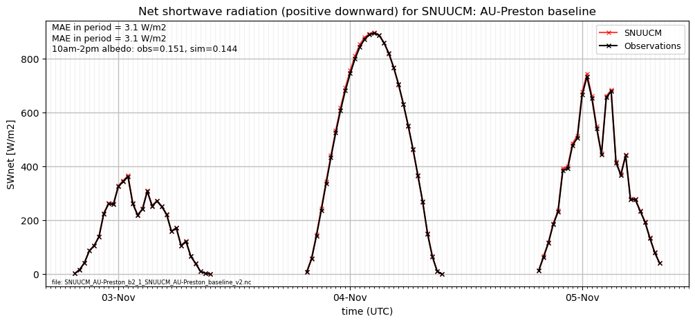
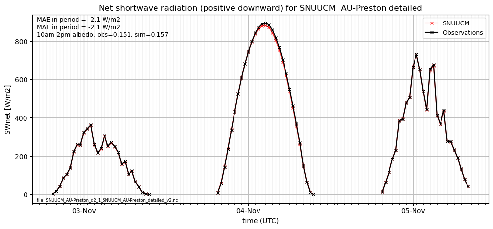
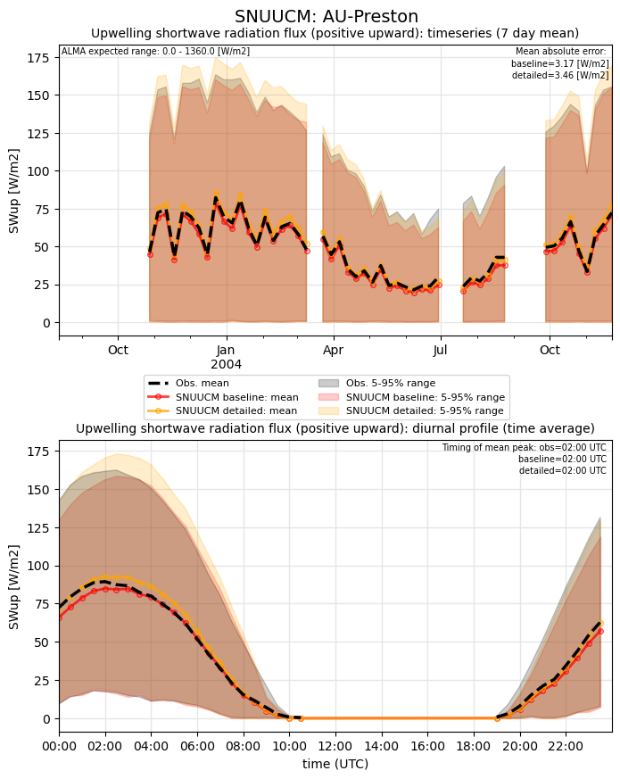
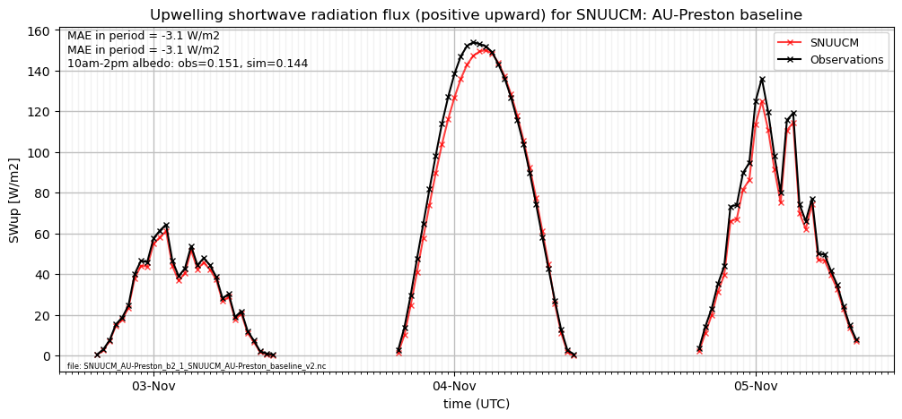
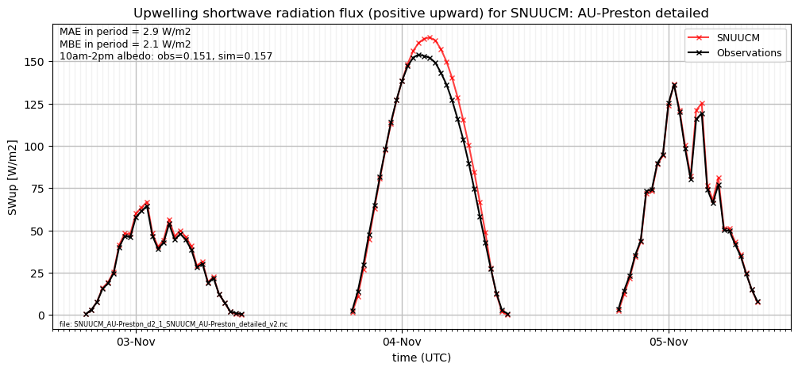

# AU-Preston: SNUUCM

**NOTE:** *Results presented here are highly dependent on how models are configured in this experiment and may be subject to variable output formatting errors. Results are not intended to indicate the quality of any individual model, but to help participants better understand and improve modelling approaches in different urban environments.*

### Error metrics

| flux   | experiment   |   MAE |     MBE |    NSD |      R |
|:-------|:-------------|------:|--------:|-------:|-------:|
| SWnet  | baseline     |  3.16 |   2.369 | 0.8797 | 0.9999 |
| SWnet  | detailed     |  3.46 |  -2.075 | 0.8663 | 0.9999 |
| LWnet  | baseline     | 15.26 | -13.669 | 1.1488 | 0.9603 |
| LWnet  | detailed     | 31.29 | -29.786 | 1.5783 | 0.9121 |
| Qle    | baseline     | 27.55 |  -8.981 | 0.7608 | 0.5139 |
| Qle    | detailed     | 27.22 |  -9.389 | 0.731  | 0.5257 |
| Qh     | baseline     | 23.92 |   7.408 | 1.1925 | 0.9351 |
| Qh     | detailed     | 20.76 |  -3.412 | 0.8361 | 0.9321 |

MAE = mean absolute error, MBE = mean bias error, NSD = ratio of model:obs standard deviation, R = Pearson's correlation

### jump to figure:
 - [Albedo](#albedo)
 - [LWnet](#lwnet)
 - [LWup](#lwup)
 - [Qh](#qh)
 - [Qle](#qle)
 - [SWnet](#swnet)
 - [SWnet_subset_baseline](#swnet_subset_baseline)
 - [SWnet_subset_detailed](#swnet_subset_detailed)
 - [SWup](#swup)
 - [SWup_subset_baseline](#swup_subset_baseline)
 - [SWup_subset_detailed](#swup_subset_detailed)
 - [closure_baseline](#closure_baseline)
 - [closure_detailed](#closure_detailed)

[Link to variable definitions](variable_definitions.md)

### Albedo

### LWnet

### LWup

### Qh

### Qle

### SWnet

### SWnet_subset_baseline

### SWnet_subset_detailed

### SWup

### SWup_subset_baseline

### SWup_subset_detailed

### closure_baseline

### closure_detailed

### out of range: baseline

 - SNUUCM RoadSurfT max value of 343.9175 is greater than expected 343.0 [K]
 - SNUUCM TairSurf max value of 1163.1962 is greater than expected 333.0 [K]

### out of range: detailed

 - SNUUCM RoofSurfT max value of 359.0009 is greater than expected 343.0 [K]
 - SNUUCM RoadSurfT max value of 345.1742 is greater than expected 343.0 [K]
 - SNUUCM TairSurf max value of 1130.6298 is greater than expected 333.0 [K]

[Link to variable definitions](variable_definitions.md)

