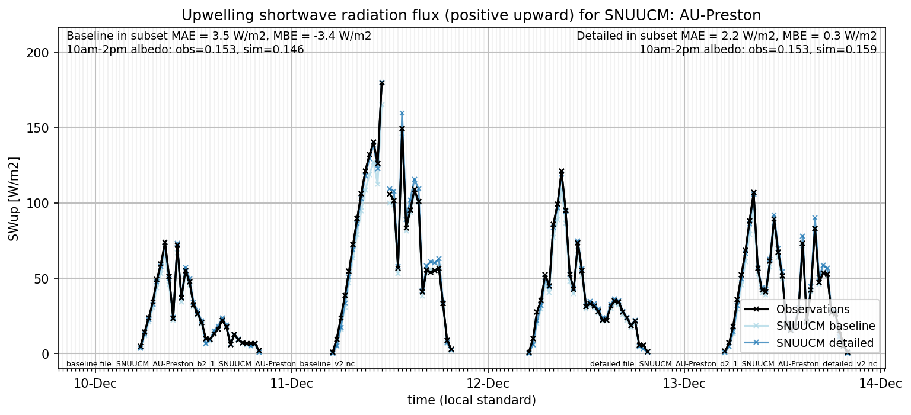

# AU-Preston: SNUUCM

**NOTE:** *Results presented here are highly dependent on how models are configured in this experiment and may be subject to variable output formatting errors. Results are not intended to indicate the quality of any individual model, but to help participants better understand and improve modelling approaches in different urban environments.*

### Submitted metadata

- [Baseline](SNUUCM_AU-Preston_baseline_attrs.md)
- [Detailed](SNUUCM_AU-Preston_detailed_attrs.md)

### Error metrics

| flux   | experiment   |      MAE |      MBE |      nSD |        R |       5th |     95th |     RMSE |     cRMSE |    AMBE |     1-nSD |        1-R |   nSkewness |   nKurtosis |   Overlap |
|:-------|:-------------|---------:|---------:|---------:|---------:|----------:|---------:|---------:|----------:|--------:|----------:|-----------:|------------:|------------:|----------:|
| SWup   | baseline     |  3.33155 | -2.49173 | 0.974546 | 0.996354 |  0.592306 |  3.42479 |  4.80001 | 0.0880635 | 2.49173 | 0.0254543 | 0.00364645 |   0.0414595 |   0.0711086 | 0.0617443 |
| SWup   | detailed     |  3.64328 |  2.22004 | 1.06343  | 0.996402 |  0.493674 |  9.6847  |  5.50196 | 0.10806   | 2.22004 | 0.0634343 | 0.00359829 |   0.0441188 |   0.0775816 | 0.071134  |
| LWup   | baseline     | 15.2786  | -8.74534 | 1.26292  | 0.975379 | 18.2402   | 20.8063  | 17.5568  | 0.362377  | 8.74534 | 0.26292   | 0.0246213  |   0.170102  |   0.321136  | 0.209453  |
| LWup   | detailed     | 24.2755  |  7.37281 | 1.76704  | 0.949016 | 19.1254   | 92.1045  | 37.5598  | 0.876661  | 7.37281 | 0.767042  | 0.0509839  |   0.295687  |   0.535286  | 0.209975  |
| Qle    | baseline     | 27.2434  | -8.86138 | 0.752757 | 0.517774 |  9.82923  | 30.5191  | 47.0437  | 0.887202  | 8.86138 | 0.247243  | 0.482226   |   0.498922  |   0.478559  | 0.221096  |
| Qle    | detailed     | 26.9151  | -9.26587 | 0.727312 | 0.529953 |  9.8775   | 33.1433  | 46.2788  | 0.870689  | 9.26587 | 0.272688  | 0.470047   |   0.414384  |   0.260917  | 0.229401  |
| Qh     | baseline     | 23.8783  |  7.37272 | 1.20491  | 0.935401 |  1.49349  | 66.3087  | 41.5583  | 0.444591  | 7.37272 | 0.20491   | 0.0645994  |   0.142559  |   0.248411  | 0.096857  |
| Qh     | detailed     | 20.7053  | -3.46489 | 0.851661 | 0.932423 | 13.1307   | 26.4687  | 34.2392  | 0.370284  | 3.46489 | 0.148339  | 0.0675772  |   0.0913439 |   0.170664  | 0.127865  |

 - MAE: mean absolute error (close to 0 is better)
 - MBE: mean bias error (close to 0 is better)
 - NSD: ratio of model to obs standard deviation (close to 1 is better)
 - R: Pearson's correlation (close to 1 is better)
 - all others: closer to 0 is better

[Link to variable definitions](../modelattrs/variable_definitions.md)

### Datasheet

### Distributions

### closure_baseline

### closure_detailed

### subset_LWup

### subset_Qh

### subset_Qle

### subset_SWup

### out of range: baseline

 - SNUUCM EvapF max value of 1506.0585 is greater than expected 1.0 [1]
 - SNUUCM EvapF min value of -62.3383 is less than expected 0.0 [1]

### out of range: detailed

 - SNUUCM RoofSurfT max value of 359.0009 is greater than expected 353.0 [K]
 - SNUUCM EvapF max value of 275.9831 is greater than expected 1.0 [1]
 - SNUUCM EvapF min value of -87.8504 is less than expected 0.0 [1]

[Link to variable definitions](../modelattrs/variable_definitions.md)

