# AU-Preston: SUEWS

**NOTE:** *Results presented here are highly dependent on how models are configured in this experiment and may be subject to variable output formatting errors. Results are not intended to indicate the quality of any individual model, but to help participants better understand and improve modelling approaches in different urban environments.*

### Error metrics
| flux   | experiment   |   MAE |    MBE |    NSD |      R |
|:-------|:-------------|------:|-------:|-------:|-------:|
| SWnet  | baseline     |  7.16 |  6.918 | 0.895  | 0.9999 |
| SWnet  | detailed     |  8.84 |  8.689 | 0.9003 | 0.9999 |
| LWnet  | baseline     |  9.7  | -8.459 | 0.9893 | 0.984  |
| LWnet  | detailed     | 10.14 | -9.075 | 0.9933 | 0.984  |
| Qle    | baseline     | 31.14 | -9.385 | 0.7689 | 0.4059 |
| Qle    | detailed     | 28.33 | -9.541 | 0.743  | 0.5045 |
| Qh     | baseline     | 84.65 | 81.593 | 1.2659 | 0.8688 |
| Qh     | detailed     | 33.3  |  5.882 | 0.9208 | 0.8533 |

### jump to figure:
 - [baseline_Albedo](#baseline_albedo)
 - [baseline_LWnet](#baseline_lwnet)
 - [baseline_LWup](#baseline_lwup)
 - [baseline_Qh](#baseline_qh)
 - [baseline_Qle](#baseline_qle)
 - [baseline_SWnet](#baseline_swnet)
 - [baseline_SWnet_ts](#baseline_swnet_ts)
 - [baseline_SWup](#baseline_swup)
 - [baseline_SWup_ts](#baseline_swup_ts)
 - [baseline_closure](#baseline_closure)
 - [detailed_Albedo](#detailed_albedo)
 - [detailed_LWnet](#detailed_lwnet)
 - [detailed_LWup](#detailed_lwup)
 - [detailed_Qh](#detailed_qh)
 - [detailed_Qle](#detailed_qle)
 - [detailed_SWnet](#detailed_swnet)
 - [detailed_SWnet_ts](#detailed_swnet_ts)
 - [detailed_SWup](#detailed_swup)
 - [detailed_SWup_ts](#detailed_swup_ts)
 - [detailed_closure](#detailed_closure)

### baseline_Albedo
[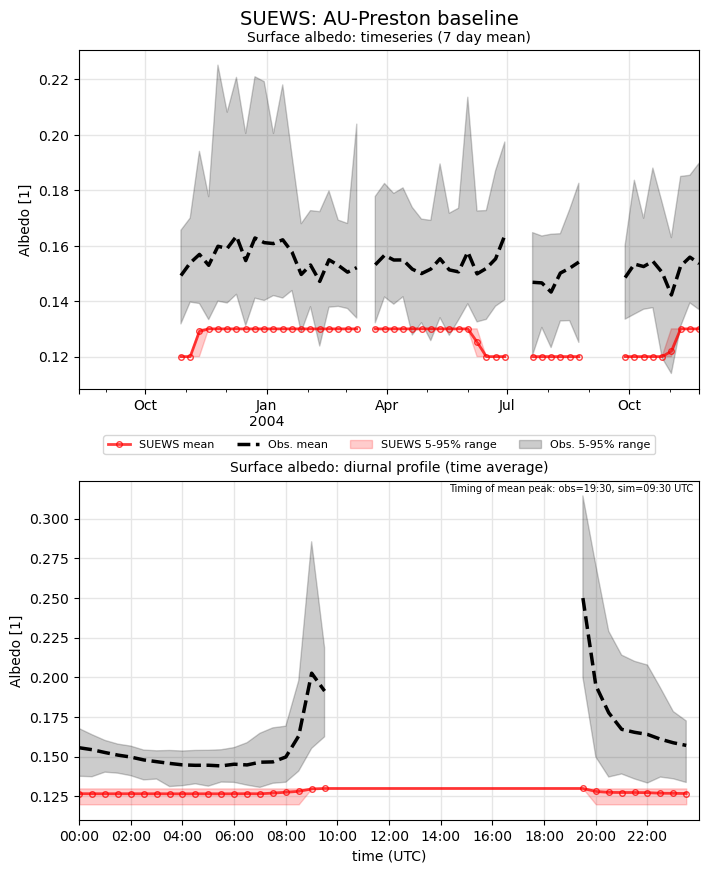](SUEWS_AU-Preston_baseline_Albedo.png)

### baseline_LWnet
[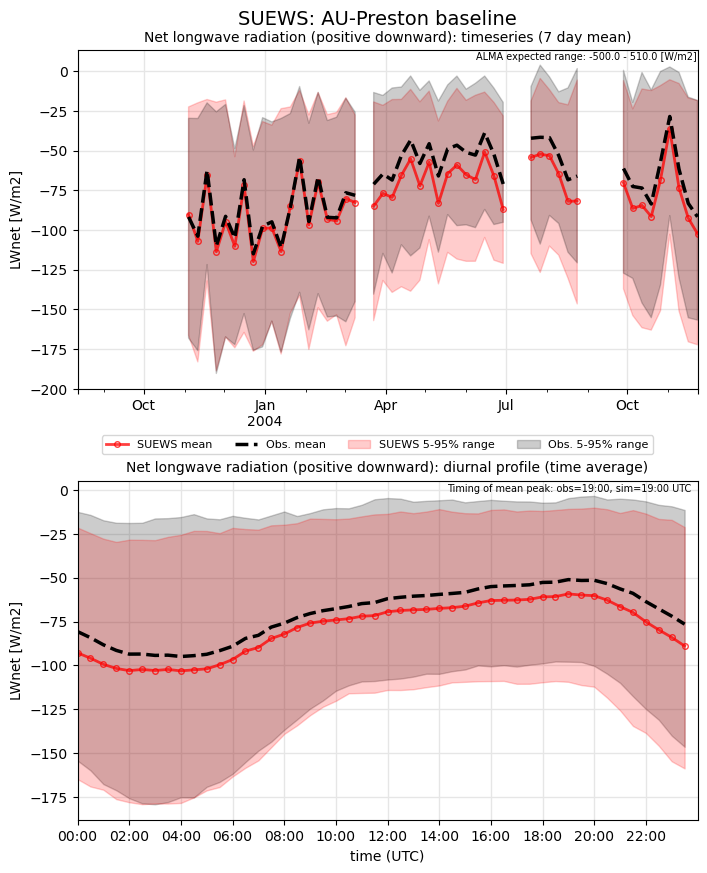](SUEWS_AU-Preston_baseline_LWnet.png)

### baseline_LWup
[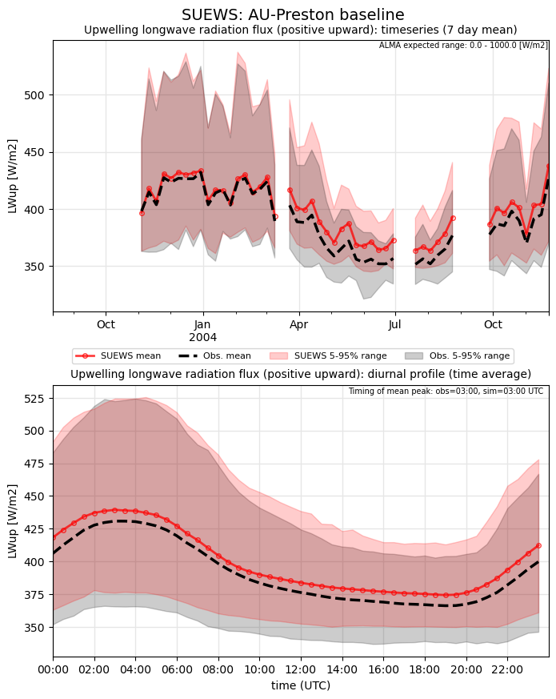](SUEWS_AU-Preston_baseline_LWup.png)

### baseline_Qh
[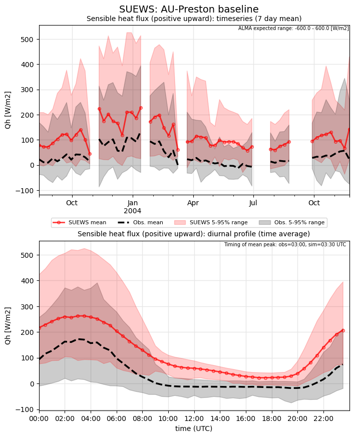](SUEWS_AU-Preston_baseline_Qh.png)

### baseline_Qle
[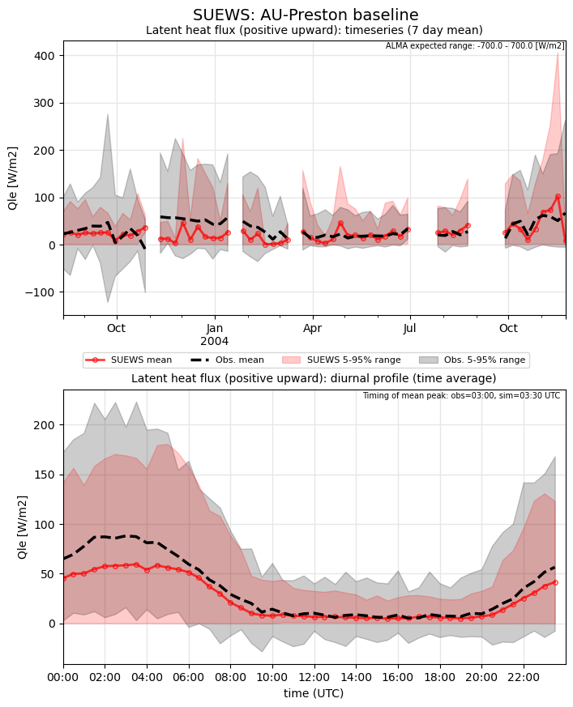](SUEWS_AU-Preston_baseline_Qle.png)

### baseline_SWnet
[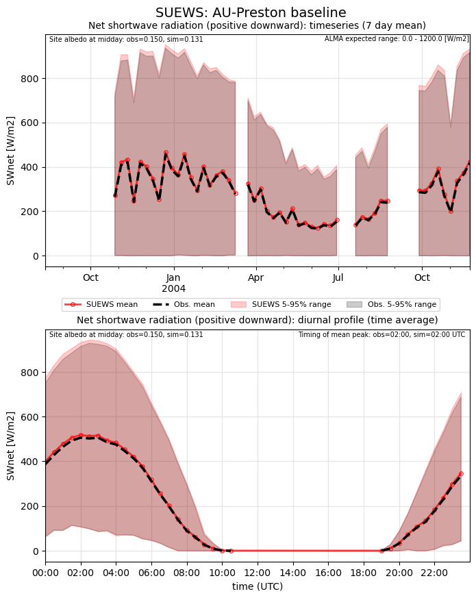](SUEWS_AU-Preston_baseline_SWnet.png)

### baseline_SWnet_ts
[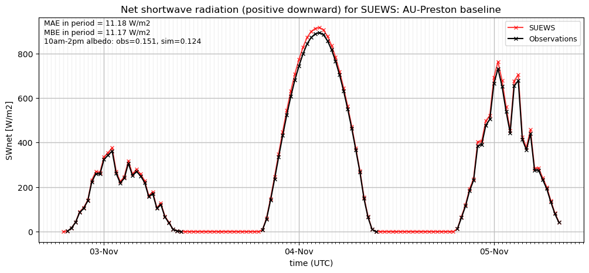](SUEWS_AU-Preston_baseline_SWnet_ts.png)

### baseline_SWup
[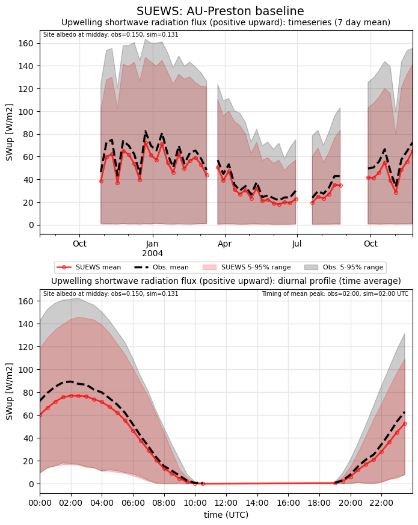](SUEWS_AU-Preston_baseline_SWup.png)

### baseline_SWup_ts
[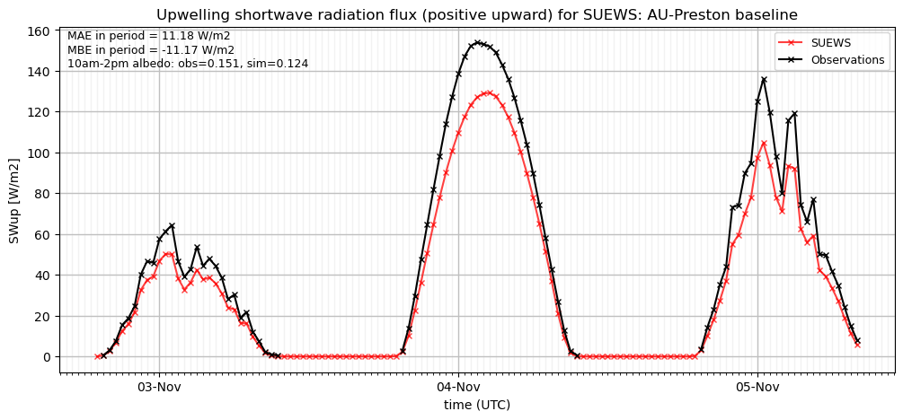](SUEWS_AU-Preston_baseline_SWup_ts.png)

### baseline_closure
[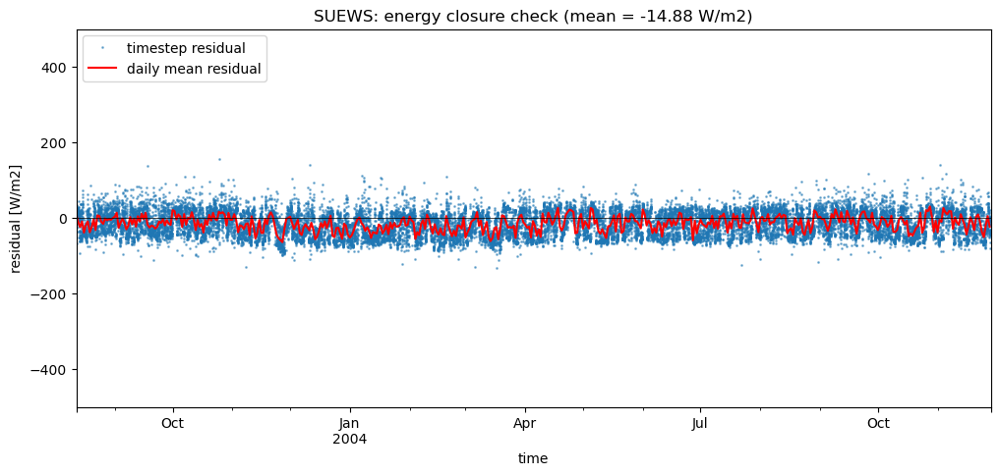](SUEWS_AU-Preston_baseline_closure.png)

### detailed_Albedo
[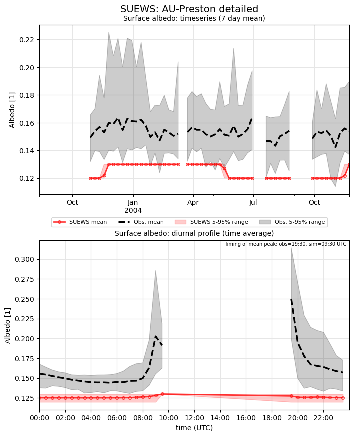](SUEWS_AU-Preston_detailed_Albedo.png)

### detailed_LWnet

### detailed_LWup

### detailed_Qh
[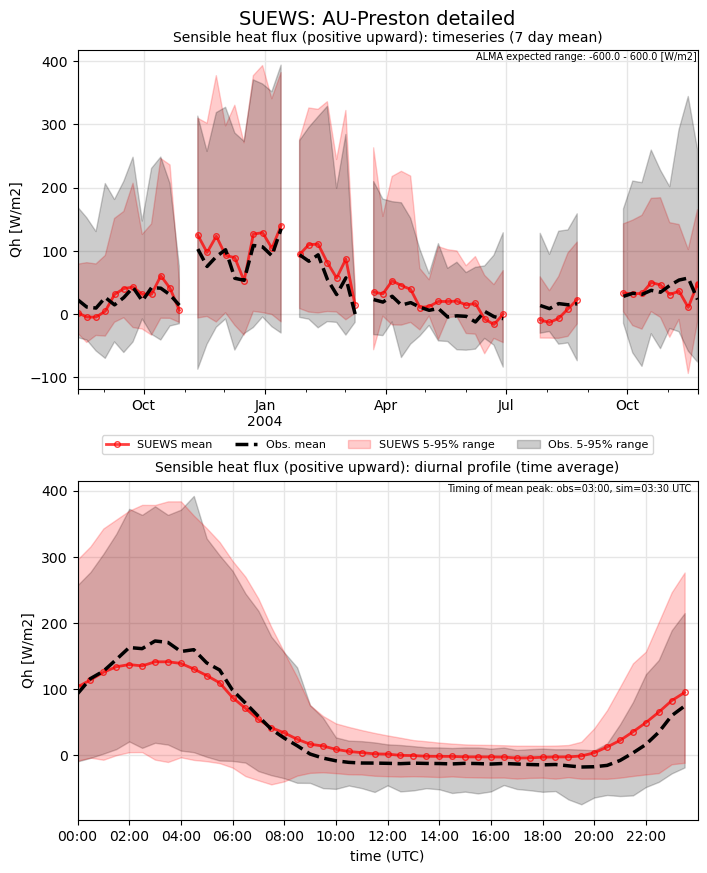](SUEWS_AU-Preston_detailed_Qh.png)

### detailed_Qle
[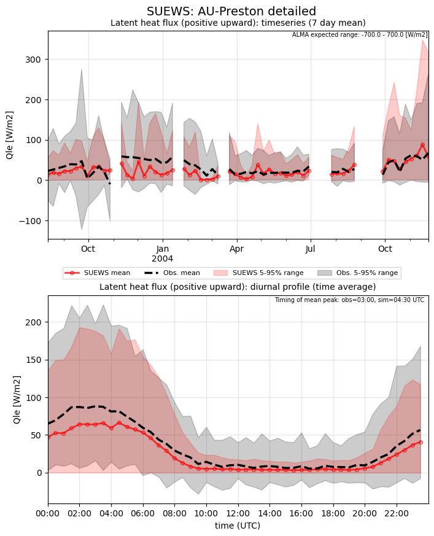](SUEWS_AU-Preston_detailed_Qle.png)

### detailed_SWnet
[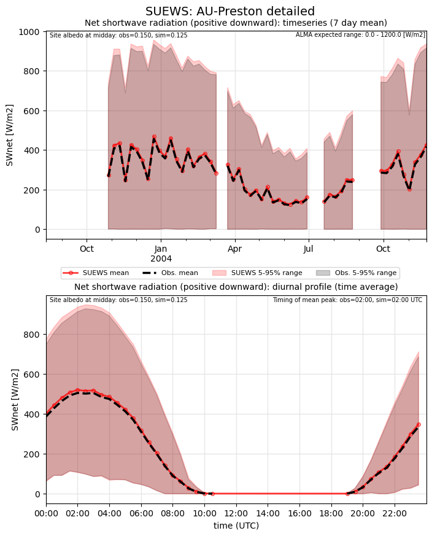](SUEWS_AU-Preston_detailed_SWnet.png)

### detailed_SWnet_ts
[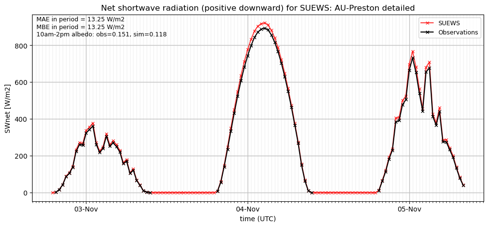](SUEWS_AU-Preston_detailed_SWnet_ts.png)

### detailed_SWup
[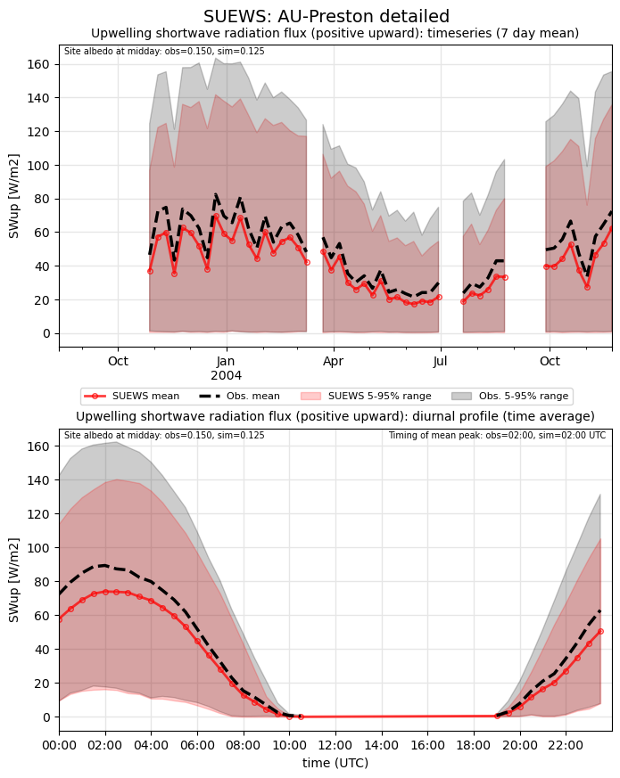](SUEWS_AU-Preston_detailed_SWup.png)

### detailed_SWup_ts
[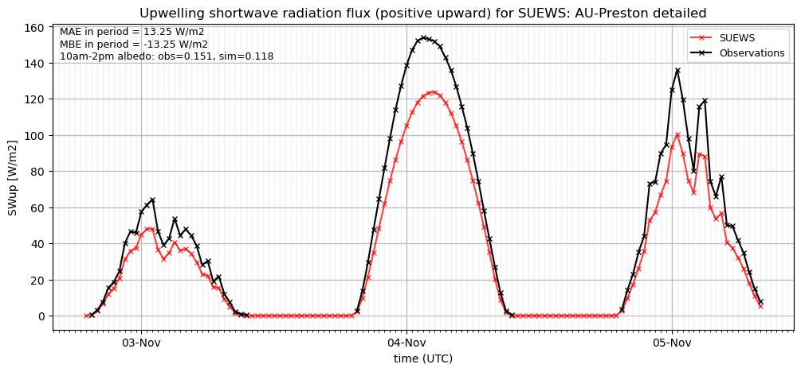](SUEWS_AU-Preston_detailed_SWup_ts.png)

### detailed_closure

### out of range: baseline

 - SUEWS SWnet value of -9.1000 is less than expected 0.0 [W/m2]
 - SUEWS AvgSurfT value of 3.1500 is less than expected 213.0 [K]
 - SUEWS TairSurf value of 2.5300 is less than expected 213.0 [K]

### out of range: detailed

 - SUEWS SWnet value of -9.1000 is less than expected 0.0 [W/m2]
 - SUEWS AvgSurfT value of 3.1500 is less than expected 213.0 [K]
 - SUEWS TairSurf value of 2.5300 is less than expected 213.0 [K]

