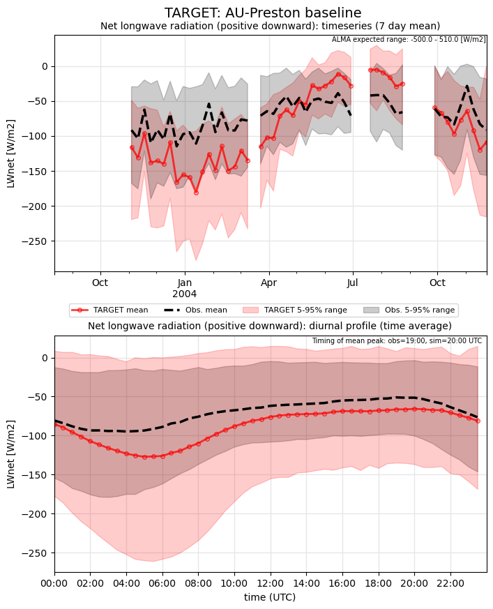
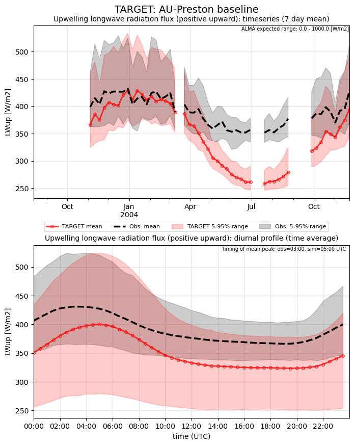
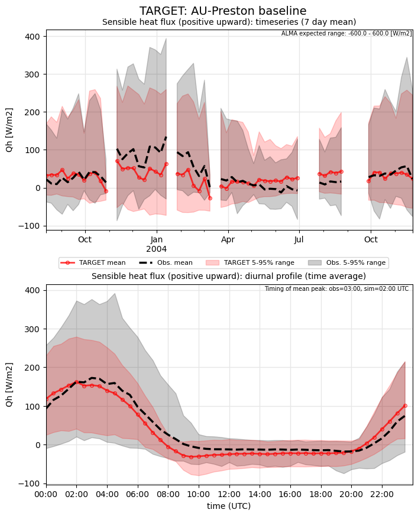
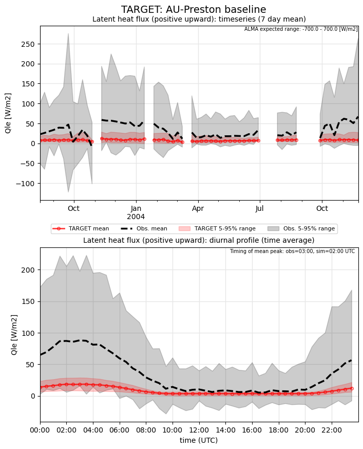
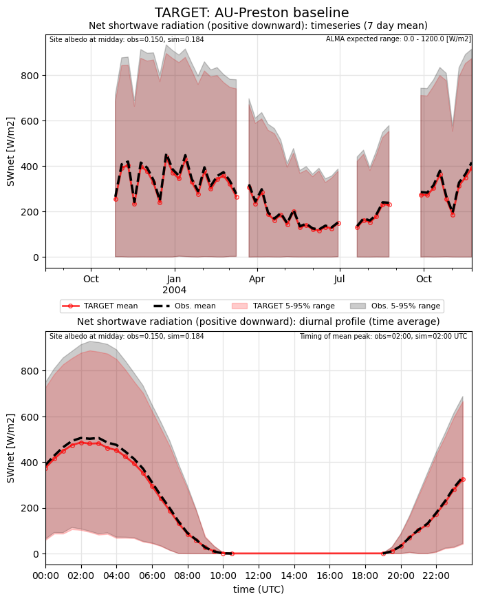
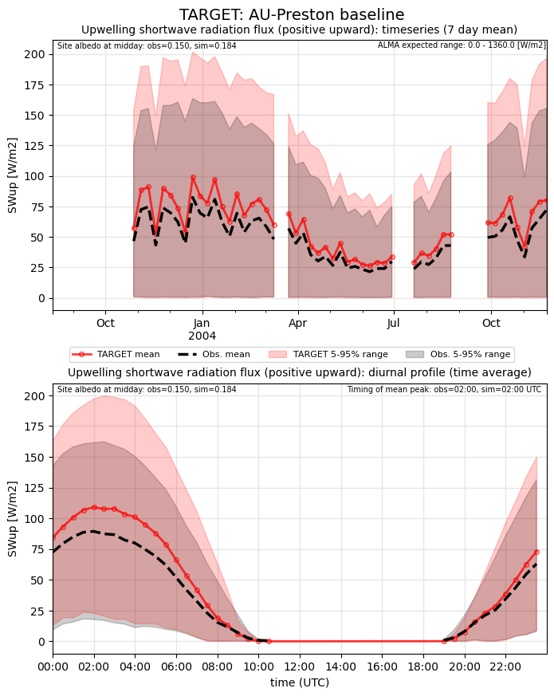

# AU-Preston: TARGET

**NOTE:** *Results presented here are highly dependent on how models are configured in this experiment and may be subject to variable output formatting errors. Results are not intended to indicate the quality of any individual model, but to help participants better understand and improve modelling approaches in different urban environments.*

### Error metrics

| flux   | experiment   |   MAE |     MBE |    NSD |      R |
|:-------|:-------------|------:|--------:|-------:|-------:|
| SWnet  | baseline     | 11.54 | -11.224 | 0.8376 | 0.9999 |
| SWnet  | detailed     | 11.54 | -11.224 | 0.8376 | 0.9999 |
| LWnet  | baseline     | 35.84 | -18.159 | 1.4395 | 0.8104 |
| LWnet  | detailed     | 40.69 | -25.668 | 1.5137 | 0.806  |
| Qle    | baseline     | 32.63 | -25.124 | 0.1268 | 0.6424 |
| Qle    | detailed     | 32.43 | -25.094 | 0.1402 | 0.6409 |
| Qh     | baseline     | 37.83 |  -6.858 | 0.8855 | 0.8417 |
| Qh     | detailed     | 38.56 |  -6.742 | 0.9303 | 0.8414 |

### jump to figure:
 - [baseline_LWnet](#baseline_lwnet)
 - [baseline_LWup](#baseline_lwup)
 - [baseline_Qh](#baseline_qh)
 - [baseline_Qle](#baseline_qle)
 - [baseline_SWnet](#baseline_swnet)
 - [baseline_SWnet_ts](#baseline_swnet_ts)
 - [baseline_SWup](#baseline_swup)
 - [baseline_SWup_ts](#baseline_swup_ts)
 - [baseline_closure](#baseline_closure)
 - [detailed_LWnet](#detailed_lwnet)
 - [detailed_LWup](#detailed_lwup)
 - [detailed_Qh](#detailed_qh)
 - [detailed_Qle](#detailed_qle)
 - [detailed_SWnet](#detailed_swnet)
 - [detailed_SWnet_ts](#detailed_swnet_ts)
 - [detailed_SWup](#detailed_swup)
 - [detailed_SWup_ts](#detailed_swup_ts)
 - [detailed_closure](#detailed_closure)

### baseline_LWnet

### baseline_LWup

### baseline_Qh

### baseline_Qle

### baseline_SWnet

### baseline_SWnet_ts

### baseline_SWup

### baseline_SWup_ts

### baseline_closure

### detailed_LWnet

### detailed_LWup

### detailed_Qh

### detailed_Qle

### detailed_SWnet

### detailed_SWnet_ts

### detailed_SWup

### detailed_SWup_ts

### detailed_closure

### out of range: baseline

 - TARGET RoofSurfT max value of 358.9660 is greater than expected 343.0 [K]
 - TARGET PSurf min value of 974.2000 is less than expected 5000.0 [Pa]

### out of range: detailed

 - TARGET RoofSurfT max value of 360.3281 is greater than expected 343.0 [K]
 - TARGET PSurf min value of 974.2000 is less than expected 5000.0 [Pa]

