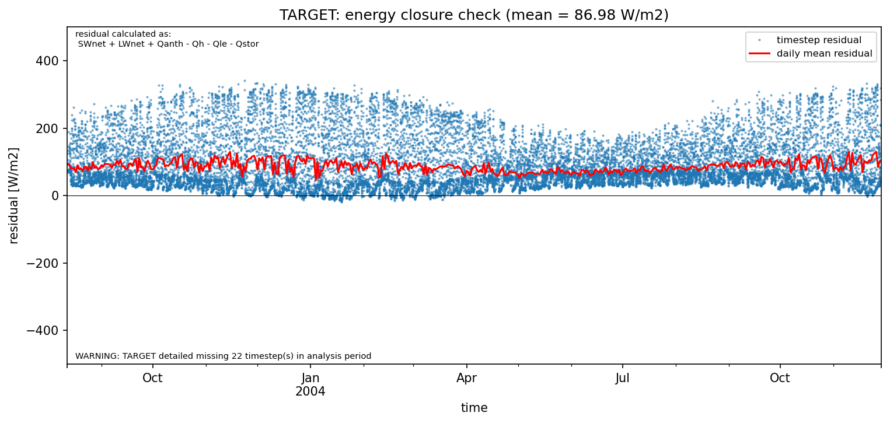

# AU-Preston: TARGET

**NOTE:** *Results presented here are highly dependent on how models are configured in this experiment and may be subject to variable output formatting errors. Results are not intended to indicate the quality of any individual model, but to help participants better understand and improve modelling approaches in different urban environments.*

### Submitted metadata

- [Baseline](TARGET_AU-Preston_baseline_attrs.md)
- [Detailed](TARGET_AU-Preston_detailed_attrs.md)

### Error metrics

| flux   | experiment   |      MAE |       MBE |        nSD |          R |       5th |     95th |     RMSE |      cRMSE |      AMBE |       1-nSD |          1-R |   nSkewness |   nKurtosis |    Overlap |
|:-------|:-------------|---------:|----------:|-----------:|-----------:|----------:|---------:|---------:|-----------:|----------:|------------:|-------------:|------------:|------------:|-----------:|
| SWup   | baseline     |  12.3446 |  11.7454  |   1.23349  |   0.992433 |   0.33612 |  34.2178 |  17.2277 |   0.270528 |  11.7454  |   0.233491  |   0.00756701 |   0.0163891 |   0.0303638 |   0.107961 |
| SWup   | detailed     |  12.3446 |  11.7454  |   1.23349  |   0.992433 |   0.33612 |  34.2178 |  17.2277 |   0.270528 |  11.7454  |   0.233491  |   0.00756701 |   0.0163891 |   0.0303638 |   0.107961 |
| LWup   | baseline     |  46.0397 | -40.6063  |   1.58598  |   0.853646 |  87.2293  |   1.3259 |  55.4228 |   0.898663 |  40.6063  |   0.585976  |   0.146354   |   0.604923  |   1.29219   |   0.427168 |
| LWup   | detailed     |  42.6043 | -33.0864  |   1.6731   |   0.855669 |  84.4443  |  16.8258 |  52.3811 |   0.967481 |  33.0864  |   0.673097  |   0.144331   |   0.585546  |   1.26478   |   0.406304 |
| Qle    | baseline     |  32.2904 | -25.0052  |   0.129656 |   0.649162 |  13.1256  | 109.425  |  54.0945 |   0.921127 |  25.0052  |   0.870344  |   0.350838   |   0.292258  |   0.863221  |   0.376942 |
| Qle    | detailed     |  32.0957 | -24.9751  |   0.14318  |   0.647607 |  12.4885  | 107.763  |  53.743  |   0.913812 |  24.9751  |   0.85682   |   0.352393   |   0.287401  |   0.861593  |   0.35946  |
| Qh     | baseline     |  37.7881 |  -6.91131 |   0.886889 |   0.842087 |   9.47116 |  34.5864 |  50.2639 |   0.5412   |   6.91131 |   0.113111  |   0.157913   |   0.295299  |   0.736099  |   0.197483 |
| Qh     | detailed     |  38.5176 |  -6.79335 |   0.931129 |   0.841756 |  13.1459  |  24.6586 |  50.7952 |   0.547206 |   6.79335 |   0.0688713 |   0.158244   |   0.292903  |   0.734872  |   0.20722  |
| Qtau   | baseline     | nan      | nan       | nan        | nan        | nan       | nan      | nan      | nan        | nan       | nan         | nan          | nan         | nan         | nan        |
| Qtau   | detailed     | nan      | nan       | nan        | nan        | nan       | nan      | nan      | nan        | nan       | nan         | nan          | nan         | nan         | nan        |

 - MAE: mean absolute error (close to 0 is better)
 - MBE: mean bias error (close to 0 is better)
 - NSD: ratio of model to obs standard deviation (close to 1 is better)
 - R: Pearson's correlation (close to 1 is better)
 - all others: closer to 0 is better

[Link to variable definitions](../modelattrs/variable_definitions.md)

### Datasheet

### Distributions

### closure_baseline

### closure_detailed

### subset_LWup

### subset_Qh

### subset_Qle

### subset_SWup

### out of range: baseline

 - TARGET PSurf min value of 974.2000 is less than expected 5000.0 [Pa]
 - TARGET RoofSurfT max value of 358.9660 is greater than expected 353.0 [K]
 - TARGET EvapF max value of 24.1920 is greater than expected 1.0 [1]
 - TARGET EvapF min value of -20.2653 is less than expected 0.0 [1]

### out of range: detailed

 - TARGET PSurf min value of 974.2000 is less than expected 5000.0 [Pa]
 - TARGET RoofSurfT max value of 360.3281 is greater than expected 353.0 [K]
 - TARGET EvapF max value of 40.5119 is greater than expected 1.0 [1]
 - TARGET EvapF min value of -17.7212 is less than expected 0.0 [1]

[Link to variable definitions](../modelattrs/variable_definitions.md)

