# AU-Preston: TEB-CNRM

**NOTE:** *Results presented here are highly dependent on how models are configured in this experiment and may be subject to variable output formatting errors. Results are not intended to indicate the quality of any individual model, but to help participants better understand and improve modelling approaches in different urban environments.*

### Error metrics

| flux   | experiment   |   MAE |     MBE |    NSD |      R |
|:-------|:-------------|------:|--------:|-------:|-------:|
| SWnet  | baseline     | 60.2  |   4.388 | 0.8868 | 0.9529 |
| SWnet  | detailed     | 59.34 |  -2.31  | 0.8662 | 0.9529 |
| LWnet  | baseline     | 19.48 |  -9.572 | 1.2196 | 0.905  |
| LWnet  | detailed     | 13.32 |  -0.293 | 1.0061 | 0.9337 |
| Qle    | baseline     | 28.12 | -10.979 | 0.6517 | 0.4668 |
| Qle    | detailed     | 22.94 |   1.173 | 0.8043 | 0.6515 |
| Qh     | baseline     | 39.83 |  33.22  | 1.1871 | 0.9142 |
| Qh     | detailed     | 24.52 |  12.067 | 1.0069 | 0.931  |

### jump to figure:
 - [baseline_LWnet](#baseline_lwnet)
 - [baseline_LWup](#baseline_lwup)
 - [baseline_Qh](#baseline_qh)
 - [baseline_Qle](#baseline_qle)
 - [baseline_SWnet](#baseline_swnet)
 - [baseline_SWnet_ts](#baseline_swnet_ts)
 - [baseline_SWup](#baseline_swup)
 - [baseline_SWup_ts](#baseline_swup_ts)
 - [baseline_closure](#baseline_closure)
 - [detailed_LWnet](#detailed_lwnet)
 - [detailed_LWup](#detailed_lwup)
 - [detailed_Qh](#detailed_qh)
 - [detailed_Qle](#detailed_qle)
 - [detailed_SWnet](#detailed_swnet)
 - [detailed_SWnet_ts](#detailed_swnet_ts)
 - [detailed_SWup](#detailed_swup)
 - [detailed_SWup_ts](#detailed_swup_ts)
 - [detailed_closure](#detailed_closure)

### baseline_LWnet
[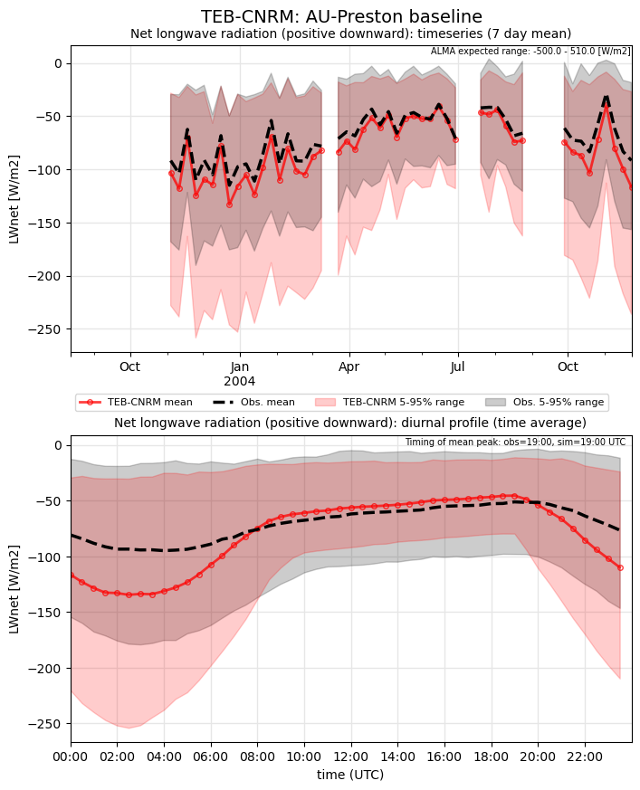](TEB-CNRM_AU-Preston_baseline_LWnet.png)

### baseline_LWup

### baseline_Qh
[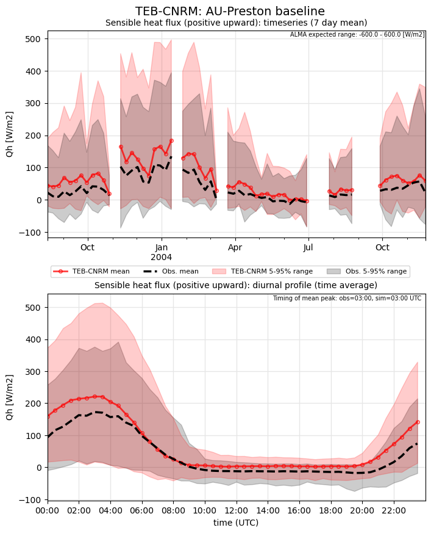](TEB-CNRM_AU-Preston_baseline_Qh.png)

### baseline_Qle
[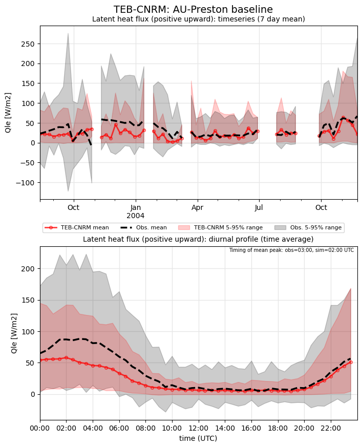](TEB-CNRM_AU-Preston_baseline_Qle.png)

### baseline_SWnet
[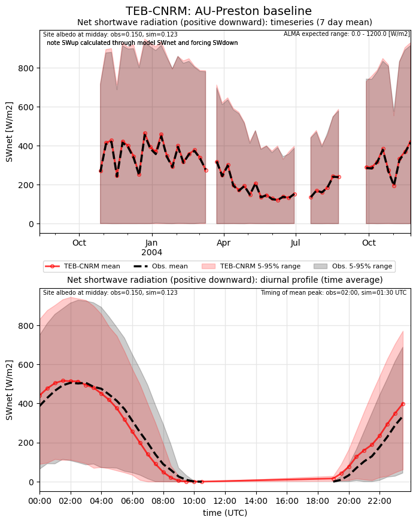](TEB-CNRM_AU-Preston_baseline_SWnet.png)

### baseline_SWnet_ts
[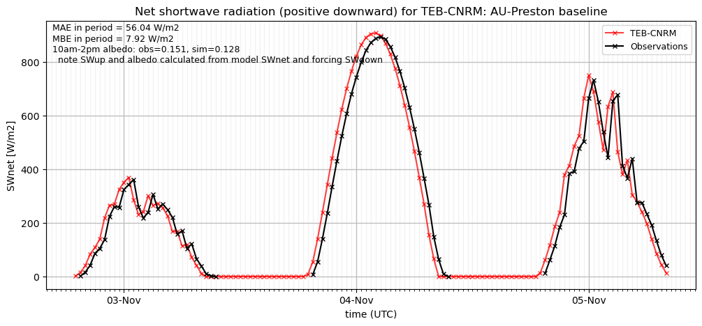](TEB-CNRM_AU-Preston_baseline_SWnet_ts.png)

### baseline_SWup
[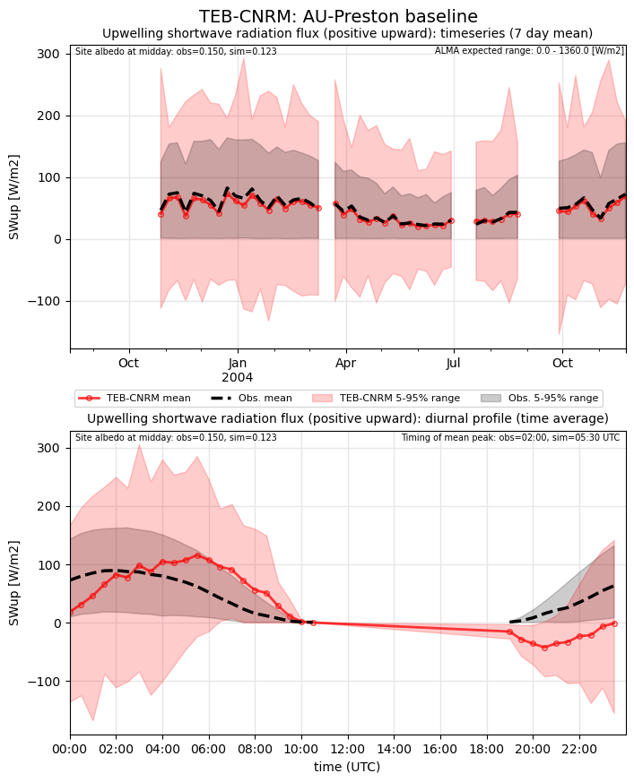](TEB-CNRM_AU-Preston_baseline_SWup.png)

### baseline_SWup_ts
[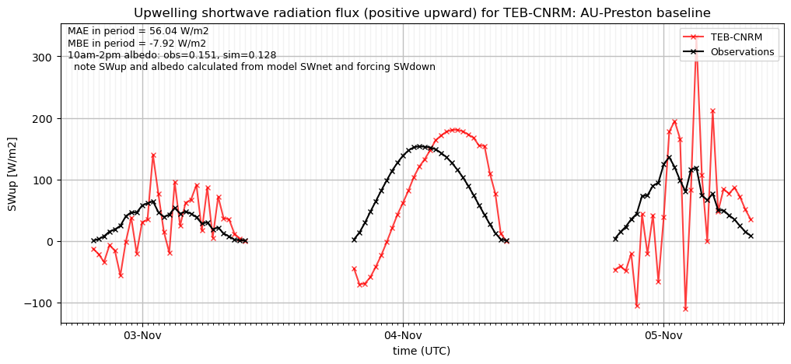](TEB-CNRM_AU-Preston_baseline_SWup_ts.png)

### baseline_closure
[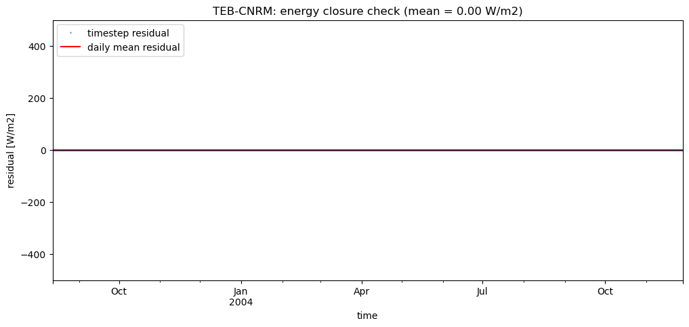](TEB-CNRM_AU-Preston_baseline_closure.png)

### detailed_LWnet
[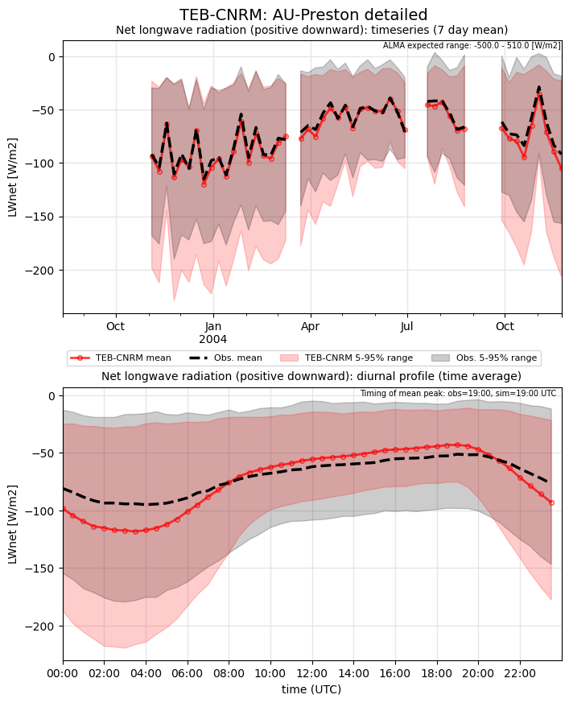](TEB-CNRM_AU-Preston_detailed_LWnet.png)

### detailed_LWup
[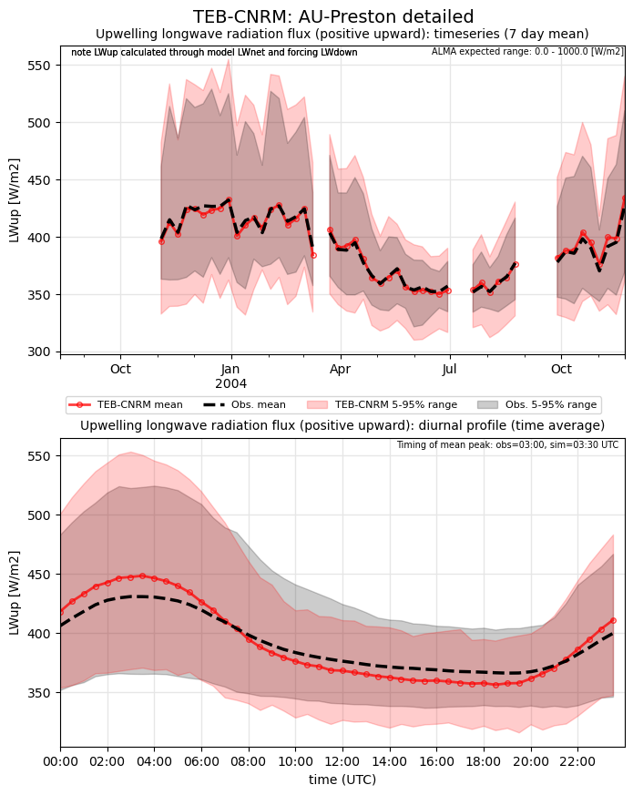](TEB-CNRM_AU-Preston_detailed_LWup.png)

### detailed_Qh
[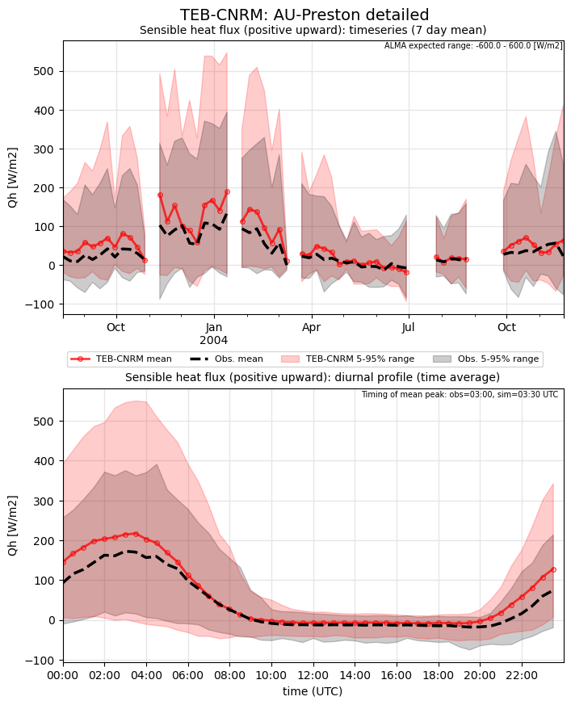](TEB-CNRM_AU-Preston_detailed_Qh.png)

### detailed_Qle
[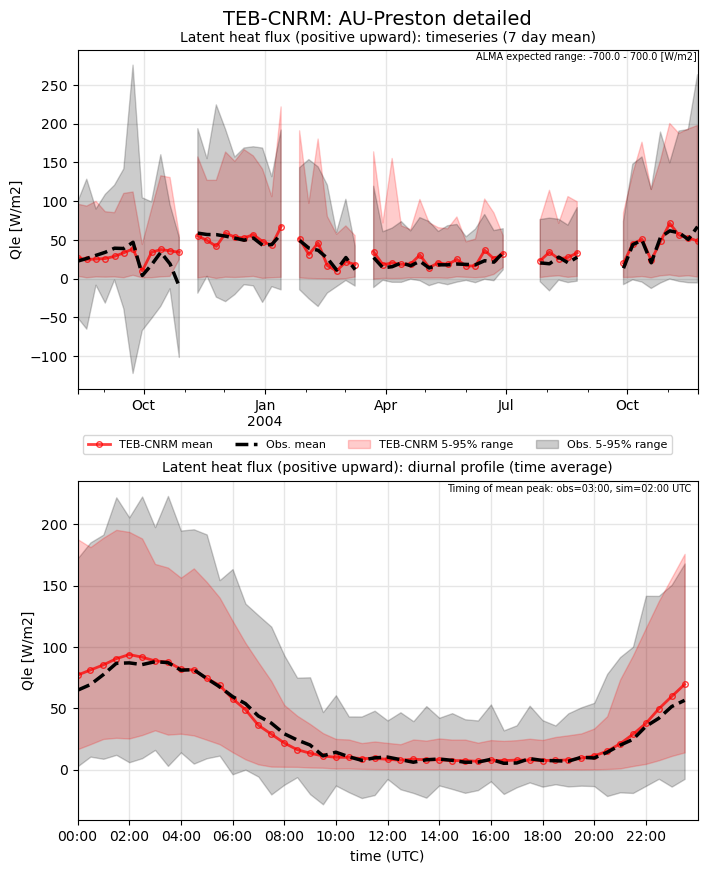](TEB-CNRM_AU-Preston_detailed_Qle.png)

### detailed_SWnet
[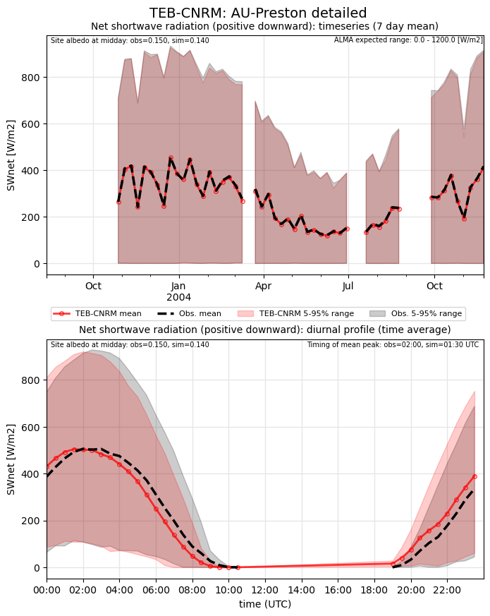](TEB-CNRM_AU-Preston_detailed_SWnet.png)

### detailed_SWnet_ts
[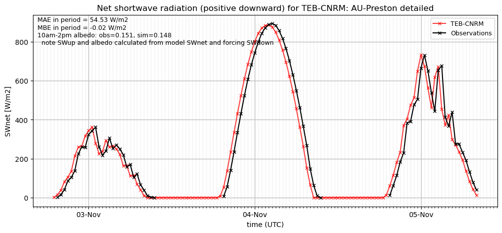](TEB-CNRM_AU-Preston_detailed_SWnet_ts.png)

### detailed_SWup
[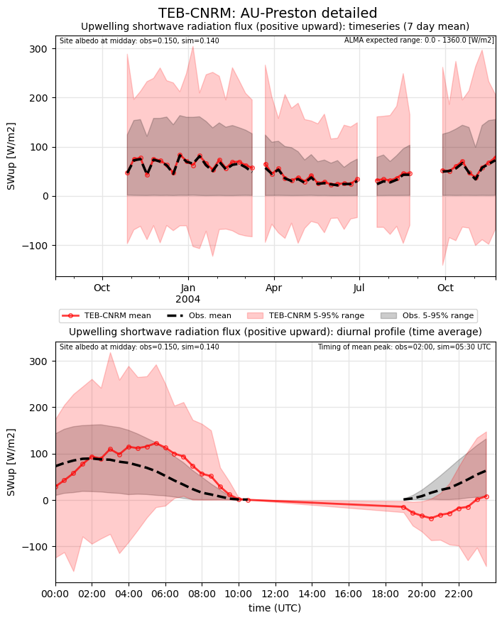](TEB-CNRM_AU-Preston_detailed_SWup.png)

### detailed_SWup_ts
[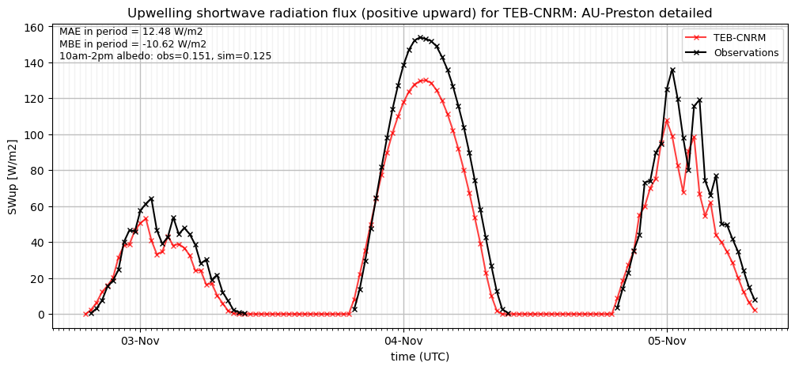](TEB-CNRM_AU-Preston_detailed_SWup_ts.png)

### detailed_closure

### out of range: baseline

 - TEB-CNRM SWup min value of -422.2044 is less than expected 0.0 [W/m2]
 - TEB-CNRM Qanth_Qle max value of 1067.2183 is greater than expected 1000.0 [W/m2]
 - TEB-CNRM Qanth_Qle min value of -97.7584 is less than expected 0.0 [W/m2]
 - TEB-CNRM RoofSurfT max value of 343.1270 is greater than expected 343.0 [K]
 - TEB-CNRM ESoil max value of 825.4787 is greater than expected 0.0003 [kg/m2/s]
 - TEB-CNRM ESoil min value of -4.0382 is less than expected -0.0003 [kg/m2/s]
 - TEB-CNRM alb min value of -1.0000 is less than expected 0.0 [1]

### out of range: detailed

 - TEB-CNRM Qanth min value of -2.7572 is less than expected 0.0 [W/m2]
 - TEB-CNRM SWup min value of -408.3740 is less than expected 0.0 [W/m2]
 - TEB-CNRM Qanth_Qle min value of -50.3338 is less than expected 0.0 [W/m2]
 - TEB-CNRM RoofSurfT max value of 343.1945 is greater than expected 343.0 [K]
 - TEB-CNRM TVeg max value of 240.2591 is greater than expected 0.0003 [kg/m2/s]
 - TEB-CNRM ESoil max value of 646.0301 is greater than expected 0.0003 [kg/m2/s]
 - TEB-CNRM alb min value of -0.9997 is less than expected 0.0 [1]

