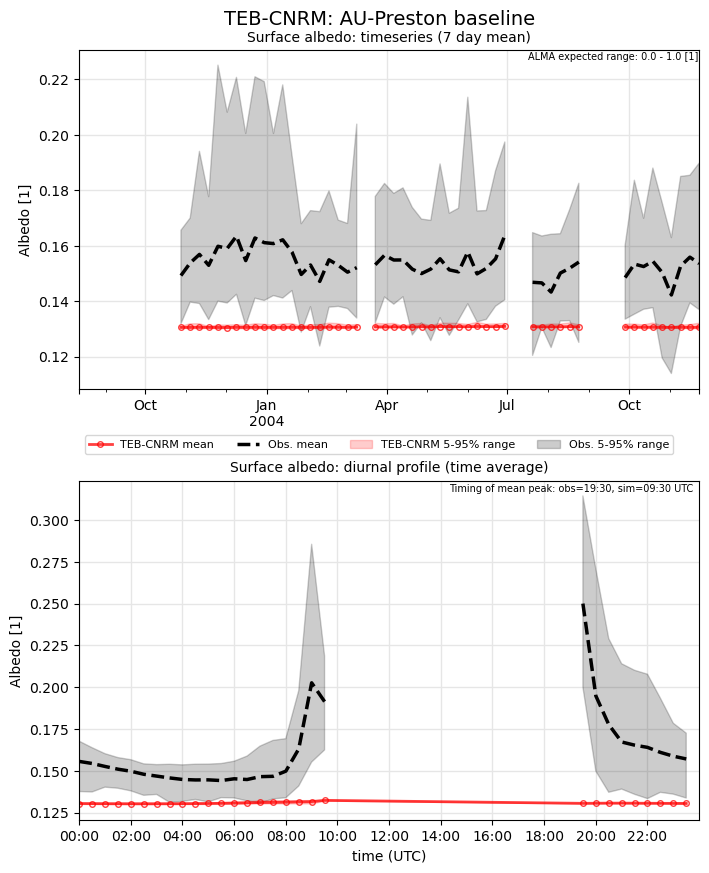
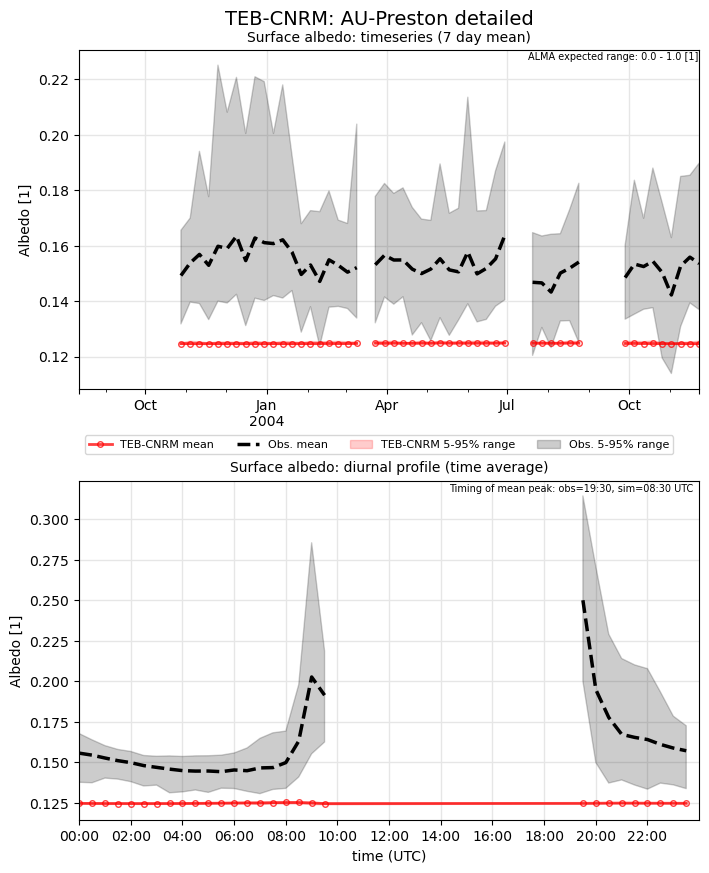

# AU-Preston: TEB-CNRM

**NOTE:** *Results presented here are highly dependent on how models are configured in this experiment and may be subject to variable output formatting errors. Results are not intended to indicate the quality of any individual model, but to help participants better understand and improve modelling approaches in different urban environments.*

### Error metrics

| flux   | experiment   |   MAE |     MBE |    NSD |      R |
|:-------|:-------------|------:|--------:|-------:|-------:|
| SWnet  | baseline     | 59.95 |   6.889 | 0.8902 | 0.9532 |
| SWnet  | detailed     | 60.35 |   8.868 | 0.8961 | 0.9532 |
| LWnet  | baseline     | 19.99 | -10.258 | 1.2334 | 0.904  |
| LWnet  | detailed     | 14.67 |  -3.514 | 1.073  | 0.9296 |
| Qle    | baseline     | 28.42 |  -5.373 | 0.7508 | 0.4514 |
| Qle    | detailed     | 31.91 |   2.739 | 0.9913 | 0.4681 |
| Qh     | baseline     | 38.31 |  27.971 | 1.2621 | 0.9076 |
| Qh     | detailed     | 34.32 |  19.931 | 1.3234 | 0.9048 |

### jump to figure:
 - [baseline_Albedo](#baseline_albedo)
 - [baseline_LWnet](#baseline_lwnet)
 - [baseline_LWup](#baseline_lwup)
 - [baseline_Qh](#baseline_qh)
 - [baseline_Qle](#baseline_qle)
 - [baseline_SWnet](#baseline_swnet)
 - [baseline_SWnet_ts](#baseline_swnet_ts)
 - [baseline_SWup](#baseline_swup)
 - [baseline_SWup_ts](#baseline_swup_ts)
 - [baseline_closure](#baseline_closure)
 - [detailed_Albedo](#detailed_albedo)
 - [detailed_LWnet](#detailed_lwnet)
 - [detailed_LWup](#detailed_lwup)
 - [detailed_Qh](#detailed_qh)
 - [detailed_Qle](#detailed_qle)
 - [detailed_SWnet](#detailed_swnet)
 - [detailed_SWnet_ts](#detailed_swnet_ts)
 - [detailed_SWup](#detailed_swup)
 - [detailed_SWup_ts](#detailed_swup_ts)
 - [detailed_closure](#detailed_closure)

### baseline_Albedo

### baseline_LWnet

### baseline_LWup

### baseline_Qh

### baseline_Qle

### baseline_SWnet

### baseline_SWnet_ts

### baseline_SWup

### baseline_SWup_ts

### baseline_closure

### detailed_Albedo

### detailed_LWnet

### detailed_LWup

### detailed_Qh

### detailed_Qle

### detailed_SWnet

### detailed_SWnet_ts

### detailed_SWup

### detailed_SWup_ts

### detailed_closure

### out of range: baseline

 - TEB-CNRM RoofSurfT max value of 344.2134 is greater than expected 343.0 [K]
 - TEB-CNRM TVeg max value of 984.8440 is greater than expected 0.0003 [kg/m2/s]
 - TEB-CNRM TVeg min value of -10.3352 is less than expected -0.0003 [kg/m2/s]
 - TEB-CNRM ESoil max value of 287.4421 is greater than expected 0.0003 [kg/m2/s]
 - TEB-CNRM ESoil min value of -11.0394 is less than expected -0.0003 [kg/m2/s]
 - TEB-CNRM SoilWet max value of 1.6046 is greater than expected 1.2 [1]
 - TEB-CNRM SoilWet min value of -0.9886 is less than expected -0.2 [1]

### out of range: detailed

 - TEB-CNRM Qh max value of 627.8499 is greater than expected 600.0 [W/m2]
 - TEB-CNRM Qanth min value of -2.6313 is less than expected 0.0 [W/m2]
 - TEB-CNRM RoofSurfT max value of 344.0882 is greater than expected 343.0 [K]
 - TEB-CNRM TVeg max value of 853.2150 is greater than expected 0.0003 [kg/m2/s]
 - TEB-CNRM TVeg min value of -4.5558 is less than expected -0.0003 [kg/m2/s]
 - TEB-CNRM ESoil max value of 196.2109 is greater than expected 0.0003 [kg/m2/s]
 - TEB-CNRM ESoil min value of -8.7227 is less than expected -0.0003 [kg/m2/s]
 - TEB-CNRM SoilWet max value of 1.6163 is greater than expected 1.2 [1]
 - TEB-CNRM SoilWet min value of -1.0063 is less than expected -0.2 [1]

