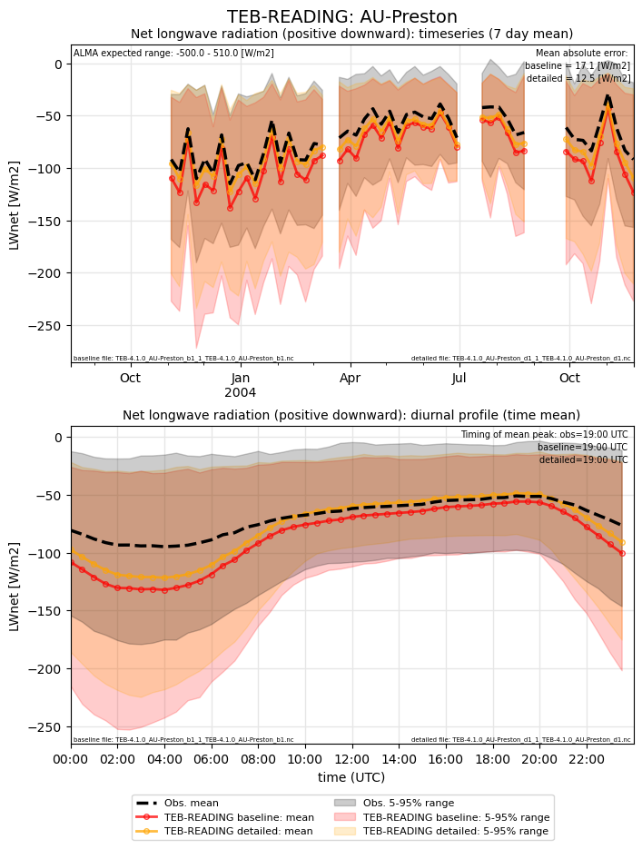
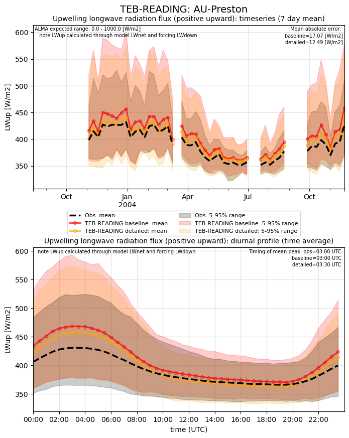
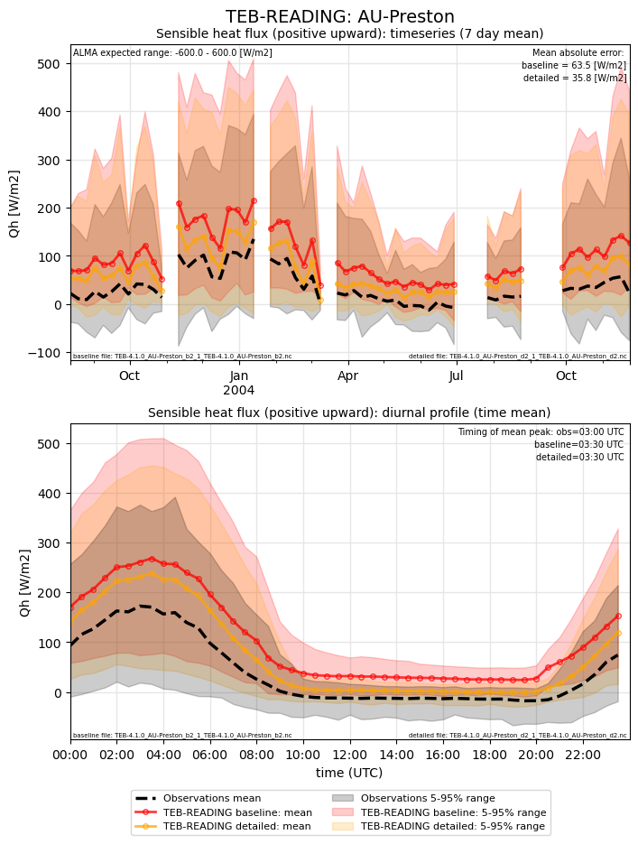
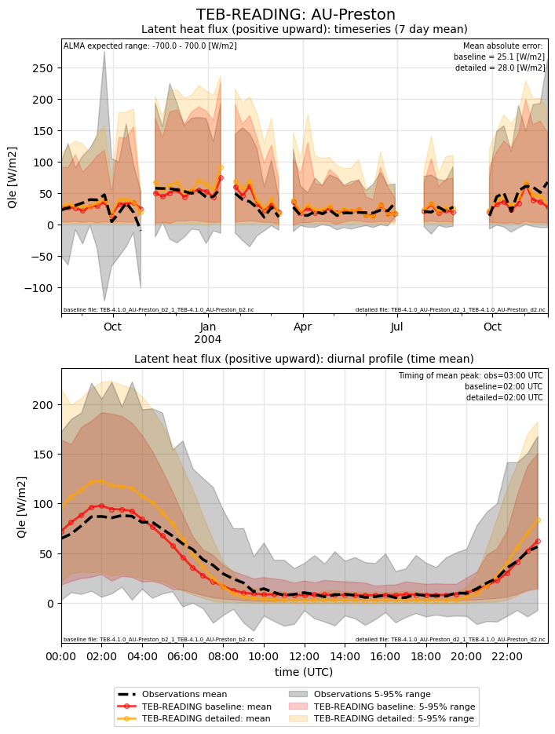
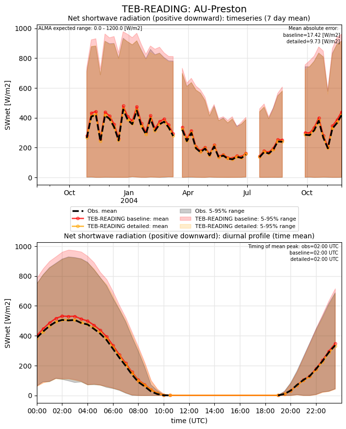
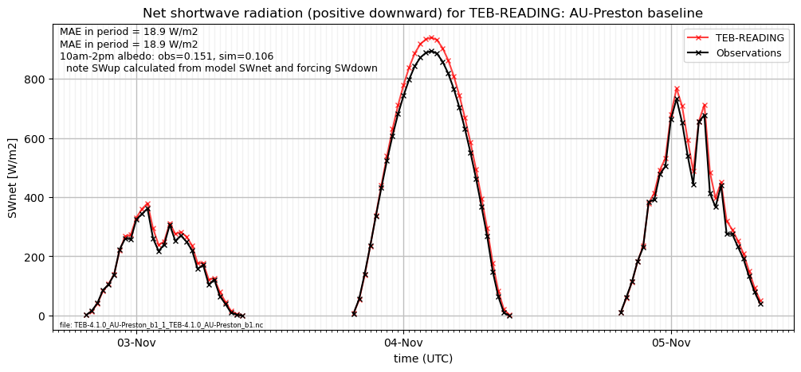
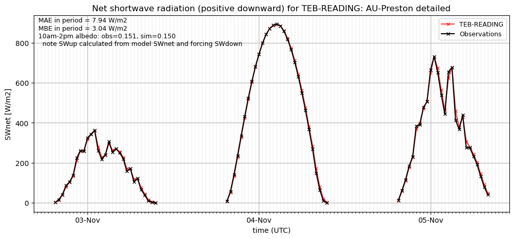
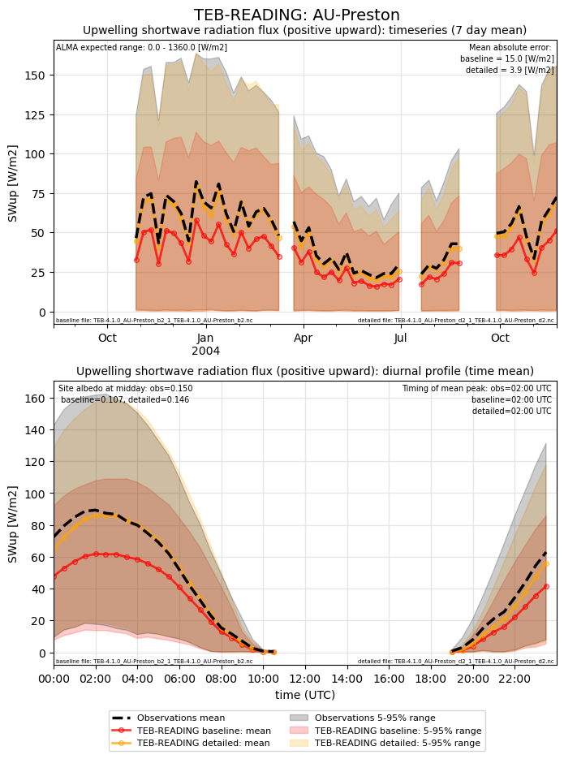
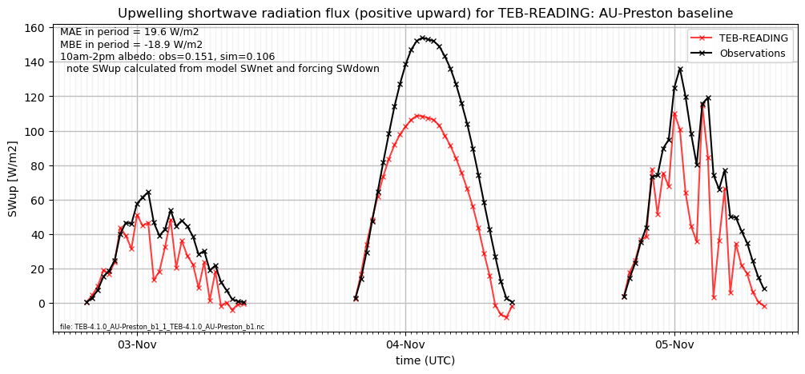
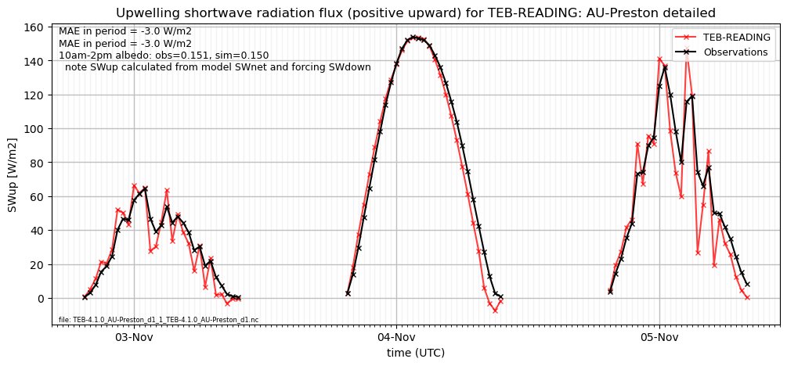

# AU-Preston: TEB-READING

**NOTE:** *Results presented here are highly dependent on how models are configured in this experiment and may be subject to variable output formatting errors. Results are not intended to indicate the quality of any individual model, but to help participants better understand and improve modelling approaches in different urban environments.*

### Error metrics

| flux   | experiment   |      MAE |        MBE |      NSD |        R |
|:-------|:-------------|---------:|-----------:|---------:|---------:|
| SWnet  | baseline     | 17.4168  |  15.2596   | 0.913622 | 0.99849  |
| SWnet  | detailed     |  9.73176 |   2.20585  | 0.872732 | 0.99852  |
| LWnet  | baseline     | 17.0705  | -16.6731   | 1.20362  | 0.962853 |
| LWnet  | detailed     | 12.4947  |  -7.86715  | 1.08923  | 0.959218 |
| Qle    | baseline     | 24.7326  |  -0.377787 | 0.836377 | 0.631247 |
| Qle    | detailed     | 27.8374  |   5.30165  | 1.08347  | 0.642714 |
| Qh     | baseline     | 62.7813  |  61.628    | 1.21425  | 0.932716 |
| Qh     | detailed     | 35.2352  |  31.462    | 1.18747  | 0.940139 |

 - MAE: mean absolute error (close to 0 is better)
 - NME: absolute mean error normalised by difference from mean  (closer to 0 is better)
 - MBE: mean bias error (close to 0 is better)
 - NSD: ratio of model to obs standard deviation (close to 1 is better)
 - R: Pearson's correlation (close to 1 is better)

### jump to figure:
 - [LWnet](#lwnet)
 - [LWup](#lwup)
 - [Qh](#qh)
 - [Qle](#qle)
 - [SWnet](#swnet)
 - [SWnet_subset_baseline](#swnet_subset_baseline)
 - [SWnet_subset_detailed](#swnet_subset_detailed)
 - [SWup](#swup)
 - [SWup_subset_baseline](#swup_subset_baseline)
 - [SWup_subset_detailed](#swup_subset_detailed)
 - [closure_baseline](#closure_baseline)
 - [closure_detailed](#closure_detailed)

[Link to variable definitions](../modelattrs/variable_definitions.md)

### LWnet

### LWup

### Qh

### Qle

### SWnet

### SWnet_subset_baseline

### SWnet_subset_detailed

### SWup

### SWup_subset_baseline

### SWup_subset_detailed

### closure_baseline

### closure_detailed

### out of range: baseline

 - TEB-READING SWup min value of -92.3008 is less than expected 0.0 [W/m2]
 - TEB-READING alb min value of -0.8127 is less than expected 0.0 [1]

### out of range: detailed

 - TEB-READING SWup min value of -81.1769 is less than expected 0.0 [W/m2]
 - TEB-READING alb min value of -0.7382 is less than expected 0.0 [1]

[Link to variable definitions](../modelattrs/variable_definitions.md)

