# AU-Preston: TEB-READING

**NOTE:** *Results presented here are highly dependent on how models are configured in this experiment and may be subject to variable output formatting errors. Results are not intended to indicate the quality of any individual model, but to help participants better understand and improve modelling approaches in different urban environments.*

### Error metrics

| flux   | experiment   |   MAE |     MBE |    NSD |      R |
|:-------|:-------------|------:|--------:|-------:|-------:|
| SWnet  | baseline     | 17.42 |  15.262 | 0.9136 | 0.9985 |
| SWnet  | detailed     |  9.73 |   2.205 | 0.8727 | 0.9985 |
| LWnet  | baseline     | 17.07 | -16.673 | 1.2036 | 0.9629 |
| LWnet  | detailed     | 12.49 |  -7.867 | 1.0892 | 0.9592 |
| Qle    | baseline     | 24.74 |  -0.424 | 0.8361 | 0.6311 |
| Qle    | detailed     | 27.86 |   5.24  | 1.0831 | 0.642  |
| Qh     | baseline     | 62.79 |  61.64  | 1.2141 | 0.9327 |
| Qh     | detailed     | 35.25 |  31.477 | 1.1873 | 0.9401 |

### jump to figure:
 - [baseline_LWnet](#baseline_lwnet)
 - [baseline_LWup](#baseline_lwup)
 - [baseline_Qh](#baseline_qh)
 - [baseline_Qle](#baseline_qle)
 - [baseline_SWnet](#baseline_swnet)
 - [baseline_SWnet_ts](#baseline_swnet_ts)
 - [baseline_SWup](#baseline_swup)
 - [baseline_SWup_ts](#baseline_swup_ts)
 - [baseline_closure](#baseline_closure)
 - [detailed_LWnet](#detailed_lwnet)
 - [detailed_LWup](#detailed_lwup)
 - [detailed_Qh](#detailed_qh)
 - [detailed_Qle](#detailed_qle)
 - [detailed_SWnet](#detailed_swnet)
 - [detailed_SWnet_ts](#detailed_swnet_ts)
 - [detailed_SWup](#detailed_swup)
 - [detailed_SWup_ts](#detailed_swup_ts)
 - [detailed_closure](#detailed_closure)

### baseline_LWnet
[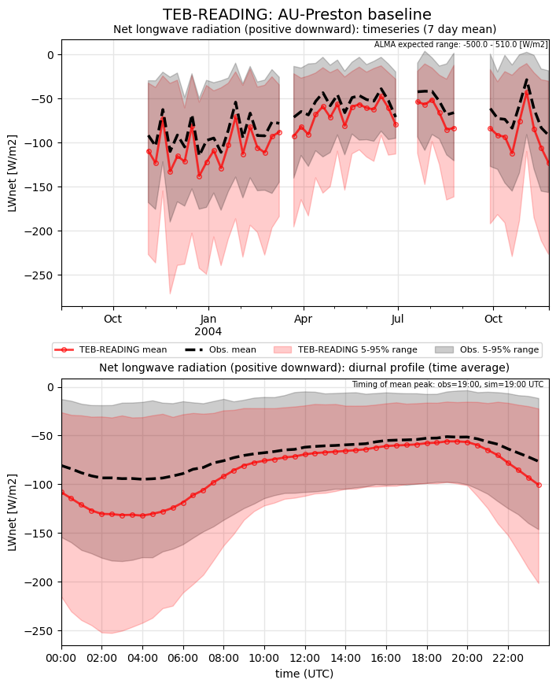](TEB-READING_AU-Preston_baseline_LWnet.png)

### baseline_LWup
[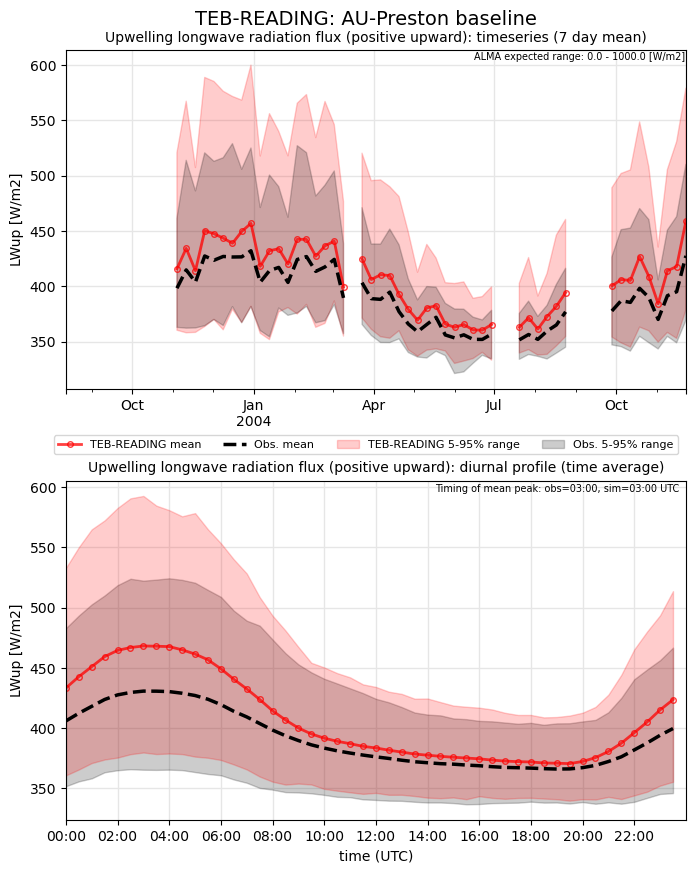](TEB-READING_AU-Preston_baseline_LWup.png)

### baseline_Qh
[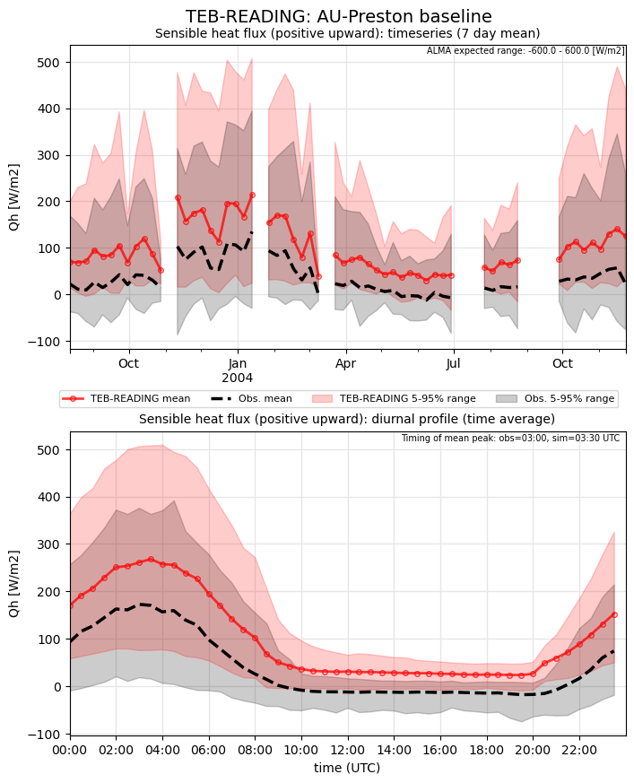](TEB-READING_AU-Preston_baseline_Qh.png)

### baseline_Qle
[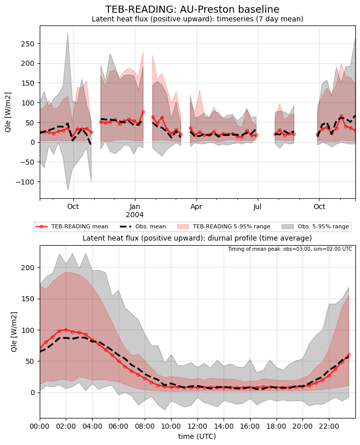](TEB-READING_AU-Preston_baseline_Qle.png)

### baseline_SWnet
[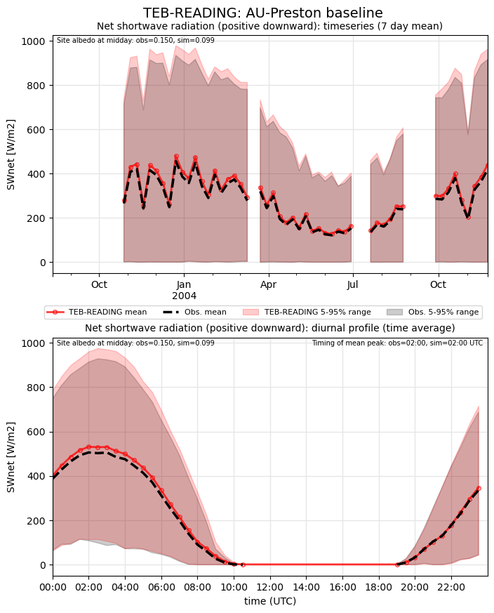](TEB-READING_AU-Preston_baseline_SWnet.png)

### baseline_SWnet_ts
[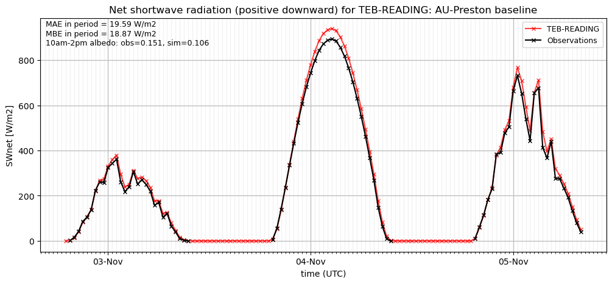](TEB-READING_AU-Preston_baseline_SWnet_ts.png)

### baseline_SWup
[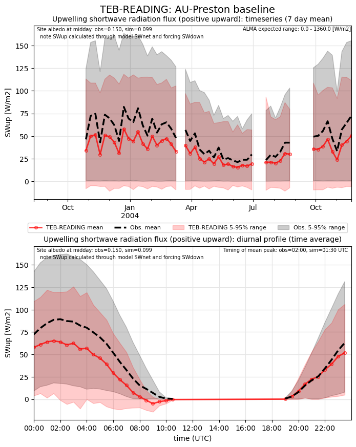](TEB-READING_AU-Preston_baseline_SWup.png)

### baseline_SWup_ts
[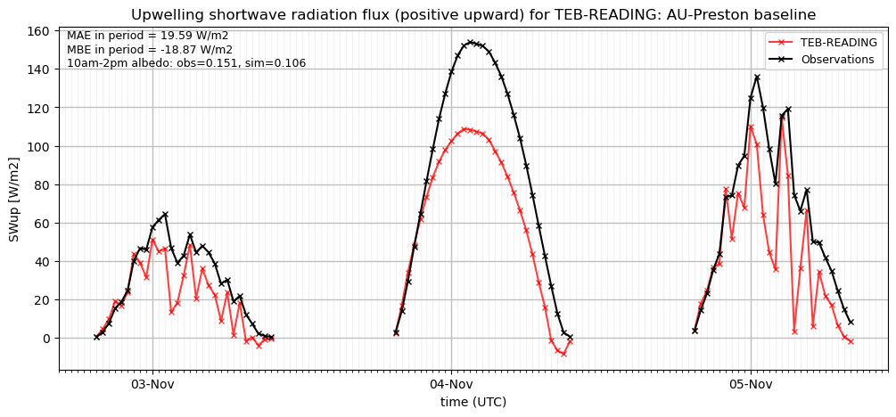](TEB-READING_AU-Preston_baseline_SWup_ts.png)

### baseline_closure
[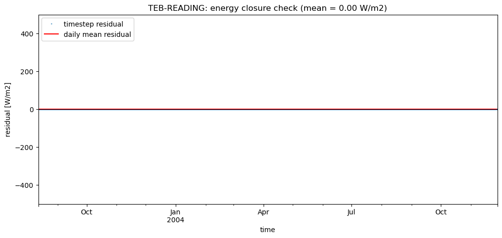](TEB-READING_AU-Preston_baseline_closure.png)

### detailed_LWnet
[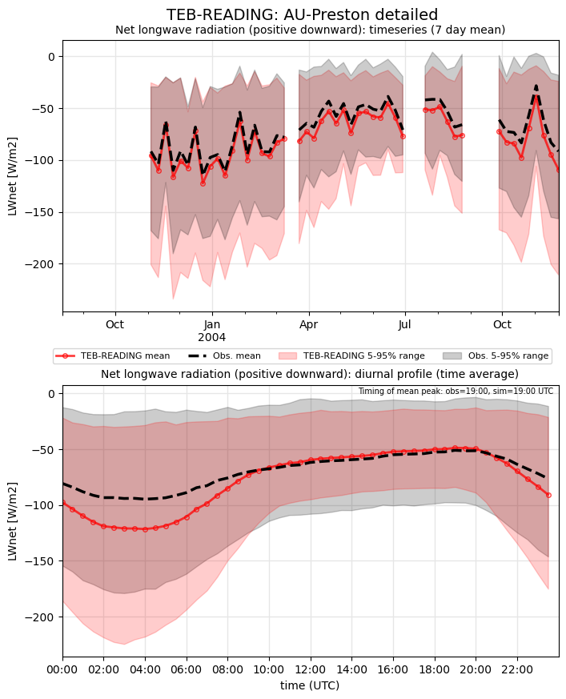](TEB-READING_AU-Preston_detailed_LWnet.png)

### detailed_LWup
[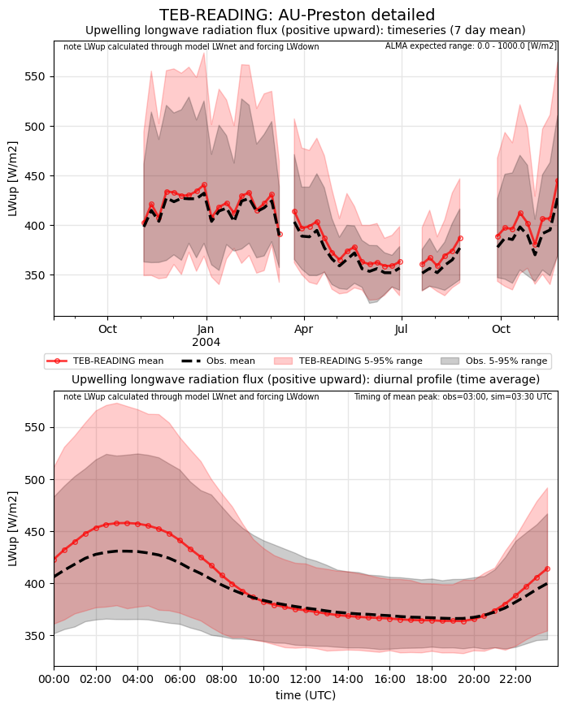](TEB-READING_AU-Preston_detailed_LWup.png)

### detailed_Qh
[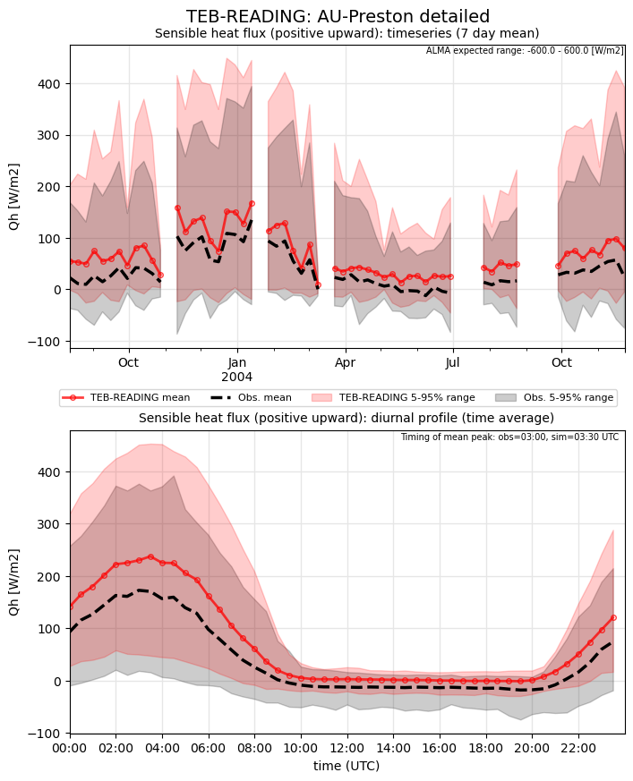](TEB-READING_AU-Preston_detailed_Qh.png)

### detailed_Qle
[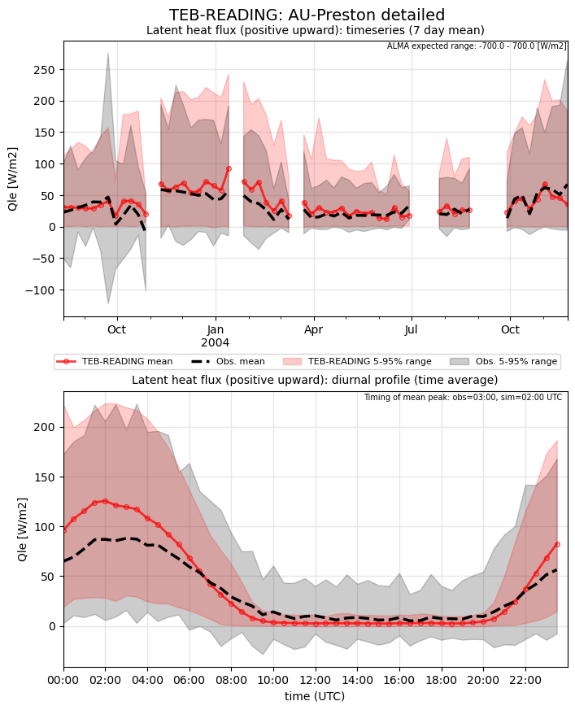](TEB-READING_AU-Preston_detailed_Qle.png)

### detailed_SWnet
[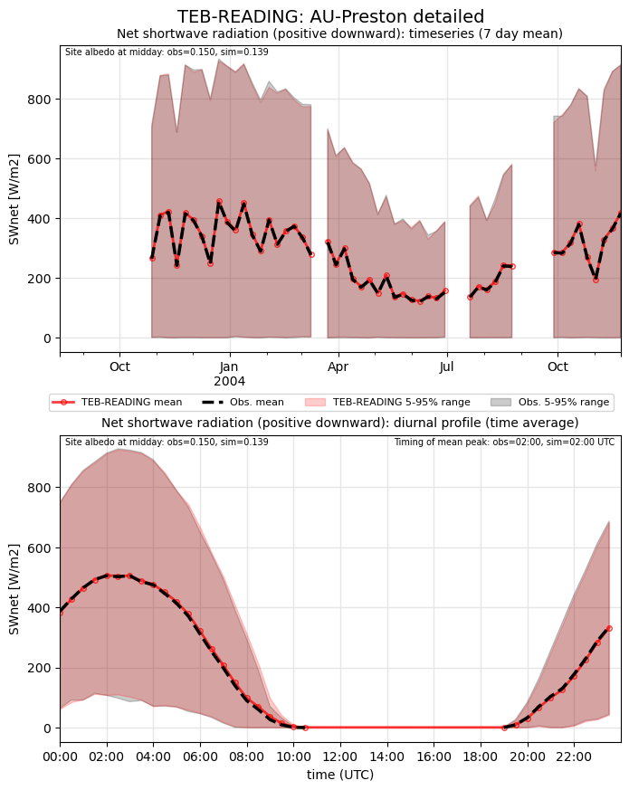](TEB-READING_AU-Preston_detailed_SWnet.png)

### detailed_SWnet_ts
[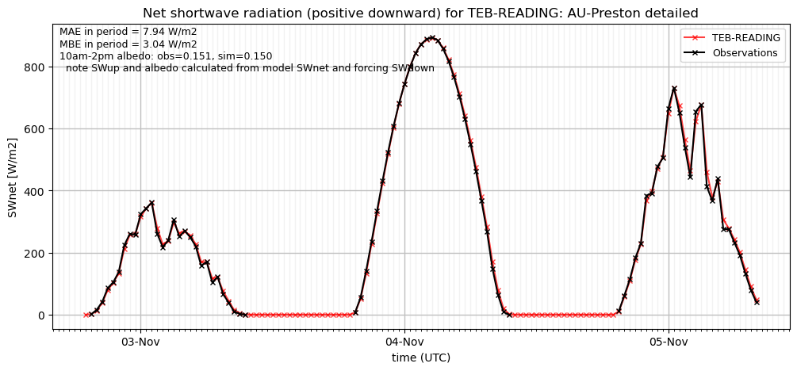](TEB-READING_AU-Preston_detailed_SWnet_ts.png)

### detailed_SWup
[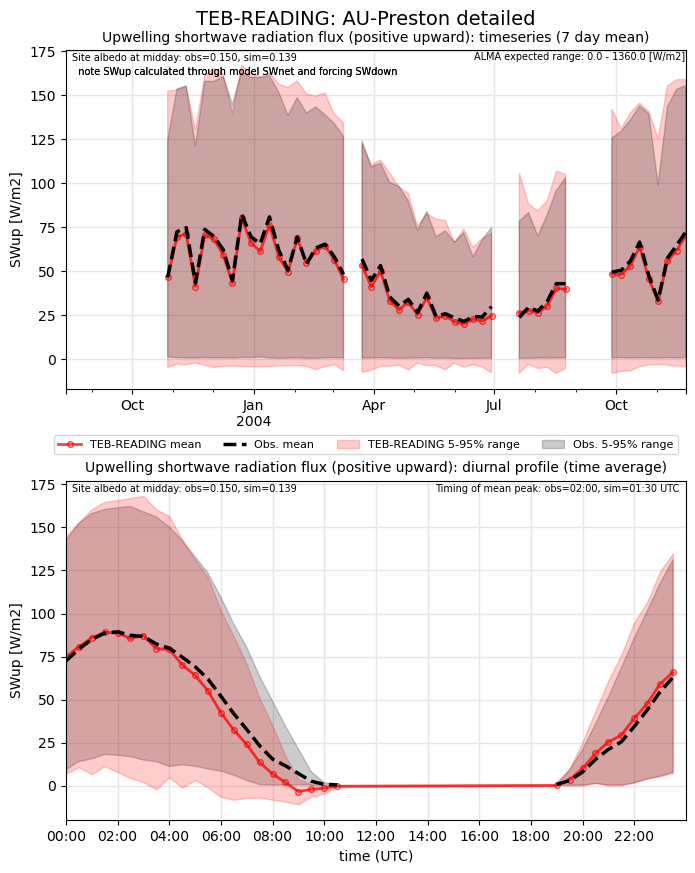](TEB-READING_AU-Preston_detailed_SWup.png)

### detailed_SWup_ts
[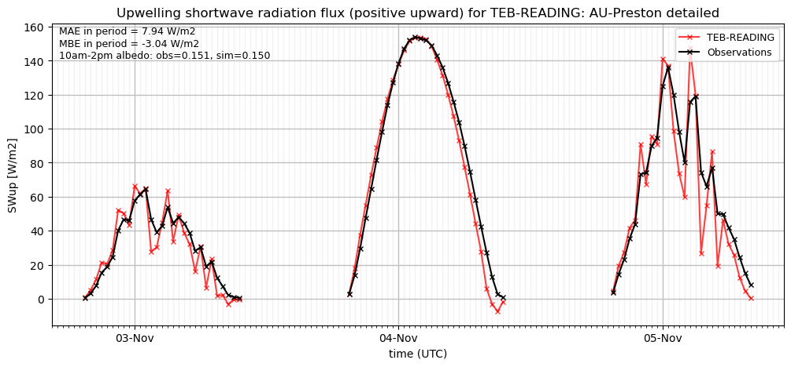](TEB-READING_AU-Preston_detailed_SWup_ts.png)

### detailed_closure

### out of range: baseline

 - TEB-READING SWup value of -446.8446 is less than expected 0.0 [W/m2]
 - TEB-READING RoofSurfT value of 348.9096 is greater than expected 343.0 [K]
 - TEB-READING alb value of -0.9960 is less than expected 0.0 [1]

### out of range: detailed

 - TEB-READING SWup value of -446.8446 is less than expected 0.0 [W/m2]
 - TEB-READING RoofSurfT value of 348.9096 is greater than expected 343.0 [K]
 - TEB-READING alb value of -0.9960 is less than expected 0.0 [1]

