# AU-Preston: TEB-SPARTCS

**NOTE:** *Results presented here are highly dependent on how models are configured in this experiment and may be subject to variable output formatting errors. Results are not intended to indicate the quality of any individual model, but to help participants better understand and improve modelling approaches in different urban environments.*

### Error metrics

| flux   | experiment   |   MAE |     MBE |    NSD |      R |
|:-------|:-------------|------:|--------:|-------:|-------:|
| SWnet  | baseline     | 59.93 |   6.851 | 0.8899 | 0.9532 |
| SWnet  | detailed     | 61.81 |  14.538 | 0.9129 | 0.9532 |
| LWnet  | baseline     | 20.24 | -11.44  | 1.249  | 0.908  |
| LWnet  | detailed     | 16.49 |  -8.994 | 1.1578 | 0.9303 |
| Qle    | baseline     | 28.43 |  -5.36  | 0.752  | 0.4509 |
| Qle    | detailed     | 32.77 |   2.761 | 1.0251 | 0.4611 |
| Qh     | baseline     | 37.82 |  26.871 | 1.2593 | 0.906  |
| Qh     | detailed     | 33.53 |  17.652 | 1.3352 | 0.905  |

### jump to figure:
 - [baseline_Albedo](#baseline_albedo)
 - [baseline_LWnet](#baseline_lwnet)
 - [baseline_LWup](#baseline_lwup)
 - [baseline_Qh](#baseline_qh)
 - [baseline_Qle](#baseline_qle)
 - [baseline_SWnet](#baseline_swnet)
 - [baseline_SWnet_ts](#baseline_swnet_ts)
 - [baseline_SWup](#baseline_swup)
 - [baseline_SWup_ts](#baseline_swup_ts)
 - [baseline_closure](#baseline_closure)
 - [detailed_Albedo](#detailed_albedo)
 - [detailed_LWnet](#detailed_lwnet)
 - [detailed_LWup](#detailed_lwup)
 - [detailed_Qh](#detailed_qh)
 - [detailed_Qle](#detailed_qle)
 - [detailed_SWnet](#detailed_swnet)
 - [detailed_SWnet_ts](#detailed_swnet_ts)
 - [detailed_SWup](#detailed_swup)
 - [detailed_SWup_ts](#detailed_swup_ts)
 - [detailed_closure](#detailed_closure)

### baseline_Albedo
[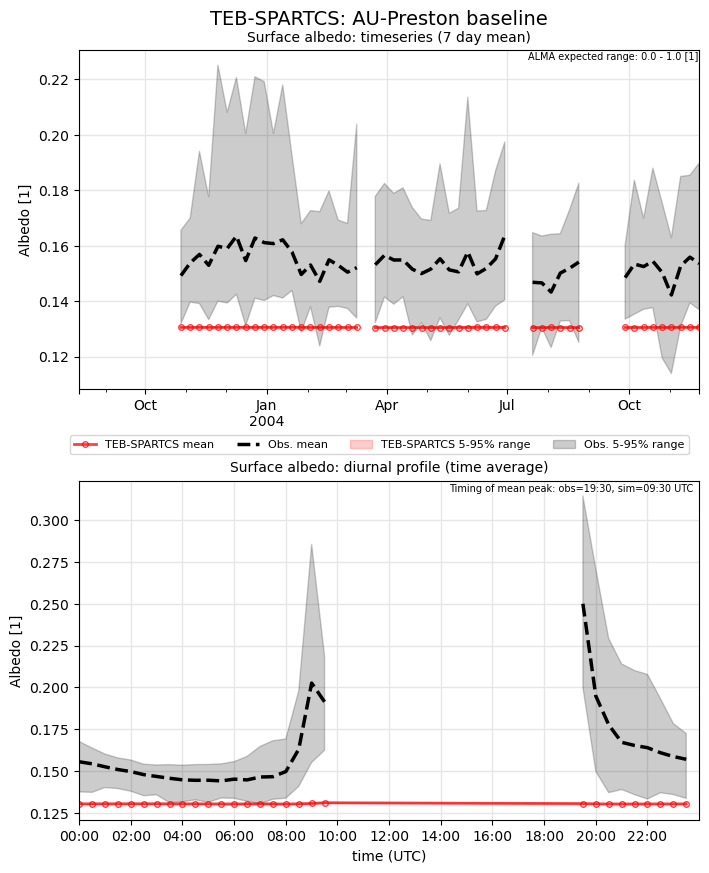](TEB-SPARTCS_AU-Preston_baseline_Albedo.png)

### baseline_LWnet
[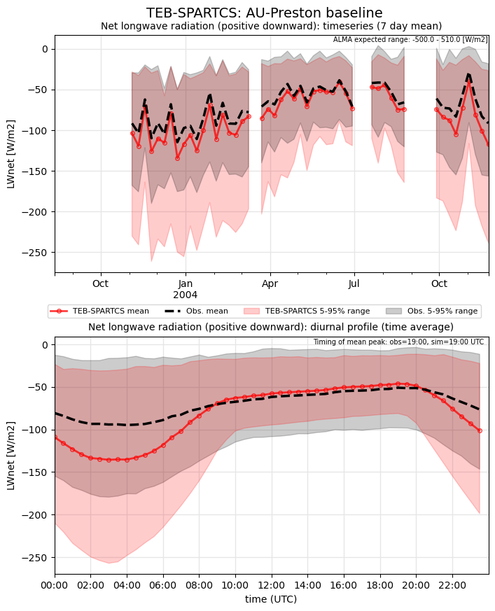](TEB-SPARTCS_AU-Preston_baseline_LWnet.png)

### baseline_LWup
[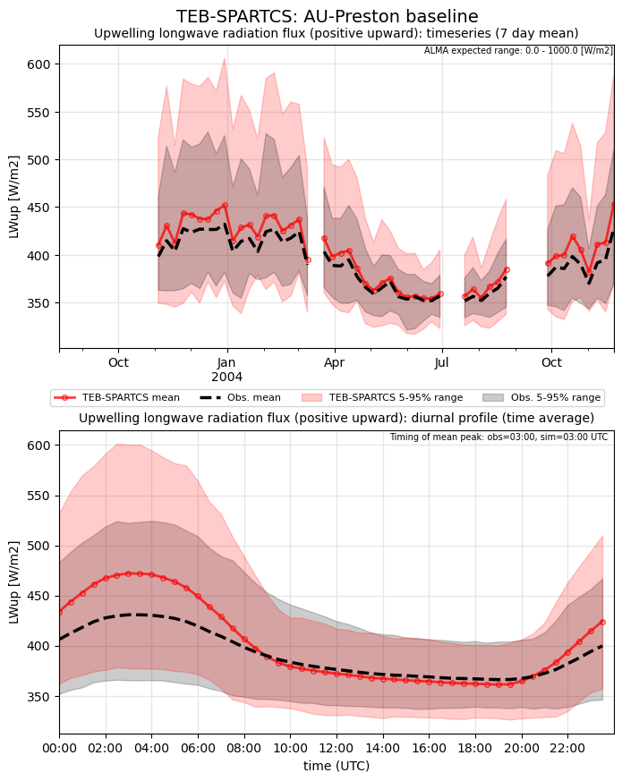](TEB-SPARTCS_AU-Preston_baseline_LWup.png)

### baseline_Qh
[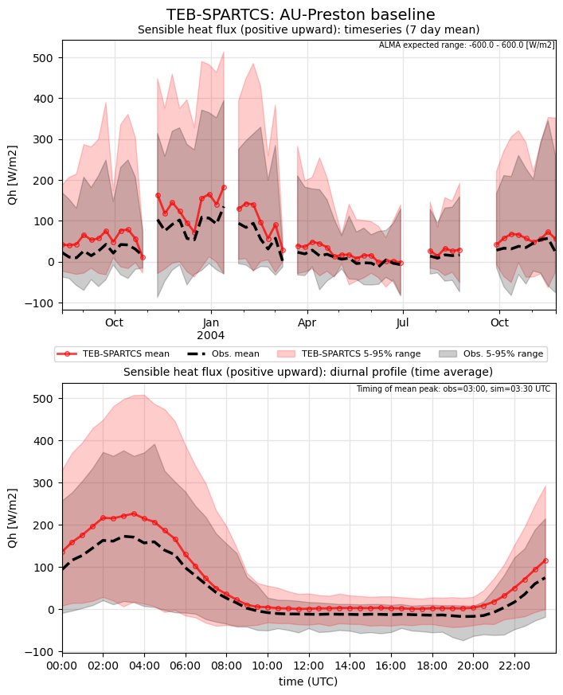](TEB-SPARTCS_AU-Preston_baseline_Qh.png)

### baseline_Qle
[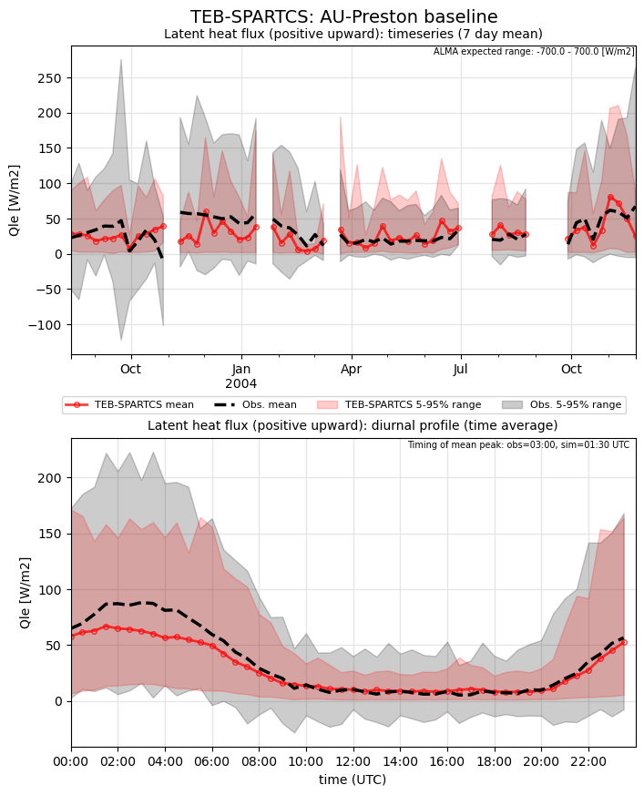](TEB-SPARTCS_AU-Preston_baseline_Qle.png)

### baseline_SWnet
[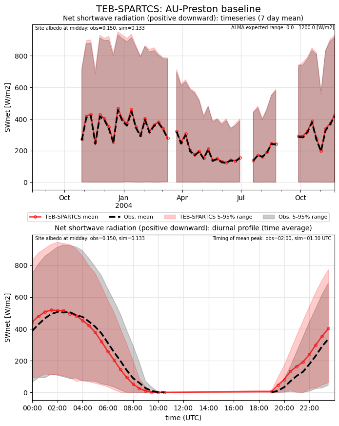](TEB-SPARTCS_AU-Preston_baseline_SWnet.png)

### baseline_SWnet_ts
[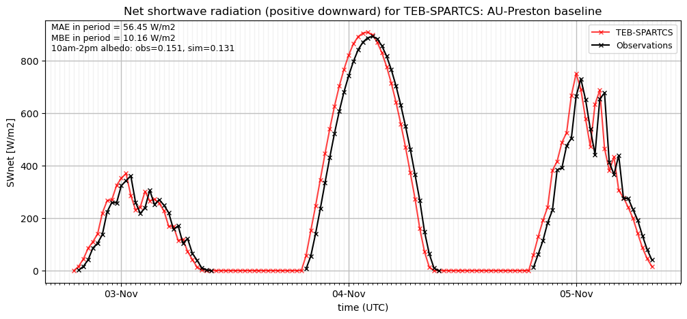](TEB-SPARTCS_AU-Preston_baseline_SWnet_ts.png)

### baseline_SWup
[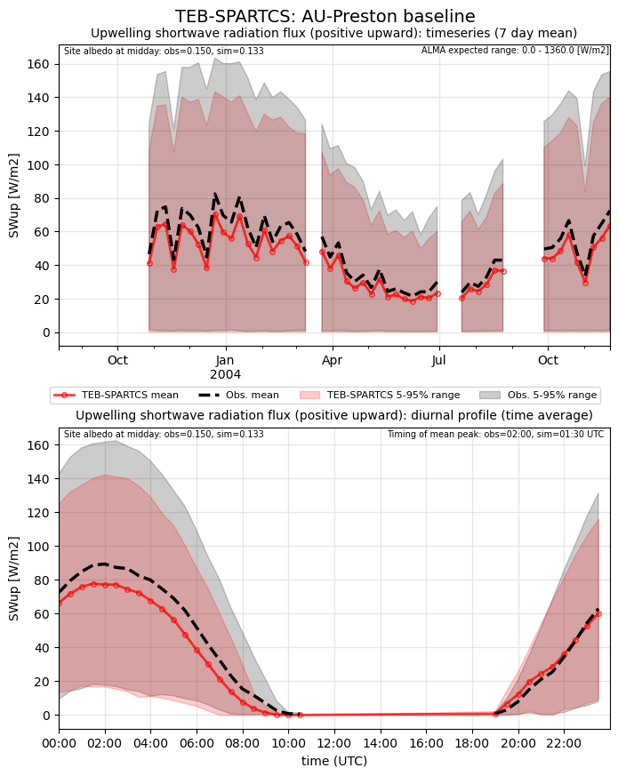](TEB-SPARTCS_AU-Preston_baseline_SWup.png)

### baseline_SWup_ts

### baseline_closure
[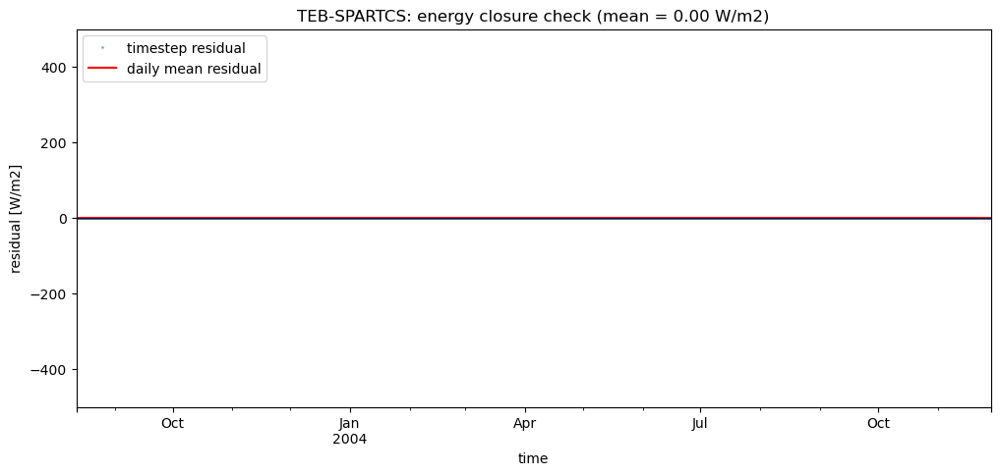](TEB-SPARTCS_AU-Preston_baseline_closure.png)

### detailed_Albedo
[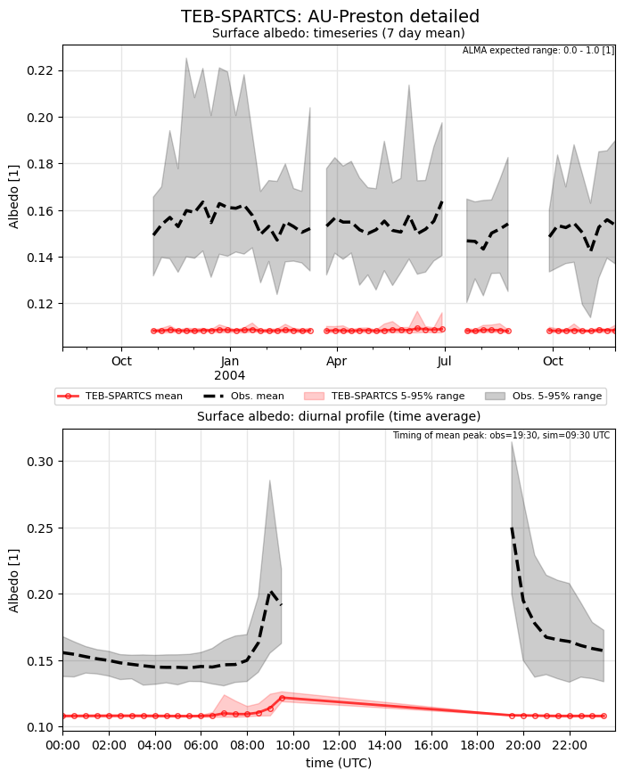](TEB-SPARTCS_AU-Preston_detailed_Albedo.png)

### detailed_LWnet

### detailed_LWup
[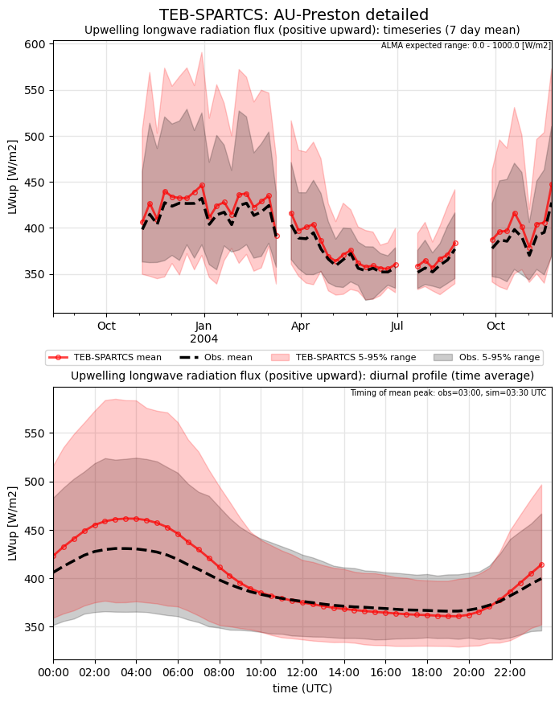](TEB-SPARTCS_AU-Preston_detailed_LWup.png)

### detailed_Qh
[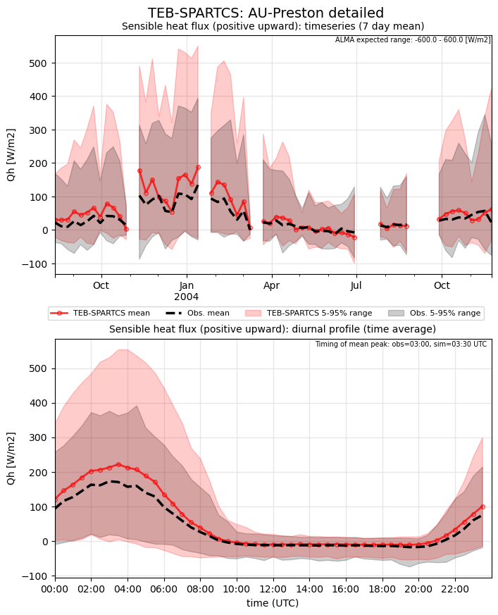](TEB-SPARTCS_AU-Preston_detailed_Qh.png)

### detailed_Qle
[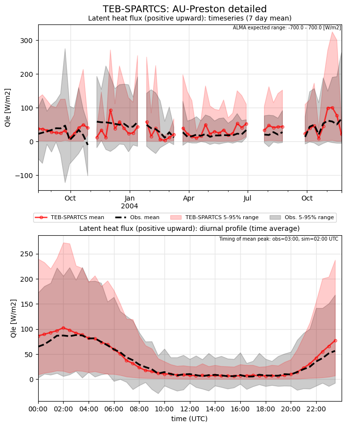](TEB-SPARTCS_AU-Preston_detailed_Qle.png)

### detailed_SWnet
[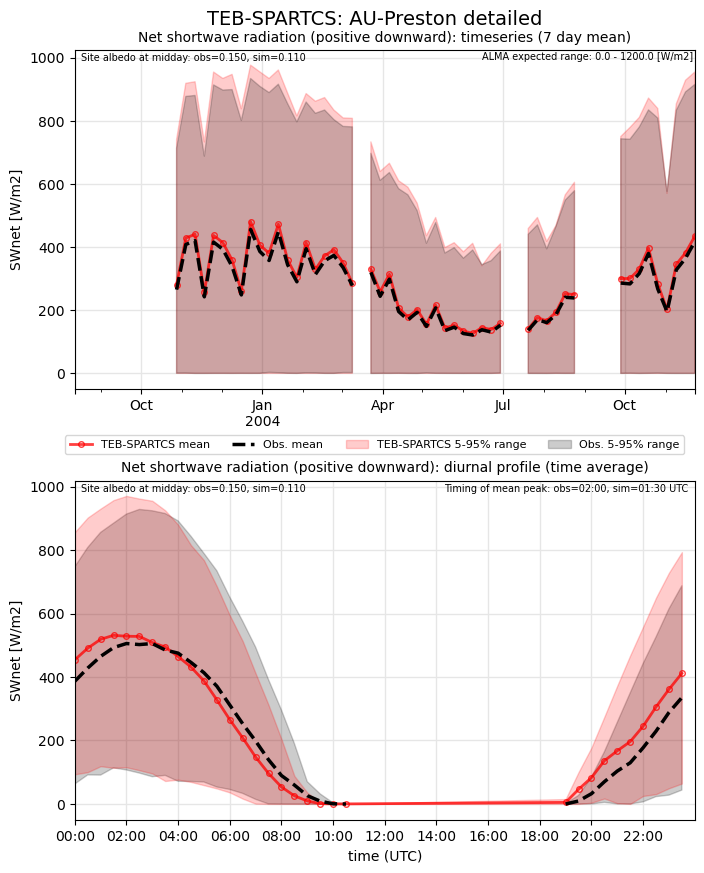](TEB-SPARTCS_AU-Preston_detailed_SWnet.png)

### detailed_SWnet_ts
[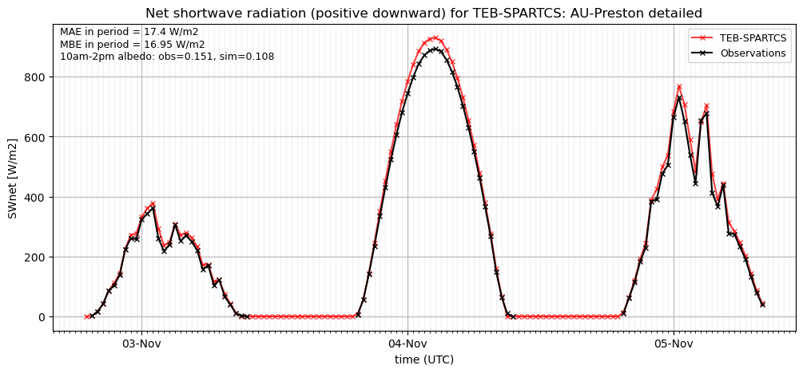](TEB-SPARTCS_AU-Preston_detailed_SWnet_ts.png)

### detailed_SWup
[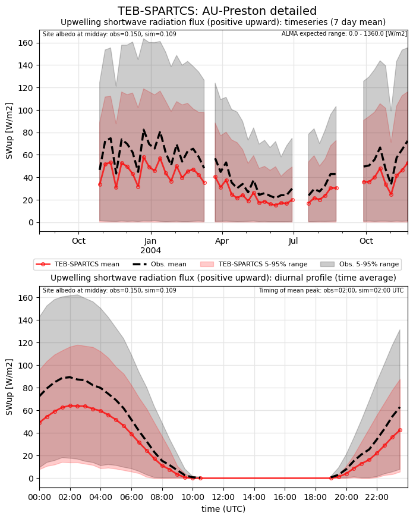](TEB-SPARTCS_AU-Preston_detailed_SWup.png)

### detailed_SWup_ts
[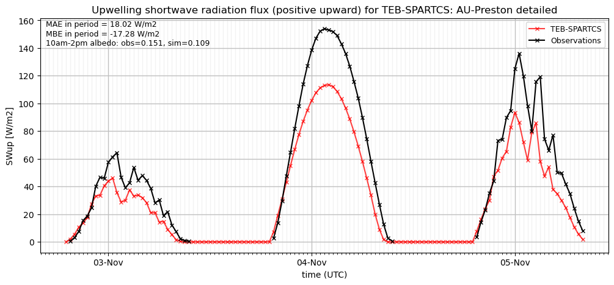](TEB-SPARTCS_AU-Preston_detailed_SWup_ts.png)

### detailed_closure

### out of range: baseline

 - TEB-SPARTCS RoofSurfT max value of 344.2155 is greater than expected 343.0 [K]
 - TEB-SPARTCS TVeg max value of 982.9402 is greater than expected 0.0003 [kg/m2/s]
 - TEB-SPARTCS TVeg min value of -1.0133 is less than expected -0.0003 [kg/m2/s]
 - TEB-SPARTCS ESoil max value of 287.2845 is greater than expected 0.0003 [kg/m2/s]
 - TEB-SPARTCS ESoil min value of -8.6889 is less than expected -0.0003 [kg/m2/s]
 - TEB-SPARTCS SoilWet max value of 1.6046 is greater than expected 1.2 [1]
 - TEB-SPARTCS SoilWet min value of -0.9882 is less than expected -0.2 [1]

### out of range: detailed

 - TEB-SPARTCS Qh max value of 639.9794 is greater than expected 600.0 [W/m2]
 - TEB-SPARTCS Qanth min value of -2.7859 is less than expected 0.0 [W/m2]
 - TEB-SPARTCS RoofSurfT max value of 344.1589 is greater than expected 343.0 [K]
 - TEB-SPARTCS TVeg max value of 930.1982 is greater than expected 0.0003 [kg/m2/s]
 - TEB-SPARTCS TVeg min value of -6.0227 is less than expected -0.0003 [kg/m2/s]
 - TEB-SPARTCS ESoil max value of 189.9445 is greater than expected 0.0003 [kg/m2/s]
 - TEB-SPARTCS ESoil min value of -7.5198 is less than expected -0.0003 [kg/m2/s]
 - TEB-SPARTCS SoilWet max value of 1.6163 is greater than expected 1.2 [1]
 - TEB-SPARTCS SoilWet min value of -1.0033 is less than expected -0.2 [1]

