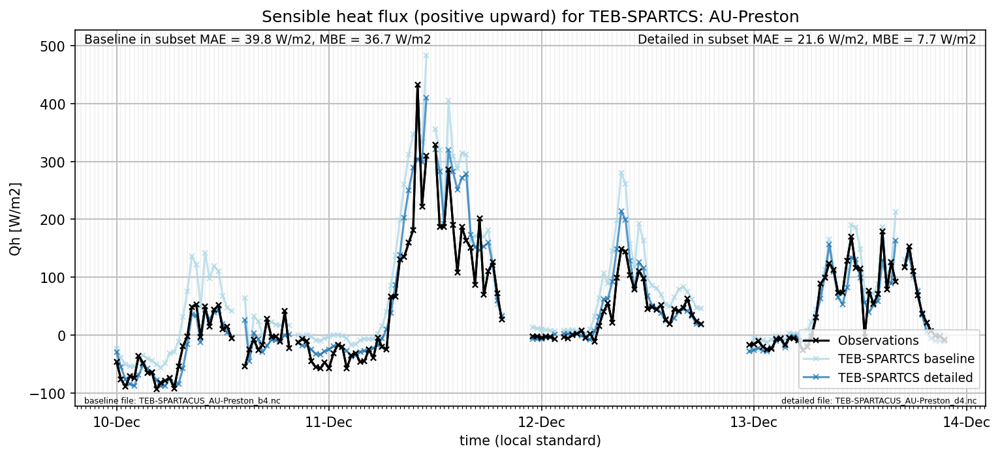

# AU-Preston: TEB-SPARTCS

**NOTE:** *Results presented here are highly dependent on how models are configured in this experiment and may be subject to variable output formatting errors. Results are not intended to indicate the quality of any individual model, but to help participants better understand and improve modelling approaches in different urban environments.*

### Submitted metadata

- [Baseline](TEB-SPARTCS_AU-Preston_baseline_attrs.md)
- [Detailed](TEB-SPARTCS_AU-Preston_detailed_attrs.md)

### Error metrics

| flux   | experiment   |       MAE |       MBE |      nSD |        R |         5th |      95th |      RMSE |    cRMSE |      AMBE |     1-nSD |        1-R |   nSkewness |   nKurtosis |   Overlap |
|:-------|:-------------|----------:|----------:|---------:|---------:|------------:|----------:|----------:|---------:|----------:|----------:|-----------:|------------:|------------:|----------:|
| SWup   | baseline     |  7.69154  | -7.56699  | 0.87263  | 0.995297 |  1.24463    | 18.5728   | 10.5016   | 0.156305 |  7.56699  | 0.12737   | 0.00470319 |  0.00532037 |   0.0290041 | 0.0840887 |
| SWup   | detailed     |  9.70961  | -9.63359  | 0.821318 | 0.99506  |  1.26137    | 26.3642   | 13.4056   | 0.200105 |  9.63359  | 0.178682  | 0.0049402  |  0.051484   |   0.074311  | 0.0851253 |
| LWup   | baseline     | 17.3756   | 11.2064   | 1.44264  | 0.967812 |  7.49419    | 57.2659   | 25.2048   | 0.5374   | 11.2064   | 0.442637  | 0.0321878  |  0.12411    |   0.113115  | 0.115151  |
| LWup   | detailed     | 12.7531   |  7.8255   | 1.30198  | 0.97587  |  4.5332     | 40.0949   | 18.2505   | 0.392463 |  7.8255   | 0.301982  | 0.0241301  |  0.15353    |   0.287135  | 0.0894369 |
| Qle    | baseline     | 27.6845   | -5.33713  | 0.739879 | 0.470614 | 13.85       | 29.8393   | 48.3359   | 0.922511 |  5.33713  | 0.260121  | 0.529386   |  0.597269   |   0.783722  | 0.269984  |
| Qle    | detailed     | 30.8871   |  7.10935  | 1.07264  | 0.527572 | 12.9227     | 25.4523   | 53.0407   | 1.00934  |  7.10935  | 0.0726442 | 0.472428   |  0.212489   |   0.165849  | 0.171838  |
| Qh     | baseline     | 33.4711   | 25.5433   | 1.24836  | 0.93479  | 14.2156     | 90.8817   | 50.5199   | 0.473806 | 25.5433   | 0.248357  | 0.0652102  |  0.069155   |   0.0874429 | 0.242117  |
| Qh     | detailed     | 27.439    |  9.72635  | 1.24239  | 0.920477 |  0.181143   | 68.4932   | 47.5814   | 0.506309 |  9.72635  | 0.242387  | 0.0795233  |  0.187537   |   0.457569  | 0.0628576 |
| Qtau   | baseline     |  0.21249  |  0.187489 | 1.31975  | 0.873902 |  0.033933   |  0.363041 |  0.286342 | 0.659604 |  0.187489 | 0.319751  | 0.126098   |  0.126224   |   0.137959  | 0.23962   |
| Qtau   | detailed     |  0.207402 |  0.180694 | 1.40922  | 0.872065 |  0.00307257 |  0.419852 |  0.299163 | 0.726666 |  0.180694 | 0.409224  | 0.127935   |  0.160073   |   0.221434  | 0.201558  |

 - MAE: mean absolute error (close to 0 is better)
 - MBE: mean bias error (close to 0 is better)
 - NSD: ratio of model to obs standard deviation (close to 1 is better)
 - R: Pearson's correlation (close to 1 is better)
 - all others: closer to 0 is better

[Link to variable definitions](../modelattrs/variable_definitions.md)

### Datasheet

### Distributions

### closure_baseline

### closure_detailed

### subset_LWup

### subset_Qh

### subset_Qle

### subset_SWup

### out of range: baseline

 - TEB-SPARTCS TVeg max value of 0.0004 is greater than expected 0.0003 [kg/m2/s]
 - TEB-SPARTCS EvapF max value of 32.2770 is greater than expected 1.0 [1]
 - TEB-SPARTCS EvapF min value of -7.1219 is less than expected 0.0 [1]

### out of range: detailed

 - TEB-SPARTCS Qh max value of 602.5126 is greater than expected 600.0 [W/m2]
 - TEB-SPARTCS TVeg max value of 0.0004 is greater than expected 0.0003 [kg/m2/s]
 - TEB-SPARTCS EvapF max value of 13.3841 is greater than expected 1.0 [1]
 - TEB-SPARTCS EvapF min value of -8.7738 is less than expected 0.0 [1]

[Link to variable definitions](../modelattrs/variable_definitions.md)

