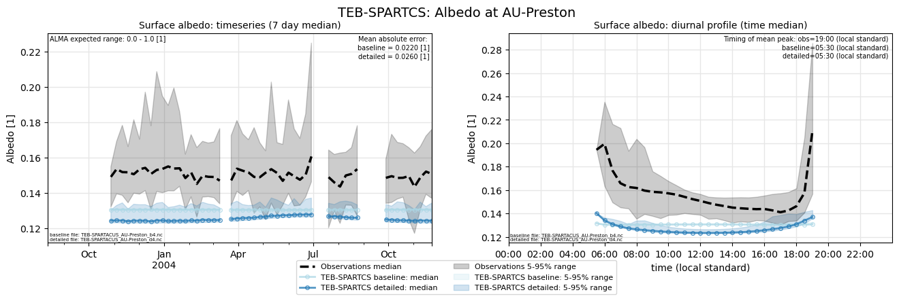

# AU-Preston: TEB-SPARTCS

**NOTE:** *Results presented here are highly dependent on how models are configured in this experiment and may be subject to variable output formatting errors. Results are not intended to indicate the quality of any individual model, but to help participants better understand and improve modelling approaches in different urban environments.*

### Error metrics

| flux   | experiment   |   MAE |     MBE |    NSD |      R |
|:-------|:-------------|------:|--------:|-------:|-------:|
| SWnet  | baseline     | 10.17 |   5.29  | 0.8873 | 0.9987 |
| SWnet  | detailed     | 15.52 |  12.928 | 0.9103 | 0.9987 |
| LWnet  | baseline     | 17.56 | -11.193 | 1.2454 | 0.9374 |
| LWnet  | detailed     | 13.68 |  -8.77  | 1.1543 | 0.9542 |
| Qle    | baseline     | 27.96 |  -5.356 | 0.7518 | 0.4679 |
| Qle    | detailed     | 32.31 |   2.702 | 1.0255 | 0.4731 |
| Qh     | baseline     | 33.51 |  25.576 | 1.2522 | 0.9345 |
| Qh     | detailed     | 30.49 |  16.236 | 1.327  | 0.9204 |

### jump to figure:
 - [Albedo](#albedo)
 - [LWnet](#lwnet)
 - [LWup](#lwup)
 - [Qh](#qh)
 - [Qle](#qle)
 - [SWnet](#swnet)
 - [SWnet_subset_baseline](#swnet_subset_baseline)
 - [SWnet_subset_detailed](#swnet_subset_detailed)
 - [SWup](#swup)
 - [SWup_subset_baseline](#swup_subset_baseline)
 - [SWup_subset_detailed](#swup_subset_detailed)
 - [closure_baseline](#closure_baseline)
 - [closure_detailed](#closure_detailed)

[Link to variable definitions](variable_definitions.md)

### Albedo

### LWnet

### LWup

### Qh

### Qle

### SWnet

### SWnet_subset_baseline

### SWnet_subset_detailed

### SWup

### SWup_subset_baseline

### SWup_subset_detailed

### closure_baseline

### closure_detailed

### out of range: baseline

 - TEB-SPARTCS RoofSurfT max value of 344.1284 is greater than expected 343.0 [K]
 - TEB-SPARTCS TVeg max value of 982.9030 is greater than expected 0.0003 [kg/m2/s]
 - TEB-SPARTCS TVeg min value of -1.5082 is less than expected -0.0003 [kg/m2/s]
 - TEB-SPARTCS ESoil max value of 286.3840 is greater than expected 0.0003 [kg/m2/s]
 - TEB-SPARTCS ESoil min value of -8.6089 is less than expected -0.0003 [kg/m2/s]
 - TEB-SPARTCS SoilWet max value of 1.6047 is greater than expected 1.2 [1]
 - TEB-SPARTCS SoilWet min value of -0.9861 is less than expected -0.2 [1]

### out of range: detailed

 - TEB-SPARTCS Qh max value of 637.5291 is greater than expected 600.0 [W/m2]
 - TEB-SPARTCS Qanth min value of -2.7648 is less than expected 0.0 [W/m2]
 - TEB-SPARTCS RoofSurfT max value of 344.0659 is greater than expected 343.0 [K]
 - TEB-SPARTCS TVeg max value of 944.3084 is greater than expected 0.0003 [kg/m2/s]
 - TEB-SPARTCS TVeg min value of -6.4846 is less than expected -0.0003 [kg/m2/s]
 - TEB-SPARTCS ESoil max value of 189.3662 is greater than expected 0.0003 [kg/m2/s]
 - TEB-SPARTCS ESoil min value of -7.6425 is less than expected -0.0003 [kg/m2/s]
 - TEB-SPARTCS SoilWet max value of 1.6163 is greater than expected 1.2 [1]
 - TEB-SPARTCS SoilWet min value of -1.0000 is less than expected -0.2 [1]

[Link to variable definitions](variable_definitions.md)

