# AU-Preston: TERRA_4.11

**NOTE:** *Results presented here are highly dependent on how models are configured in this experiment and may be subject to variable output formatting errors. Results are not intended to indicate the quality of any individual model, but to help participants better understand and improve modelling approaches in different urban environments.*

### Error metrics

| flux   | experiment   |   MAE |     MBE |    NSD |      R |
|:-------|:-------------|------:|--------:|-------:|-------:|
| SWnet  | baseline     | 14.83 |  14.831 | 0.9168 | 0.9999 |
| SWnet  | detailed     | 33.57 |  -1.014 | 0.8635 | 0.9842 |
| LWnet  | baseline     | 33.19 |  32.651 | 0.4878 | 0.9842 |
| LWnet  | detailed     | 35.45 |  34.878 | 0.4294 | 0.9808 |
| Qle    | baseline     | 32.03 | -24.899 | 0.1611 | 0.5335 |
| Qle    | detailed     | 31.78 | -24.589 | 0.1536 | 0.5338 |
| Qh     | baseline     | 93.01 |  92.309 | 1.4132 | 0.9217 |
| Qh     | detailed     | 66.74 |  65.842 | 1.4127 | 0.9363 |

### jump to figure:
 - [LWnet](#lwnet)
 - [LWup](#lwup)
 - [Qh](#qh)
 - [Qle](#qle)
 - [SWnet](#swnet)
 - [SWup](#swup)
 - [baseline_SWnet_ts](#baseline_swnet_ts)
 - [baseline_SWup_ts](#baseline_swup_ts)
 - [baseline_closure](#baseline_closure)
 - [detailed_SWnet_ts](#detailed_swnet_ts)
 - [detailed_SWup_ts](#detailed_swup_ts)
 - [detailed_closure](#detailed_closure)

### LWnet
[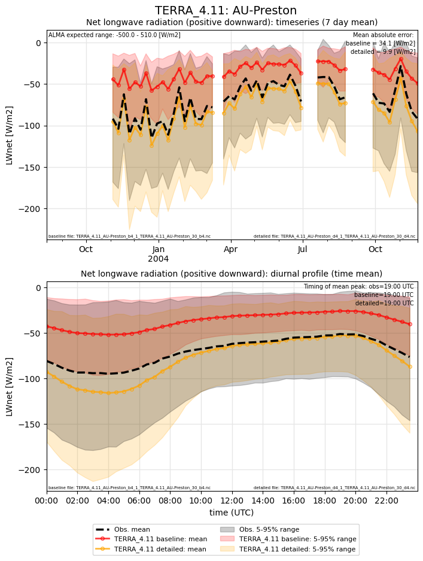](TERRA_4.11_AU-Preston_LWnet.png)

### LWup
[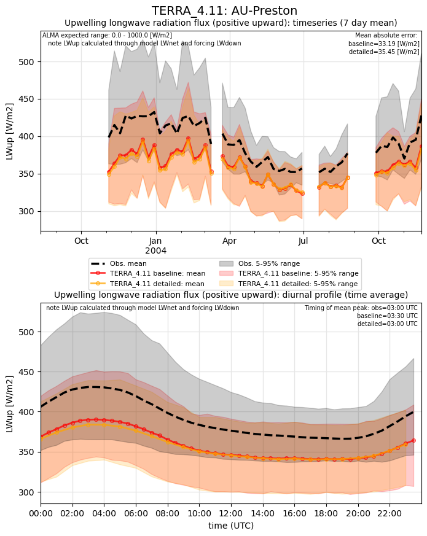](TERRA_4.11_AU-Preston_LWup.png)

### Qh
[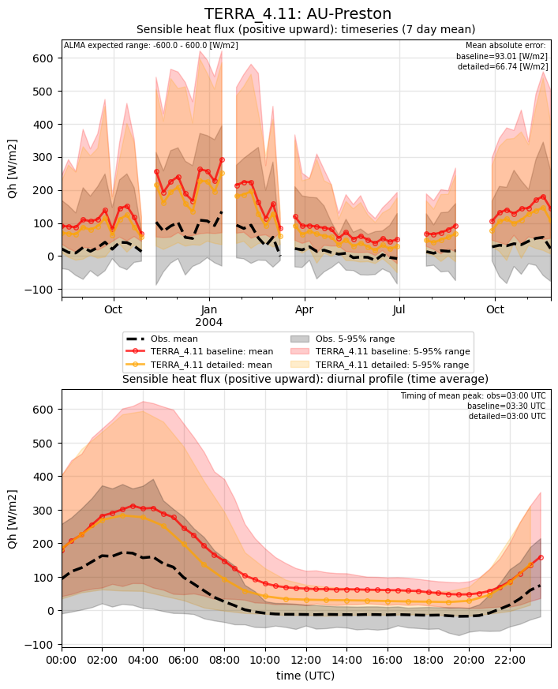](TERRA_4.11_AU-Preston_Qh.png)

### Qle
[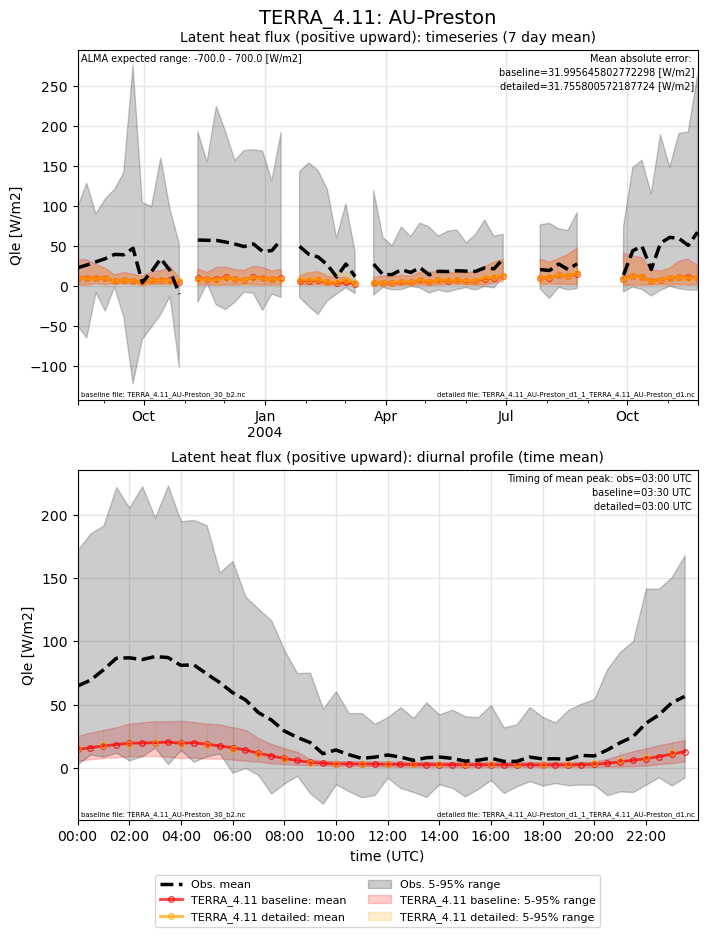](TERRA_4.11_AU-Preston_Qle.png)

### SWnet
[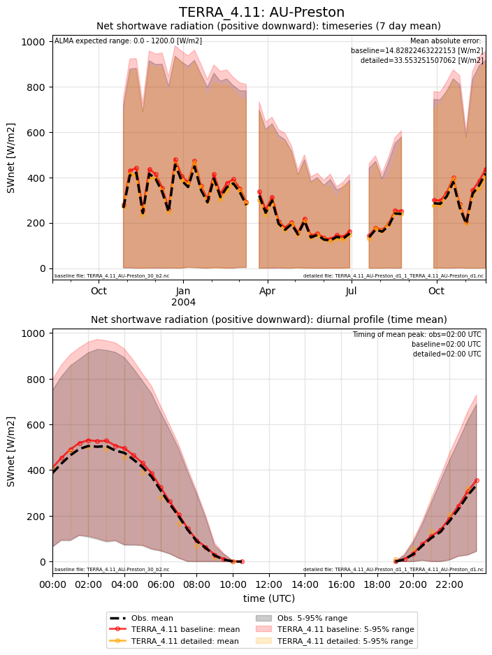](TERRA_4.11_AU-Preston_SWnet.png)

### SWup
[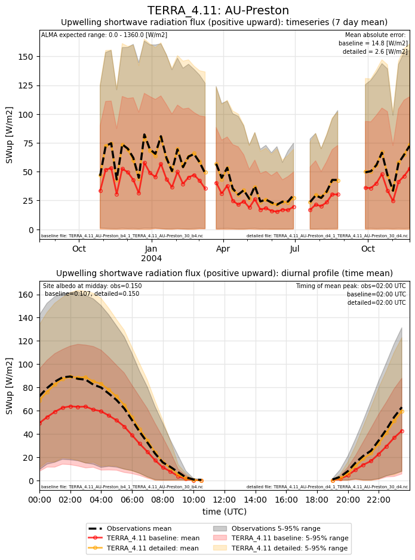](TERRA_4.11_AU-Preston_SWup.png)

### baseline_SWnet_ts
[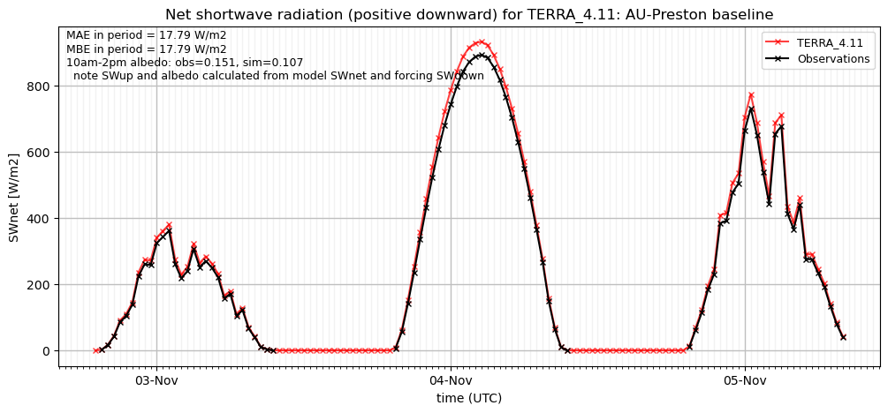](TERRA_4.11_AU-Preston_baseline_SWnet_ts.png)

### baseline_SWup_ts
[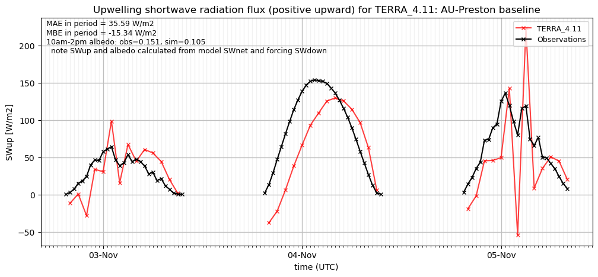](TERRA_4.11_AU-Preston_baseline_SWup_ts.png)

### baseline_closure

### detailed_SWnet_ts
[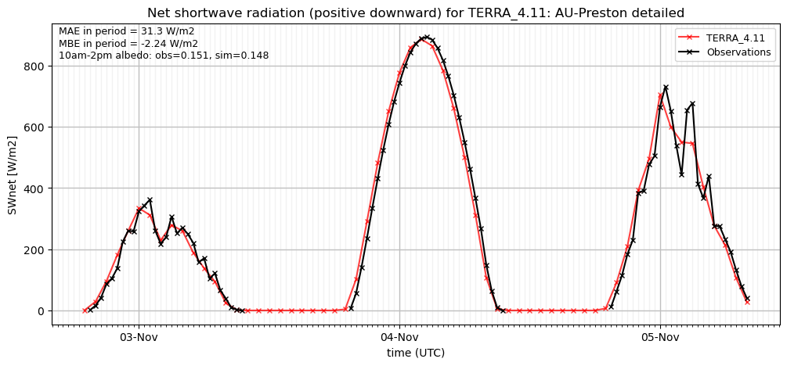](TERRA_4.11_AU-Preston_detailed_SWnet_ts.png)

### detailed_SWup_ts
[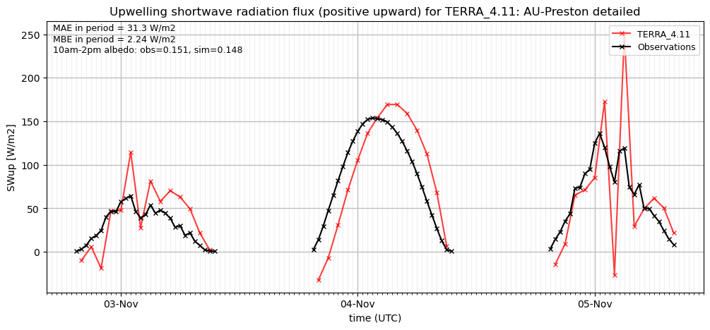](TERRA_4.11_AU-Preston_detailed_SWup_ts.png)

### detailed_closure
[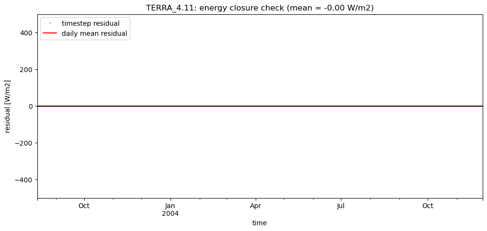](TERRA_4.11_AU-Preston_detailed_closure.png)

### out of range: baseline

 - TERRA_4.11 Qh max value of 733.2882 is greater than expected 600.0 [W/m2]
 - TERRA_4.11 SWup min value of -443.5046 is less than expected 0.0 [W/m2]
 - TERRA_4.11 alb min value of -0.9981 is less than expected 0.0 [1]

### out of range: detailed

 - TERRA_4.11 Qh max value of 655.5526 is greater than expected 600.0 [W/m2]
 - TERRA_4.11 SWup min value of -392.7304 is less than expected 0.0 [W/m2]
 - TERRA_4.11 alb min value of -0.9995 is less than expected 0.0 [1]

