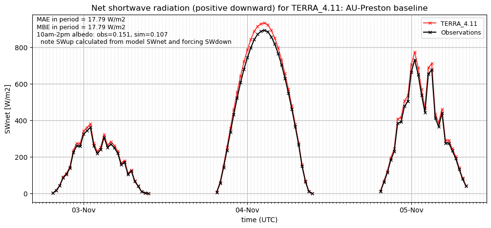
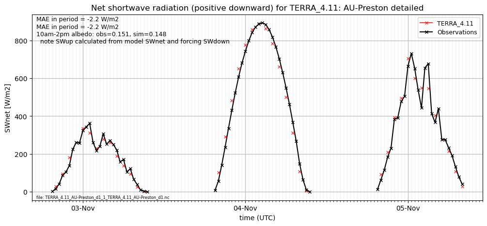
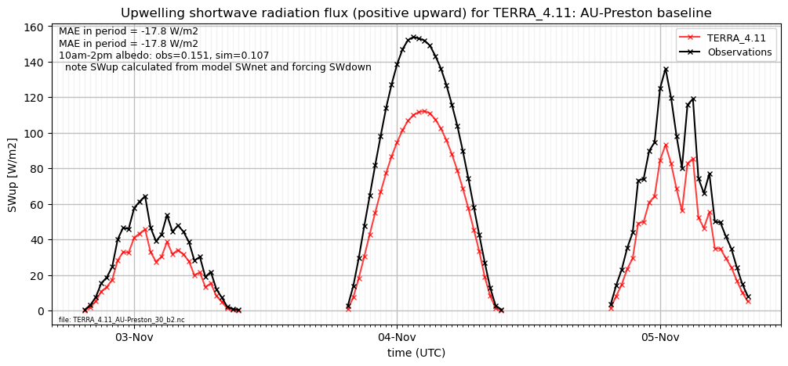
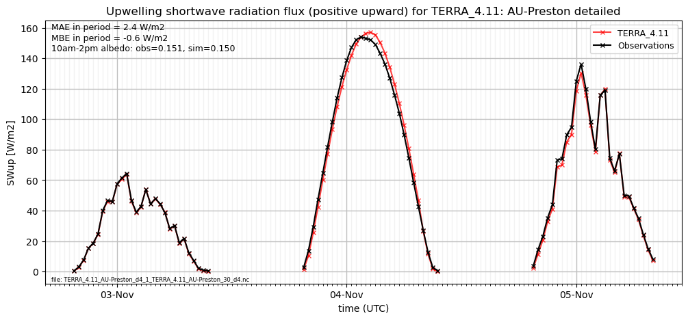
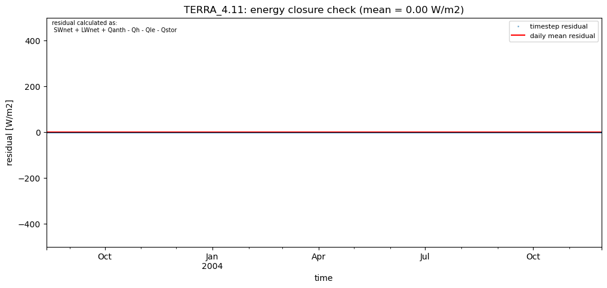
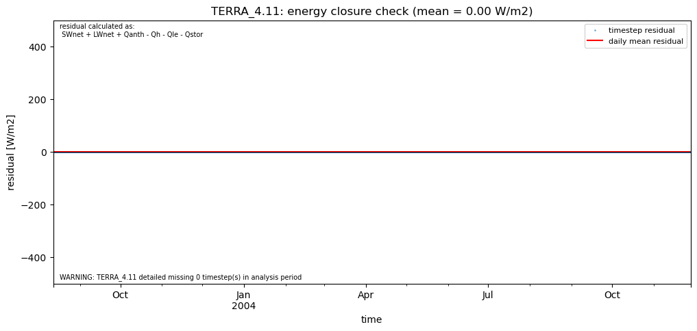

# AU-Preston: TERRA_4.11

**NOTE:** *Results presented here are highly dependent on how models are configured in this experiment and may be subject to variable output formatting errors. Results are not intended to indicate the quality of any individual model, but to help participants better understand and improve modelling approaches in different urban environments.*

### Error metrics

| flux   | experiment   |     MAE |       MBE |      NSD |        R |
|:-------|:-------------|--------:|----------:|---------:|---------:|
| SWnet  | baseline     | 14.8282 |  14.8282  | 0.916779 | 0.99991  |
| SWnet  | detailed     | 33.5533 |  -1.01363 | 0.8635   | 0.984174 |
| LWnet  | baseline     | 33.1895 |  32.6509  | 0.487767 | 0.98419  |
| LWnet  | detailed     | 35.4508 |  34.8778  | 0.429391 | 0.980815 |
| Qle    | baseline     | 31.9956 | -24.8356  | 0.161127 | 0.534444 |
| Qle    | detailed     | 31.7558 | -24.5079  | 0.153675 | 0.534804 |
| Qh     | baseline     | 93.0035 |  92.2974  | 1.41335  | 0.921807 |
| Qh     | detailed     | 66.7245 |  65.8259  | 1.41291  | 0.936458 |

 - MAE: mean absolute error (close to 0 is better)
 - NME: absolute mean error normalised by difference from mean  (closer to 0 is better)
 - MBE: mean bias error (close to 0 is better)
 - NSD: ratio of model to obs standard deviation (close to 1 is better)
 - R: Pearson's correlation (close to 1 is better)

### jump to figure:
 - [LWnet](#lwnet)
 - [LWup](#lwup)
 - [Qh](#qh)
 - [Qle](#qle)
 - [SWnet](#swnet)
 - [SWnet_subset_baseline](#swnet_subset_baseline)
 - [SWnet_subset_detailed](#swnet_subset_detailed)
 - [SWup](#swup)
 - [SWup_subset_baseline](#swup_subset_baseline)
 - [SWup_subset_detailed](#swup_subset_detailed)
 - [closure_baseline](#closure_baseline)
 - [closure_detailed](#closure_detailed)

[Link to variable definitions](../modelattrs/variable_definitions.md)

### LWnet

### LWup

### Qh

### Qle

### SWnet

### SWnet_subset_baseline

### SWnet_subset_detailed

### SWup

### SWup_subset_baseline

### SWup_subset_detailed

### closure_baseline

### closure_detailed

### out of range: baseline

 - TERRA_4.11 Qh max value of 733.2882 is greater than expected 600.0 [W/m2]

### out of range: detailed

 - TERRA_4.11 Qh max value of 655.5526 is greater than expected 600.0 [W/m2]
 - TERRA_4.11 SWup min value of -217.6542 is less than expected 0.0 [W/m2]
 - TERRA_4.11 alb min value of -0.9922 is less than expected 0.0 [1]

[Link to variable definitions](../modelattrs/variable_definitions.md)

