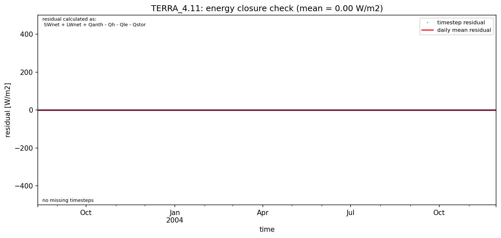

# AU-Preston: TERRA_4.11

**NOTE:** *Results presented here are highly dependent on how models are configured in this experiment and may be subject to variable output formatting errors. Results are not intended to indicate the quality of any individual model, but to help participants better understand and improve modelling approaches in different urban environments.*

### Error metrics

| flux   | experiment   |       MAE |        MBE |        nSD |          R |        5th |      95th |      RMSE |       cRMSE |       AMBE |        1-nSD |          1-R |   nSkewness |   nKurtosis |     Overlap |
|:-------|:-------------|----------:|-----------:|-----------:|-----------:|-----------:|----------:|----------:|------------:|-----------:|-------------:|-------------:|------------:|------------:|------------:|
| SWup   | baseline     |  15.6779  | -15.6779   |   0.722361 |   0.996712 |   0.864479 |  40.4019  |  20.5767  |   0.286065  |  15.6779   |   0.277639   |   0.0032878  |   0.0127398 |   0.021483  |   0.085139  |
| SWup   | detailed     |   2.72029 |  -0.168314 |   1.0098   |   0.996711 |   0.527381 |   1.66252 |   3.82814 |   0.0820926 |   0.168314 |   0.00979964 |   0.00328935 |   0.0123996 |   0.0208734 |   0.0585362 |
| LWup   | baseline     |  34.1144  | -33.5754   |   0.822459 |   0.845105 |  38.5685   |  59.6461  |  40.4056  |   0.535081  |  33.5754   |   0.177541   |   0.154895   |   0.640754  |   0.707055  |   0.298302  |
| LWup   | detailed     |   9.92596 |   8.39176  |   1.15127  |   0.985453 |   1.97083  |  24.4745  |  13.0353  |   0.237435  |   8.39176  |   0.151266   |   0.0145465  |   0.0757592 |   0.154236  |   0.0830009 |
| Qle    | baseline     |  27.0403  | -18.3711   |   0.417078 |   0.578484 |  12.1683   |  71.1615  |  47.0372  |   0.831509  |  18.3711   |   0.582922   |   0.421516   |   0.0316621 |   0.587977  |   0.397564  |
| Qle    | detailed     |  27.0366  | -18.136    |   0.409938 |   0.569229 |  12.1682   |  71.9752  |  47.2323  |   0.837468  |  18.136    |   0.590062   |   0.430771   |   0.051767  |   0.595052  |   0.361924  |
| Qh     | baseline     |  87.5701  |  86.919    |   1.42245  |   0.927139 |  61.8557   | 187.845   | 104.016   |   0.621083  |  86.919    |   0.422449   |   0.0728605  |   0.0321459 |   0.0251173 |   0.585537  |
| Qh     | detailed     |  34.845   |  30.8145   |   1.33079  |   0.94652  |  11.433    | 113.303   |  55.4987  |   0.501758  |  30.8145   |   0.330787   |   0.0534802  |   0.0285521 |   0.0471717 |   0.234252  |
| Qtau   | baseline     | nan       | nan        | nan        | nan        | nan        | nan       | nan       | nan         | nan        | nan          | nan          | nan         | nan         | nan         |
| Qtau   | detailed     | nan       | nan        | nan        | nan        | nan        | nan       | nan       | nan         | nan        | nan          | nan          | nan         | nan         | nan         |

 - MAE: mean absolute error (close to 0 is better)
 - MBE: mean bias error (close to 0 is better)
 - NSD: ratio of model to obs standard deviation (close to 1 is better)
 - R: Pearson's correlation (close to 1 is better)
 - all others: closer to 0 is better

[Link to variable definitions](../modelattrs/variable_definitions.md)

### Datasheet

### Distributions

### closure_baseline

### closure_detailed

### subset_LWup

### subset_Qh

### subset_Qle

### subset_SWup

### out of range: baseline

 - TERRA_4.11 Qh max value of 731.2208 is greater than expected 600.0 [W/m2]
 - TERRA_4.11 Qs min value of -0.0000 is less than expected 0.0 [kg/m2/s]
 - TERRA_4.11 EvapF max value of 1.4902 is greater than expected 1.0 [1]
 - TERRA_4.11 EvapF min value of -0.0019 is less than expected 0.0 [1]

### out of range: detailed

 - TERRA_4.11 Qs min value of -0.0000 is less than expected 0.0 [kg/m2/s]
 - TERRA_4.11 EvapF max value of 146.6986 is greater than expected 1.0 [1]
 - TERRA_4.11 EvapF min value of -188.8821 is less than expected 0.0 [1]

[Link to variable definitions](../modelattrs/variable_definitions.md)

