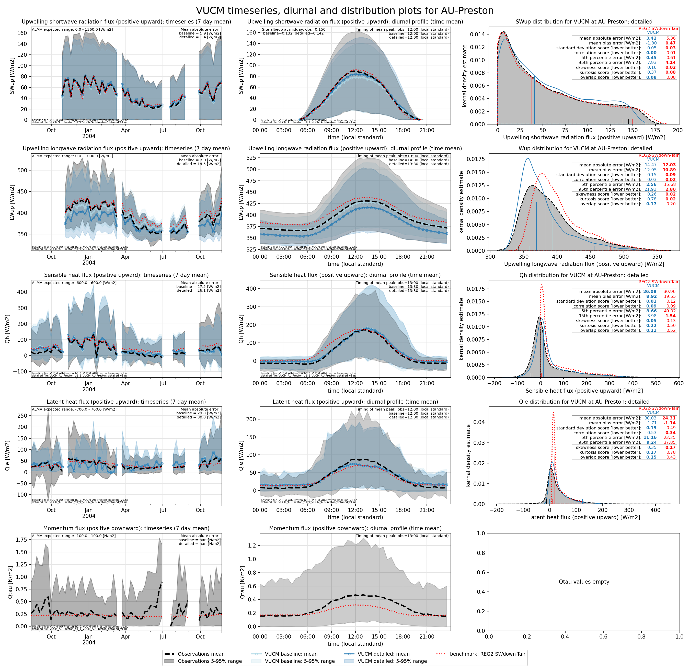
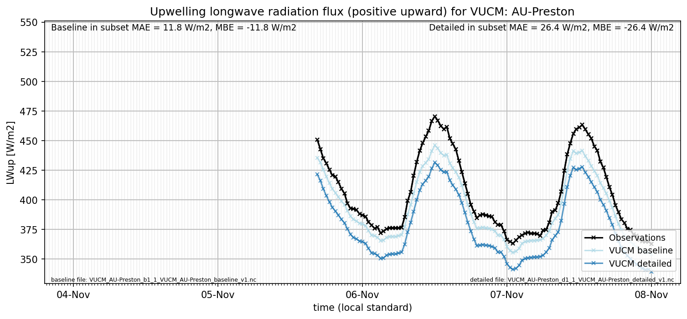

# AU-Preston: VUCM

**NOTE:** *Results presented here are highly dependent on how models are configured in this experiment and may be subject to variable output formatting errors. Results are not intended to indicate the quality of any individual model, but to help participants better understand and improve modelling approaches in different urban environments.*

### Submitted metadata

- [Baseline](VUCM_AU-Preston_baseline_attrs.md)
- [Detailed](VUCM_AU-Preston_detailed_attrs.md)

### Error metrics

| flux   | experiment   |       MAE |        MBE |        nSD |          R |     5th |    95th |      RMSE |      cRMSE |       AMBE |        1-nSD |          1-R |     nSkewness |   nKurtosis |     Overlap |
|:-------|:-------------|----------:|-----------:|-----------:|-----------:|--------:|--------:|----------:|-----------:|-----------:|-------------:|-------------:|--------------:|------------:|------------:|
| SWup   | baseline     |   5.86953 |  -5.56441  |   0.885002 |   0.996047 |   0.563 |  17.636 |   8.65158 |   0.142202 |   5.56441  |   0.114998   |   0.00395294 |   0.0968863   |    0.211826 |   0.0739672 |
| SWup   | detailed     |   3.41751 |  -1.79814  |   0.950276 |   0.996002 |   0.472 |   7.928 |   5.00897 |   0.100352 |   1.79814  |   0.0497237  |   0.00399783 |   0.0974703   |    0.204124 |   0.0775112 |
| LWup   | baseline     |   7.94332 |  -0.244159 |   0.873613 |   0.980074 |   8.426 |   8.041 |   9.4712  |   0.225365 |   0.244159 |   0.126387   |   0.0199263  |   0.188929    |    0.556487 |   0.122475  |
| LWup   | detailed     |  14.4727  | -12.9494   |   0.850586 |   0.965802 |   2.558 |  21.925 |  17.6003  |   0.283727 |  12.9494   |   0.149414   |   0.0341979  |   0.256294    |    0.776749 |   0.168973  |
| Qle    | baseline     |  29.8401  |   2.07782  |   0.852218 |   0.485175 |  11.139 |   7.187 |  49.4284  |   0.948327 |   2.07782  |   0.147782   |   0.514825   |   0.357291    |    0.306891 |   0.142811  |
| Qle    | detailed     |  30.0258  |   1.70912  |   0.845644 |   0.473027 |  11.159 |   9.243 |  49.845   |   0.956603 |   1.70912  |   0.154356   |   0.526973   |   0.347597    |    0.26856  |   0.145455  |
| Qh     | baseline     |  27.5288  |   8.08409  |   1.00635  |   0.90696  |   2.124 |   1.643 |  40.6254  |   0.432784 |   8.08409  |   0.00634715 |   0.0930403  |   0.000243236 |    0.156289 |   0.200653  |
| Qh     | detailed     |  26.0848  |   8.91609  |   0.986535 |   0.914586 |   8.665 |   3.984 |  38.8231  |   0.410743 |   8.91609  |   0.0134646  |   0.0854143  |   0.0548572   |    0.223231 |   0.211389  |
| Qtau   | baseline     | nan       | nan        | nan        | nan        | nan     | nan     | nan       | nan        | nan        | nan          | nan          | nan           |  nan        | nan         |
| Qtau   | detailed     | nan       | nan        | nan        | nan        | nan     | nan     | nan       | nan        | nan        | nan          | nan          | nan           |  nan        | nan         |

 - MAE: mean absolute error (close to 0 is better)
 - MBE: mean bias error (close to 0 is better)
 - NSD: ratio of model to obs standard deviation (close to 1 is better)
 - R: Pearson's correlation (close to 1 is better)
 - all others: closer to 0 is better

[Link to variable definitions](../modelattrs/variable_definitions.md)

### Datasheet

### Distributions

### closure_baseline

### closure_detailed

### subset_LWup

### subset_Qh

### subset_Qle

### subset_SWup

### out of range: baseline

 - VUCM SWup min value of -0.3180 is less than expected 0.0 [W/m2]
 - VUCM Qh max value of 606.7470 is greater than expected 600.0 [W/m2]
 - VUCM EvapF max value of 8.6094 is greater than expected 1.0 [1]
 - VUCM EvapF min value of -12.1872 is less than expected 0.0 [1]

### out of range: detailed

 - VUCM SWup min value of -0.3140 is less than expected 0.0 [W/m2]
 - VUCM EvapF max value of 11.6146 is greater than expected 1.0 [1]
 - VUCM EvapF min value of -7.7398 is less than expected 0.0 [1]

[Link to variable definitions](../modelattrs/variable_definitions.md)

