# AU-Preston: VUCM

**NOTE:** *Results presented here are highly dependent on how models are configured in this experiment and may be subject to variable output formatting errors. Results are not intended to indicate the quality of any individual model, but to help participants better understand and improve modelling approaches in different urban environments.*

### Error metrics
| flux   | experiment   |   MAE |    MBE |    NSD |      R |
|:-------|:-------------|------:|-------:|-------:|-------:|
| SWnet  | baseline     |  5.56 |  5.276 | 0.8902 | 0.9999 |
| SWnet  | detailed     |  3.25 |  1.724 | 0.8799 | 0.9999 |
| LWnet  | baseline     |  7.95 |  0.255 | 0.8788 | 0.9773 |
| LWnet  | detailed     | 14.48 | 12.96  | 0.8753 | 0.9624 |
| Qle    | baseline     | 30.07 |  2.033 | 0.8245 | 0.483  |
| Qle    | detailed     | 30.26 |  1.654 | 0.8245 | 0.471  |
| Qh     | baseline     | 27.56 |  8.11  | 1.013  | 0.9068 |
| Qh     | detailed     | 26.12 |  8.954 | 0.9883 | 0.9144 |

### jump to figure:
 - [baseline_LWnet](#baseline_lwnet)
 - [baseline_LWup](#baseline_lwup)
 - [baseline_Qh](#baseline_qh)
 - [baseline_Qle](#baseline_qle)
 - [baseline_SWnet](#baseline_swnet)
 - [baseline_SWnet_ts](#baseline_swnet_ts)
 - [baseline_SWup](#baseline_swup)
 - [baseline_SWup_ts](#baseline_swup_ts)
 - [baseline_closure](#baseline_closure)
 - [detailed_LWnet](#detailed_lwnet)
 - [detailed_LWup](#detailed_lwup)
 - [detailed_Qh](#detailed_qh)
 - [detailed_Qle](#detailed_qle)
 - [detailed_SWnet](#detailed_swnet)
 - [detailed_SWnet_ts](#detailed_swnet_ts)
 - [detailed_SWup](#detailed_swup)
 - [detailed_SWup_ts](#detailed_swup_ts)
 - [detailed_closure](#detailed_closure)

### baseline_LWnet
[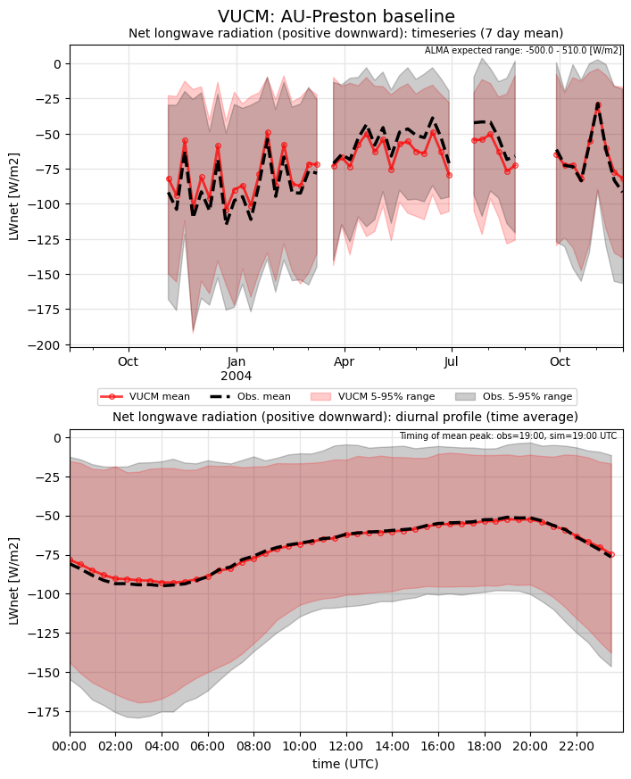](VUCM_AU-Preston_baseline_LWnet.png)

### baseline_LWup
[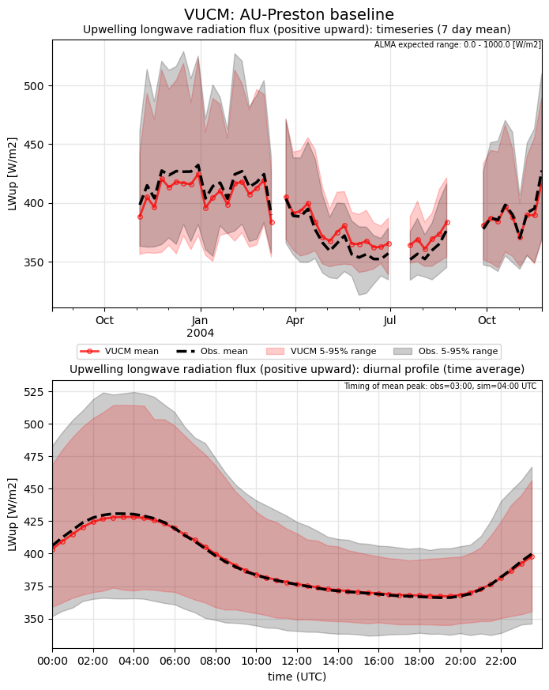](VUCM_AU-Preston_baseline_LWup.png)

### baseline_Qh
[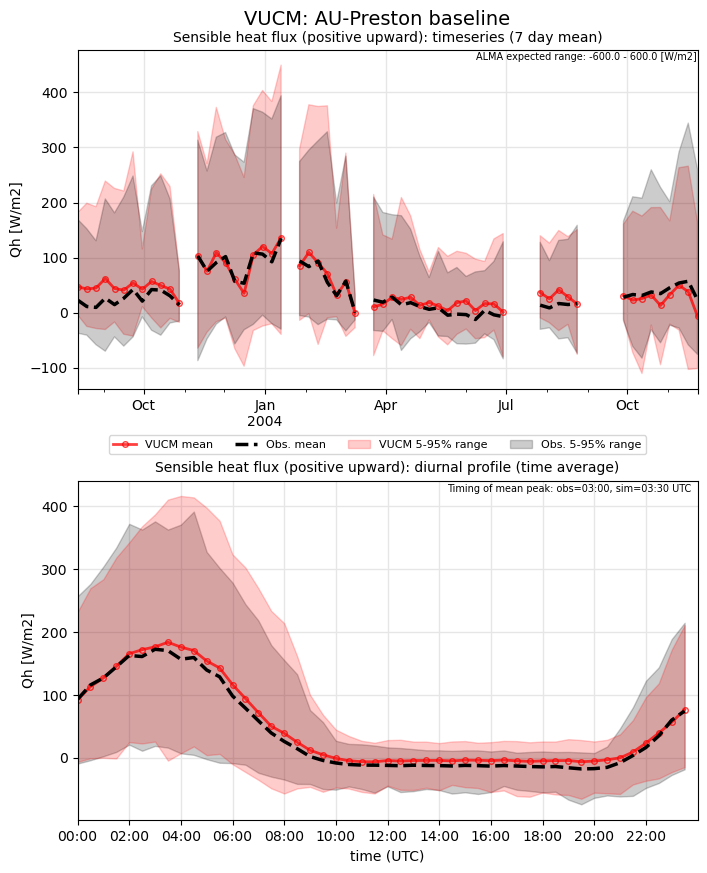](VUCM_AU-Preston_baseline_Qh.png)

### baseline_Qle
[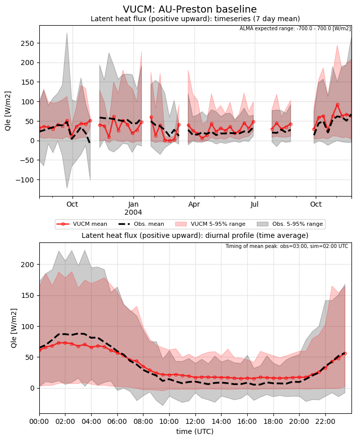](VUCM_AU-Preston_baseline_Qle.png)

### baseline_SWnet
[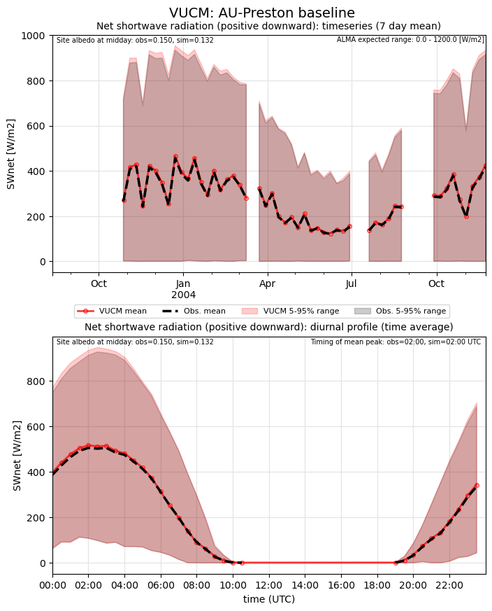](VUCM_AU-Preston_baseline_SWnet.png)

### baseline_SWnet_ts

### baseline_SWup

### baseline_SWup_ts
[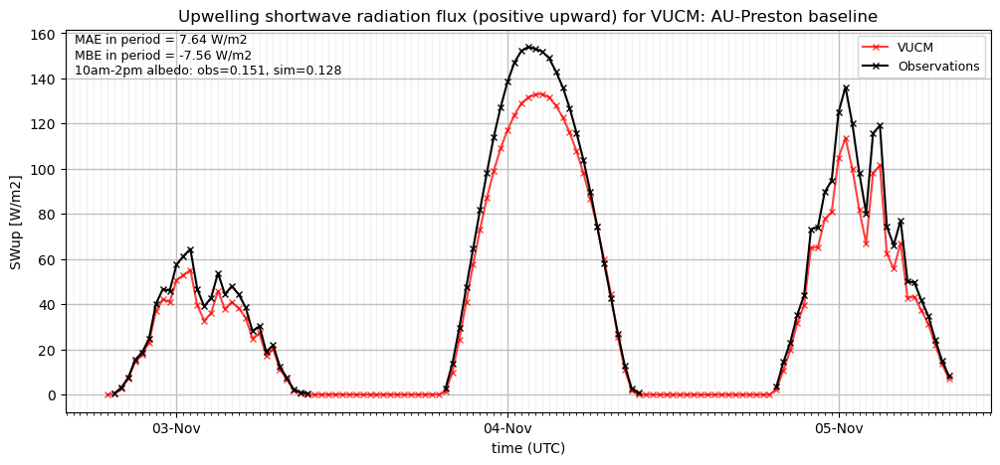](VUCM_AU-Preston_baseline_SWup_ts.png)

### baseline_closure
[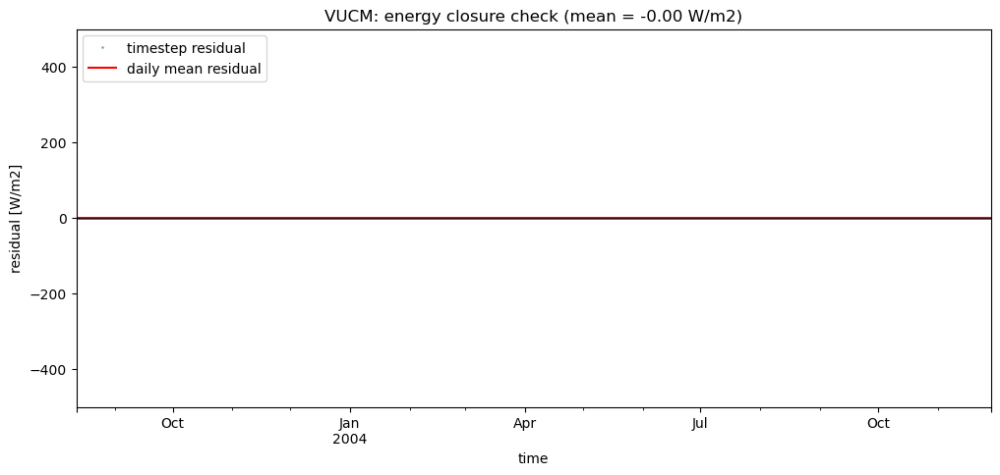](VUCM_AU-Preston_baseline_closure.png)

### detailed_LWnet
[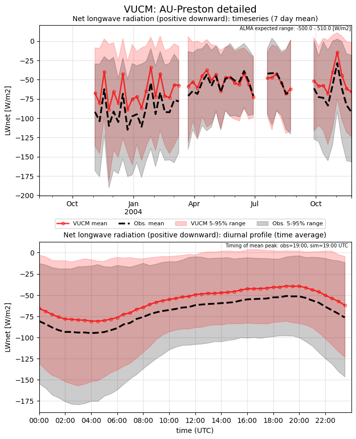](VUCM_AU-Preston_detailed_LWnet.png)

### detailed_LWup
[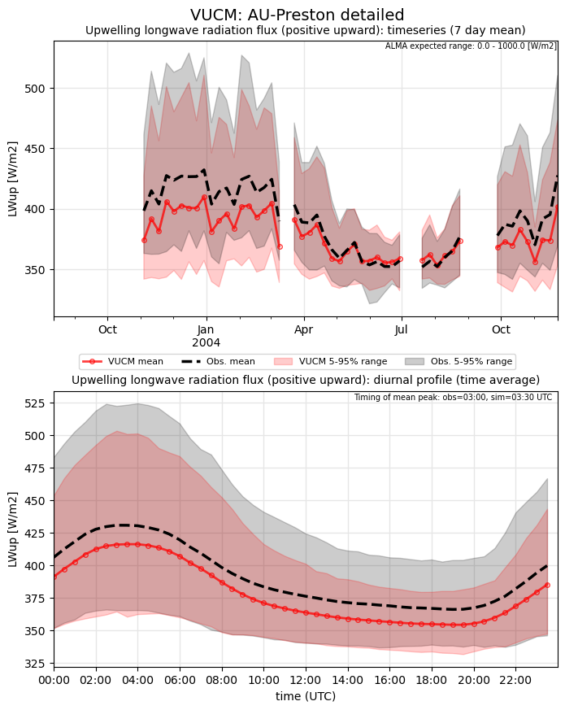](VUCM_AU-Preston_detailed_LWup.png)

### detailed_Qh
[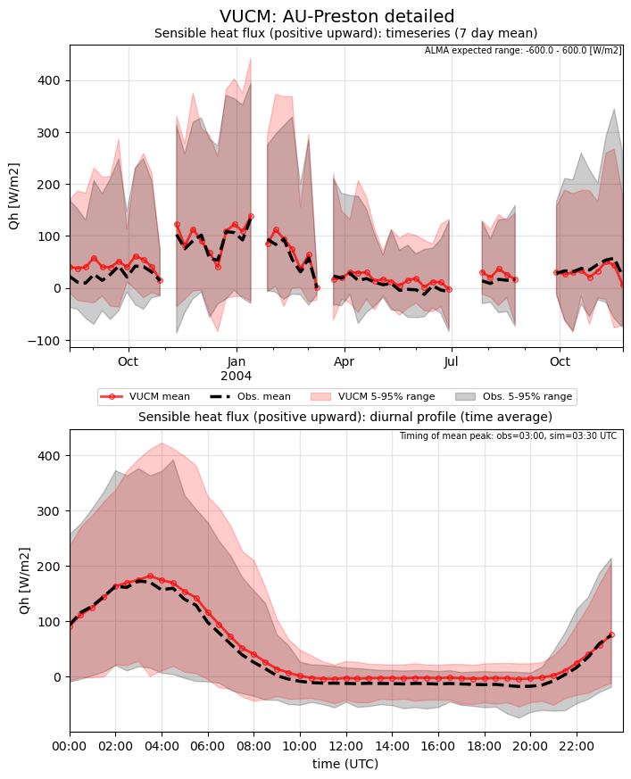](VUCM_AU-Preston_detailed_Qh.png)

### detailed_Qle
[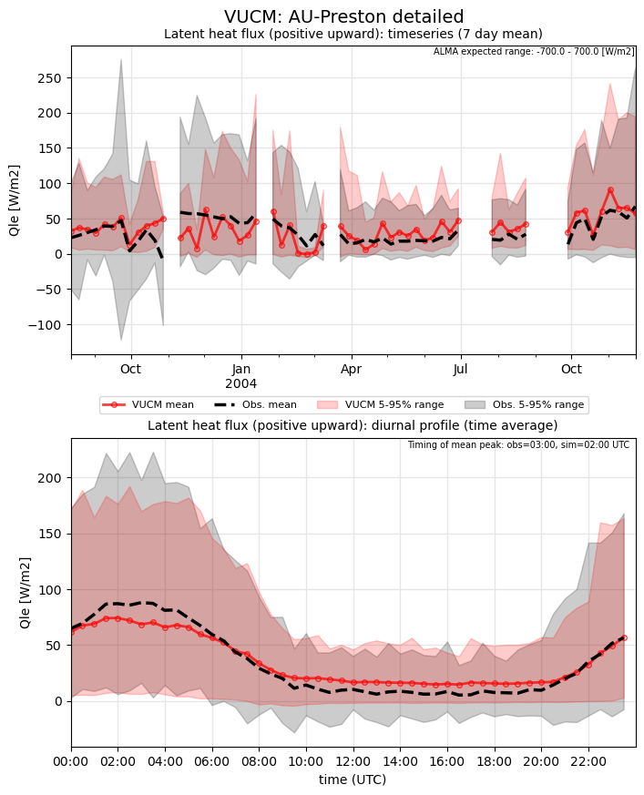](VUCM_AU-Preston_detailed_Qle.png)

### detailed_SWnet

### detailed_SWnet_ts
[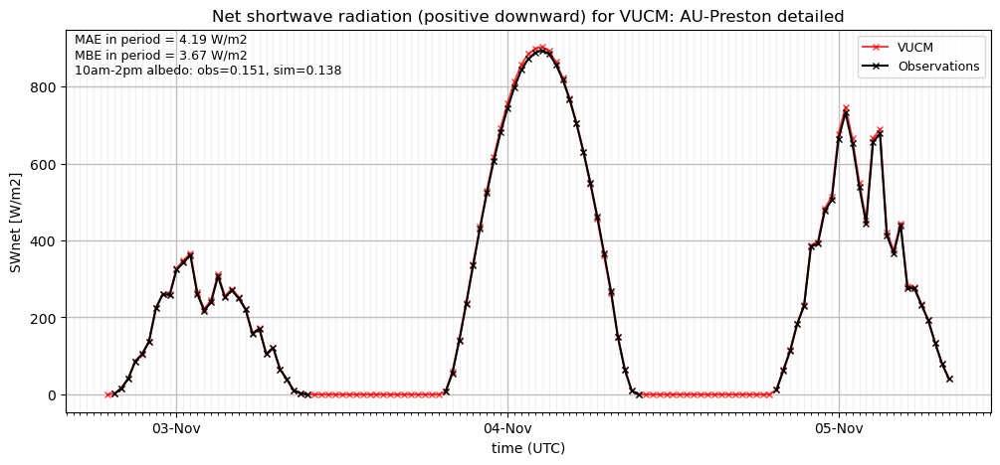](VUCM_AU-Preston_detailed_SWnet_ts.png)

### detailed_SWup
[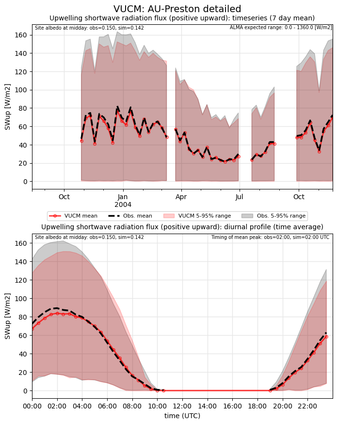](VUCM_AU-Preston_detailed_SWup.png)

### detailed_SWup_ts
[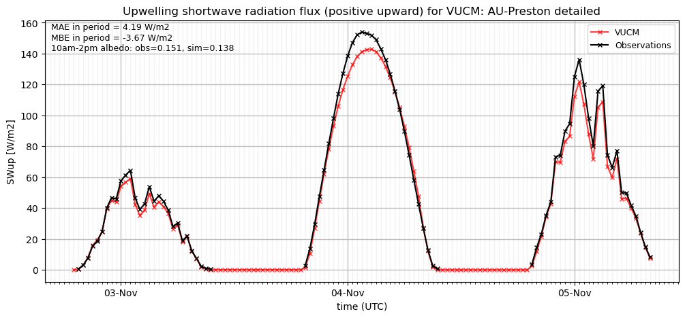](VUCM_AU-Preston_detailed_SWup_ts.png)

### detailed_closure
[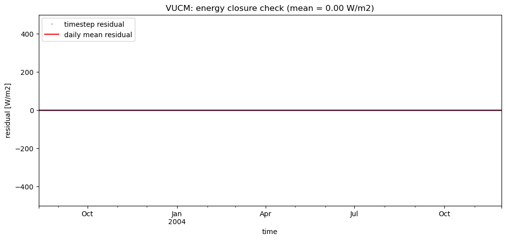](VUCM_AU-Preston_detailed_closure.png)

### out of range: baseline

 - VUCM Qh value of 606.7470 is greater than expected 600.0 [W/m2]
 - VUCM SWup value of -0.3180 is less than expected 0.0 [W/m2]
 - VUCM alb value of -0.1534 is less than expected 0.0 [1]

### out of range: detailed

 - VUCM Qh value of 606.7470 is greater than expected 600.0 [W/m2]
 - VUCM SWup value of -0.3180 is less than expected 0.0 [W/m2]
 - VUCM alb value of -0.1534 is less than expected 0.0 [1]

