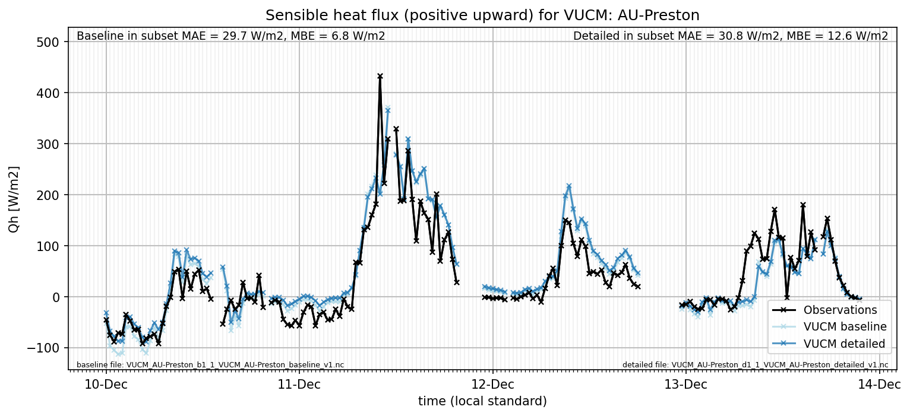
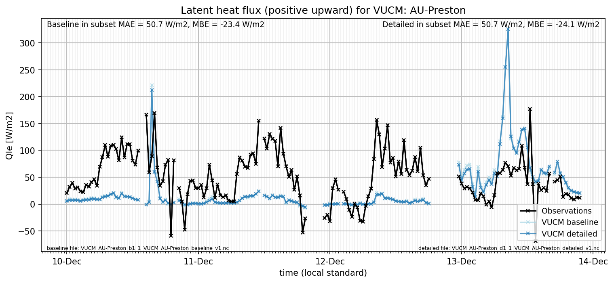
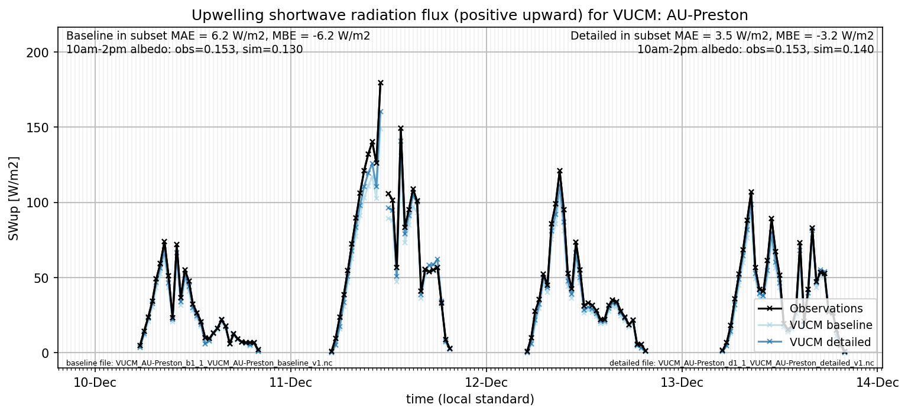

# AU-Preston: VUCM

**NOTE:** *Results presented here are highly dependent on how models are configured in this experiment and may be subject to variable output formatting errors. Results are not intended to indicate the quality of any individual model, but to help participants better understand and improve modelling approaches in different urban environments.*

### Error metrics

| flux   | experiment   |      MAE |        MBE |      NSD |        R |
|:-------|:-------------|---------:|-----------:|---------:|---------:|
| SWnet  | baseline     |  5.5672  |   5.27941  | 0.890183 | 0.999897 |
| SWnet  | detailed     |  3.25293 |   1.72474  | 0.879916 | 0.999892 |
| SWup   | baseline     |  5.55781 |  -5.27072  | 0.78481  | 0.996321 |
| SWup   | detailed     |  3.2506  |  -1.72689  | 0.843734 | 0.996275 |
| LWnet  | baseline     |  7.94882 |   0.250174 | 0.878869 | 0.977306 |
| LWnet  | detailed     | 14.4778  |  12.9545   | 0.875348 | 0.962472 |
| LWup   | baseline     |  7.94332 |  -0.244159 | 0.826203 | 0.980074 |
| LWup   | detailed     | 14.4727  | -12.9494   | 0.801331 | 0.965802 |
| Qle    | baseline     | 29.8401  |   2.07782  | 0.834994 | 0.485175 |
| Qle    | detailed     | 30.0258  |   1.70912  | 0.835018 | 0.473027 |
| Qh     | baseline     | 27.5288  |   8.08409  | 1.01351  | 0.90696  |
| Qh     | detailed     | 26.0848  |   8.91609  | 0.988872 | 0.914586 |

 - MAE: mean absolute error (close to 0 is better)
 - MBE: mean bias error (close to 0 is better)
 - NSD: ratio of model to obs standard deviation (close to 1 is better)
 - R: Pearson's correlation (close to 1 is better)

### jump to figure:
 - [LWnet](#lwnet)
 - [LWup](#lwup)
 - [Qanth](#qanth)
 - [Qh](#qh)
 - [Qle](#qle)
 - [SWnet](#swnet)
 - [SWup](#swup)
 - [closure_baseline](#closure_baseline)
 - [closure_detailed](#closure_detailed)
 - [subset_LWnet](#subset_lwnet)
 - [subset_LWup](#subset_lwup)
 - [subset_Qanth](#subset_qanth)
 - [subset_Qh](#subset_qh)
 - [subset_Qle](#subset_qle)
 - [subset_SWnet](#subset_swnet)
 - [subset_SWup](#subset_swup)

[Link to variable definitions](../modelattrs/variable_definitions.md)

### LWnet

### LWup

### Qanth

### Qh

### Qle

### SWnet

### SWup

### closure_baseline

### closure_detailed

### subset_LWnet

### subset_LWup

### subset_Qanth

### subset_Qh

### subset_Qle

### subset_SWnet

### subset_SWup

### out of range: baseline

 - VUCM Qh max value of 606.7470 is greater than expected 600.0 [W/m2]
 - VUCM SWup min value of -0.3180 is less than expected 0.0 [W/m2]

### out of range: detailed

 - VUCM SWup min value of -0.3140 is less than expected 0.0 [W/m2]

[Link to variable definitions](../modelattrs/variable_definitions.md)

