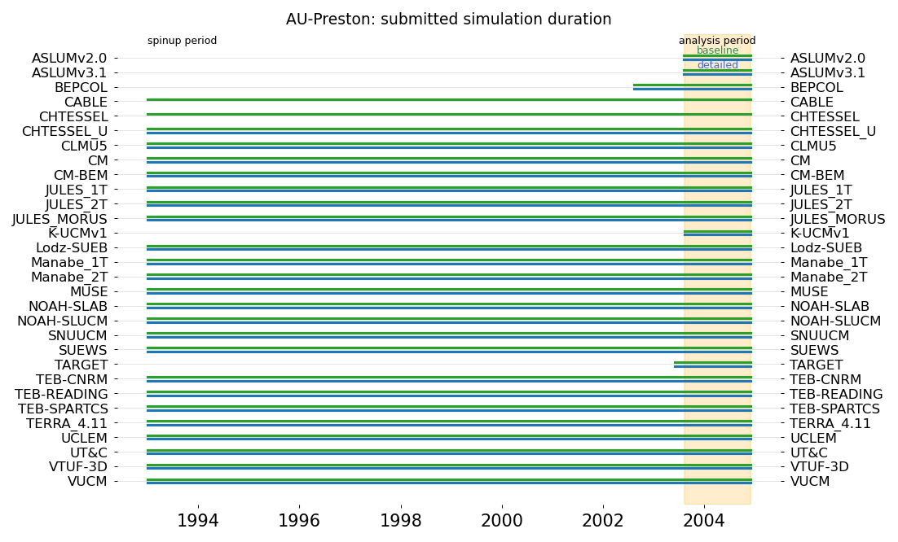

# AU-Preston submission summary

 - [Baseline results](./baseline/index.md)
 - [Detailed results](./detailed/index.md)
 - [Error metric summary](./metrics/index.md)
 - [Site details](https://urban-plumber.github.io/AU-Preston/)

## Experiments: 

 - **Baseline**: basic surface information provided, otherwise with default model setup
 - **Detailed**: more detailed information like building morphology, albedo and anthropogenic heat

## Model data

Metadata as submitted for baseline and detailed experiments. Results for individual models.

|             | baseline                                                                   | detailed                                                                   | model plots                                   |
|:------------|:---------------------------------------------------------------------------|:---------------------------------------------------------------------------|:----------------------------------------------|
| ASLUMv2.0   | [baseline metadata](./modelattrs/ASLUMv2.0_AU-Preston_baseline_attrs.md)   | [detailed metadata](./modelattrs/ASLUMv2.0_AU-Preston_detailed_attrs.md)   | [ASLUMv2.0 results](./ASLUMv2.0/index.md)     |
| ASLUMv3.1   | [baseline metadata](./modelattrs/ASLUMv3.1_AU-Preston_baseline_attrs.md)   | [detailed metadata](./modelattrs/ASLUMv3.1_AU-Preston_detailed_attrs.md)   | [ASLUMv3.1 results](./ASLUMv3.1/index.md)     |
| BEPCOL      | [baseline metadata](./modelattrs/BEPCOL_AU-Preston_baseline_attrs.md)      | [detailed metadata](./modelattrs/BEPCOL_AU-Preston_detailed_attrs.md)      | [BEPCOL results](./BEPCOL/index.md)           |
| CABLE       | [baseline metadata](./modelattrs/CABLE_AU-Preston_baseline_attrs.md)       |                                                                            | [CABLE results](./CABLE/index.md)             |
| CHTESSEL    | [baseline metadata](./modelattrs/CHTESSEL_AU-Preston_baseline_attrs.md)    |                                                                            | [CHTESSEL results](./CHTESSEL/index.md)       |
| CHTESSEL_U  | [baseline metadata](./modelattrs/CHTESSEL_U_AU-Preston_baseline_attrs.md)  | [detailed metadata](./modelattrs/CHTESSEL_U_AU-Preston_detailed_attrs.md)  | [CHTESSEL_U results](./CHTESSEL_U/index.md)   |
| CLMU5       | [baseline metadata](./modelattrs/CLMU5_AU-Preston_baseline_attrs.md)       | [detailed metadata](./modelattrs/CLMU5_AU-Preston_detailed_attrs.md)       | [CLMU5 results](./CLMU5/index.md)             |
| CM-BEM      | [baseline metadata](./modelattrs/CM-BEM_AU-Preston_baseline_attrs.md)      | [detailed metadata](./modelattrs/CM-BEM_AU-Preston_detailed_attrs.md)      | [CM-BEM results](./CM-BEM/index.md)           |
| CM          | [baseline metadata](./modelattrs/CM_AU-Preston_baseline_attrs.md)          | [detailed metadata](./modelattrs/CM_AU-Preston_detailed_attrs.md)          | [CM results](./CM/index.md)                   |
| JULES_1T    | [baseline metadata](./modelattrs/JULES_1T_AU-Preston_baseline_attrs.md)    | [detailed metadata](./modelattrs/JULES_1T_AU-Preston_detailed_attrs.md)    | [JULES_1T results](./JULES_1T/index.md)       |
| JULES_2T    | [baseline metadata](./modelattrs/JULES_2T_AU-Preston_baseline_attrs.md)    | [detailed metadata](./modelattrs/JULES_2T_AU-Preston_detailed_attrs.md)    | [JULES_2T results](./JULES_2T/index.md)       |
| JULES_MORUS | [baseline metadata](./modelattrs/JULES_MORUS_AU-Preston_baseline_attrs.md) | [detailed metadata](./modelattrs/JULES_MORUS_AU-Preston_detailed_attrs.md) | [JULES_MORUS results](./JULES_MORUS/index.md) |
| K-UCMv1     | [baseline metadata](./modelattrs/K-UCMv1_AU-Preston_baseline_attrs.md)     | [detailed metadata](./modelattrs/K-UCMv1_AU-Preston_detailed_attrs.md)     | [K-UCMv1 results](./K-UCMv1/index.md)         |
| Lodz-SUEB   | [baseline metadata](./modelattrs/Lodz-SUEB_AU-Preston_baseline_attrs.md)   | [detailed metadata](./modelattrs/Lodz-SUEB_AU-Preston_detailed_attrs.md)   | [Lodz-SUEB results](./Lodz-SUEB/index.md)     |
| MUSE        | [baseline metadata](./modelattrs/MUSE_AU-Preston_baseline_attrs.md)        | [detailed metadata](./modelattrs/MUSE_AU-Preston_detailed_attrs.md)        | [MUSE results](./MUSE/index.md)               |
| Manabe_1T   | [baseline metadata](./modelattrs/Manabe_1T_AU-Preston_baseline_attrs.md)   | [detailed metadata](./modelattrs/Manabe_1T_AU-Preston_detailed_attrs.md)   | [Manabe_1T results](./Manabe_1T/index.md)     |
| Manabe_2T   | [baseline metadata](./modelattrs/Manabe_2T_AU-Preston_baseline_attrs.md)   | [detailed metadata](./modelattrs/Manabe_2T_AU-Preston_detailed_attrs.md)   | [Manabe_2T results](./Manabe_2T/index.md)     |
| NOAH-SLAB   | [baseline metadata](./modelattrs/NOAH-SLAB_AU-Preston_baseline_attrs.md)   | [detailed metadata](./modelattrs/NOAH-SLAB_AU-Preston_detailed_attrs.md)   | [NOAH-SLAB results](./NOAH-SLAB/index.md)     |
| NOAH-SLUCM  | [baseline metadata](./modelattrs/NOAH-SLUCM_AU-Preston_baseline_attrs.md)  | [detailed metadata](./modelattrs/NOAH-SLUCM_AU-Preston_detailed_attrs.md)  | [NOAH-SLUCM results](./NOAH-SLUCM/index.md)   |
| SNUUCM      | [baseline metadata](./modelattrs/SNUUCM_AU-Preston_baseline_attrs.md)      | [detailed metadata](./modelattrs/SNUUCM_AU-Preston_detailed_attrs.md)      | [SNUUCM results](./SNUUCM/index.md)           |
| SUEWS       | [baseline metadata](./modelattrs/SUEWS_AU-Preston_baseline_attrs.md)       | [detailed metadata](./modelattrs/SUEWS_AU-Preston_detailed_attrs.md)       | [SUEWS results](./SUEWS/index.md)             |
| TARGET      | [baseline metadata](./modelattrs/TARGET_AU-Preston_baseline_attrs.md)      | [detailed metadata](./modelattrs/TARGET_AU-Preston_detailed_attrs.md)      | [TARGET results](./TARGET/index.md)           |
| TEB-READING | [baseline metadata](./modelattrs/TEB-READING_AU-Preston_baseline_attrs.md) | [detailed metadata](./modelattrs/TEB-READING_AU-Preston_detailed_attrs.md) | [TEB-READING results](./TEB-READING/index.md) |
| TEB-CNRM    | [baseline metadata](./modelattrs/TEB-CNRM_AU-Preston_baseline_attrs.md)    | [detailed metadata](./modelattrs/TEB-CNRM_AU-Preston_detailed_attrs.md)    | [TEB-CNRM results](./TEB-CNRM/index.md)       |
| TEB-SPARTCS | [baseline metadata](./modelattrs/TEB-SPARTCS_AU-Preston_baseline_attrs.md) | [detailed metadata](./modelattrs/TEB-SPARTCS_AU-Preston_detailed_attrs.md) | [TEB-SPARTCS results](./TEB-SPARTCS/index.md) |
| TERRA_4.11  | [baseline metadata](./modelattrs/TERRA_4.11_AU-Preston_baseline_attrs.md)  | [detailed metadata](./modelattrs/TERRA_4.11_AU-Preston_detailed_attrs.md)  | [TERRA_4.11 results](./TERRA_4.11/index.md)   |
| UCLEM       | [baseline metadata](./modelattrs/UCLEM_AU-Preston_baseline_attrs.md)       | [detailed metadata](./modelattrs/UCLEM_AU-Preston_detailed_attrs.md)       | [UCLEM results](./UCLEM/index.md)             |
| UT&C        | [baseline metadata](./modelattrs/UT&C_AU-Preston_baseline_attrs.md)        | [detailed metadata](./modelattrs/UT&C_AU-Preston_detailed_attrs.md)        | [UT&C results](./UT&C/index.md)               |
| VTUF-3D     | [baseline metadata](./modelattrs/VTUF-3D_AU-Preston_baseline_attrs.md)     | [detailed metadata](./modelattrs/VTUF-3D_AU-Preston_detailed_attrs.md)     | [VTUF-3D results](./VTUF-3D/index.md)         |
| VUCM        | [baseline metadata](./modelattrs/VUCM_AU-Preston_baseline_attrs.md)        | [detailed metadata](./modelattrs/VUCM_AU-Preston_detailed_attrs.md)        | [VUCM results](./VUCM/index.md)               |

## Submitted variables

- Upper triangle shows submitted variables for the **baseline** experiment.
- Lower triangle shows submitted variables for the **detailed** experiment.
- Orange indicates more data than forcing (i.e. shorter than expected timesteps).
- Lighter green may indicate longer than expected timesteps, or partial data.
- [Link to variable definitions](./modelattrs/variable_definitions.md)
- Click figure to expand.

## Simulation duration

