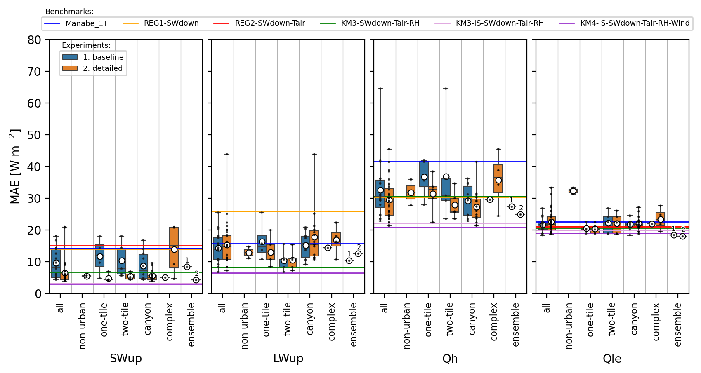
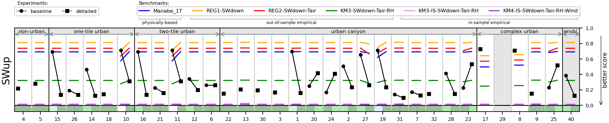
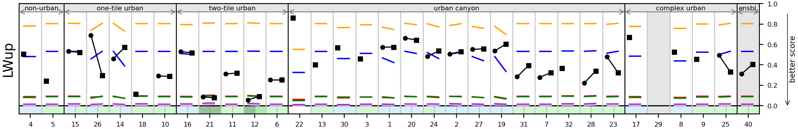
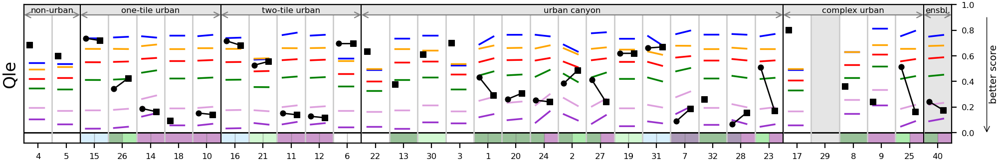
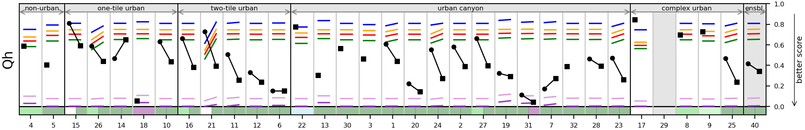
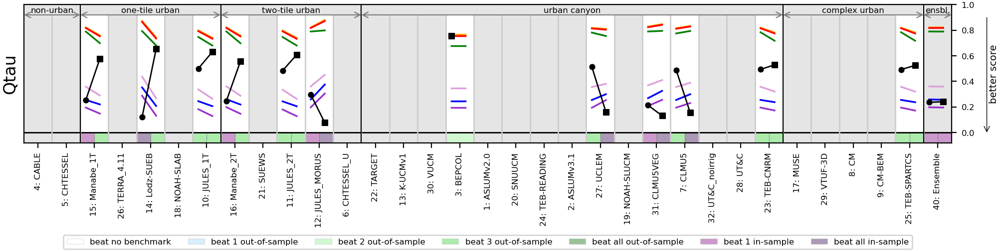

**NOTE:** *Results presented here are highly dependent on how models are configured in this experiment and may be subject to variable output formatting errors. Results are not intended to indicate the quality of any individual model, but to help participants better understand and improve modelling approaches in different urban environments.*

# CA-Sunset results

Also see:

- [Site details](https://urban-plumber.github.io/CA-Sunset/)
- [Detailed experiment plots](../detailed/index.md)
- [Individual model data and results](../index.md#model-data)

## Site images

|                                             |                                             |    
|:-------------------------------------------:|:-------------------------------------------:|
|   Regional map. © OpenStreetMap    |  Site aerial photo with 500 m radius. © OpenStreetMap, Microsoft    |

## Mean absolute error by cohort

Benchmarks are provided to help provide lower and upper bounds of performance expectations. The simple out-of-sample emperical benchmarks are trained excluding observations from this site (i.e. using the other 19 sites in the project). These simple information limited models are not expected to perform well, but provide a lower bound of performance expectations. The in-sample emperical benchmarks use observations only from this site, providing an upper bound of predictability for a particular flux.

## Benchmarking evaluation: PLUMBER2 metrics

For this benchmarking evaluation a series of error metrics (see below) are aggregated into a score that are normalised between 0-1, with zero being the worst of all benchmarks and the model in question, and 1 being the best of all benchmarks and the model in question. In this way each score is independent of other participating models, and ensures fluxes which are inherently less predictable do not dominate the score. This is a more robust method to assess if models are performing well or poorly across sites.

The aggregated scores include the following metrics (normalised so that lower is better).

 - mean absolute error (MAE)
 - absolute mean bias error (AMBE)
 - normalized standard deviation (1-nSD)
 - normalised correlation coefficent (1-R)
 - 5th percentile error (5th)
 - 95th percentile error (95th)
 - distriution overlap, or Perkins Skill Score (Overlap)

