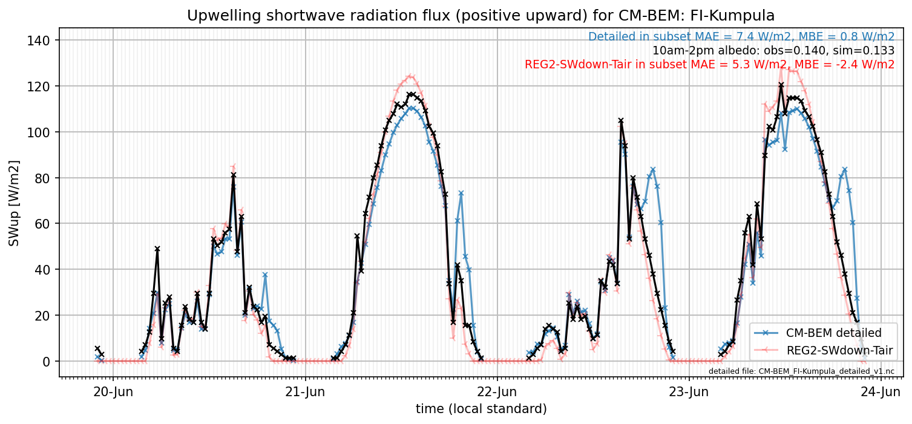

# FI-Kumpula: CM-BEM

**NOTE:** *Results presented here are highly dependent on how models are configured in this experiment and may be subject to variable output formatting errors. Results are not intended to indicate the quality of any individual model, but to help participants better understand and improve modelling approaches in different urban environments.*

### Submitted metadata

- [Baseline](CM-BEM_FI-Kumpula_baseline_attrs.md)
- [Detailed](CM-BEM_FI-Kumpula_detailed_attrs.md)

### Error metrics

| flux   | experiment   |      MAE |       MBE |        nSD |          R |      5th |     95th |     RMSE |      cRMSE |      AMBE |       1-nSD |        1-R |   nSkewness |   nKurtosis |    Overlap |
|:-------|:-------------|---------:|----------:|-----------:|-----------:|---------:|---------:|---------:|-----------:|----------:|------------:|-----------:|------------:|------------:|-----------:|
| SWup   | baseline     | nan      | nan       | nan        | nan        | nan      | nan      | nan      | nan        | nan       | nan         | nan        |  nan        |  nan        | nan        |
| SWup   | detailed     |  14.1137 |  -7.50909 |   0.704586 |   0.769804 |   0.338  |  25.0752 |  30.4841 |   0.641604 |   7.50909 |   0.295422  |   0.230196 |    0.57453  |    1.18433  |   0.102293 |
| LWup   | baseline     | nan      | nan       | nan        | nan        | nan      | nan      | nan      | nan        | nan       | nan         | nan        |  nan        |  nan        | nan        |
| LWup   | detailed     |  11.6864 |  -6.23774 |   1.08574  |   0.977359 |   4.8661 |  12.4587 |  13.9999 |   0.23773  |   6.23774 |   0.0857359 |   0.022641 |    2.57433  |    0.727705 |   0.127379 |
| Qle    | baseline     | nan      | nan       | nan        | nan        | nan      | nan      | nan      | nan        | nan       | nan         | nan        |  nan        |  nan        | nan        |
| Qle    | detailed     |  14.8437 |  -5.38994 |   0.850929 |   0.673958 |   1.1015 |  19.1027 |  29.2485 |   0.759671 |   5.38994 |   0.14907   |   0.326042 |    0.547155 |    6.73382  |   0.190542 |
| Qh     | baseline     | nan      | nan       | nan        | nan        | nan      | nan      | nan      | nan        | nan       | nan         | nan        |  nan        |  nan        | nan        |
| Qh     | detailed     |  29.6215 |  10.1356  |   0.608832 |   0.752951 |  28.1257 |  37.3112 |  41.0776 |   0.673673 |  10.1356  |   0.391168  |   0.247049 |    0.193007 |    0.358561 |   0.408427 |

 - MAE: mean absolute error (close to 0 is better)
 - MBE: mean bias error (close to 0 is better)
 - NSD: ratio of model to obs standard deviation (close to 1 is better)
 - R: Pearson's correlation (close to 1 is better)
 - all others: closer to 0 is better

[Link to variable definitions](../modelattrs/variable_definitions.md)

### subset_SWup_v0-9

### out of range: baseline

### out of range: detailed

 - CM-BEM TairSurf min value of -0.0372 is less than expected 213.0 [K]
 - CM-BEM SWnet min value of -71.6957 is less than expected 0.0 [W/m2]
 - CM-BEM LWup min value of -42.5282 is less than expected 0.0 [W/m2]
 - CM-BEM Qle max value of 4436.5957 is greater than expected 700.0 [W/m2]
 - CM-BEM Qanth max value of 5837.7800 is greater than expected 1000.0 [W/m2]
 - CM-BEM Qanth min value of -6021.6100 is less than expected 0.0 [W/m2]

[Link to variable definitions](../modelattrs/variable_definitions.md)

