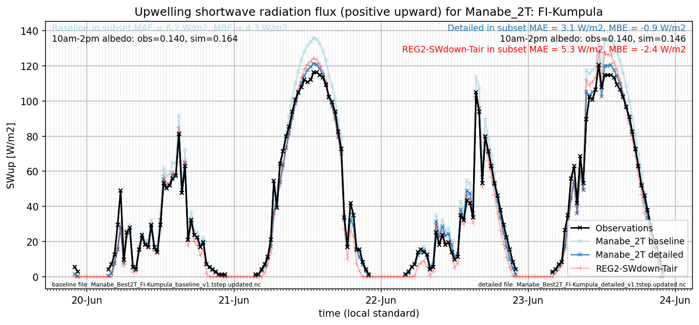

# FI-Kumpula: Manabe_2T

**NOTE:** *Results presented here are highly dependent on how models are configured in this experiment and may be subject to variable output formatting errors. Results are not intended to indicate the quality of any individual model, but to help participants better understand and improve modelling approaches in different urban environments.*

### Submitted metadata

- [Baseline](Manabe_2T_FI-Kumpula_baseline_attrs.md)
- [Detailed](Manabe_2T_FI-Kumpula_detailed_attrs.md)

### Error metrics

| flux   | experiment   |      MAE |       MBE |      nSD |        R |        5th |     95th |    RMSE |    cRMSE |     AMBE |     1-nSD |       1-R |   nSkewness |   nKurtosis |   Overlap |
|:-------|:-------------|---------:|----------:|---------:|---------:|-----------:|---------:|--------:|---------:|---------:|----------:|----------:|------------:|------------:|----------:|
| SWup   | baseline     |  7.96378 |   2.4804  | 1.07478  | 0.966667 |  0.0240802 | 10.4735  | 13.0359 | 0.277926 |  2.4804  | 0.0747631 | 0.0333331 |   0.100102  |   0.29705   |  0.122142 |
| SWup   | detailed     |  5.87509 |  -1.23406 | 1.02078  | 0.974341 |  0.170912  |  1.07694 | 10.6543 | 0.229817 |  1.23406 | 0.0207641 | 0.025659  |   0.0325821 |   0.0392333 |  0.119431 |
| LWup   | baseline     |  9.23178 |   4.60076 | 1.18502  | 0.985374 |  0.0601037 | 31.9427  | 14.5831 | 0.262482 |  4.60076 | 0.185014  | 0.0146265 |   3.27002   |   0.626355  |  0.119516 |
| LWup   | detailed     |  8.81828 |   4.73511 | 1.17973  | 0.985477 |  1.85306   | 32.1664  | 14.4032 | 0.25801  |  4.73511 | 0.179724  | 0.0145233 |   3.53396   |   0.750431  |  0.117501 |
| Qle    | baseline     | 17.2479  |  -2.60026 | 0.575275 | 0.577329 |  6.66583   | 35.5769  | 31.0078 | 0.816514 |  2.60026 | 0.424724  | 0.422671  |   0.151257  |   0.237475  |  0.257713 |
| Qle    | detailed     | 17.4985  |  -2.1776  | 0.601584 | 0.566308 |  6.51354   | 32.906   | 31.2936 | 0.824948 |  2.1776  | 0.398415  | 0.433692  |   0.13469   |   0.225472  |  0.251417 |
| Qh     | baseline     | 31.0376  | -16.5534  | 0.561063 | 0.56856  |  8.13271   | 87.106   | 51.3532 | 0.822676 | 16.5534  | 0.438937  | 0.43144   |   0.503526  |   0.238709  |  0.167298 |
| Qh     | detailed     | 29.8908  | -16.6291  | 0.632123 | 0.63729  | 10.7899    | 75.8625  | 48.4787 | 0.770642 | 16.6291  | 0.367877  | 0.36271   |   0.376779  |   0.174315  |  0.155333 |

 - MAE: mean absolute error (close to 0 is better)
 - MBE: mean bias error (close to 0 is better)
 - NSD: ratio of model to obs standard deviation (close to 1 is better)
 - R: Pearson's correlation (close to 1 is better)
 - all others: closer to 0 is better

[Link to variable definitions](../modelattrs/variable_definitions.md)

### subset_SWup_v0-9

### out of range: baseline

### out of range: detailed

[Link to variable definitions](../modelattrs/variable_definitions.md)

