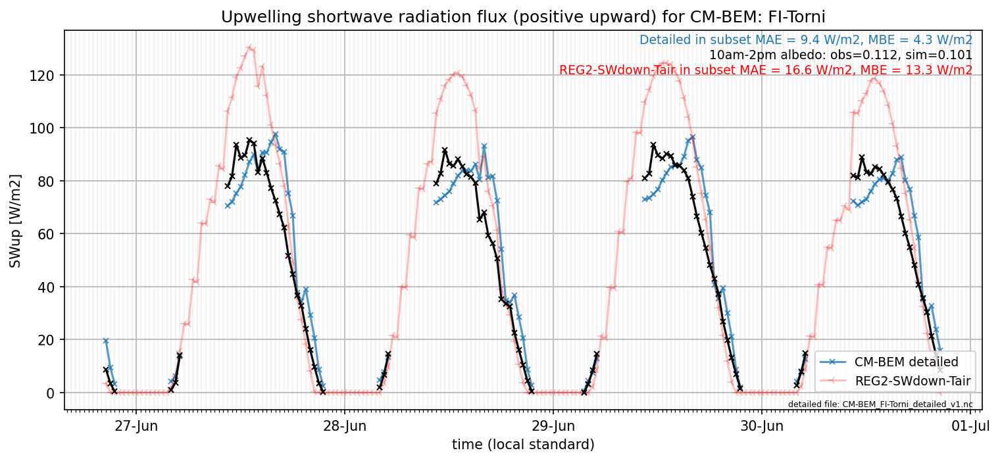

# FI-Torni: CM-BEM

**NOTE:** *Results presented here are highly dependent on how models are configured in this experiment and may be subject to variable output formatting errors. Results are not intended to indicate the quality of any individual model, but to help participants better understand and improve modelling approaches in different urban environments.*

### Submitted metadata

- [Baseline](CM-BEM_FI-Torni_baseline_attrs.md)
- [Detailed](CM-BEM_FI-Torni_detailed_attrs.md)

### Error metrics

| flux   | experiment   |      MAE |       MBE |       nSD |          R |      5th |     95th |     RMSE |      cRMSE |      AMBE |      1-nSD |         1-R |   nSkewness |   nKurtosis |    Overlap |
|:-------|:-------------|---------:|----------:|----------:|-----------:|---------:|---------:|---------:|-----------:|----------:|-----------:|------------:|------------:|------------:|-----------:|
| SWup   | baseline     | nan      | nan       | nan       | nan        | nan      | nan      | nan      | nan        | nan       | nan        | nan         | nan         |  nan        | nan        |
| SWup   | detailed     |  12.9115 |  -3.53207 |   1.18986 |   0.789676 |   6.2995 |   7.6286 |  20.3666 |   0.732499 |   3.53207 |   0.189856 |   0.210324  |   0.354244  |    0.214721 |   0.198681 |
| LWup   | baseline     | nan      | nan       | nan       | nan        | nan      | nan      | nan      | nan        | nan       | nan        | nan         | nan         |  nan        | nan        |
| LWup   | detailed     |  14.6332 |  -9.21044 |   1.17658 |   0.980681 |  13.254  |  17.7095 |  16.3935 |   0.276843 |   9.21044 |   0.176579 |   0.0193192 |   1.50038   |    1.06088  |   0.16998  |
| Qle    | baseline     | nan      | nan       | nan       | nan        | nan      | nan      | nan      | nan        | nan       | nan        | nan         | nan         |  nan        | nan        |
| Qle    | detailed     |  20.8523 | -12.4043  |   1.27762 |   0.141114 |   1.3216 |  40.5892 |  49.2587 |   1.50722  |  12.4043  |   0.277617 |   0.858886  |   4.34651   |   16.9044   |   0.191573 |
| Qh     | baseline     | nan      | nan       | nan       | nan        | nan      | nan      | nan      | nan        | nan       | nan        | nan         | nan         |  nan        | nan        |
| Qh     | detailed     |  33.6945 |  12.7256  |   1.16092 |   0.80291  |  17.4404 |  63.272  |  50.7488 |   0.695348 |  12.7256  |   0.160922 |   0.19709   |   0.0489415 |    0.235175 |   0.22012  |

 - MAE: mean absolute error (close to 0 is better)
 - MBE: mean bias error (close to 0 is better)
 - NSD: ratio of model to obs standard deviation (close to 1 is better)
 - R: Pearson's correlation (close to 1 is better)
 - all others: closer to 0 is better

[Link to variable definitions](../modelattrs/variable_definitions.md)

### subset_SWup_v0-9

### out of range: baseline

### out of range: detailed

 - CM-BEM SWnet min value of -29.5888 is less than expected 0.0 [W/m2]
 - CM-BEM SWup min value of -41.5817 is less than expected 0.0 [W/m2]
 - CM-BEM Albedo min value of -0.1190 is less than expected 0.0 [1]
 - CM-BEM alb min value of -0.1189 is less than expected 0.0 [1]
 - CM-BEM Qle max value of 1487.4686 is greater than expected 700.0 [W/m2]
 - CM-BEM Qle min value of -1480.9513 is less than expected -700.0 [W/m2]
 - CM-BEM Qanth max value of 41447.5300 is greater than expected 1000.0 [W/m2]
 - CM-BEM Qanth min value of -7868.8500 is less than expected 0.0 [W/m2]

[Link to variable definitions](../modelattrs/variable_definitions.md)

