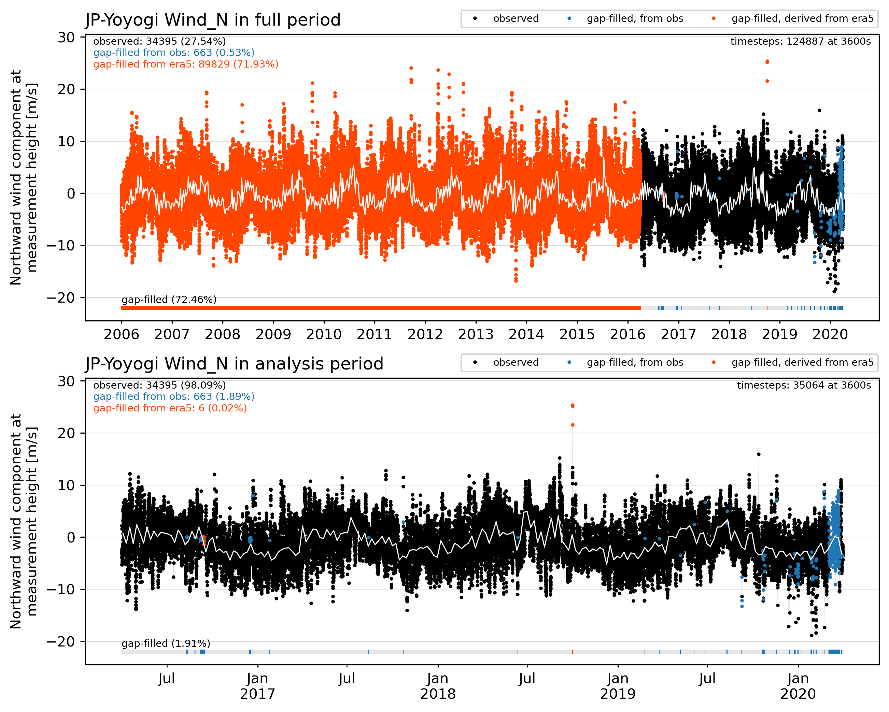
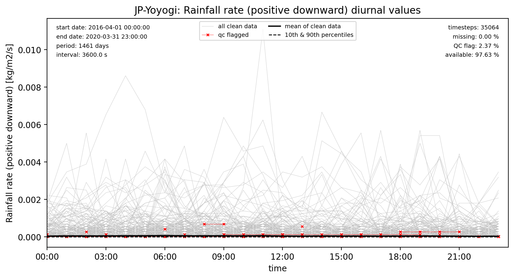

# Yoyogi, Tokyo, Japan (JP-Yoyogi)

## Site observation metadata

|                           | observation_attributes                                                                                                                                                                                                                                                                           |
|:--------------------------|:-------------------------------------------------------------------------------------------------------------------------------------------------------------------------------------------------------------------------------------------------------------------------------------------------|
| title                     | URBAN-PLUMBER forcing data for JP-Yoyogi                                                                                                                                                                                                                                                         |
| summary                   | Observed and ERA5-derived surface meteorological data for Yoyogi, Tokyo, Japan. Data is for use by registered participants of Urban-PLUMBER in this project only. Do not distribute. All times in UTC.                                                                                           |
| sitename                  | JP-Yoyogi                                                                                                                                                                                                                                                                                        |
| long_sitename             | Yoyogi, Tokyo, Japan                                                                                                                                                                                                                                                                             |
| version                   | v1                                                                                                                                                                                                                                                                                               |
| conventions               | ALMA+CF.rev13                                                                                                                                                                                                                                                                                    |
| featureType               | timeSeries                                                                                                                                                                                                                                                                                       |
| time_coverage_start       | 2006-01-01 00:00:00                                                                                                                                                                                                                                                                              |
| time_coverage_end         | 2020-03-31 14:00:00                                                                                                                                                                                                                                                                              |
| time_analysis_start       | 2016-03-31 15:00:00                                                                                                                                                                                                                                                                              |
| time_shown_in             | UTC                                                                                                                                                                                                                                                                                              |
| local_utc_offset_hours    | 9.0                                                                                                                                                                                                                                                                                              |
| timestep_interval_seconds | 3600.0                                                                                                                                                                                                                                                                                           |
| timestep_number_spinup    | 89823                                                                                                                                                                                                                                                                                            |
| timestep_number_analysis  | 35064                                                                                                                                                                                                                                                                                            |
| observations_contact      | Hirofumi Sugawara, hiros@nda.ac.jp                                                                                                                                                                                                                                                               |
| observations_reference    | Hirano, Sugawara, Murayama, Kondo (2015): https://doi.org/10.2151/sola.2015-024; Sugawara, Shimizu, Hirano, Murayama and Kondo (2014): https://doi.org/10.14887/kazekosymp.23.0_49; Ishidoya, Sugawara,Terao, Kaneyasu, Aoki, Tsuboi and Kondo. (2020): https://doi.org/10.5194/acp-20-5293-2020 |
| project_contact           | Mathew Lipson: m.lipson@unsw.edu.au, Sue Grimmond: c.s.grimmond@reading.ac.uk, Martin Best: martin.best@metoffice.gov.uk                                                                                                                                                                         |
| date_created              | 2021-05-08 18:46:13                                                                                                                                                                                                                                                                              |
| other_references          | ERA5: Copernicus Climate Change Service (C3S) (2017): https://cds.climate.copernicus.eu/cdsapp#!/home NCI Australia: http://doi.org/10.25914/5f48874388857                                                                                                                                       |
| acknowledgements          | Contains modified Copernicus Climate Change Service Information (ERA5 hourly data on single levels). Data from replica hosted by NCI Australia. With thanks to all involved in collecting, processing and hosting observational data                                                             |
| comment                   | Observations for turbulent fluxes removed from sectors 180°-260° because of land surface inhomogeneities. Gap-filling for the forcing data using data at nearby observatories (less than 8 km distance).                                                                                         |

## Site images

|                                             |                                             |    
|:-------------------------------------------:|:-------------------------------------------:|
|   source: OpenStreetMap    |  source: OpenStreetMap    |
|  source: H. Sugawara  |  source: OpenStreetMap, Microsoft    |

## Site characteristics

|   id | parameter                          |      value | units         | source                  | doi                                                                                                                                                          |
|-----:|:-----------------------------------|-----------:|:--------------|:------------------------|:-------------------------------------------------------------------------------------------------------------------------------------------------------------|
|    1 | latitude                           |    35.6645 | degrees_north | Hirano et al. (2015)    | [https://doi.org/10.2151/sola.2015-024](https://doi.org/10.2151/sola.2015-024)                                                                               |
|    2 | longitude                          |   139.685  | degrees_east  | Hirano et al. (2015)    | [https://doi.org/10.2151/sola.2015-024](https://doi.org/10.2151/sola.2015-024)                                                                               |
|    3 | ground_height                      |    39      | m             | Hirano et al. (2015)    | [https://doi.org/10.2151/sola.2015-024](https://doi.org/10.2151/sola.2015-024)                                                                               |
|    4 | measurement_height_above_ground    |    52      | m             | Hirano et al. (2015)    | [https://doi.org/10.2151/sola.2015-024](https://doi.org/10.2151/sola.2015-024)                                                                               |
|    5 | impervious_area_fraction           |     0.92   | 1             | estimated, see notes    | area fractions within 500 m radius, from satellite imagery with sector 170-250 deg excluded                                                                  |
|    6 | tree_area_fraction                 |     0.06   | 1             | estimated, see notes    | area fractions within 500 m radius, from satellite imagery with sector 170-250 deg excluded                                                                  |
|    7 | grass_area_fraction                |     0.01   | 1             | estimated, see notes    | area fractions within 500 m radius, from satellite imagery with sector 170-250 deg excluded                                                                  |
|    8 | bare_soil_area_fraction            |     0.01   | 1             | estimated, see notes    | area fractions within 500 m radius, from satellite imagery with sector 170-250 deg excluded                                                                  |
|    9 | water_area_fraction                |     0      | 1             | estimated, see notes    | area fractions within 500 m radius, from satellite imagery with sector 170-250 deg excluded                                                                  |
|   10 | roof_area_fraction                 |     0.41   | 1             | estimated, see notes    | area fractions within 500 m radius, from satellite imagery with sector 170-250 deg excluded                                                                  |
|   11 | road_area_fraction                 |     0.32   | 1             | estimated, see notes    | area fractions within 500 m radius, from satellite imagery with sector 170-250 deg excluded                                                                  |
|   12 | other_paved_area_fraction          |     0.19   | 1             | estimated, see notes    | area fractions within 500 m radius, from satellite imagery with sector 170-250 deg excluded                                                                  |
|   13 | building_mean_height               |     9      | m             | Hirano et al. (2015)    | [https://doi.org/10.2151/sola.2015-024](https://doi.org/10.2151/sola.2015-024)                                                                               |
|   14 | tree_mean_height                   |    15      | m             | estimate                | -                                                                                                                                                            |
|   15 | roughness_length_momentum          |     1.1    | m             | Hirano et al (2016)     | [https://www.jstage.jst.go.jp/article/kazekosymp/24/0/24_85/_article/-char/en](https://www.jstage.jst.go.jp/article/kazekosymp/24/0/24_85/_article/-char/en) |
|   16 | displacement_height                |    28      | m             | Sugawara et al (2015)   | Measurement of roughness parameters over urban heterogeneous canopy, ICUC-9                                                                                  |
|   17 | canyon_height_width_ratio          |     1.2    | 1             | Sugawara, pers. comms   | derived from GIS/3D model                                                                                                                                    |
|   18 | wall_to_plan_area_ratio            |     1.14   | 1             | Sugawara, pers. comms   | derived from GIS/3D model                                                                                                                                    |
|   19 | average_albedo_at_midday           |     0.133  | 1             | median of observations  | -                                                                                                                                                            |
|   20 | resident_population_density        | 16600      | person/km2    | Hirano et al. (2015)    | [https://doi.org/10.2151/sola.2015-024](https://doi.org/10.2151/sola.2015-024)                                                                               |
|   21 | anthropogenic_heat_flux_mean       |    20      | W/m2          | Moriwaki et al (2008)   | https://doi.org/10.1029/2007WR006624                                                                                                                         |
|   22 | topsoil_clay_fraction              |     0.23   | 1             | OpenLandMap             | [https://doi.org/10.5281/zenodo.2525663](https://doi.org/10.5281/zenodo.2525663)                                                                             |
|   23 | topsoil_sand_fraction              |     0.39   | 1             | OpenLandMap             | [https://doi.org/10.5281/zenodo.2525662](https://doi.org/10.5281/zenodo.2525662)                                                                             |
|   24 | topsoil_bulk_density               |  1350      | kg/m3         | OpenLandMap             | [https://doi.org/10.5281/zenodo.2525665](https://doi.org/10.5281/zenodo.2525665)                                                                             |
|   25 | building_height_standard_deviation |     9.75   | m             | Sugawara et al (2014)   | [https://doi.org/10.14887/kazekosymp.23.0_49](https://doi.org/10.14887/kazekosymp.23.0_49)                                                                   |
|   26 | roughness_length_momentum_mac      |     0.63   | m             | Macdonald et al. (1998) | [https://doi.org/10.1016/S1352-2310(97)00403-2](https://doi.org/10.1016/S1352-2310(97)00403-2)                                                               |
|   27 | displacement_height_mac            |     6.12   | m             | Macdonald et al. (1998) | [https://doi.org/10.1016/S1352-2310(97)00403-2](https://doi.org/10.1016/S1352-2310(97)00403-2)                                                               |
|   28 | roughness_length_momentum_kanda    |     2.76   | m             | Kanda et al. (2013)     | [https://doi.org/10.1007/s10546-013-9818-x](https://doi.org/10.1007/s10546-013-9818-x)                                                                       |
|   29 | displacement_height_kanda          |    18.2    | m             | Kanda et al. (2013)     | [https://doi.org/10.1007/s10546-013-9818-x](https://doi.org/10.1007/s10546-013-9818-x)                                                                       |

## Site observations

## Site forcing

### SWdown forcing

### LWdown forcing

### Tair forcing

### Qair forcing

### PSurf forcing

### Rainf forcing

### Snowf forcing

### Wind_N forcing

### Wind_E forcing

## Quality control (qc) and gap filling procedure

**QC process on observations**
 
 - remove values outside the [ALMAv3 protocol expected range values](https://urban-plumber.github.io/AU-Preston/plots/modelattrs/variable_definitions.html)
 - remove night periods of non-zero shortwave radiation between civil twilight times for site latitude and longitude
 - remove constant values of 4 or more timesteps (excluding zero values for shortwave, rainfall and snowfall)
 - remove outliers by applying a filter for values outside 4 standard deviations for each hour in a rolling 30 day window. Applying filter again at 5 standard deviations until no outliers exist.
 
**Gap-filling process**

 - first fill with nearby local tower observations where available
 - for gaps of 2 hours or less, fill with linear interpolation of adjacent observation
 - fill remaining gaps with bias-corrected, ERA5 derived data (see below)
 - snowfall from ERA5, with water equivalent removed from rainfall to retain mass balance
 - prepend flux tower data period with 10-years of ERA5 derived data (used for model spinup)
 
**ERA5 bias correction**
 
 - for downwelling longwave, temperature, humidity and pressure: calculate the mean bias between ERA5 and flux tower data in a 30-day rolling window for every hour and each day of the year, and apply that bias correction to all ERA5 data. For periods not covered by observations, linearly interpoloate between known biases for each hour seperately.
 - for precipitation: calculate total precipitation in a 10-year period and calculate the ratio between ERA5 data and the nearest GHCN-D station and apply that correction factor to ERA5 data.
 - for wind: apply wind log profile correction from ERA5 10m wind to tower measurement height using site roughness and displacement, with ERA5 roughness to match observed mean wind speeds.
 - for downwelling shortwave: use ERA5 data without correction

### SWdown diurnal qc

### LWdown diurnal qc

### Tair diurnal qc

### Qair diurnal qc

### Rainf diurnal qc

### PSurf diurnal qc

### Wind_N diurnal qc

### Wind_E diurnal qc

