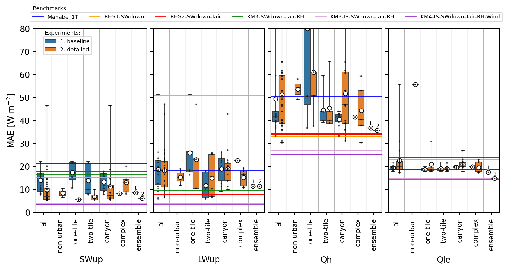
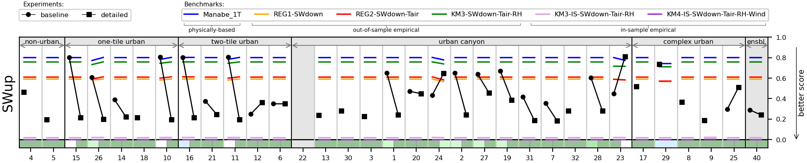
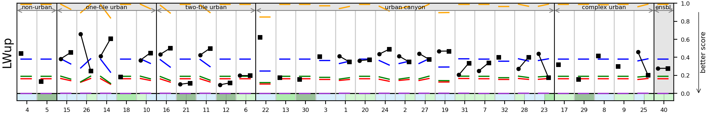
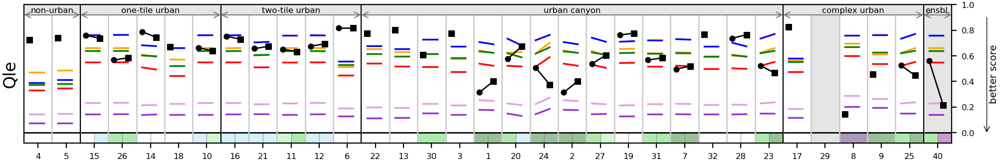
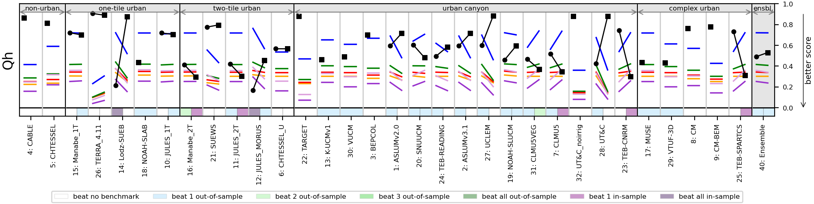

**NOTE:** *Results presented here are highly dependent on how models are configured in this experiment and may be subject to variable output formatting errors. Results are not intended to indicate the quality of any individual model, but to help participants better understand and improve modelling approaches in different urban environments.*

# KR-Jungnang results

Also see:

- [Site details](https://urban-plumber.github.io/KR-Jungnang/)
- [Baseline plots](../baseline/index.md)
- [Detailed plots](../detailed/index.md)
- [Individual model data and results](../index.md#model-data)

## Site images

|                                             |                                             |    
|:-------------------------------------------:|:-------------------------------------------:|
|   Regional map. © OpenStreetMap    |  Site aerial photo with 500 m radius. © OpenStreetMap, Microsoft    |

## Mean absolute error by cohort

## Benchmarking evaluation: PLUMBER2 metrics

