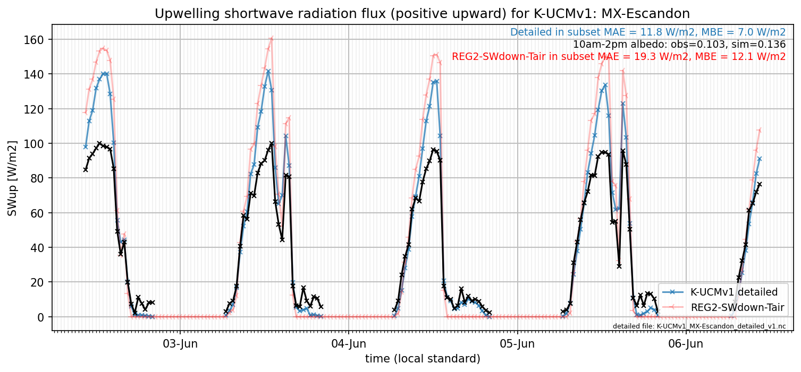

# MX-Escandon: K-UCMv1

**NOTE:** *Results presented here are highly dependent on how models are configured in this experiment and may be subject to variable output formatting errors. Results are not intended to indicate the quality of any individual model, but to help participants better understand and improve modelling approaches in different urban environments.*

### Submitted metadata

- [Baseline](K-UCMv1_MX-Escandon_baseline_attrs.md)
- [Detailed](K-UCMv1_MX-Escandon_detailed_attrs.md)

### Error metrics

| flux   | experiment   |      MAE |       MBE |        nSD |          R |      5th |     95th |     RMSE |      cRMSE |      AMBE |      1-nSD |         1-R |   nSkewness |   nKurtosis |    Overlap |
|:-------|:-------------|---------:|----------:|-----------:|-----------:|---------:|---------:|---------:|-----------:|----------:|-----------:|------------:|------------:|------------:|-----------:|
| SWup   | baseline     | nan      | nan       | nan        | nan        | nan      | nan      | nan      | nan        | nan       | nan        | nan         |   nan       |  nan        | nan        |
| SWup   | detailed     |  11.4882 |   7.96147 |   1.37646  |   0.974732 |   2.3934 |  33.6078 |  16.0474 |   0.459653 |   7.96147 |   0.376459 |   0.0252677 |     1.24131 |    0.145089 |   0.198091 |
| LWup   | baseline     | nan      | nan       | nan        | nan        | nan      | nan      | nan      | nan        | nan       | nan        | nan         |   nan       |  nan        | nan        |
| LWup   | detailed     | nan      | nan       | nan        | nan        | nan      | nan      | nan      | nan        | nan       | nan        | nan         |   nan       |  nan        | nan        |
| Qle    | baseline     | nan      | nan       | nan        | nan        | nan      | nan      | nan      | nan        | nan       | nan        | nan         |   nan       |  nan        | nan        |
| Qle    | detailed     |  26.7358 | -24.0768  |   0.187164 |   0.428038 |   3.6298 |  83.8798 |  41.7164 |   0.935309 |  24.0768  |   0.812836 |   0.571962  |    13.7669  |  308.098    |   0.556949 |
| Qh     | baseline     | nan      | nan       | nan        | nan        | nan      | nan      | nan      | nan        | nan       | nan        | nan         |   nan       |  nan        | nan        |
| Qh     | detailed     |  37.8051 |   2.1717  |   1.43909  |   0.764893 |  21.8925 |  61.001  |  72.5212 |   0.932463 |   2.1717  |   0.439092 |   0.235107  |     4.54964 |  284.539    |   0.299686 |
| Qtau   | baseline     | nan      | nan       | nan        | nan        | nan      | nan      | nan      | nan        | nan       | nan        | nan         |   nan       |  nan        | nan        |
| Qtau   | detailed     | nan      | nan       | nan        | nan        | nan      | nan      | nan      | nan        | nan       | nan        | nan         |   nan       |  nan        | nan        |

 - MAE: mean absolute error (close to 0 is better)
 - MBE: mean bias error (close to 0 is better)
 - NSD: ratio of model to obs standard deviation (close to 1 is better)
 - R: Pearson's correlation (close to 1 is better)
 - all others: closer to 0 is better

[Link to variable definitions](../modelattrs/variable_definitions.md)

### subset_SWup_v0-9

### out of range: baseline

### out of range: detailed

 - K-UCMv1 LWup max value of 2687.9639 is greater than expected 1000.0 [W/m2]
 - K-UCMv1 LWnet min value of -2376.0339 is less than expected -500.0 [W/m2]
 - K-UCMv1 SWnet min value of -1.7683 is less than expected 0.0 [W/m2]
 - K-UCMv1 Qstor min value of -8393.6468 is less than expected -800.0 [W/m2]
 - K-UCMv1 Qh max value of 5486.6861 is greater than expected 600.0 [W/m2]
 - K-UCMv1 Qstar min value of -2373.1671 is less than expected -500.0 [W/m2]

[Link to variable definitions](../modelattrs/variable_definitions.md)

