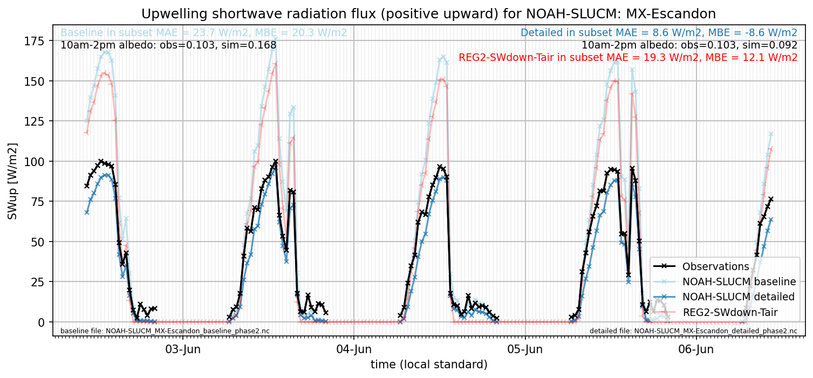

# MX-Escandon: NOAH-SLUCM

**NOTE:** *Results presented here are highly dependent on how models are configured in this experiment and may be subject to variable output formatting errors. Results are not intended to indicate the quality of any individual model, but to help participants better understand and improve modelling approaches in different urban environments.*

### Submitted metadata

- [Baseline](NOAH-SLUCM_MX-Escandon_baseline_attrs.md)
- [Detailed](NOAH-SLUCM_MX-Escandon_detailed_attrs.md)

### Error metrics

| flux   | experiment   |       MAE |       MBE |        nSD |          R |       5th |      95th |      RMSE |      cRMSE |      AMBE |       1-nSD |         1-R |   nSkewness |   nKurtosis |    Overlap |
|:-------|:-------------|----------:|----------:|-----------:|-----------:|----------:|----------:|----------:|-----------:|----------:|------------:|------------:|------------:|------------:|-----------:|
| SWup   | baseline     |  24.3765  |  22.7077  |   1.73809  |   0.982488 |   2.6277  |  64.308   |  32.7429  |   0.778239 |  22.7077  |   0.738093  |   0.0175118 |    0.735104 |   0.0234668 |   0.245232 |
| SWup   | detailed     |   7.79209 |  -7.73532 |   0.947061 |   0.98278  |   2.87095 |   7.16748 |   9.61128 |   0.188198 |   7.73532 |   0.0529394 |   0.0172196 |    0.734651 |   0.0228074 |   0.142916 |
| LWup   | baseline     | nan       | nan       | nan        | nan        | nan       | nan       | nan       | nan        | nan       | nan         | nan         |  nan        | nan         | nan        |
| LWup   | detailed     | nan       | nan       | nan        | nan        | nan       | nan       | nan       | nan        | nan       | nan         | nan         |  nan        | nan         | nan        |
| Qle    | baseline     |  28.4991  | -26.3457  |   0.147295 |   0.59623  |   2.55726 |  85.4376  |  42.6199  |   0.919811 |  26.3457  |   0.852705  |   0.40377   |    0.144078 |   0.345041  |   0.555253 |
| Qle    | detailed     |  28.4991  | -26.3457  |   0.147295 |   0.59623  |   2.55726 |  85.4376  |  42.6199  |   0.919811 |  26.3457  |   0.852705  |   0.40377   |    0.144078 |   0.345041  |   0.555253 |
| Qh     | baseline     |  34.9183  | -21.8755  |   0.914242 |   0.792703 |   9.42121 |  26.4532  |  53.0429  |   0.621606 |  21.8755  |   0.0857571 |   0.207297  |    0.160229 |   0.493407  |   0.313049 |
| Qh     | detailed     |  36.0135  | -10.4373  |   1.14278  |   0.806508 |  10.1715  |  23.8896  |  53.8947  |   0.680167 |  10.4373  |   0.142785  |   0.193492  |    0.122368 |   0.262873  |   0.347819 |
| Qtau   | baseline     | nan       | nan       | nan        | nan        | nan       | nan       | nan       | nan        | nan       | nan         | nan         |  nan        | nan         | nan        |
| Qtau   | detailed     | nan       | nan       | nan        | nan        | nan       | nan       | nan       | nan        | nan       | nan         | nan         |  nan        | nan         | nan        |

 - MAE: mean absolute error (close to 0 is better)
 - MBE: mean bias error (close to 0 is better)
 - NSD: ratio of model to obs standard deviation (close to 1 is better)
 - R: Pearson's correlation (close to 1 is better)
 - all others: closer to 0 is better

[Link to variable definitions](../modelattrs/variable_definitions.md)

### subset_SWup_v0-9

### out of range: baseline

 - NOAH-SLUCM TairSurf max value of 5352.0742 is greater than expected 333.0 [K]
 - NOAH-SLUCM TairSurf min value of -224.6140 is less than expected 213.0 [K]

### out of range: detailed

 - NOAH-SLUCM Qle max value of 1508.4170 is greater than expected 700.0 [W/m2]
 - NOAH-SLUCM TairSurf max value of 5930.2793 is greater than expected 333.0 [K]
 - NOAH-SLUCM TairSurf min value of -255.6588 is less than expected 213.0 [K]

[Link to variable definitions](../modelattrs/variable_definitions.md)

