# Narutowicza Street, Łódź, Poland (PL-Narutowicza)

## Site observations

[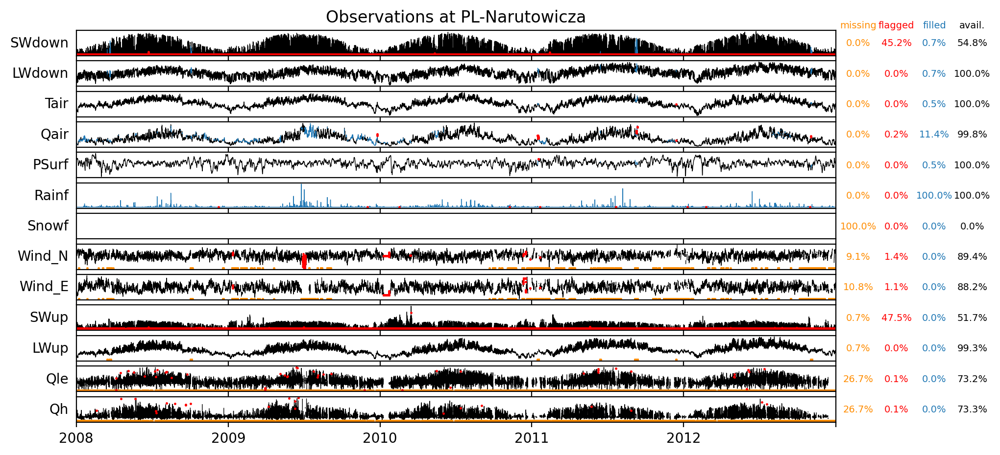](./obs_plots/all_obs_qc.png)

## Site observation metadata

|                           | observation_attributes                                                                                                                                                                                                               |
|:--------------------------|:-------------------------------------------------------------------------------------------------------------------------------------------------------------------------------------------------------------------------------------|
| title                     | URBAN-PLUMBER forcing data for PL-Narutowicza                                                                                                                                                                                        |
| summary                   | Observed and ERA5-derived surface meteorological data for Narutowicza Street, Łódź, Poland. Data is for use by registered participants of Urban-PLUMBER in this project only. Do not distribute. All times in UTC.                   |
| sitename                  | PL-Narutowicza                                                                                                                                                                                                                       |
| long_sitename             | Narutowicza Street, Łódź, Poland                                                                                                                                                                                                     |
| version                   | v1                                                                                                                                                                                                                                   |
| conventions               | ALMA+CF.rev13                                                                                                                                                                                                                        |
| featureType               | timeSeries                                                                                                                                                                                                                           |
| time_coverage_start       | 1998-01-01 00:00:00                                                                                                                                                                                                                  |
| time_coverage_end         | 2012-12-31 23:00:00                                                                                                                                                                                                                  |
| time_analysis_start       | 2008-01-01 00:00:00                                                                                                                                                                                                                  |
| time_shown_in             | UTC                                                                                                                                                                                                                                  |
| local_utc_offset_hours    | 1.0                                                                                                                                                                                                                                  |
| timestep_interval_seconds | 3600.0                                                                                                                                                                                                                               |
| timestep_number_spinup    | 87648                                                                                                                                                                                                                                |
| timestep_number_analysis  | 43848                                                                                                                                                                                                                                |
| observations_contact      | Wlodzimierz Pawlak: wlodzimierz.pawlak@geo.uni.lodz.pl, Krzysztof Fortuniak: krzysztof.fortuniak@geo.uni.lodz.pl                                                                                                                     |
| observations_reference    | Fortuniak, Pawlak and Siedlecki (2013): https://doi.org/10.1007/s10546-012-9762-1; Fortuniak, Kłysik, Siedlecki (2006): http://www.urban-climate.org/documents/ICUC6_Preprints.pdf (p64-67)                                          |
| project_contact           | Mathew Lipson: m.lipson@unsw.edu.au, Sue Grimmond: c.s.grimmond@reading.ac.uk, Martin Best: martin.best@metoffice.gov.uk                                                                                                             |
| date_created              | 2021-05-20 21:11:47                                                                                                                                                                                                                  |
| other_references          | ERA5: Copernicus Climate Change Service (C3S) (2017): https://cds.climate.copernicus.eu/cdsapp#!/home NCI Australia: http://doi.org/10.25914/5f48874388857                                                                           |
| acknowledgements          | Contains modified Copernicus Climate Change Service Information (ERA5 hourly data on single levels). Data from replica hosted by NCI Australia. With thanks to all involved in collecting, processing and hosting observational data |
| comment                   | Missing forcing filled with PL-Lipowa tower site where available. Precipitation from IMGW Łódź Lublinek.                                                                                                                             |

## Site images

|                                             |                                             |    
|:-------------------------------------------:|:-------------------------------------------:|
| [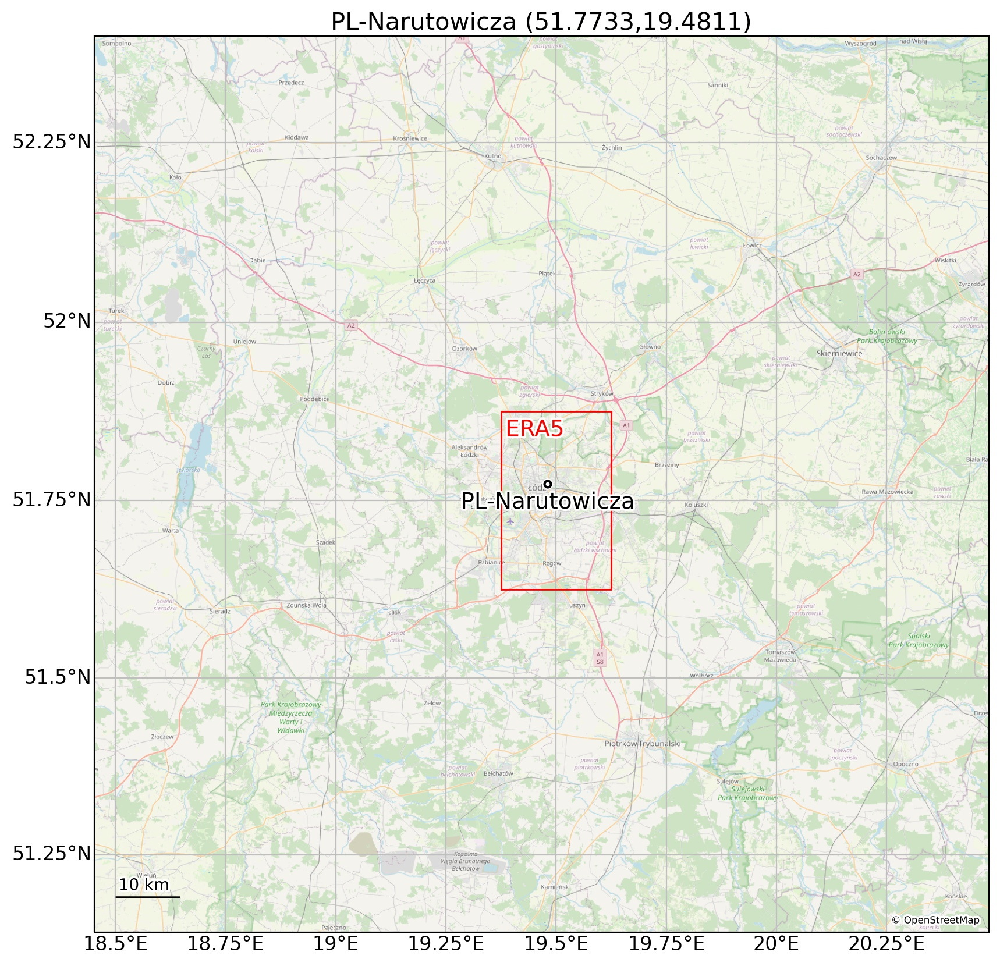](./images/PL-Narutowicza_region_map.jpg)  source: OpenStreetMap    |  source: OpenStreetMap    |
|  source: Włodzimierz Pawlak  |  source: OpenStreetMap, Microsoft    |

## Site characteristics

|   id | parameter                          |      value | units         | source                                 | doi                                                                                                                                                                          |
|-----:|:-----------------------------------|-----------:|:--------------|:---------------------------------------|:-----------------------------------------------------------------------------------------------------------------------------------------------------------------------------|
|    1 | latitude                           |    51.7733 | degrees_north | Fortuniak et al. (2013)                | [http://doi.org/10.1007/s10546-012-9762-1](http://doi.org/10.1007/s10546-012-9762-1)                                                                                         |
|    2 | longitude                          |    19.4811 | degrees_east  | Fortuniak et al. (2013)                | [http://doi.org/10.1007/s10546-012-9762-1](http://doi.org/10.1007/s10546-012-9762-1)                                                                                         |
|    3 | ground_height                      |   221      | m             | Fortuniak et al. (2013)                | [http://doi.org/10.1007/s10546-012-9762-1](http://doi.org/10.1007/s10546-012-9762-1)                                                                                         |
|    4 | measurement_height_above_ground    |    42      | m             | Fortuniak et al. (2013)                | [http://doi.org/10.1007/s10546-012-9762-1](http://doi.org/10.1007/s10546-012-9762-1)                                                                                         |
|    5 | impervious_area_fraction           |     0.65   | 1             | -                                      | -                                                                                                                                                                            |
|    6 | tree_area_fraction                 |     0.22   | 1             | Fortuniak et al. (2006)                | [http://meteo.geo.uni.lodz.pl/kf/publikacje_kf_PDF/r2006_ICUC6_p64_Fortuniak_etal.pdf](http://meteo.geo.uni.lodz.pl/kf/publikacje_kf_PDF/r2006_ICUC6_p64_Fortuniak_etal.pdf) |
|    7 | grass_area_fraction                |     0.09   | 1             | Fortuniak et al. (2006)                | [http://meteo.geo.uni.lodz.pl/kf/publikacje_kf_PDF/r2006_ICUC6_p64_Fortuniak_etal.pdf](http://meteo.geo.uni.lodz.pl/kf/publikacje_kf_PDF/r2006_ICUC6_p64_Fortuniak_etal.pdf) |
|    8 | bare_soil_area_fraction            |     0.04   | 1             | Fortuniak et al. (2006)                | [http://meteo.geo.uni.lodz.pl/kf/publikacje_kf_PDF/r2006_ICUC6_p64_Fortuniak_etal.pdf](http://meteo.geo.uni.lodz.pl/kf/publikacje_kf_PDF/r2006_ICUC6_p64_Fortuniak_etal.pdf) |
|    9 | water_area_fraction                |     0      | 1             | -                                      | -                                                                                                                                                                            |
|   10 | roof_area_fraction                 |     0.29   | 1             | Fortuniak et al. (2013)                | [http://doi.org/10.1007/s10546-012-9762-1](http://doi.org/10.1007/s10546-012-9762-1)                                                                                         |
|   11 | road_area_fraction                 |     0.19   | 1             | Pawlak, pers. comms                    | -                                                                                                                                                                            |
|   12 | other_paved_area_fraction          |     0.17   | 1             | Pawlak, pers. comms                    | -                                                                                                                                                                            |
|   13 | building_mean_height               |    16      | m             | Fortuniak et al. (2013)                | [http://doi.org/10.1007/s10546-012-9762-1](http://doi.org/10.1007/s10546-012-9762-1)                                                                                         |
|   14 | tree_mean_height                   |    16      | m             | Fortuniak et al. (2013)                | [http://doi.org/10.1007/s10546-012-9762-1](http://doi.org/10.1007/s10546-012-9762-1)                                                                                         |
|   15 | roughness_length_momentum          |     1.9    | m             | Fortuniak et al. (2013) (anemometric)  | [http://doi.org/10.1007/s10546-012-9762-1](http://doi.org/10.1007/s10546-012-9762-1)                                                                                         |
|   16 | displacement_height                |    11      | m             | Fortuniak et al. (2013) (morphometric) | [http://doi.org/10.1007/s10546-012-9762-1](http://doi.org/10.1007/s10546-012-9762-1)                                                                                         |
|   17 | canyon_height_width_ratio          |     0.75   | 1             | estimated, see notes                   | Pawlak, pers. comms, assuming similar to PL-Lipowa                                                                                                                           |
|   18 | wall_to_plan_area_ratio            |     1.06   | 1             | estimated, see notes                   | derived from canyon h/w ratio and eq 1 from [Masson et al (2020)](htpps://doi.org/10.1016/j.uclim.2019.100536)                                                               |
|   19 | average_albedo_at_midday           |     0.087  | 1             | median of observations                 | -                                                                                                                                                                            |
|   20 | resident_population_density        | 10380      | person/km2    | Pawlak, pers. comms                    | derived from Statistics of Łódź 2018                                                                                                                                         |
|   21 | anthropogenic_heat_flux_mean       |     8.8    | W/m2          | Varquez et al (2021)                   | [https://doi.org/10.1038/s41597-021-00850-w](https://doi.org/10.1038/s41597-021-00850-w)                                                                                     |
|   22 | topsoil_clay_fraction              |     0.15   | 1             | OpenLandMap                            | [https://doi.org/10.5281/zenodo.2525663](https://doi.org/10.5281/zenodo.2525663)                                                                                             |
|   23 | topsoil_sand_fraction              |     0.48   | 1             | OpenLandMap                            | [https://doi.org/10.5281/zenodo.2525662](https://doi.org/10.5281/zenodo.2525662)                                                                                             |
|   24 | topsoil_bulk_density               |  1130      | kg/m3         | OpenLandMap                            | [https://doi.org/10.5281/zenodo.2525665](https://doi.org/10.5281/zenodo.2525665)                                                                                             |
|   25 | building_height_standard_deviation |    13.1    | m             | estimated, see notes                   | derived from morphology using eq. 2 of [Kanda et al. (2013)](https://doi.org/10.1007/s10546-013-9818-x)                                                                      |
|   26 | roughness_length_momentum_mac      |     1.99   | m             | Macdonald method                       | derived from morphology using eq. 26 of [Macdonald et al. (1998)](https://doi.org/10.1016/S1352-2310(97)00403-2)                                                             |
|   27 | displacement_height_mac            |     8.62   | m             | Macdonald method                       | derived from morphology using eq. 23 of [Macdonald et al. (1998)](https://doi.org/10.1016/S1352-2310(97)00403-2)                                                             |
|   28 | roughness_length_momentum_kanda    |     3.32   | m             | Kanda method                           | derived from morphology using eq. 12a of [Kanda et al. (2013)](https://doi.org/10.1007/s10546-013-9818-x)                                                                    |
|   29 | displacement_height_kanda          |    24.95   | m             | Kanda method                           | derived from morphology using eq. 10a of [Kanda et al. (2013)](https://doi.org/10.1007/s10546-013-9818-x)                                                                    |

## Site forcing

### SWdown forcing

### LWdown forcing

### Tair forcing

[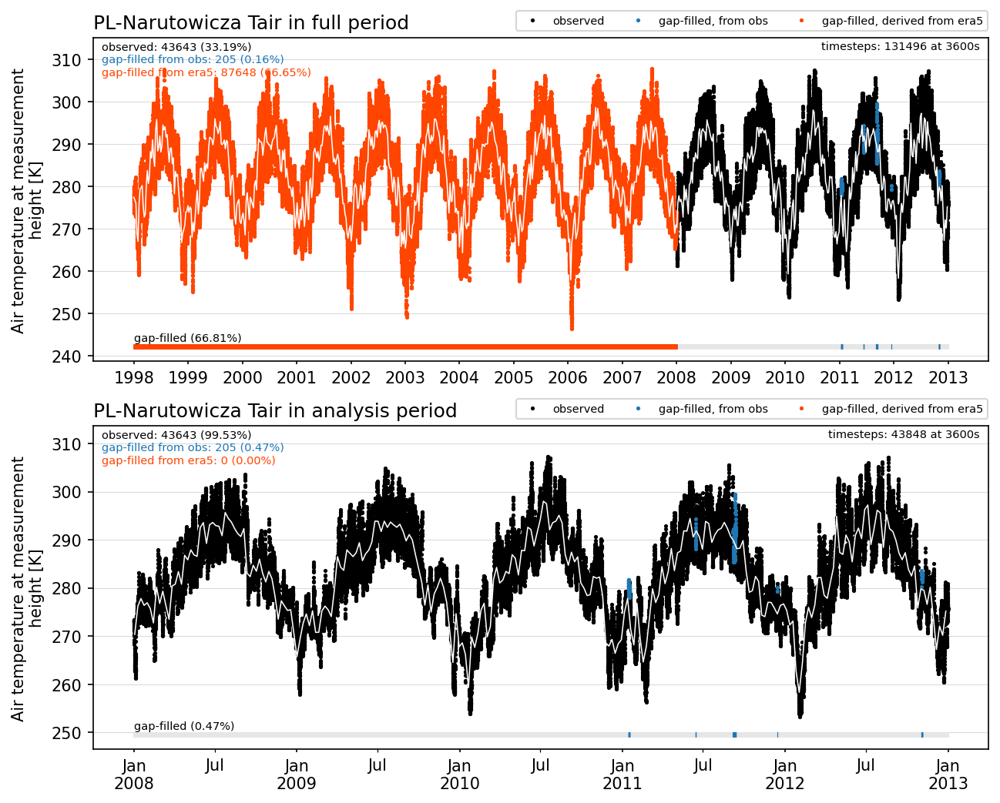](./obs_plots/Tair_gapfilled_forcing.png)

### Qair forcing

[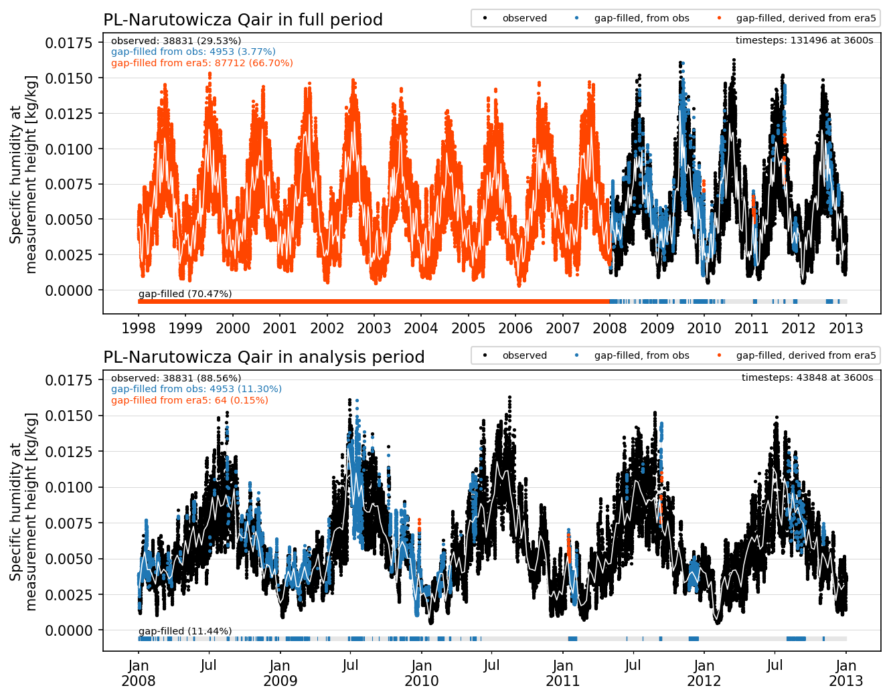](./obs_plots/Qair_gapfilled_forcing.png)

### PSurf forcing

### Rainf forcing

[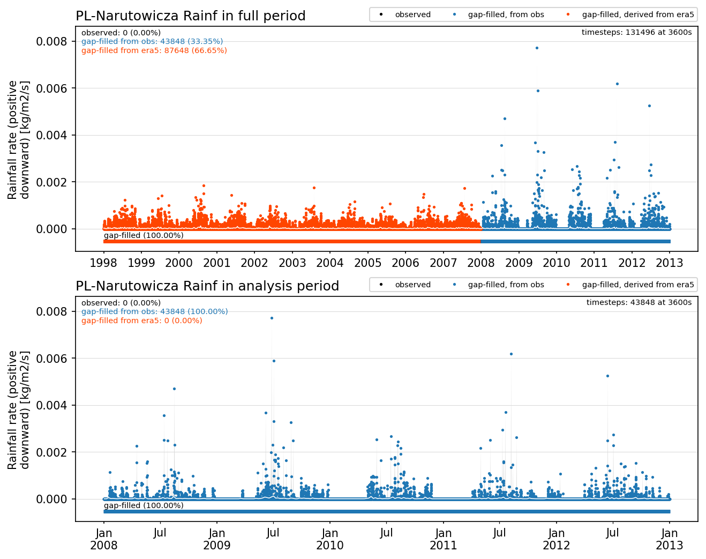](./obs_plots/Rainf_gapfilled_forcing.png)

### Snowf forcing

### Wind_N forcing

[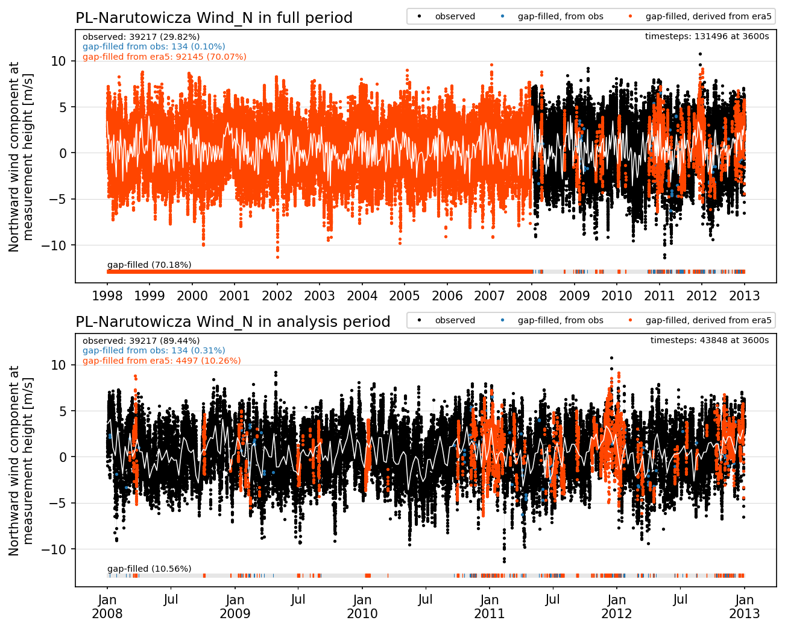](./obs_plots/Wind_N_gapfilled_forcing.png)

### Wind_E forcing

## Quality control (qc) and gap filling procedure

**QC process on observations**
 
 - remove values outside the [ALMAv3 protocol expected range values](https://urban-plumber.github.io/AU-Preston/plots/modelattrs/variable_definitions.html)
 - remove night periods of non-zero shortwave radiation between civil twilight times for site latitude and longitude
 - remove constant values of 4 or more timesteps (excluding zero values for shortwave, rainfall and snowfall)
 - remove outliers by applying a filter for values outside 4 standard deviations for each hour in a rolling 30 day window. Applying filter again at 5 standard deviations until no outliers exist.
 
**Gap-filling process**

 - first fill with nearby local tower observations where available
 - for gaps of 2 hours or less, fill with linear interpolation of adjacent observation
 - fill remaining gaps with bias-corrected, ERA5 derived data (see below)
 - snowfall from ERA5, with water equivalent removed from rainfall to retain mass balance
 - prepend flux tower data period with 10-years of ERA5 derived data (used for model spinup)
 
**ERA5 bias correction**
 
 - for downwelling longwave, temperature, humidity and pressure: calculate the mean bias between ERA5 and flux tower data in a 30-day rolling window for every hour and each day of the year, and apply that bias correction to all ERA5 data. For periods not covered by observations, linearly interpoloate between known biases for each hour seperately.
 - for precipitation: calculate total precipitation in a 10-year period and calculate the ratio between ERA5 data and the nearest GHCN-D station and apply that correction factor to ERA5 data.
 - for wind: apply wind log profile correction from ERA5 10m wind to tower measurement height using site roughness and displacement, with ERA5 roughness to match observed mean wind speeds.
 - for downwelling shortwave: use ERA5 data without correction

### SWdown diurnal qc

### LWdown diurnal qc

[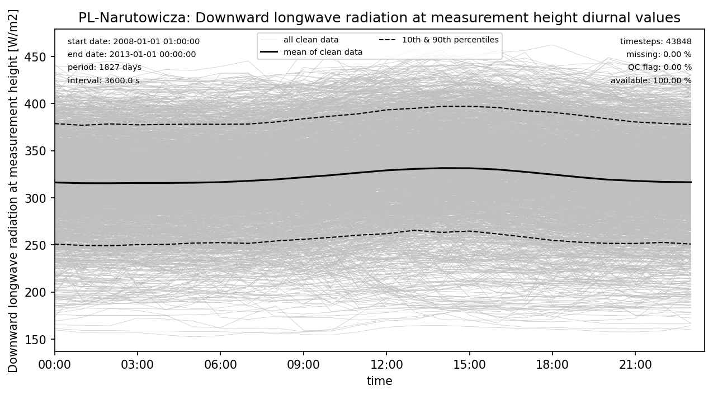](./obs_plots/LWdown_obs_qc_diurnal.png)

### Tair diurnal qc

[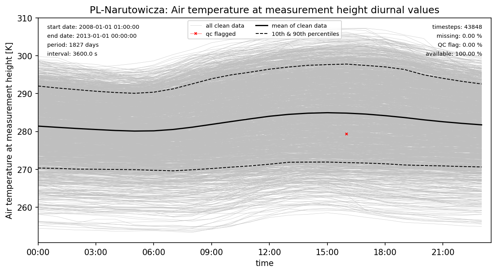](./obs_plots/Tair_obs_qc_diurnal.png)

### Qair diurnal qc

### Rainf diurnal qc

### PSurf diurnal qc

[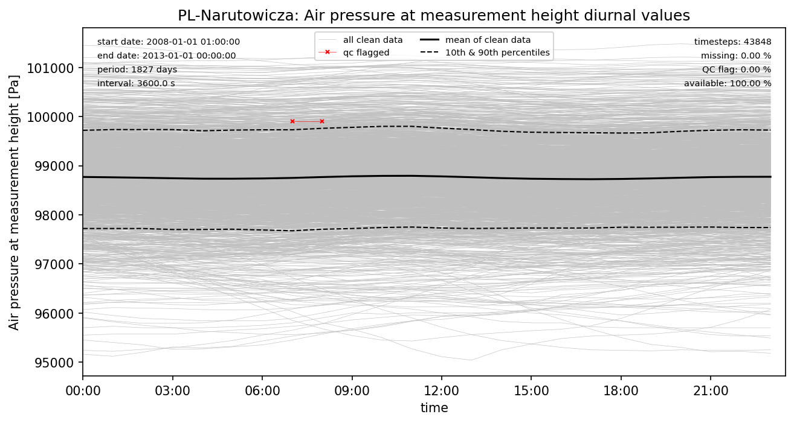](./obs_plots/PSurf_obs_qc_diurnal.png)

### Wind_N diurnal qc

[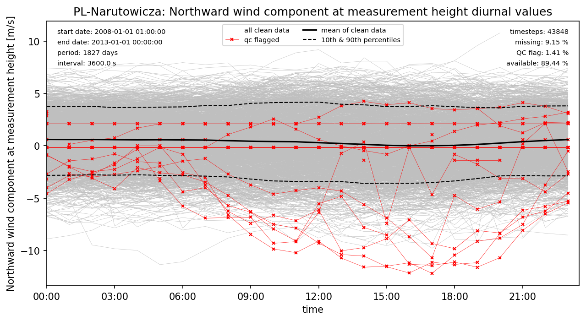](./obs_plots/Wind_N_obs_qc_diurnal.png)

### Wind_E diurnal qc

[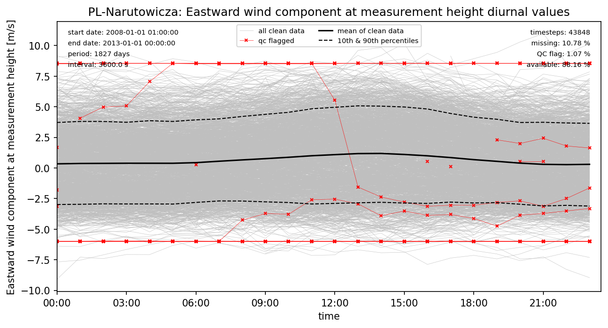](./obs_plots/Wind_E_obs_qc_diurnal.png)

